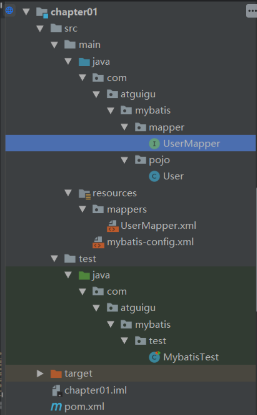
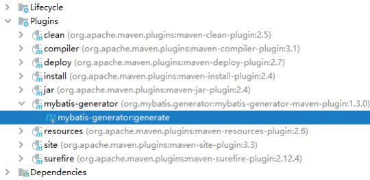
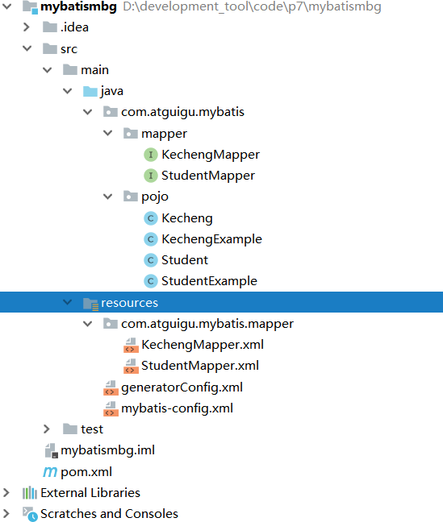

# Mybatis

# 一、Mybatis

## 1、Mybatis简介

### 1.1.前言

**什么是框架？**

**框架是一系列**`jar`包，其本质是对`JDK`功能的扩展

**框架是一组程序的集合，包含了一系列的最佳实践，作用是解决某一个领域的问题**

### 1.2.Mybatis简介

**什么是Mybatis**

**Mybatis是一个半自动化ORM（对象关系映射）框架，它内部封装了JDBC，开发时只需要关注Sql语句本身，不需要花费精力去处理加载驱动，创建连接，创建Statement等，程序员可以直接编写SQL语句，可以严格控制SQL的执行性能，灵活度高**

### 1.3.Mybatis特性

1. **Mybatis是支持定制化SQL，存储过程以及高级映射的优秀的持久层框架**
2. **Mybatis避免了几乎所有的JDBC代码和手动设置参数以及获取结果集**
3. **Mybatis可以使用简单的**`XML`或注解用于配置和原始映射，将接口和Java的Pojo（Plain Old Java Objects，普通的java对象）映射成数据库中的记录
4. **Mybatis是一个半自动的ORM（Object Relation Mapping）框架**

> **什么是ORM**
>

**Object Relation Mapping，对象关系映射。对象指的是Java对象，关系指的是数据库中的关系模型，对象关系映射，指的就是在Java对象和数据库的关系模型之间建立一种对应关系，比如用一个Java的Student类，去对应数据库中的一张student表，类中的属性和表中的列一一对应。Student类就对应student表，一个Student对象就对应student表中的一行数据**

> **为什么mybatis是半自动的ORM框架**
>

**用mybatis进行开发，需要手动编写SQL语句。而全自动的ORM框架，如hibernate，则不需要编写SQL语句。用hibernate开发，只需要定义好ORM映射关系，就可以直接进行CRUD操作了。由于mybatis需要手写SQL语句，所以它有较高的灵活性，可以根据需要，自由地对SQL进行定制，也因为要手写SQL，当要切换数据库时，SQL语句可能就要重写，因为不同的数据库有不同的方言(Dialect)，所以mybatis的数据库无关性低。虽然mybatis需要手写SQL，但相比JDBC，它提供了输入映射和输出映射，可以很方便地进行SQL参数设置，以及结果集封装。并且还提供了关联查询和动态SQL等功能，极大地提升了开发的效率。并且它的学习成本也比hibernate低很多**

### 1.4.Mybatis下载

**Mybatis官网下载**

### 1.5.和其他持久化层技术对比

* **JDBC**

  * **SQL夹杂在java代码中耦合度高，导致硬编码内伤**
  * **维护不易且实际开发需求中，SQL有变化，频繁修改的情况多见**
  * **代码冗长，开发效率低**
* **Hibernate和JPA**

  * **操作简便，开发效率高**
  * **程序中SQL 长、难、复杂需要绕过框架**
  * **内部自动生产的SQL,不容易做特殊优化**
  * **基于全映射的全自动框架，大量字段的POJO进行部分映射的比较困难**
  * **反射操作太多，导致数据库性能下降**
* **Mybatis**

  * **轻量级，性能出色**
  * **SQL和java编码分开，功能边界清晰，java代码专注业务，SQL语句专注数据**
  * **开发效率稍逊于Hibernate，但是可以接受**

## 2、搭建Mybatis

### 2.1.开发环境

**IDE：idea 2019.2**

**搭建工具：maven 3.5.4**

**Mysql版本：Mysql 8**

**Mybatis版本：Mybatis 3.5.7**

> **MySQL不同版本的注意事项**
>
> **1、驱动类driver-class-name**
>
> **MySQL 5 版本使用**`JDBC 5`驱动，驱动类使用：com.mysql.jdbc.Driver
>
> **MySQL 8版本使用**`JDBC 8`驱动，驱动类使用：com.mysql.jdbc.Driver
>
> **2、链接地址url**
>
> **MySQL 5版本的url：**
>
> **jdbc:mysql://localhost:3306/ssm**
>
> **MySQL 8版本的url：**
>
> **jdbc:mysql://localhost:3306/ssm?serverTimezone=UTC**
>
> **否则运行测试用例报告如下错误：**
>
> java.sql.SQLException: The server time zone value 'Öйú±ê׼ʱ¼ä' is unrecognized or
>
> represents more
>

**项目结构：**

​

### 2.2.创建Maven工程

**引入依赖**

> pom.xml
>

```xml
<dependencies>
  <!-- Mybatis核心 -->
  <dependency>
    <groupId>org.mybatis</groupId>
    <artifactId>mybatis</artifactId>
    <version>3.5.7</version>
  </dependency>
  
  <!-- junit测试 -->
  <dependency>
    <groupId>junit</groupId>
    <artifactId>junit</artifactId>
    <version>4.12</version>
    <scope>test</scope>
  </dependency>
  
  <!-- MySQL驱动 -->
  <dependency>
    <groupId>mysql</groupId>
    <artifactId>mysql-connector-java</artifactId>
    <version>5.1.3</version>
  </dependency>
</dependencies>
```

> **创建表** user
>

```sql
CREATE TABLE USER(
  id INT PRIMARY KEY AUTO_INCREMENT,
  username VARCHAR(20),
  PASSWORD VARCHAR(20),
  age INT,
  gender CHAR(1),
  email VARCHAR(50)
);

```

> **User实体类**
>

```java
package com.atguigu.mybatis.pojo;

/**
* @author 李智勇
* @version 1.0
*/
public class User {
  
    private Integer id;
  
    private String username;
  
    private String password;
  
    private Integer age;
  
    private String gender;
  
    private String email;
  
    public Integer getId() {
        return id;
    }
  
    public void setId(Integer id) {
        this.id = id;
    }
  
    public String getUsername() {
        return username;
    }
  
    public void setUsername(String username) {
        this.username = username;
    }
  
    public String getPassword() {
        return password;
    }
  
    public void setPassword(String password) {
        this.password = password;
    }
  
    public Integer getAge() {
        return age;
    }
  
    public void setAge(Integer age) {
        this.age = age;
    }
  
    public String getGender() {
        return gender;
    }
  
    public void setGender(String gender) {
        this.gender = gender;
    }
  
    public String getEmail() {
        return email;
    }
  
    public void setEmail(String email) {
        this.email = email;
    }
  
    @Override
    public String toString() {
        return "User{" +
            "id=" + id +
            ", username='" + username + '\'' +
            ", password='" + password + '\'' +
            ", age=" + age +
            ", gender='" + gender + '\'' +
            ", email='" + email + '\'' +
            '}';
    }
}
```

### 2.3.创建Mybatis核心配置文件

> 习惯上命名为 mybatis-config.xml，这个文件名仅仅只是建议，并非强制要求。将来整合 Spring 之后，这个配置文件可以省略，所以大家操作时可以直接复制、粘贴。
>
> **核心配置文件主要用于配置连接数据库的环境以及Mybatis的全局配置信息**
>
> **核心配置文件存放的位置是src/main/resources目录下**
>

> mybatis-config.xml
>

```xml
<?xml version="1.0" encoding="UTF-8" ?>
<!DOCTYPE configuration
        PUBLIC "-//mybatis.org//DTD Config 3.0//EN"
        "http://mybatis.org/dtd/mybatis-3-config.dtd">
<configuration>

    <!-- environments表示配置Mybatis的开发环境，可以配置多个环境，在众多具体环境中，
    使用default属性指定实际运行时使用的环境。default属性的取值是environment标签的id属性的值。 -->
    <environments default="development">

        <!-- environment表示配置Mybatis的一个具体的环境 -->
        <environment id="development">

            <!-- Mybatis的内置的事务管理器 -->
            <transactionManager type="JDBC"/>

            <!-- 配置数据源 -->
            <dataSource type="POOLED">

                <!-- 建立数据库连接的具体信息 -->
                <property name="driver" value="com.mysql.jdbc.Driver"/>
                <property name="url" value="jdbc:mysql://localhost:3306/mybatis"/>
                <property name="username" value="root"/>
                <property name="password" value="root"/>
            </dataSource>

        </environment>
    </environments>
<!--    引入mybatis的映射文件-->
    <mappers>
        <!-- Mapper注册：指定Mybatis映射文件的具体位置 -->
        <!-- mapper标签：配置一个具体的Mapper映射文件 -->
        <!-- resource属性：指定Mapper映射文件的实际存储位置，这里需要使用一个以类路径根目录为基准的相对路径 -->
        <!--    对Maven工程的目录结构来说，resources目录下的内容会直接放入类路径，所以这里我们可以以resources目录为基准 -->
        <mapper resource="mappers/UserMapper.xml"/>
    </mappers>

</configuration>
```

### 2.4.创建mapper接口

> **Mybatis中的mapper接口相当于以前的dao，但是区别在于，mapper仅仅是接口，我们不需要提供实现类**
>

```java
package com.atguigu.mybatis.mapper;

/**
* mapper接口
*/
public interface UserMapper {
    int insertUser();
}
```

### 2.5.创建Mybatis的映射文件

**相关概念：ORM（Object Relationship Mapping）对象关系映射。**

* **对象：Java的实体类对象**
* **关系：关系型数据库**
* **映射：二者之间的对应关系**

**下表列举的是最简单的单表映射（一个表和一个类）：**

|**Java概念**|**数据库概念**|
| --------------------| ----------------------|
|**类**|**表**|
|**属性**|**字段/列**|
|**对象**|**记录/行**|

**映射文件的命名规则：**

1. 接口名称必须和 xml 文件名称一致
2. 接口中方法名称必须是 xml 文件中的 sql 标签中的 id 的值
3. xml 文件中 namespace 的值必须是接口的全类路径名
4. 参数类型一致
5. 返回值类型一致

> UserMapper
>

```xml
<?xml version="1.0" encoding="UTF-8" ?>
<!DOCTYPE mapper
        PUBLIC "-//mybatis.org//DTD Mapper 3.0//EN"
        "http://mybatis.org/dtd/mybatis-3-mapper.dtd">

<!-- mapper是根标签，namespace属性：在Mybatis全局范围内找到一个具体的Mapper配置 -->
<!-- 引入接口后，为了方便通过接口全类名来找到Mapper配置文件，所以通常将namespace属性设置为接口全类名 -->
<mapper namespace="com.atguigu.mybatis.mapper.UserMapper">
  
  <!-- 编写具体的SQL语句，使用id属性唯一的标记一条SQL语句 -->
  <!-- resultType属性：指定封装查询结果的int类型 -->
  <!--int insertUser();-->
  <insert id="insertUser">
    <!-- Mybatis负责把SQL语句中的#{}部分替换成“?”占位符，在#{}内部还是要声明一个见名知意的名称 -->
    insert into user values(null,'admin','123456',23,'n','12345@qq.com');
  </insert>
</mapper>
```

### 2.6.创建junit测试类

注意：添加，修改，删除都需要提交事务，方法：sqlSessio.commit()，

也可以设置自动提交： SqlSession sqlSession = sqlsessionFactory.openSession(true);

> **数据库结果：**
>

```java
3 admin	123456	23 n 12345@qq.com
```

### 2.7.加入log4j日志功能

#### 2.7.1.加入依赖

> 日志依赖
>

```xml
 <!--log4j日志-->
    <dependency>
        <groupId>ch.qos.logback</groupId>
        <artifactId>logback-classic</artifactId>
        <version>1.2.3</version>
    </dependency>
```

#### 2.7.2.配置xml

**注意：名字必须为log4j.xml**

> log4j
>

```xml
<?xml version="1.0" encoding="UTF-8"?>
<configuration debug="true">
    <!-- 指定日志输出的位置，ConsoleAppender表示输出到控制台 -->
    <appender name="STDOUT"
              class="ch.qos.logback.core.ConsoleAppender">
        <encoder>
            <!-- 日志输出的格式 -->
            <!-- 按照顺序分别是：时间、日志级别、线程名称、打印日志的类、日志主体内容、换行 -->
            <pattern>[%d{HH:mm:ss.SSS}] [%-5level] [%thread] [%logger] [%msg]%n</pattern>
            <charset>UTF-8</charset>
        </encoder>
    </appender>

    <!-- 设置全局日志级别。日志级别按顺序分别是：TRACE、DEBUG、INFO、WARN、ERROR -->
    <!-- 指定任何一个日志级别都只打印当前级别和后面级别的日志。 -->
    <root level="INFO">
        <!-- 指定打印日志的appender，这里通过“STDOUT”引用了前面配置的appender -->
        <appender-ref ref="STDOUT" />
    </root>

    <!-- 根据特殊需求指定局部日志级别 -->
    <logger name="com.atguigu.mybatis" level="DEBUG" />

</configuration>
```

#### 2.7.3.日志级别说明

> **日志级别**
>
> FATAL（致命) > ERROR(错误）> WARN(警告) > INFO(信息) > DEBUG(调试）
>
> 从左到右打印的内容越来越详细
>

### 2.8.执行结果

> Mybatis Test
>

```java
package com.atguigu.mybatis.test;

import com.atguigu.mybatis.mapper.UserMapper;
import com.atguigu.mybatis.pojo.User;
import org.apache.ibatis.io.Resources;
import org.apache.ibatis.session.SqlSession;
import org.apache.ibatis.session.SqlSessionFactory;
import org.apache.ibatis.session.SqlSessionFactoryBuilder;
import org.junit.Test;

import java.io.IOException;
import java.io.InputStream;

/**
 * @author 李智勇
 * @version 1.0
 */
public class MybatisTest {
    @Test
    public void testInsert() throws IOException {
        //获取核心配置文件的输入流
        InputStream is = Resources.getResourceAsStream("mybatis-config.xml");
        //获取SqlSessionFactoryBuilder对象
        SqlSessionFactoryBuilder sqlSessionFactoryBuilder = new SqlSessionFactoryBuilder();
        //获取SqlSessionFactory对象
        SqlSessionFactory sqlsessionFactory = sqlSessionFactoryBuilder.build(is);
        //获取sql的会话对象SqlSession，是Mybatis提供的操作数据库的对象
        SqlSession sqlSession = sqlsessionFactory.openSession(true);
        //获取UserMapper接口的代理实现类对象
        UserMapper userMapper = sqlSession.getMapper(UserMapper.class);
        //调用mapper接口中的方法，实现添加用户信息的功能
        int result = userMapper.insertUser();
        System.out.println("结果：" + result);
        //提交事务
        sqlSession.commit();
        //关闭资源
        sqlSession.close();
    }
}
```

> 执行结果
>

```java
D:\development_tool\developer_kits\idea\jdk11\bin\java.exe -ea -Didea.test.cyclic.buffer.size=1048576 "-javaagent:D:\development_tool\developer_kits\idea\IntelliJ IDEA 2018.2.8\lib\idea_rt.jar=56761:D:\development_tool\developer_kits\idea\IntelliJ IDEA 2018.2.8\bin" -Dfile.encoding=UTF-8 -classpath "D:\development_tool\developer_kits\idea\IntelliJ IDEA 2018.2.8\lib\idea_rt.jar;D:\development_tool\developer_kits\idea\IntelliJ IDEA 2018.2.8\plugins\junit\lib\junit-rt.jar;D:\development_tool\developer_kits\idea\IntelliJ IDEA 2018.2.8\plugins\junit\lib\junit5-rt.jar;D:\development_tool\code\breakThroughInvolution\mybatis\chapter01\target\test-classes;D:\development_tool\code\breakThroughInvolution\mybatis\chapter01\target\classes;D:\development_tool\developer_kits\repository_boot\repository_boot\org\mybatis\mybatis\3.5.7\mybatis-3.5.7.jar;D:\development_tool\developer_kits\repository_boot\repository_boot\junit\junit\4.12\junit-4.12.jar;D:\development_tool\developer_kits\repository_boot\repository_boot\org\hamcrest\hamcrest-core\1.3\hamcrest-core-1.3.jar;D:\development_tool\developer_kits\repository_boot\repository_boot\mysql\mysql-connector-java\5.1.3\mysql-connector-java-5.1.3.jar;D:\development_tool\developer_kits\repository_boot\repository_boot\ch\qos\logback\logback-classic\1.2.3\logback-classic-1.2.3.jar;D:\development_tool\developer_kits\repository_boot\repository_boot\ch\qos\logback\logback-core\1.2.3\logback-core-1.2.3.jar;D:\development_tool\developer_kits\repository_boot\repository_boot\org\slf4j\slf4j-api\1.7.25\slf4j-api-1.7.25.jar" com.intellij.rt.execution.junit.JUnitStarter -ideVersion5 -junit4 com.atguigu.mybatis.test.MybatisTest,testInsert
20:52:18.392 [main] DEBUG org.apache.ibatis.logging.LogFactory - Logging initialized using 'class org.apache.ibatis.logging.slf4j.Slf4jImpl' adapter.
20:52:18.409 [main] DEBUG org.apache.ibatis.datasource.pooled.PooledDataSource - PooledDataSource forcefully closed/removed all connections.
20:52:18.409 [main] DEBUG org.apache.ibatis.datasource.pooled.PooledDataSource - PooledDataSource forcefully closed/removed all connections.
20:52:18.409 [main] DEBUG org.apache.ibatis.datasource.pooled.PooledDataSource - PooledDataSource forcefully closed/removed all connections.
20:52:18.409 [main] DEBUG org.apache.ibatis.datasource.pooled.PooledDataSource - PooledDataSource forcefully closed/removed all connections.
20:52:18.467 [main] DEBUG org.apache.ibatis.transaction.jdbc.JdbcTransaction - Opening JDBC Connection
20:52:18.600 [main] DEBUG org.apache.ibatis.datasource.pooled.PooledDataSource - Created connection 1473981203.
20:52:18.601 [main] DEBUG org.apache.ibatis.transaction.jdbc.JdbcTransaction - Setting autocommit to false on JDBC Connection [com.mysql.jdbc.JDBC4Connection@57db2b13]
20:52:18.603 [main] DEBUG com.atguigu.mybatis.mapper.UserMapper.insertUser - ==>  Preparing: insert into user values(null,'admin','123456',23,'n','12345@qq.com');
20:52:18.625 [main] DEBUG com.atguigu.mybatis.mapper.UserMapper.insertUser - ==> Parameters: 
20:52:18.626 [main] DEBUG com.atguigu.mybatis.mapper.UserMapper.insertUser - <==    Updates: 1
结果：1
20:52:18.626 [main] DEBUG org.apache.ibatis.transaction.jdbc.JdbcTransaction - Committing JDBC Connection [com.mysql.jdbc.JDBC4Connection@57db2b13]
20:52:18.641 [main] DEBUG org.apache.ibatis.transaction.jdbc.JdbcTransaction - Resetting autocommit to true on JDBC Connection [com.mysql.jdbc.JDBC4Connection@57db2b13]
20:52:18.641 [main] DEBUG org.apache.ibatis.transaction.jdbc.JdbcTransaction - Closing JDBC Connection [com.mysql.jdbc.JDBC4Connection@57db2b13]
20:52:18.641 [main] DEBUG org.apache.ibatis.datasource.pooled.PooledDataSource - Returned connection 1473981203 to pool.

Process finished with exit code 0
```

## 3、核心配置文件详解

> mybatis-config.xml
>

```xml
<?xml version="1.0" encoding="UTF-8" ?>
<!DOCTYPE configuration
        PUBLIC "-//mybatis.org//DTD Config 3.0//EN"
        "http://mybatis.org/dtd/mybatis-3-config.dtd">

<configuration>

    <!--
        MyBatis核心配置文件中的标签必须要按照指定的顺序配置：
        properties?,settings?,typeAliases?,typeHandlers?,
        objectFactory?,objectWrapperFactory?,reflectorFactory?,
        plugins?,environments?,databaseIdProvider?,mappers?
    -->

    <!--引入properties文件，此后就可以在当前文件中使用${key}的方式访问value-->
    <properties resource="jdbc.properties" />

    <!--
        typeAliases：设置类型别名，即为某个具体的类型设置一个别名
        在MyBatis的范围中，就可以使用别名表示一个具体的类型
    -->
    <typeAliases>
        <!--
            type：设置需要起别名的类型
            alias：设置某个类型的别名
        -->
        <!--<typeAlias type="com.atguigu.mybatis.pojo.User" alias="abc"></typeAlias>-->
        <!--若不设置alias，当前的类型拥有默认的别名，即类名且不区分大小写-->
        <!--<typeAlias type="com.atguigu.mybatis.pojo.User"></typeAlias>-->
        <!--通过包设置类型别名，指定包下所有的类型将全部拥有默认的别名，即类名且不区分大小写-->
        <package name="com.atguigu.mybatis.pojo"/>
    </typeAliases>

    <!--
        environments：配置连接数据库的环境
        属性：
        default：设置默认使用的环境的id
    -->
    <environments default="development">
        <!--
            environment：设置一个具体的连接数据库的环境
            属性：
            id：设置环境的唯一标识，不能重复
        -->
        <environment id="development">
            <!--
                transactionManager：设置事务管理器
                属性：
                type：设置事务管理的方式
                type="JDBC|MANAGED"
                JDBC：表示使用JDBC中原生的事务管理方式
                MANAGED：被管理，例如Spring
            -->
            <transactionManager type="JDBC"/>
            <!--
                dataSource：设置数据源
                属性：
                type：设置数据源的类型
                type="POOLED|UNPOOLED|JNDI"
                POOLED：表示使用数据库连接池
                UNPOOLED：表示不使用数据库连接池
                JNDI：表示使用上下文中的数据源
            -->
            <dataSource type="POOLED">
                <property name="driver" value="${jdbc.driver}"/>
                <property name="url" value="${jdbc.url}"/>
                <property name="username" value="${jdbc.username}"/>
                <property name="password" value="${jdbc.password}"/>
            </dataSource>
        </environment>

        <environment id="test">
            <transactionManager type="JDBC"/>
            <dataSource type="POOLED">
                <property name="driver" value="com.mysql.cj.jdbc.Driver"/>
                <property name="url" value="jdbc:mysql://localhost:3306/ssm?serverTimezone=UTC"/>
                <property name="username" value="root"/>
                <property name="password" value="123456"/>
            </dataSource>
        </environment>
    </environments>

    <!--引入mybatis的映射文件-->
    <mappers>
        <!--<mapper resource="mappers/UserMapper.xml"/>-->
        <!--
            以包的方式引入映射文件，但是必须满足两个条件：
            1、mapper接口和映射文件所在的包必须一致
            2、mapper接口的名字和映射文件的名字必须一致
	   
        -->  
        <package name="com.atguigu.mybatis.mapper"/>
    </mappers>
</configuration>
```

## 4、MyBatis的增删改查

### 4.1、新增

```xml
<!--int insertUser();-->
    <insert id="insertUser">
        insert into t_user values(null,'admin','123456',23,'男','12345@qq.com')
    </insert>
```

### 4.2、删除

```xml
<!--void deleteUser();-->
    <delete id="deleteUser">
        delete from t_user where id = 3
    </delete>
```

### 4.3、修改

```xml
 <!--void updateUser();-->
    <update id="updateUser">
        update t_user set username='root',password='123' where id = 3
    </update>
```

### 4.4、查询一个实体类对象

```xml
<!--User getUserById();--> 
<select id="getUserById" resultType="com.atguigu.mybatis.pojo.User">
        select * from t_user where id = 1
</select>
```

### 4.5、查询list集合

```xml
 <!--List<User> getAllUser();-->
    <select id="getAllUser" resultType="User">
        select * from t_user
    </select>
```

### 4.6、注意事项

> 注意：
>
> mapper接口和映射文件要保证两个一致：  
>         1、mapper接口的全类名和映射文件的namespace一致  
>         2、mapper接口中的方法的方法名要和映射文件中的sql的id保持一致
>
> 查询的标签select必须设置属性resultType或resultMap，用于设置实体类和数据库表的映射关系
>
> resultType：自动映射，用于属性名和表中字段名一致的情况
>
> resultMap：自定义映射，用于一对多或多对一或字段名和属性名不一致的情况
>

### 2.7、使用注解增删改查

```java
查询：@Select();
添加：@Insert();
修改：@Update();
删除：@Delete();
如上只需要写在mapper接口的方法上即可，括号中写的是sql语句
```

## 5、MyBatis获取参数值的两种方式

> MyBatis获取参数值的两种方式：${}和#{}
>
> ${}的本质就是字符串拼接，#{}的本质就是占位符赋值
>
> ${}使用字符串拼接的方式拼接sql，若为字符串类型或日期类型的字段进行赋值时，需要手动加单引号；但是#{}使用占位符赋值的方式拼接sql，此时为字符串类型或日期类型的字段进行赋值时，可以自动添加单引号
>

### 5.1、单个字面量类型的参数

> 若mapper接口中的方法参数为单个的字面$量类型
>
> 此时可以使用${}和#{}以任意的名称获取参数的值，
>
> 注意${}需要手动加单引号

### 5.2、多个字面量类型的参数

> 若mapper接口中的方法参数为多个时
>
> 此时MyBatis会自动将这些参数放在一个map集合中，以arg0,arg1...为键，以参数为值；以param1,param2...为键，以参数为值；因此只需要通过${}和#{}访问map集合的键就可以获取相对应的值，
>
> 注意${}需要手动加单引号

### 5.3、map集合类型的参数

> 若mapper接口中的方法需要的参数为多个时，此时可以手动创建map集合，将这些数据放在map中
>
> 只需要通过${}和#{}访问map集合的键就可以获取相对应的值，
>
> 注意${}需要手动加单引号

### 5.4、实体类类型的参数

> 若mapper接口中的方法参数为实体类对象时
>
> 此时可以使用${}和#{}，通过访问实体类对象中的属性名获取属性值，
>
> 注意${}需要手动加单引号

### 5.5、使用@Param标识参数

> 可以通过@Param注解标识mapper接口中的方法参数
>
> 此时，会将这些参数放在map集合中，以@Param注解的value属性值为键，以参数为值；以param1,param2...为键，以参数为值；只需要通过${}和#{}访问map集合的键就可以获取相对应的值
>
> 注意${}需要手动加单引号
>

## 6、MyBatis的各种查询功能

### 6.1、查询一个实体类对象

```xml
<!--User getUserById(@Param("id") Integer id);-->
    <select id="getUserById" resultType="User">
        select * from t_user where id = #{id}
    </select>
```

### 6.2、查询一个list集合

```xml
<!--List<User> getAllUser();-->
    <select id="getAllUser" resultType="User">
        select * from t_user
    </select>
```

> 当查询的数据为多条时，不能使用实体类作为返回值，否则会抛出异常
>
> TooManyResultsException；但是若查询的数据只有一条，可以使用实体类或集合作为返回值
>

### 6.3、查询单个数据

```xml
<!--Integer getCount();-->
    <!--
        MyBatis中为Java中常用的类型设置了类型别名
        Integer：Integer，int
        int：_int,_integer
        Map：map
        String：string
    -->
    <select id="getCount" resultType="int">
        select count(*) from t_user
    </select>
```

### 6.4、查询一条数据为map集合

> map的好处
>
> 可以查询任何东西
>
> 例如当我们要查询信息时，查询的结果没有相对应的实体类时
>
> 查询的结果：key->数据库字段 value->数据库的值
>
> 注意：如果查询的数据为null，不会放到map集合中
>

```xml
<!--Map<String, Object> getUserByIdToMap(@Param("id") Integer id);-->
    <select id="getUserByIdToMap" resultType="map">
        select * from t_user where id = #{id}
    </select>
```

### 6.5、查询多条数据为map集合

#### ①方式一

```java
/**
* 查询所有用户信息为map集合 
* @return 
* 将表中的数据以map集合的方式查询，一条数据对应一个map；若有多条数据，
* 就会产生多个map集合，此 时可以将这些map放在一个list集合中获取 
*/
List<Map<String, Object>> getAllUserToMap();
```

```xml
 <!--List<Map<String, Object>> getAllUserToMap();-->
    <select id="getAllUserToMap" resultType="map">
        select * from t_user
    </select>
```

#### ②方式二

```java
/**
* 查询所有的用户信息为map集合

*可以将每条数据转换的map集合放在一个大的map中，但是必须要通过@MapKey注解
* 将查询的某个字段的值作为大的map的键
*值是每条数据所对应的 map集合
**/
@MapKey("id")
Map<String, Object> getAllUserToMap();
```

```xml
<!--List<Map<String, Object>> getAllUserToMap();-->
<!-- 
       {
       1={password=123456, gender=男, id=1, age=23, email=12345@qq.com, username=admin},
       2={password=123, gender=男, id=2, age=23, email=12345@qq.com, username=zhangsan},
       3={password=123456, gender=女, id=3, age=33, email=123@qq.com, username=root},
       4={password=123, id=4, username=lisi}
       }
    -->
    <select id="getAllUserToMap" resultType="map">
        select * from t_user
    </select>
```

## 7、特殊SQL的执行

### 7.1、模糊查询

```xml
 <!--List<User> getUserByLike(@Param("mohu") String mohu);-->
    <select id="getUserByLike" resultType="User">
        <!--方式一：使用${}直接拼接
	select * from t_user where username like '%${mohu}%'-->
        <!--方式二：使用字符串函数 concat拼接
	select * from t_user where username like concat('%',#{mohu},'%')-->
	<!--方式三(建议)： 用双引号包裹%号，解析后为 '%xxx'%-->
        select * from t_user where username like "%"#{mohu}"%"
    </select>
```

### 7.2、批量删除

```xml
 <!--void deleteMoreUser(@Param("ids") String ids);//ids:9,10
        注意：不能使用#{}，因为解析后为：('9,10'),自动加上了单引号，直接变成了字符串
        因此要使用${}连接符
    -->
    <delete id="deleteMoreUser">
        delete from t_user where id in(${ids})
    </delete>
```

### 7.3、动态设置表名

```xml
<!--List<User> getUserList(@Param("tableName") String tableName);
     使用场景：
        例如user表和vip表，字段名都一样，需要查询时就要动态设置表名
    注意：不能使用#{}，因为解析后会自动加上单引号，因此使用${}
    -->
    <select id="getUserList" resultType="User">
        select * from ${tableName}
    </select>
```

### 7.4、添加功能获取自增的主键

> 场景模拟：	
>
> t_clazz(clazz_id,clazz_name)
>
> t_student(student_id,student_name,clazz_id)
>
> 1、添加班级信息
>
> 2、获取新添加的班级的id
>
> 3、为班级分配学生，即将某学生的班级id修改为新添加的班级的id
>

```xml
  <!--void insertUser(User user);-->
    <!--
        useGeneratedKeys:表示当前添加功能使用自增的主键
        keyProperty:将添加的数据的自增主键为实体类类型的参数的属性赋值
    -->
    <insert id="insertUser" useGeneratedKeys="true" keyProperty="id">
        insert into t_user values(null,#{username},#{password},#{age},#{gender},#{email})
    </insert>
```

> 注解版获取自增的主键
>

```java
@Insert("insert into t_user values(null,#{username},#{password},#{age},#{gender},#{email}");
@Potions(useGeneratedKeys=true,keyProperty="id",keyColumn="id");
void insertUser(User user);
```

> 这里的useGeneratedKeys参数只针对 [insert](https://so.csdn.net/so/search?q=insert&spm=1001.2101.3001.7020) 语句生效
>
> useGeneratedKeys：是否返回自增id
>
> keyProperty：表示实体类中的成员变量
>
> keyColumn：对应数据库中的列名
>

## 8、自定义映射resultMap

> Emp
>

```java
package com.atguigu.mybatis.pojo;

/**
 * Date:2022/6/29
 * Author:ybc
 * Description:
 */
public class Emp {

    private Integer empId;

    private String empName;

    private Integer age;

    private String gender;

    private Dept dept;

    public Emp() {
    }

    public Emp(Integer empId, String empName, Integer age, String gender) {
        this.empId = empId;
        this.empName = empName;
        this.age = age;
        this.gender = gender;
    }

    public Integer getEmpId() {
        return empId;
    }

    public void setEmpId(Integer empId) {
        this.empId = empId;
    }

    public String getEmpName() {
        return empName;
    }

    public void setEmpName(String empName) {
        this.empName = empName;
    }

    public Integer getAge() {
        return age;
    }

    public void setAge(Integer age) {
        this.age = age;
    }

    public String getGender() {
        return gender;
    }

    public void setGender(String gender) {
        this.gender = gender;
    }

    @Override
    public String toString() {
        return "Emp{" +
                "empId=" + empId +
                ", empName='" + empName + '\'' +
                ", age=" + age +
                ", gender='" + gender + '\'' +
                ", dept=" + dept +
                '}';
    }

    public Dept getDept() {
        return dept;
    }

    public void setDept(Dept dept) {
        this.dept = dept;
    }

}

```

> Dept
>

```java
package com.atguigu.mybatis.pojo;

import java.util.List;

/**
 * Date:2022/6/29
 * Author:ybc
 * Description:
 */
public class Dept {

    private Integer deptId;

    private String deptName;
   
    private List<Emp> emps;

    public Dept() {
    }

    public Dept(Integer deptId, String deptName) {
        this.deptId = deptId;
        this.deptName = deptName;
    }

    public Integer getDeptId() {
        return deptId;
    }

    public void setDeptId(Integer deptId) {
        this.deptId = deptId;
    }

    public String getDeptName() {
        return deptName;
    }

    public void setDeptName(String deptName) {
        this.deptName = deptName;
    }

    public List<Emp> getEmps() {
        return emps;
    }

    public void setEmps(List<Emp> emps) {
        this.emps = emps;
    }

    @Override
    public String toString() {
        return "Dept{" +
                "deptId=" + deptId +
                ", deptName='" + deptName + '\'' +
                ", emps=" + emps +
                '}';
    }
}

```

### 8.1、resultMap处理字段和属性的映射关系

> 若字段名和实体类中的属性名不一致，有三种解决方案
>

> mybatis-config.xml
>

```xml
 <settings>
        <!--将下划线映射为驼峰-->
        <setting name="mapUnderscoreToCamelCase" value="true"/>
	 <!--开启延迟加载-->
        <setting name="lazyLoadingEnabled" value="true"/>
        <!--按需加载-->
        <setting name="aggressiveLazyLoading" value="false"/>
</settings>
```

```java
/**
     * 根据id查询员工信息
     * @param empId
     * @return
     */
    Emp getEmpByEmpId(@Param("empId") Integer empId);

```

```xml
<!--
        字段名和属性名不一致的情况，如何处理映射关系
        方式一：为查询的字段设置别名，和属性名保持一致
        方式二：当字段符合MySQL的要求使用_，而属性符合java的要求使用驼峰
        此时可以在MyBatis的核心配置文件中设置一个全局配置，可以自动将下划线映射为驼峰
        emp_id:empId,emp_name:empName
        方式三：使用resultMap自定义映射处理
    -->

    <!--
        resultMap：设置自定义的映射关系
        id：唯一标识
        type：处理映射关系的实体类的类型
        常用的标签：
        id：处理主键和实体类中属性的映射关系
        result：处理普通字段和实体类中属性的映射关系
        association：处理多对一的映射关系（处理实体类类型的属性）
        collection：处理一对多的映射关系（处理集合类型的属性）
        column：设置映射关系中的字段名，必须是sql查询出的某个字段
        property：设置映射关系中的属性的属性名，必须是处理的实体类类型中的属性名
    -->
    <resultMap id="empResultMap" type="Emp">
        <id column="emp_id" property="empId"></id>
        <result column="emp_name" property="empName"></result>
        <result column="age" property="age"></result>
        <result column="gender" property="gender"></result>
    </resultMap>

    <!--
        Emp getEmpByEmpId(@Param("empId") Integer empId);
        方式三：使用resultMap：设置自定义的映射关系
    -->
    <select id="getEmpByEmpId" resultMap="empResultMap">
        select * from t_emp where emp_id = #{empId}
    </select>
  
    <select id="getEmpByEmpIdOld" resultType="Emp">
            <!--
            方式一：设置别名
            select emp_id empId,emp_name empName,age,gender from t_emp where emp_id = #{empId}
            方式二：使用全局配置
            -->
        select * from t_emp where emp_id = #{empId}
    </select>
```

### 8.2、多对一映射处理

> 场景模拟：
>
> 查询员工信息以及员工所对应的部门信息
>

> 实体类中加上对应的表的实体类对象
>
> private Dept dept;
>

#### 8.2.1、级联方式处理映射关系

```java
/**
     * 获取员工以及所对应的部门信息
     * @param empId
     * @return
     */
    Emp getEmpAndDeptByEmpId(@Param("empId") Integer empId);
```

```xml
<resultMap id="empAndDeptResultMap" type="Emp">
        <id column="emp_id" property="empId"></id>
        <result column="emp_name" property="empName"></result>
        <result column="age" property="age"></result>
        <result column="gender" property="gender"></result>
        <!--根据实体类中的对象属性调对应的属性-->
        <result column="dept_id" property="dept.deptId"></result>
        <result column="dept_name" property="dept.deptName"></result>
    </resultMap>

 <!--Emp getEmpAndDeptByEmpId(@Param("empId") Integer empId);-->
    <select id="getEmpAndDeptByEmpId" resultMap="empAndDeptResultMap">
        select
        t_emp.*,t_dept.*
        from t_emp
        left join t_dept
        on t_emp.dept_id = t_dept.dept_id
        where t_emp.emp_id = #{empId}
    </select>
```

#### 8.2.2、使用association处理映射关系

```java
/**
     * 获取员工以及所对应的部门信息
     * @param empId
     * @return
     */
    Emp getEmpAndDeptByEmpId(@Param("empId") Integer empId);
```

```xml
 <resultMap id="empAndDeptResultMap" type="Emp">
        <id column="emp_id" property="empId"></id>
        <result column="emp_name" property="empName"></result>
        <result column="age" property="age"></result>
        <result column="gender" property="gender"></result>
        <!--
            association：处理多对一的映射关系（处理实体类类型的属性）
            property：设置需要处理映射关系的属性的属性名
            javaType：设置要处理的属性的类型
        -->
        <association property="dept" javaType="Dept">
            <id column="dept_id" property="deptId"></id>
            <result column="dept_name" property="deptName"></result>
        </association>
    </resultMap>

 <!--Emp getEmpAndDeptByEmpId(@Param("empId") Integer empId);-->
    <select id="getEmpAndDeptByEmpId" resultMap="empAndDeptResultMap">
        select
        t_emp.*,t_dept.*
        from t_emp
        left join t_dept
        on t_emp.dept_id = t_dept.dept_id
        where t_emp.emp_id = #{empId}
    </select>
```

#### 8.2.3、分步查询

> 前言：
>
> 建议查询那个表就写在对应的mapper.xml文件中
>
> 因此：如下是写在了两个xml文件中
>

##### 8.2.3.1、第一步

> Emp
>

```java
/**
     * 通过分步查询查询员工以及所对应的部门信息的第一步
     * @param empId
     * @return
     */
    Emp getEmpAndDeptByStepOne(@Param("empId") Integer empId);
```

```xml
<resultMap id="empAndDeptByStepResultMap" type="Emp">
        <id column="emp_id" property="empId"></id>
        <result column="emp_name" property="empName"></result>
        <result column="age" property="age"></result>
        <result column="gender" property="gender"></result>
        <!--
            property：设置需要处理映射关系的属性的属性名
            select：设置分步查询的sql的唯一标识,(全类名.id(唯一标识))。即：类似于调用方法
            column：将查询出的某个字段作为分步查询的sql的条件。即：类似于给方法传参数
            fetchType：在开启了延迟加载的环境中，通过该属性设置当前的分步查询是否使用延迟加载
            fetchType="eager(立即加载)|lazy(延迟加载)"
        -->
        <association property="dept" fetchType="eager"
                     select="com.atguigu.mybatis.mapper.DeptMapper.getEmpAndDeptByStepTwo"
                     column="dept_id"></association>
    </resultMap>


<!--Emp getEmpAndDeptByStepOne(@Param("empId") Integer empId);-->
    <select id="getEmpAndDeptByStepOne" resultMap="empAndDeptByStepResultMap">
        select * from t_emp where emp_id = #{empId}
    </select>
```

##### 8.2.3.2、第二步

> Dept
>

```java
 /**
     * 通过分步查询查询员工以及所对应的部门信息的第二步
     * @return
     */
    Dept getEmpAndDeptByStepTwo(@Param("deptId") Integer deptId);
```

```xml
<!--Dept getEmpAndDeptByStepTwo(@Param("deptId") Integer deptId);-->
    <select id="getEmpAndDeptByStepTwo" resultType="Dept">
        select * from t_dept where dept_id = #{deptId}
    </select>
```

##### 8.2.3.3、延迟加载

> 	当全部需要关联查询信息时，此时不用延迟加载，直接将关联查询信息全部返回即可，可使用resultType或resultMap完成映射。
>
> 分步查询的优点：可以实现延迟加载  
> 但是必须在核心配置文件中设置全局配置信息：  
> lazyLoadingEnabled：延迟加载的全局开关。当开启时，所有关联对象都会延迟加载  
> aggressiveLazyLoading：当开启时，任何方法的调用都会加载该对象的所有属性。否则，每个属  
> 性会按需加载  
> 此时就可以实现按需加载，获取的数据是什么，就只会执行相应的sql。此时可通过association和  
> collection中的fetchType属性设置当前的分步查询是否使用延迟加载， fetchType="lazy(延迟加  
> 载)|eager(立即加载)"
>
> 延迟加载的作用和使用场合  
> 作用：
>
> 	当需要查询关联信息时再去数据库查询，默认不去关联查询，提高数据库性能。
>	
> 	只有使用resultMap支持延迟加载设置。
>
> 场合：
>
> 	当只有部分记录需要关联查询其它信息时，此时可按需延迟加载，需要关联查询时再向数据库发出sql，以提高数据库性能。
>

### 8.3、一对多映射处理

> ==一对多无法使用级联==
>
> 实体类中加上对应的表的List集合，泛型为实体类对象
>
> private List<Emp>emps;
>

#### 8.3.1、collection

```xml
 <resultMap id="deptAndEmpResultMap" type="Dept">
        <id column="dept_id" property="deptId"></id>
        <result column="dept_name" property="deptName"></result>
        <!--
            ofType：设置集合类型的属性中存储的数据的类型
        -->
        <collection property="emps" ofType="Emp">
            <id column="emp_id" property="empId"></id>
            <result column="emp_name" property="empName"></result>
            <result column="age" property="age"></result>
            <result column="gender" property="gender"></result>
        </collection>
    </resultMap>

    <!--Dept getDeptAndEmpByDeptId(@Param("deptId") Integer deptId);-->
    <select id="getDeptAndEmpByDeptId" resultMap="deptAndEmpResultMap">
        SELECT *
        FROM t_dept
        LEFT JOIN t_emp
        ON t_dept.dept_id = t_emp.dept_id
        WHERE t_dept.dept_id = #{deptId}
    </select>
```

```java
 /**
     * 查询部门以及部门中的员工信息
     * @param deptId
     * @return
     */
    Dept getDeptAndEmpByDeptId(@Param("deptId") Integer deptId);
```

#### 8.3.2、分步查询

##### 8.3.2.1、分布查询第一步

```java
/**
     * 通过分步查询查询部门以及部门中的员工信息的第一步
     * @param deptId
     * @return
     */
    Dept getDeptAndEmpByStepOne(@Param("deptId") Integer deptId);
```

```xml
 <resultMap id="deptAndEmpResultMapByStep" type="Dept">
        <id column="dept_id" property="deptId"></id>
        <result column="dept_name" property="deptName"></result>
        <collection property="emps"
                    select="com.atguigu.mybatis.mapper.EmpMapper.getDeptAndEmpByStepTwo"
                    column="dept_id"></collection>
    </resultMap>

    <!--Dept getDeptAndEmpByStepOne(@Param("deptId") Integer deptId);-->
    <select id="getDeptAndEmpByStepOne" resultMap="deptAndEmpResultMapByStep">
        select * from t_dept where dept_id = #{deptId}
    </select>
```

##### 8.3.2.1、分布查询第二步

```java
 /**
     * 通过分步查询查询部门以及部门中的员工信息的第二步
     * @param deptId
     * @return
     */
    List<Emp> getDeptAndEmpByStepTwo(@Param("deptId") Integer deptId);
```

```xml
<!--List<Emp> getDeptAndEmpByStepTwo(@Param("deptId") Integer deptId);-->
    <select id="getDeptAndEmpByStepTwo" resultType="Emp">
        select * from t_emp where dept_id = #{deptId}
    </select>
```

## 9、动态SQL

> Mybatis框架的动态SQL技术是一种根据特定条件动态拼装SQL语句的功能，它存在的意义是为了
>
> 解决 拼接SQL语句字符串时的痛点问题。
>

### 9.1、if

> if标签可通过test属性的表达式进行判断，若表达式的结果为true，则标签中的内容会执行；反之
>
> 标签中的内容不会执行
>

```java
 /**
     * 根据条件查询员工信息
     * @param emp
     * @return
     */
    List<Emp> getEmpByCondition(Emp emp);
```

```xml
<!--List<Emp> getEmpByCondition(Emp emp);--> 
<select id="getEmpByConditionOne" resultType="Emp">
        select * from t_emp where 1=1
        <if test="empName != null and empName != ''">
            and emp_name = #{empName}
        </if>
        <if test="age != null and age != ''">
            and age = #{age}
        </if>
        <if test="gender != null and gender != ''">
            and gender = #{gender}
        </if>
    </select>
```

### 9.2、where

> a.若where标签中有条件成立，会自动生成where关键字  
> b.会自动将where标签中内容前多余的and去掉，但是其中内容后多余的and无法去掉(例如：and age = #{age} and)  
> c.若where标签中没有任何一个条件成立，则where没有任何功能
>

```xml
<!--List<Emp> getEmpByCondition(Emp emp);--> 
<select id="getEmpByConditionTwo" resultType="Emp">
        select * from t_emp
        <where>
            <if test="empName != null and empName != ''">
                emp_name = #{empName}
            </if>
            <if test="age != null and age != ''">
                and age = #{age}
            </if>
            <if test="gender != null and gender != ''">
                and gender = #{gender}
            </if>
        </where>
    </select>
```

### 9.3、trim

> trim用于去掉或添加标签中的内容
>
> 常用属性：
>
> prefix：在trim标签中的内容的前面添加某些内容
>
> prefixOverrides：在trim标签中的内容的前面去掉某些内容
>
> suffix：在trim标签中的内容的后面添加某些内容
>
> suffixOverrides：在trim标签中的内容的后面去掉某些内容
>

```xml
<!--List<Emp> getEmpByCondition(Emp emp);-->
    <select id="getEmpByCondition" resultType="Emp">
        select emp_id,emp_name,age,gender,dept_id from t_emp
        <trim prefix="where" suffixOverrides="and">
            <if test="empName != null and empName != ''">
                emp_name = #{empName} and
            </if>
            <if test="age != null and age != ''">
                age = #{age} and
            </if>
            <if test="gender != null and gender != ''">
                gender = #{gender}
            </if>
        </trim>
    </select>
```

### 9.4、choose、when、otherwise

> 相当于java中的if...else if...else  
> when至少设置一个，otherwise最多设置一个
>

```java
 /**
     * 使用choose查询员工信息
     * @param emp
     * @return
     */
    List<Emp> getEmpByChoose(Emp emp);
```

```java

```

### 9.5、foreach

> collection：设置要循环的数组或集合  
>         item：用一个字符串表示数组或集合中的每一个数据  
>         separator：设置每次循环的数据之间的分隔符  
>         open：循环的所有内容以什么开始  
>         close：循环的所有内容以什么结束
>

```java
/**
     * 批量添加员工信息
     * @param emps
     */
    void insertMoreEmp(@Param("emps") List<Emp> emps);
```

```xml
<!--void insertMoreEmp(@Param("emps") List<Emp> emps);-->
    <insert id="insertMoreEmp">
        insert into t_emp values
        <foreach collection="emps" item="emp" separator=",">
            (null,#{emp.empName},#{emp.age},#{emp.gender},null)
        </foreach>
    </insert>
```

```java
/**
     * 批量删除
     * @param empIds
     */
    void deleteMoreEmp(@Param("empIds") Integer[] empIds);
```

```xml
<!--void deleteMoreEmp(@Param("empIds") Integer[] empIds);-->
    <delete id="deleteMoreEmp">

        <!--
        方式一：
        delete from t_emp where emp_id in
        <foreach collection="empIds" item="empId" separator="," open="(" close=")">
            #{empId}
        </foreach>-->
        <!--方式二： -->
        delete from t_emp where
        <foreach collection="empIds" item="empId" separator="or">
            emp_id = #{empId}
        </foreach>
    </delete>
```

### 9.6、SQL片段

> sql片段，可以记录一段公共sql片段，在使用的地方通过include标签进行引入
>

```xml
<sql id="empColumns">
        emp_id,emp_name,age,gender,dept_id
</sql>

 <select id="getEmpByCondition" resultType="Emp">
        select <include refid="empColumns"/> from t_emp
</select>
```

## 10、MyBatis的缓存

### 10.1、MyBatis的一级缓存

> 一级缓存：mybatis默认开启
>
> 一级缓存是SqlSession级别的，通过同一个SqlSession查询的数据会被缓存，下次查询相同的数据，就
>
> 会从缓存中直接获取，不会从数据库重新访问
>
> 使一级缓存失效的四种情况：
>
> 1. 不同的SqlSession对应不同的一级缓存
> 2. 同一个SqlSession但是查询条件不同
> 3. 同一个SqlSession两次查询期间执行了任何一次增删改操作
> 4. 同一个SqlSession两次查询期间手动清空了缓存
>

* ==什么是同一个sqlSession：==

  * ```java
    SqlSession sqlSession1 = SqlSessionUtil.getSqlSession();
            CacheMapper mapper1 = sqlSession1.getMapper(CacheMapper.class);
            Emp emp1 = mapper1.getEmpById(1);
            System.out.println(emp1);
            sqlSession1.clearCache();
            //mapper1.insertEmp(new Emp(null, "小红", 25, "男"));
            Emp emp2 = mapper1.getEmpById(1);
            System.out.println(emp2);
    	SqlSession sqlSession2 = SqlSessionUtil.getSqlSession();
            CacheMapper mapper2 = sqlSession2.getMapper(CacheMapper.class);
            Emp emp3 = mapper2.getEmpById(1);
            System.out.println(emp3);
    	/**
             * 如上代码中，emp1和emp2都是从sqlSession1中的getEmpById()方法
             * 查询出来的结果，因此他们是同一个sqlSession，第二次查询不会执行sql语句，
             * 而是从从缓存中获取，但如果第二次查询时参数换了，即1换成了2，那就是执行两次，
             * 因为id=2的sql语句并没有被缓存
             * 而emp3是有创建了一个sqlSession，所以不是同一个sqlSession
             */
    ```

总结：

> 	     一级缓存：mybatis默认开启
>	
>       	    是一个sqlSession范围（从sqlSession的创建到 sqlSession的销毁）
>	
>       	     执行commit（）是清空一级缓存,或者进行了增删改操作
>

### 10.2、MyBatis的二级缓存

> 二级缓存是SqlSessionFactory级别，通过同一个SqlSessionFactory创建的SqlSession查询的结果会被
>
> 缓存；此后若再次执行相同的查询语句，结果就会从缓存中获取
>
> 二级缓存开启的条件：
>
> a>在核心配置文件中，设置全局配置属性cacheEnabled="true"，默认为true，不需要设置
>
> b>在映射文件中设置标签==<cache/>==
>
> c>二级缓存必须在SqlSession关闭或提交之后有效
>
> d>查询的数据所转换的实体类类型必须实现序列化的接口
>
> 使二级缓存失效的情况：
>
> 两次查询之间执行了任意的增删改，会使一级和二级缓存同时失效
>
> 执行commit（）是清空二级缓存
>

### 10.3、二级缓存的相关配置(了解)

> 在mapper配置文件中添加的cache标签可以设置一些属性：
>
> ①eviction属性：缓存回收策略，默认的是 LRU。
>
> LRU（Least Recently Used） – 最近最少使用的：移除最长时间不被使用的对象。
>
> FIFO（First in First out） – 先进先出：按对象进入缓存的顺序来移除它们。
>
> SOFT – 软引用：移除基于垃圾回收器状态和软引用规则的对象。
>
> WEAK – 弱引用：更积极地移除基于垃圾收集器状态和弱引用规则的对象。
>
> ②flushInterval属性：刷新间隔，单位毫秒
>
> 默认情况是不设置，也就是没有刷新间隔，缓存仅仅调用语句时刷新
>
> ③size属性：引用数目，正整数
>
> 代表缓存最多可以存储多少个对象，太大容易导致内存溢出
>
> ④readOnly属性：只读， true/false
>
> true：只读缓存；会给所有调用者返回缓存对象的相同实例。因此这些对象不能被修改。这提供了 很重
>
> 要的性能优势。
>
> false：读写缓存；会返回缓存对象的拷贝（通过序列化）。这会慢一些，但是安全，因此默认是
>
> false。
>

### 10.4、MyBatis缓存查询的顺序

> 先查询二级缓存，因为二级缓存中可能会有其他程序已经查出来的数据，可以拿来直接使用。
>
> 如果二级缓存没有命中，再查询一级缓存
>
> 如果一级缓存也没有命中，则查询数据库
>
> SqlSession关闭之后，一级缓存中的数据会写入二级缓存
>

### 10.5、整合第三方缓存EHCache

==针对于二级缓存==​

#### 10.5.1、添加依赖

```xml
<!-- Mybatis EHCache整合包 --> 
<dependency> 
<groupId>org.mybatis.caches</groupId>
 <artifactId>mybatis-ehcache</artifactId> 
<version>1.2.1</version> 
</dependency> 
<!-- slf4j日志门面的一个具体实现 --> 
<dependency> 
<groupId>ch.qos.logback</groupId> 
<artifactId>logback-classic</artifactId>
 <version>1.2.3</version> 
</dependency>
```

#### 10.5.2、各jar包功能

|jar包名称|作用|
| -----------------| ---------------------------------|
|mybatis-ehcache|Mybatis和EHCache的整合包|
|ehcache|EHCache核心包|
|slf4j-api|SLF4J日志门面包|
|logback-classic|支持SLF4J门面接口的一个具体实现|

#### 10.5.3、创建EHCache的配置文件ehcache.xml

```xml
<?xml version="1.0" encoding="utf-8" ?>
 <ehcache xmlns:xsi="http://www.w3.org/2001/XMLSchema-instance"
  xsi:noNamespaceSchemaLocation="../config/ehcache.xsd"> 
  <!-- 磁盘保存路径 --> 
  <diskStore path="D:\atguigu\ehcache"/> 
  <defaultCache
  		 maxElementsInMemory="1000" 
  		 maxElementsOnDisk="10000000" 
  		 eternal="false" 
  		 overflowToDisk="true" 
  		 timeToIdleSeconds="120" 
  		 timeToLiveSeconds="120" 
  		 diskExpiryThreadIntervalSeconds="120" 
  		 memoryStoreEvictionPolicy="LRU"> 
  		</defaultCache> 
</ehcache>	
```

#### 10.5.4、设置二级缓存的类型

```xml
<cache type="org.mybatis.caches.ehcache.EhcacheCache"/>
```

#### 10.5.5、加入logback日志

> 存在SLF4J时，作为简易日志的log4j将失效，此时我们需要借助SLF4J的具体实现logback来打印日志。 创建logback的配置文件logback.xml
>

```xml
<?xml version="1.0" encoding="UTF-8"?>
<configuration debug="true">
    <!-- 指定日志输出的位置 -->
    <appender name="STDOUT" class="ch.qos.logback.core.ConsoleAppender">
        <encoder>
            <!-- 日志输出的格式 -->
            <!-- 按照顺序分别是： 时间、日志级别、线程名称、打印日志的类、日志主体内容、换行 -->
            <pattern>[%d{HH:mm:ss.SSS}] [%-5level] [%thread] [%logger] [%msg]%n</pattern>
        </encoder>
    </appender>

    <!-- 设置全局日志级别。日志级别按顺序分别是： DEBUG、INFO、WARN、ERROR -->
    <!-- 指定任何一个日志级别都只打印当前级别和后面级别的日志。 -->
    <root level="DEBUG">
        <!-- 指定打印日志的appender，这里通过“STDOUT”引用了前面配置的appender -->
        <appender-ref ref="STDOUT" />
    </root>

    <!-- 根据特殊需求指定局部日志级别 -->
    <logger name="com.atguigu.mybatis.mapper" level="DEBUG"/>
</configuration>
```

#### 10.5.6、EHCache配置文件说明

|属性名|是否必须|作用|
| ---------------------------------| ----------| ---------------------------------------------------------------------------------------------------------------------------------------------------|
|maxElementsInMemory|是|在内存中缓存的element的最大数目|
|maxElementsOnDisk|是|在磁盘上缓存的element的最大数目，若是0表示无穷大|
|eternal|是|设定缓存的elements是否永远不过期。 如果为true，则缓存的数据始终有效， 如果为false那么还要根据timeToIdleSeconds、timeToLiveSeconds判断|
|overflowToDisk|是|设定当内存缓存溢出的时候是否将过期的element缓存到磁盘上|
|timeToIdleSeconds|否|当缓存在EhCache中的数据前后两次访问的时间超过timeToIdleSeconds的属性取值时， 这些数据便会删除，默认值是0,也就是可闲置时间无穷大|
|timeToLiveSeconds|否|缓存element的有效生命期，默认是0.,也就是element存活时间无穷大|
|diskSpoolBufferSizeMB|否|DiskStore(磁盘缓存)的缓存区大小。默认是30MB。每个Cache都应该有自己的一个缓冲区|
|diskPersistent|否|在VM重启的时候是否启用磁盘保存EhCache中的数据，默认是false。|
|diskExpiryThreadIntervalSeconds|否|磁盘缓存的清理线程运行间隔，默认是120秒。每个120s， 相应的线程会进行一次EhCache中数据的清理工作|
|memoryStoreEvictionPolicy|否|当内存缓存达到最大，有新的element加入的时候， 移除缓存中element的策略。 默认是LRU （最近最少使用），可选的有LFU （最不常使用）和FIFO （先进先出）|

## 11、MyBatis的逆向工程

> 正向工程：先创建Java实体类，由框架负责根据实体类生成数据库表。 Hibernate是支持正向工
>
> 程的。
>
> 逆向工程：先创建数据库表，由框架负责根据数据库表，反向生成如下资源：
>
> Java实体类
>
> Mapper接口
>
> Mapper映射文件
>

### 11.1、创建逆向工程的步骤

#### 11.1.1、添加依赖和插件

```xml
<!-- 依赖MyBatis核心包 -->
    <dependencies>
        <dependency>
            <groupId>org.mybatis</groupId>
            <artifactId>mybatis</artifactId>
            <version>3.5.7</version>
        </dependency>
        <!-- junit测试 -->
        <dependency>
            <groupId>junit</groupId>
            <artifactId>junit</artifactId>
            <version>4.12</version>
            <scope>test</scope>
        </dependency>

        <!-- log4j日志 -->
        <dependency>
            <groupId>log4j</groupId>
            <artifactId>log4j</artifactId>
            <version>1.2.17</version>
        </dependency>

        <dependency>
            <groupId>mysql</groupId>
            <artifactId>mysql-connector-java</artifactId>
            <version>5.1.46</version>
        </dependency>
   
    </dependencies>

    <!-- 控制Maven在构建过程中相关配置 -->
    <build>

        <!-- 构建过程中用到的插件 -->
        <plugins>

            <!-- 具体插件，逆向工程的操作是以构建过程中插件形式出现的 -->
            <plugin>
                <groupId>org.mybatis.generator</groupId>
                <artifactId>mybatis-generator-maven-plugin</artifactId>
                <version>1.3.0</version>

                <!-- 插件的依赖 -->
                <dependencies>

                    <!-- 逆向工程的核心依赖 -->
                    <dependency>
                        <groupId>org.mybatis.generator</groupId>
                        <artifactId>mybatis-generator-core</artifactId>
                        <version>1.3.2</version>
                    </dependency>

                    <!-- MySQL驱动 -->
                    <dependency>
                        <groupId>mysql</groupId>
                        <artifactId>mysql-connector-java</artifactId>
                        <version>5.1.47</version>
                    </dependency>
                </dependencies>
            </plugin>
        </plugins>
    </build>
```

#### 11.1.2、创建MyBatis的核心配置文件

```xml
<?xml version="1.0" encoding="UTF-8"?>
<!DOCTYPE configuration
        PUBLIC "-//mybatis.org//DTD Config 3.0//EN"
        "http://mybatis.org/dtd/mybatis-3-config.dtd">

<configuration>

    <!--
        MyBatis核心配置文件中的标签必须要按照指定的顺序配置：
        properties?,settings?,typeAliases?,typeHandlers?,
        objectFactory?,objectWrapperFactory?,reflectorFactory?,
        plugins?,environments?,databaseIdProvider?,mappers?
    -->

    <properties resource="jdbc.properties"/>

    <settings>
        <!--将下划线映射为驼峰-->
        <setting name="mapUnderscoreToCamelCase" value="true"/>
    </settings>

    <typeAliases>
        <package name="com.atguigu.mybatis.pojo"/>
    </typeAliases>

  

    <environments default="development">
        <environment id="development">
            <transactionManager type="JDBC"/>
            <dataSource type="POOLED">
                <property name="driver" value="${jdbc.driver}"/>
                <property name="url" value="${jdbc.url}"/>
                <property name="username" value="${jdbc.username}"/>
                <property name="password" value="${jdbc.password}"/>
            </dataSource>
        </environment>
    </environments>

    <!--引入mybatis的映射文件-->
    <mappers>
        <package name="com.atguigu.mybatis.mapper"/>
    </mappers>
</configuration>
```

#### 11.1.3、创建逆向工程的配置文件>

> 文件名必须是：generatorConfig.xml
>

```xml
<?xml version="1.0" encoding="UTF-8"?>
<!DOCTYPE generatorConfiguration
        PUBLIC "-//mybatis.org//DTD MyBatis Generator Configuration 1.0//EN"
        "http://mybatis.org/dtd/mybatis-generator-config_1_0.dtd">
<generatorConfiguration>
    <!--
            targetRuntime: 执行生成的逆向工程的版本
                    MyBatis3Simple: 生成基本的CRUD（清新简洁版）
                    MyBatis3: 生成带条件的CRUD（奢华尊享版）
     -->
    <context id="DB2Tables" targetRuntime="MyBatis3">
        <!-- 数据库的连接信息 -->
        <jdbcConnection driverClass="com.mysql.jdbc.Driver"
                        connectionURL="jdbc:mysql://localhost:3306/template"
                        userId="root"
                        password="root">
        </jdbcConnection>
        <!-- javaBean的生成策略-->
        <javaModelGenerator targetPackage="com.atguigu.mybatis.pojo" targetProject=".\src\main\java"> <!--.代表当前目录，..表示上级目录-->
            <!--是否能够使用子包，即如上的包名的.是否解析成一层一层的目录-->
            <property name="enableSubPackages" value="true" />
            <!--将当前字段的前后空格去掉生成相对应的实体类中的属性-->
            <property name="trimStrings" value="true" />
        </javaModelGenerator>
        <!-- SQL映射文件的生成策略  如下属性含义同上-->
        <sqlMapGenerator targetPackage="com.atguigu.mybatis.mapper"  targetProject=".\src\main\resources">
            <property name="enableSubPackages" value="true" />
        </sqlMapGenerator>
        <!-- Mapper接口的生成策略 -->
        <javaClientGenerator type="XMLMAPPER" targetPackage="com.atguigu.mybatis.mapper"  targetProject=".\src\main\java">
            <property name="enableSubPackages" value="true" />
        </javaClientGenerator>
        <!-- 逆向分析的表 -->
        <!-- tableName设置为*号，可以对应所有表，此时不写domainObjectName -->
        <!--tableName属性指数据库中的表名
            domainObjectName属性指定生成出来的实体类的类名 -->
        <table tableName="student" domainObjectName="Student"/>
        <table tableName="kecheng" domainObjectName="Kecheng"/>
    </context>
</generatorConfiguration>
```

#### 11.1.4、执行MBG插件的generate目标

​

#### 11.1.5、效果

​

### 11.2、测试

#### 11.2.1、前期准备工作

> 因为如上mybatis核心配置文件引入了properties，因此我们需要导入jdbc
>
> 我们在导入log4j.xml日志文件
>
> 本次测试用的mysql版本为5.5
>

> jdbc.properties
>

```properties
jdbc.driver=com.mysql.jdbc.Driver
jdbc.url=jdbc:mysql://localhost:3306/template
jdbc.username=root
jdbc.password=root
```

> log4j.xml
>
> 报错不用管
>

```xml
<?xml version="1.0" encoding="UTF-8" ?>
<!DOCTYPE log4j:configuration SYSTEM "log4j.dtd">

<log4j:configuration xmlns:log4j="http://jakarta.apache.org/log4j/">

    <appender name="STDOUT" class="org.apache.log4j.ConsoleAppender">
        <param name="Encoding" value="UTF-8" />
        <layout class="org.apache.log4j.PatternLayout">
            <param name="ConversionPattern" value="%-5p %d{MM-dd HH:mm:ss,SSS} %m  (%F:%L) \n" />
        </layout>
    </appender>
    <logger name="java.sql">
        <level value="debug" />
    </logger>
    <logger name="org.apache.ibatis">
        <level value="info" />
    </logger>
    <root>
        <level value="debug" />
        <appender-ref ref="STDOUT" />
    </root>
</log4j:configuration>
```

> 创建工具类，方便测试
>

```java
package com.atguigu.mybatis.utils;

import org.apache.ibatis.io.Resources;
import org.apache.ibatis.session.SqlSession;
import org.apache.ibatis.session.SqlSessionFactory;
import org.apache.ibatis.session.SqlSessionFactoryBuilder;

import java.io.IOException;
import java.io.InputStream;

/**
 * @author 李智勇
 * @version 1.0
 */
public class SqlSessionUtils {
    public static SqlSession getSqlSession(){
        SqlSession sqlSession = null;
        try {
            //获取核心配置文件的输入流
            InputStream is = Resources.getResourceAsStream("mybatis-config.xml");
            //获取SqlSessionFactoryBuilder
            SqlSessionFactoryBuilder sqlSessionFactoryBuilder = new SqlSessionFactoryBuilder();
            //获取SqlSessionFactory
            SqlSessionFactory sqlSessionFactory = sqlSessionFactoryBuilder.build(is);
            //获取SqlSession对象
            sqlSession = sqlSessionFactory.openSession(true);
        } catch (IOException e) {
            e.printStackTrace();
        }
        return sqlSession;
    }
}

```

#### 11.2.2、测试

> testMBG
>

```java
package com.atguigu.mybatis.test;

import com.atguigu.mybatis.mapper.StudentMapper;
import com.atguigu.mybatis.pojo.Student;
import com.atguigu.mybatis.pojo.StudentExample;
import com.atguigu.mybatis.utils.SqlSessionUtils;
import org.apache.ibatis.session.SqlSession;
import org.junit.Test;

import java.util.List;

/**
 * @author 李智勇
 * @version 1.0
 */
public class MBGTest {
    @Test
    public void testMBG(){
        SqlSession sqlSession = SqlSessionUtils.getSqlSession();
        StudentMapper mapper = sqlSession.getMapper(StudentMapper.class);
//        根据id查询数据
        Student student = mapper.selectByPrimaryKey(2);
        System.out.println(student);
//        查询所有数据
        List<Student> list = mapper.selectByExample(null);
        for (Student student1 : list) {
            System.out.println(student1);
        }
//        根据条件查询数据
        StudentExample example = new StudentExample();
        example.createCriteria().andNameEqualTo("张三").andAgeEqualTo(18);
        example.or().andAddressEqualTo("新乡");
        List<Student> lists = mapper.selectByExample(example);
        for (Student student1 : lists) {
            System.out.println(student1);
        }
//        测试普通修改功能
//        即例如数据库中字段共5各，student对象就给id，name设置了值
//        那么其他字段就会设置为null
//        总结：如果设置属性为null，就会修改为null
//        Student stu = new Student();
//        stu.setId(8);
//        stu.setName("张三");

//        mapper.updateByPrimaryKey(stu);
//        选择性修改
//        即：如果设置属性为null，就不修改
        Student stus = new Student();
        stus.setId(8);
        stus.setName("张三");
        mapper.updateByPrimaryKeySelective(stus);
    }
}

```

## 12、分页插件

### 12.1、分页插件的使用步骤

#### 12.1.1、添加依赖

```xml
  	<dependency>
            <groupId>com.github.pagehelper</groupId>
            <artifactId>pagehelper</artifactId>
            <version>5.2.0</version>
        </dependency>
```

#### 12.1.2、配置分页插件

> 在MyBatis的核心配置文件中配置插件
>

```xml
	<plugins>
        <!--配置分页插件-->
        <plugin interceptor="com.github.pagehelper.PageInterceptor"></plugin>
    </plugins>
```

### 12.2、分页插件的使用

> a>在查询功能之前使用PageHelper.startPage(int pageNum, int pageSize)开启分页功能
>
> pageNum：当前页的页码
>
> pageSize：每页显示的条数
>
> b>在查询获取list集合之后，使用PageInfo<T> pageInfo = new PageInfo<>(List<T> list, int
>
> navigatePages)获取分页相关数据
>
> list：分页之后的数据
>
> navigatePages：导航分页的页码数
>
> c>分页相关数据
>
> PageInfo{
>
> pageNum=8, pageSize=4, size=2, startRow=29, endRow=30, total=30, pages=8,
>
> list=Page{count=true, pageNum=8, pageSize=4, startRow=28, endRow=32, total=30,
>
> pages=8, reasonable=false, pageSizeZero=false},
>
> prePage=7, nextPage=0, isFirstPage=false, isLastPage=true, hasPreviousPage=true,
>
> hasNextPage=false, navigatePages=5, navigateFirstPage4, navigateLastPage8,
>
> navigatepageNums=[4, 5, 6, 7, 8]
>
> }
>
> pageNum：当前页的页码
>
> pageSize：每页显示的条数
>
> size：当前页显示的真实条数
>
> total：总记录数
>
> pages：总页数
>
> prePage：上一页的页码
>
> nextPage：下一页的页码
>
> isFirstPage/isLastPage：是否为第一页/最后一页
>
> hasPreviousPage/hasNextPage：是否存在上一页/下一页
>
> navigatePages：导航分页的页码数
>
> navigatepageNums：导航分页的页码，[1,2,3,4,5]
>
