# Spring

# 1、Spring概念

## 1.1、Spring框架概述

* **Spring概述**

  * **Spring 是一个轻量级开源的 javaEE框架**
  * **Spring 可以解决企业应用开发的复杂性**
* **Spring 有两个核心部分：IOC 和 AOP**

  * **IOC：控制反转: 把创建对象过程交给Spring进行管理**
  * **Di: 依赖注入: 给类中的属性设置值，必须在IOC的基础上才能完成操作**
  * **AOP：面向切面: 不修改源代码的情况下进行功能增强**

官网地址：https://spring.io/

> Spring 是最受欢迎的企业级 Java 应用程序开发框架，数以百万的来自世界各地的开发人员使用
>
> Spring 框架来创建性能好、易于测试、可重用的代码。
>
> Spring 框架是一个开源的 Java 平台，它最初是由 Rod Johnson 编写的，并且于 2003 年 6 月首次在 Apache 2.0 许可下发布。
>
> Spring 是轻量级的框架，其基础版本只有 2 MB 左右的大小。
>
> Spring 框架的核心特性是可以用于开发任何 Java 应用程序，但是在 Java EE 平台上构建 web 应用程序是需要扩展的。 Spring 框架的目标是使 J2EE 开发变得更容易使用，通过启用基于 POJO编程模型来促进良好的编程实践。
>

## 1.2、Spring家族

项目列表：https://spring.io/projects

## 1.3、Spring Framework

> Spring 基础框架，可以视为 Spring 基础设施，基本上任何其他 Spring 项目都是以 Spring Framework为基础的。
>

### 1.3.1、Spring Framework特性

* 非侵入式：使用 Spring Framework 开发应用程序时，Spring 对应用程序本身的结构影响非常小。对领域模型可以做到零污染；对功能性组件也只需要使用几个简单的注解进行标记，完全不会破坏原有结构，反而能将组件结构进一步简化。这就使得基于 Spring Framework 开发应用程序时结构清晰、简洁优雅。

* 控制反转：IOC——Inversion of Control，翻转资源获取方向。把自己创建资源、向环境索取资源变成环境将资源准备好，我们享受资源注入。

* 面向切面编程：AOP——Aspect Oriented Programming，在不修改源代码的基础上增强代码功能。

* 容器：Spring IOC 是一个容器，因为它包含并且管理组件对象的生命周期。组件享受到了容器化的管理，替程序员屏蔽了组件创建过程中的大量细节，极大的降低了使用门槛，大幅度提高了开发效率。

* 组件化：Spring 实现了使用简单的组件配置组合成一个复杂的应用。在 Spring 中可以使用 XML和 Java 注解组合这些对象。这使得我们可以基于一个个功能明确、边界清晰的组件有条不紊的搭建超大型复杂应用系统。

* 声明式：很多以前需要编写代码才能实现的功能，现在只需要声明需求即可由框架代为实现。

* 一站式：在 IOC 和 AOP 的基础上可以整合各种企业应用的开源框架和优秀的第三方类库。而且Spring 旗下的项目已经覆盖了广泛领域，很多方面的功能性需求可以在 Spring Framework 的基础上全部使用 Spring 来实现。

### 1.3.2、Spring Framework五大功能模块

|功能模块|功能介绍|
| -------------------------| -------------------------------------------------------------|
|Core Container|核心容器，在 Spring 环境下使用任何功能都必须基于 IOC 容器。|
|AOP&Aspects|面向切面编程|
|Testing|提供了对 junit 或 TestNG 测试框架的整合。|
|Data Access/Integration|提供了对数据访问/集成的功能。|
|Spring MVC|提供了面向Web应用程序的集成功能。|

## 1.4、Spring特点

**1.** **方便解耦，简化开发**

**2.** **AOP**编程的支持

**3.** **方便程序的测试**

**4.** **声明式事物的支持**

**5.** **方便集成各种优秀框架**

**6.** **简化**JavaEE API **的使用难度**

## 1.5、解耦概述

|**耦合性(Coupling)，也叫耦合度，是对模块间关联程度的度量。耦合的强弱取决于模块间接口的<br />复杂性、调用模块的方式以及通过界面传送数据的多少。模块间的耦合度是指模块之间的依赖关系<br />，包括控制关系、调用关系、数据传递关系。模块间联系越多，其耦合性越强，同时表明其独立性<br />越差( 降低耦合性，可以提高其独立性)。耦合性存在于各个领域，而非软件设计中独有的，但是我<br />们只讨论软件工程中的耦合。在软件工程中，耦合指的就是就是对象之间的依赖性。对象之间的耦<br />合越高，维护成本越高。因此对象的设计应使类和构件之间的耦合最小。软件设计中通常用耦合度<br />和内聚度作为衡量模块独立程度的标准。划分模块的一个准则就是高内聚低耦合。**<br />|
| ---------------------------------------------------------------------------------------------------------------------------------------------------------------------------------------------------------------------------------------------------------------------------------------------------------------------------------------------------------------------------------------------------------------------------------------------------------------------------------------------------------------------------------------------------------------------------------------------------------------------------------------------------------------------------------------------------------------------------------------------------------------------------------------------------------------------------------------------------------------------------------------------------------------------------------------------------------------------------------------------------------------------------------------------------------------------------------------------------------------------------------------------------------------------------------------------------------------------------------------------------------|
|**它有如下分类：<br />**（**1**） **内容耦合** 。<br />当一个模块直接修改或操作另一个模块的数据时，或一个模块不通过正常入口而转入另一个<br />模块时，这样的耦合被称为内容耦合。内容耦合是最高程度的耦合，应该避免使用之。<br />（**2**） **公共耦合** 。<br />两个或两个以上的模块共同引用一个全局数据项，这种耦合被称为公共耦合。在具有大量<br />公共耦合的结构中，确定究竟是哪个模块给全局变量赋了一个特定的值是十分困难的。<br />（**3**）**外部耦合** 。<br />一组模块都访问同一全局简单变量而不是同一全局数据结构，而且不是通过参数表传递<br />该全局变量的信息，则称之为外部耦合。<br />（**4**）**控制耦合** 。<br />一个模块通过接口向另一个模块传递一个控制信号，接受信号的模块根据信号值而进行<br />适当的动作，这种耦合被称为控制耦合。<br />（**5**）**标记耦合** 。<br />若一个模块A通过接口向两个模块B和C传递一个公共参数，那么称模块B和C之间存在<br />一个标记耦合。<br />（**6**） **数据耦合** 。<br />模块之间通过参数来传递数据，那么被称为数据耦合。数据耦合是最低的一种耦合形式，<br />系统中一般都存在这种类型的耦合，因为为了完成一些有意义的功能，往往需要将某些<br />模块的输出数据作为另一些模块的输入数据。<br />（7）**非直接耦合**。<br />两个模块之间没有直接关系，它们之间的联系完全是通过主模块的控制和调用来实现的。<br />|
|**总结：**耦合是影响软件复杂程度和设计质量的一个重要因素，在设计上我们应采用以下原则：<br />如果模块间必须存在耦合，就尽量使用数据耦合，少用控制耦合，限制公共耦合的范围，尽量<br />避免使用内容耦合。<br />**内聚与耦合**内聚标志一个模块内各个元素彼此结合的紧密程度，它是信息隐蔽和局部化概念的自然<br />扩展。内聚是从功能角度来度量模块内的联系，一个好的内聚模块应当恰好做一件事。它描述的是<br />模块内的功能联系。耦合是软件结构中各模块之间相互连接的一种度量，耦合强弱取决于模块间接<br />口的复杂程度、进入或访问一个模块的点以及通过接口的数据。<br />**程序讲究的是低耦合，高内聚。就是同一个模块内的各个元素之间要高度紧密，但是各个模块之<br />间的相互依存度却要不那么紧密。**内聚和耦合是密切相关的，同其他模块存在高耦合的模块意味<br />着低内聚，而高内聚的模块意味着该模块同其他**模块之间是低耦合。在进行软件设计时，应力争<br />做到高内聚，低耦合。**<br />|

## 1.6、 Spring体系结构图

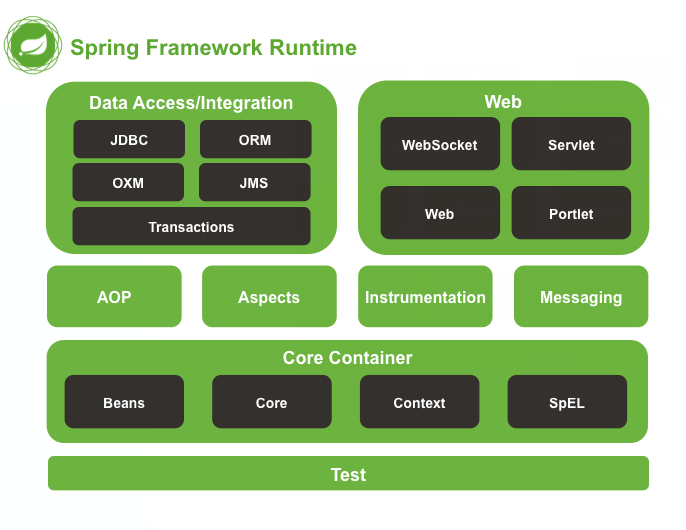​

**Spring 框架是一个分层架构，由 7 个定义良好的模块组成。Spring 模块构建在核心容器之上，核心容器定义了创建、配置和管理 bean 的方式**

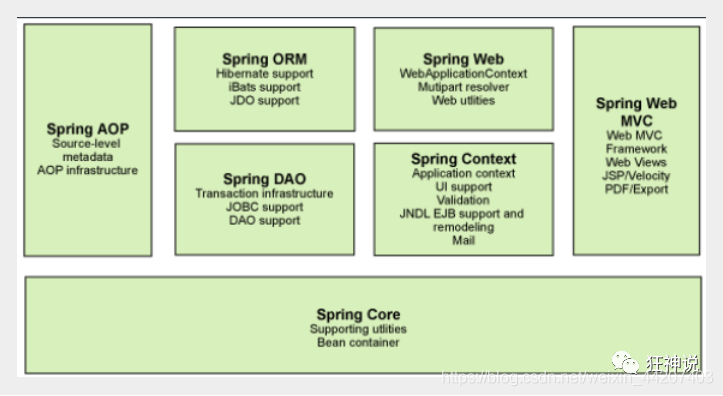​

**组成 Spring 框架的每个模块（或组件）都可以单独存在，或者与其他一个或多个模块联合实现。每个模块的功能如下：**

* **核心容器** **：核心容器提供 Spring 框架的基本功能。核心容器的主要组件是 BeanFactory，它是工厂模式的实现。BeanFactory 使用** *控制反转* **（IOC） 模式将应用程序的配置和依赖性规范与实际的应用程序代码分开。**
* **Spring 上下文** **：Spring 上下文是一个配置文件，向 Spring 框架提供上下文信息。Spring 上下文包括企业服务，例如 JNDI、EJB、电子邮件、国际化、校验和调度功能。**
* **Spring AOP** **：通过配置管理特性，Spring AOP 模块直接将面向切面的编程功能 , 集成到了 Spring 框架中。所以，可以很容易地使 Spring 框架管理任何支持 AOP的对象。Spring AOP 模块为基于 Spring 的应用程序中的对象提供了事务管理服务。通过使用 Spring AOP，不用依赖组件，就可以将声明性事务管理集成到应用程序中。**
* **Spring DAO** **：JDBC DAO 抽象层提供了有意义的异常层次结构，可用该结构来管理异常处理和不同数据库供应商抛出的错误消息。异常层次结构简化了错误处理，并且极大地降低了需要编写的异常代码数量（例如打开和关闭连接）。Spring DAO 的面向 JDBC 的异常遵从通用的 DAO 异常层次结构。**
* **Spring ORM** **：Spring 框架插入了若干个 ORM 框架，从而提供了 ORM 的对象关系工具，其中包括 JDO、Hibernate 和 iBatis SQL Map。所有这些都遵从 Spring 的通用事务和 DAO 异常层次结构。**
* **Spring Web 模块** **：Web 上下文模块建立在应用程序上下文模块之上，为基于 Web 的应用程序提供了上下文。所以，Spring 框架支持与 Jakarta Struts 的集成。Web 模块还简化了处理多部分请求以及将请求参数绑定到域对象的工作。**
* **Spring MVC 框架** **：MVC 框架是一个全功能的构建 Web 应用程序的 MVC 实现。通过策略接口，MVC 框架变成为高度可配置的，MVC 容纳了大量视图技术，其中包括 JSP、Velocity、Tiles、iText 和 POI。**

## 1.7、Spring jar 包下载

**懒得写，详见csdn**

## 1.8、Spring入门案例

1. **创建java工程**
2. **导入spring5相关jar包**

    1. 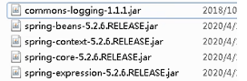​
    2. **以上4个为spring核心配置，**​
    3. **另外一个是日志包，不加入会报错**
    4. 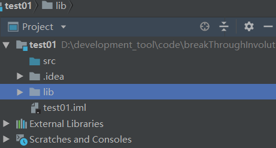​
3. > **创建普通类，创建普通方法**
    >

```java
public class User {
	public void add(){
		System.out.println("add......");
	}
}
```

4. **创建xml配置文件**

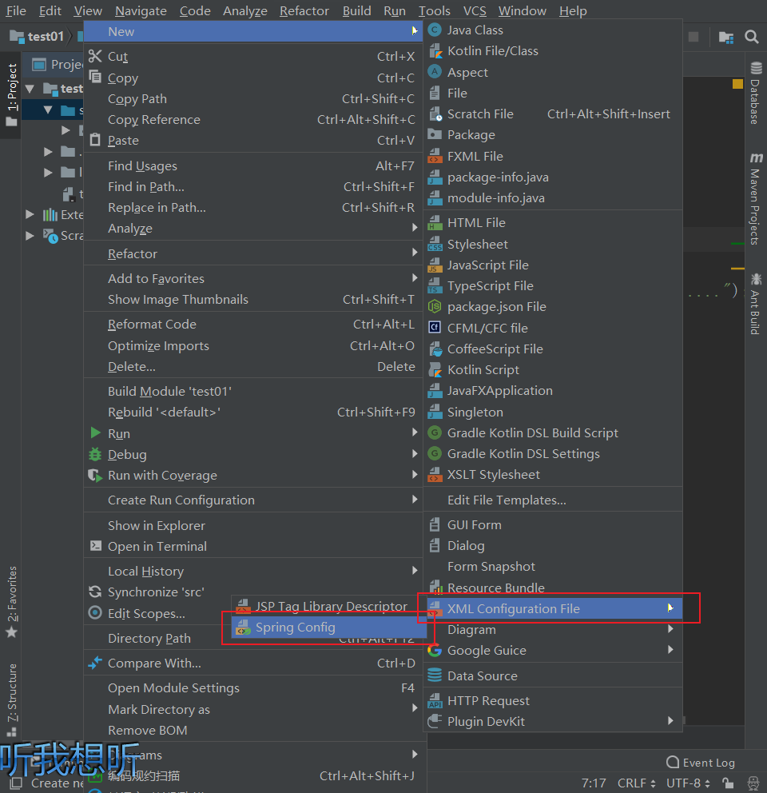​

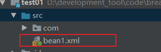​

5. > **配置xml**
    >

```xml
<?xml version="1.0" encoding="UTF-8"?>
<beans xmlns="http://www.springframework.org/schema/beans"
			 xmlns:xsi="http://www.w3.org/2001/XMLSchema-instance"
			 xsi:schemaLocation="http://www.springframework.org/schema/beans http://www.springframework.org/schema/beans/spring-beans.xsd">
	<!--配置User对象创建-->
	<bean id="user" class="com.atguigu.spring5.User"/>
</beans>
```

6. > **编写测试类进行进行测试**
    >

```java
package com.atguigu.spring5.test;

import com.atguigu.spring5.User;
import org.junit.Test;
import org.springframework.context.support.ClassPathXmlApplicationContext;

/**
* @author 李智勇
* @version 1.0
*/
public class test {
	@Test
	public void testAdd(){
		//1.加载spring配置文件
		ClassPathXmlApplicationContext context =	//bean1.xml：配置文件的路径
			new ClassPathXmlApplicationContext("bean1.xml");
		//2.获取配置创建的对象		//user -》id  User.class -》反射方式
		User user = context.getBean("user", User.class);
		//3.调用add方法
		user.add();
	}
}
```

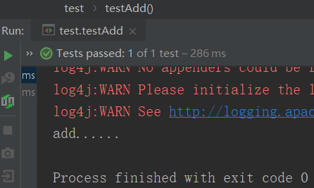​

# 2、IOC

## 2.1、 IOC概念

**什么是IOC**

* **ioc**

  * **控制反转** **：把创建对象交给**`spring`进行管理
  * **DI** **（** **依赖注入** **）：给类中的属性设置值**
* **使用**`IOC` **的目的：** **降低耦合度**
* **IOC底层原理**

  * `xml`解析
  * **工厂模式**
  * **反射**

## 2.2、IOC在Spring中的实现

**Spring的**`IOC`容器就是`IOC`思想的一个落地的产品实现，`IOC`容器中管理的组件也叫做`bean`，在创建bean之前，首先需要创建`IOC`容器，Spring提供了`IOC`容器的两种实现方式：

1、**BeanFactory**

**这是**`IOC`容器的基本实现，是Spring内部使用的接口，是帮助我们管理bean的，面向`Spring`本身，不提供给开发人员使用

2、**ApplicationContext**

·`BeanFactory`的子接口，提供了更多高级特性，面向Spring的使用者，几乎所有场合都是用**`ApplicationContext`，而不是底层的`BeanFactory`

**ApplicationContext的主要实现类**

​

|**类型名**|说明|
| :-------------------------------------------| :-----------------------------------------------------------------------------------------------------------------------------------------|
|**ClassPathXmlApplicationContext**|**通过读取类路径下的 XML 格式的配置文件创建 IOC 容器对象**<br />|
|**FileSystemXmlApplicationContext**|**通过文件系统路径读取 XML 格式的配置文件创建 IOC 容器对象**<br />|
|**ConfigurableApplicationContext**<br />|**ApplicationContext 的子接口，包含一些扩展方法 refresh()和 close() ，让 ApplicationContext 具有启动、关闭和刷新上下文的能力。**<br />|
|**WebApplicationContext**|**专门为 Web 应用准备，基于 Web 环境创建 IOC 容器对象，并将对象引入存入 ServletContext 域中。**<br />|

## 2.3、基于xml管理bean

### 2.3.1、实验一：入门案例

#### 1、创建Maven项目

#### 2、引入依赖

```xml
 <dependencies>
        <!-- 基于Maven依赖传递性，导入spring-context依赖即可导入当前所需所有jar包 -->
        <dependency>
            <groupId>org.springframework</groupId>
            <artifactId>spring-context</artifactId>
            <version>5.3.1</version>
        </dependency>

        <!-- junit测试 -->
        <dependency>
            <groupId>junit</groupId>
            <artifactId>junit</artifactId>
            <version>4.12</version>
            <scope>test</scope>
        </dependency>

        <!-- 日志 -->
        <dependency>
            <groupId>ch.qos.logback</groupId>
            <artifactId>logback-classic</artifactId>
            <version>1.2.3</version>
        </dependency>

        <!-- Lombok -->
        <dependency>
            <groupId>org.projectlombok</groupId>
            <artifactId>lombok</artifactId>
            <version>1.18.12</version>
            <scope>provided</scope>
        </dependency>
    </dependencies>
```

#### 3、**创建类 HelloWorld**

```java
package com.atguigu.spring.pojo;

/**
 * @author 李智勇
 * @version 1.0
 */
public class HelloWorld {
public void sayHello(){
    System.out.println("hello world");
}
}
```

#### 4、**配置xml文件  applicationContext.xml**

```xml
<?xml version="1.0" encoding="UTF-8"?>
<!--如下是spring配置的约束-->
<beans xmlns="http://www.springframework.org/schema/beans"
       xmlns:xsi="http://www.w3.org/2001/XMLSchema-instance"
       xsi:schemaLocation="http://www.springframework.org/schema/beans http://www.springframework.org/schema/beans/spring-beans.xsd">
    <!--
    bean：配置一个bean将对象交给IOC容器管理
    id：bean的唯一标识，不能重复
    class：设置对应的对象所对应的类型，必须是类全路径-->
    <bean id="helloWorld" class="com.atguigu.spring.pojo.HelloWorld"></bean>
</beans>
```

#### 5、**创建测试类 HelloWorldTest**

```java
package com.atguigu.spring.test;

import com.atguigu.spring.pojo.HelloWorld;
import org.junit.jupiter.api.Test;
import org.springframework.context.ApplicationContext;
import org.springframework.context.support.ClassPathXmlApplicationContext;

/**
 * @author 李智勇
 * @version 1.0
 */
public class HelloWorldTest {
    @Test
    public void test(){
        //获取IOC容器
        ApplicationContext ioc =     //配置路径，resource和java最终会被加载到同一个路径下，因此可以直接写applicationContext.xml
                new ClassPathXmlApplicationContext("applicationContext.xml");
        //获取对象
        //方式一：根据name（id）获取对象
        // 因为我们不知道该对象类型是什么，因此需要强转
        HelloWorld helloWorld1 =(HelloWorld)ioc.getBean("helloWorld");
        helloWorld1.sayHello();
        //方式二：根据class获取对象
        HelloWorld helloWorld2 = ioc.getBean(HelloWorld.class);
        helloWorld2.sayHello();
        //方式三：根据id + class获取对象
        HelloWorld helloWorld3 = ioc.getBean("helloWorld",HelloWorld.class);
        helloWorld3.sayHello();
    }
}
```

#### 6、**运行结果**

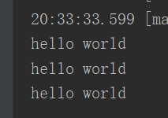​

#### 7、思路

​

#### 8、注意

Spring 底层默认通过反射技术调用组件类的无参构造器来创建组件对象，这一点需要注意。如果在需要无参构造器时，没有无参构造器，则会抛出下面的异常：

```xml
org.springframework.beans.factory.BeanCreationException: Error creating bean with name
'helloworld' defined in class path resource [applicationContext.xml]: Instantiation of bean
failed; nested exception is org.springframework.beans.BeanInstantiationException: Failed
to instantiate [com.atguigu.spring.bean.HelloWorld]: No default constructor found; nested
exception is java.lang.NoSuchMethodException: com.atguigu.spring.bean.HelloWorld.<init>
()
```

### 2.3.2、实验二：获取bean

#### 方式一：根据id获取

> 由于 id 属性指定了 bean 的唯一标识，所以根据 bean 标签的 id 属性可以精确获取到一个组件对象。上个实验中我们使用的就是这种方式。
>

#### 方式二：根据类型获取

```java
 @Test 
    public void testHelloWorld(){ 
        ApplicationContext ac = new 
        ClassPathXmlApplicationContext("applicationContext.xml"); 
        HelloWorld bean = ac.getBean(HelloWorld.class); 
        bean.sayHello(); }
}
```

#### 方式三：根据id和类型

```java
  @Test 
    public void testHelloWorld(){ 
        ApplicationContext ac = new 
        ClassPathXmlApplicationContext("applicationContext.xml"); 
        HelloWorld bean = ac.getBean("HelloWorld", HelloWorld.class); 
        bean.sayHello(); }
}
```

#### 注意

> 当根据类型获取bean时，要求IOC容器中指定类型的bean有且只能有一个
>
> 当IOC容器中一共配置了两个：
>

```xml
<bean id="helloworldOne" class="com.atguigu.spring.bean.HelloWorld"></bean> 
<bean id="helloworldTwo" class="com.atguigu.spring.bean.HelloWorld"></bean>
```

根据类型获取时会抛出异常：

> org.springframework.beans.factory.NoUniqueBeanDefinitionException: Noqualifying bean
>
> of type 'com.atguigu.spring.bean.HelloWorld' available: expected single matching bean butfound 2: helloworldOne,helloworldTwo
>

#### 扩展

如果组件类实现了接口，根据接口类型可以获取 bean 吗？

> 可以，前提是bean唯一
>

如果一个接口有多个实现类，这些实现类都配置了 bean，根据接口类型可以获取 bean 吗？

> 不行，因为bean不唯一
>

#### 结论

> 根据类型来获取bean时，在满足bean唯一性的前提下，其实只是看：『对象instanceof 指定的类型』的返回结果，只要返回的是true就可以认定为和类型匹配，能够获取到。
>

### 2.3.3、实验三：依赖注入之setter注入

1、给实体类添加set方法

2、配置bean时为属性赋值

```xml
<bean id="studentTwo" class="com.atguigu.spring.pojo.Student">
<!-- property标签：通过组件类的setXxx()方法给组件对象设置属性 --> 
<!-- name属性：指定属性名（这个属性名是getXxx()、setXxx()方法定义的，
和成员变量无关） --> 
<!-- value属性：指定属性值 --> 
<property name="id" value="1001"></property> 
<property name="name" value="张三"></property> 
<property name="age" value="23"></property> 
<property name="sex" value="男"></property> 
</bean>
```

### 2.3.4、实验四：依赖注入之构造器注入

1、在实体类中添加有参构造

2、配置bean

```xml
<bean id="studentThree" class="com.atguigu.spring.pojo.Student">
        <constructor-arg value="1002"></constructor-arg>
        <constructor-arg value="李四"></constructor-arg>
        <constructor-arg value="女"></constructor-arg>
        <constructor-arg value="24" name="age"></constructor-arg>
    </bean>
```

> 注意：
>
> constructor-arg标签还有两个属性可以进一步描述构造器参数：
>
> index属性：指定参数所在位置的索引（从0开始）
>
> name属性：指定参数名
>

### 2.3.5、实验五：特殊值处理

#### ①字面量赋值

> 什么是字面量？
>
> int a = 10;
>
> 声明一个变量a，初始化为10，此时a就不代表字母a了，而是作为一个变量的名字。当我们引用a的时候，我们实际上拿到的值是10。
>
> 而如果a是带引号的：'a'，那么它现在不是一个变量，它就是代表a这个字母本身，这就是字面量。所以字面量没有引申含义，就是我们看到的这个数据本身。
>

```xml
<!-- 使用value属性给bean的属性赋值时，Spring会把value属性的值看做字面量 --> 
<property name="name" value="张三"/>
```

#### ②null值

```xml
<!--方式一：-->
<property name="name"> 
<null /> 
</property>
<!--方式二：-->
<property name="name"> 
<value>null</value> 
</property>
```

> 注意：以下写法，为name所赋的值是字符串null
>

```xml
<property name="name" value="null"></property>
```

#### ③xml实体

```xml
<!-- 小于号大于号在XML文档中用来定义标签的开始，不能随便使用
	<：&lt;
        >：&gt;
 --> 
<!-- 解决方案一：使用XML实体来代替 --> 
<property name="sname" value="&lt;王五&gt;"></property>
```

#### ④CDATA节

```xml
<property name="expression"> 
<!-- 解决方案二：使用CDATA节 --> 
<!-- CDATA中的C代表Character，是文本、字符的含义，CDATA就表示纯文本数据 --> 
<!-- XML解析器看到CDATA节就知道这里是纯文本，就不会当作XML标签或属性来解析 --> 
<!-- 所以CDATA节中写什么符号都随意 
CDATA节是xml中一个特殊的标签，因此不能写在一个属性中
--> 
<value><![CDATA[a < b]]></value> 
</property>
```

### 2.3.6、实验六：为类类型属性赋值

> Clazz
>

```java
package com.atguigu.spring.pojo;

import java.util.List;

/**
 * Date:2022/7/1
 * Author:ybc
 * Description:
 */
public class Clazz {

    private Integer cid;

    private String cname;

    private List<Student> students;

    @Override
    public String toString() {
        return "Clazz{" +
                "cid=" + cid +
                ", cname='" + cname + '\'' +
                ", students=" + students +
                '}';
    }

    public Integer getCid() {
        return cid;
    }

    public void setCid(Integer cid) {
        this.cid = cid;
    }

    public String getCname() {
        return cname;
    }

    public void setCname(String cname) {
        this.cname = cname;
    }

    public List<Student> getStudents() {
        return students;
    }

    public void setStudents(List<Student> students) {
        this.students = students;
    }

    public Clazz() {
    }

    public Clazz(Integer cid, String cname) {
        this.cid = cid;
        this.cname = cname;
    }
}

```

> Student
>

```java
package com.atguigu.spring.pojo;

import java.util.Arrays;
import java.util.Map;

/**
 * Date:2022/7/1
 * Author:ybc
 * Description:
 */
public class Student implements Person {

    private Integer sid;

    private String sname;

    private Integer age;

    private String gender;

    private Double score;

    private String[] hobby;

    private Clazz clazz;

    private Map<String, Teacher> teacherMap;

    public Student() {
    }

    public Student(Integer sid, String sname, String gender, Integer age) {
        this.sid = sid;
        this.sname = sname;
        this.gender = gender;
        this.age = age;
    }

    public Student(Integer sid, String sname, String gender, Double score) {
        this.sid = sid;
        this.sname = sname;
        this.gender = gender;
        this.score = score;
    }

    public Integer getSid() {
        return sid;
    }

    public void setSid(Integer sid) {
        this.sid = sid;
    }

    public String getSname() {
        return sname;
    }

    public void setSname(String sname) {
        this.sname = sname;
    }

    public Integer getAge() {
        return age;
    }

    public void setAge(Integer age) {
        this.age = age;
    }

    public String getGender() {
        return gender;
    }

    public void setGender(String gender) {
        this.gender = gender;
    }

    public Double getScore() {
        return score;
    }

    public void setScore(Double score) {
        this.score = score;
    }

    public String[] getHobby() {
        return hobby;
    }

    public void setHobby(String[] hobby) {
        this.hobby = hobby;
    }

    public Clazz getClazz() {
        return clazz;
    }

    public void setClazz(Clazz clazz) {
        this.clazz = clazz;
    }

    public Map<String, Teacher> getTeacherMap() {
        return teacherMap;
    }

    public void setTeacherMap(Map<String, Teacher> teacherMap) {
        this.teacherMap = teacherMap;
    }

    @Override
    public String toString() {
        return "Student{" +
                "sid=" + sid +
                ", sname='" + sname + '\'' +
                ", age=" + age +
                ", gender='" + gender + '\'' +
                ", score=" + score +
                ", hobby=" + Arrays.toString(hobby) +
                ", clazz=" + clazz +
                ", teacherMap=" + teacherMap +
                '}';
    }
}

```

即实体类中有一个对象，用于多对一查询

#### 方式一：引用外部已声明的bean

```xml
 <bean id="studentFive" class="com.atguigu.spring.pojo.Student">
        <property name="sid" value="1004"></property>
        <property name="sname" value="赵六"></property>
        <property name="age" value="26"></property>
        <property name="gender" value="男"></property>
        <!--ref：引用IOC容器中的某个bean的id-->
	<property name="clazz" ref="clazzOne"></property>
</bean>

<bean id="clazzOne" class="com.atguigu.spring.pojo.Clazz">
        <property name="cid" value="1111"></property>
        <property name="cname" value="最强王者班"></property>
        <property name="students" ref="studentList"></property>
</bean>
```

#### 方式二：级联属性赋值

```xml
<bean id="studentFive" class="com.atguigu.spring.pojo.Student">
        <property name="sid" value="1004"></property>
        <property name="sname" value="赵六"></property>
        <property name="age" value="26"></property>
        <property name="gender" value="男"></property>
        <!--ref：引用IOC容器中的某个bean的id-->
        <property name="clazz" ref="clazzOne"></property>
        <!--级联的方式，要保证提前为clazz属性赋值或者实例化
	因为clazz已经被赋值了，那么如下就是修改了值-->
        <property name="clazz.cid" value="2222"></property>
        <property name="clazz.cname" value="远大前程班"></property>-->
</bean>

<bean id="clazzOne" class="com.atguigu.spring.pojo.Clazz">
        <property name="cid" value="1111"></property>
        <property name="cname" value="最强王者班"></property>
        <property name="students" ref="studentList"></property>
</bean>
```

#### 方式三：内部bean

```xml
<bean id="studentFive" class="com.atguigu.spring.pojo.Student">
        <property name="sid" value="1004"></property>
        <property name="sname" value="赵六"></property>
        <property name="age" value="26"></property>
        <property name="gender" value="男"></property>
  
        <property name="clazz">
            <!--内部bean，只能在当前bean的内部使用，不能直接通过IOC容器获取-->
            <bean id="clazzInner" class="com.atguigu.spring.pojo.Clazz">
                <property name="cid" value="2222"></property>
                <property name="cname" value="远大前程班"></property>
 </bean>
```

### 2.3.7、实验七：为数组类型属性赋值

```xml
<bean id="studentFive" class="com.atguigu.spring.pojo.Student">
        <property name="sid" value="1004"></property>
        <property name="sname" value="赵六"></property>
        <property name="age" value="26"></property>
        <property name="gender" value="男"></property> 
<property name="hobby">
         
            <array>
                 <!--如果当前数组是字面量类型，那么就用value给数组赋值
                如果是类类型的数组，那么需要用 <ref bean=""引用某个类型的bean给数组赋值>
                 -->
                <value>抽烟</value>
                <value>喝酒</value>
                <value>烫头</value>
            </array>
        </property>
</bean>
```

### 2.3.8、实验八：为集合类型属性赋值

#### 为List集合类型属性赋值

> 方法一：内部bean赋值
>

```xml
 <bean id="clazzOne" class="com.atguigu.spring.pojo.Clazz">
        <property name="cid" value="1111"></property>
        <property name="cname" value="最强王者班"></property>
        <!--<property name="students">
        <!--内部bean赋值-->
            <list>
                <ref bean="studentOne"></ref>
                <ref bean="studentTwo"></ref>
                <ref bean="studentThree"></ref>
            </list>
        </property>
    </bean>
<!--如上引用了如下的bean，studentTwo...后面就不写了-->
  <bean id="studentTwo" class="com.atguigu.spring.pojo.Student">
        <property name="sid" value="1001"></property>
        <property name="sname" value="张三"></property>
        <property name="age" value="23"></property>
        <property name="gender" value="男"></property>
    </bean>
```

> 方法二：使用util约束
>

```xml
<!-如下约束需要引入--> 
xmlns:xsi="http://www.w3.org/2001/XMLSchema-instance" xmlns:util="http://www.springframework.org/schema/util"
```

```xml
<bean id="clazzOne" class="com.atguigu.spring.pojo.Clazz">
        <property name="cid" value="1111"></property>
        <property name="cname" value="最强王者班"></property>
        <property name="students" ref="studentList"></property>
</bean>
<!--配置一个集合类型的bean，需要使用util的约束-->
    <util:list id="studentList">
        <ref bean="studentOne"></ref>
        <ref bean="studentTwo"></ref>
        <ref bean="studentThree"></ref>
    </util:list>
```

#### 为Map集合类型属性赋值

> 方法一：内部bean
>

```xml
 <bean id="clazzOne" class="com.atguigu.spring.pojo.Clazz">
        <property name="cid" value="1111"></property>
        <property name="cname" value="最强王者班"></property>
	<property name="teacherMap">
            <map>
                <entry key="10086" value-ref="teacherOne"></entry>
                <entry key="10010" value-ref="teacherTwo"></entry>
            </map>
        </property>
</bean>
```

> 方法二：使用util约束
>

```xml
 <bean id="clazzOne" class="com.atguigu.spring.pojo.Clazz">
        <property name="cid" value="1111"></property>
        <property name="cname" value="最强王者班"></property>
	<property name="teacherMap" ref="teacherMap"></property>
</bean>

 <util:map id="teacherMap">
        <entry key="10086" value-ref="teacherOne"></entry>
        <entry key="10010" value-ref="teacherTwo"></entry>
    </util:map>
```

### 2.3.9、实验九：p命名空间

> 需要引入p命名空间约束
>

```xml
<!--
    不带ref的是给字面量赋值
    带ref的是给类属性赋值，引用外部bean
-->
<bean id="studentSix" class="com.atguigu.spring.pojo.Student"
        p:sid="1005" p:sname="小明" p:teacherMap-ref="teacherMap"></bean>
```

### 2.3.10、实验十：管理数据源和引入外部属性文件

> pom.xml
>

```xml
<!-- MySQL驱动 -->
        <dependency>
            <groupId>mysql</groupId>
            <artifactId>mysql-connector-java</artifactId>
            <version>8.0.16</version>
        </dependency>
        <!-- 数据源 -->
        <dependency>
            <groupId>com.alibaba</groupId>
            <artifactId>druid</artifactId>
            <version>1.0.31</version>
        </dependency>
```

> 创建外部属性文件
>

```properties
jdbc.driver=com.mysql.cj.jdbc.Driver
jdbc.url=jdbc:mysql://localhost:3306/ssm?serverTimezone=UTC
jdbc.username=root
jdbc.password=123456
```

> 配置bean
>

```xml
<!-- 引入外部属性文件 --> 
<context:property-placeholder location="classpath:jdbc.properties"/>
```

```xml
<!--引入jdbc.properties，之后可以通过${key}的方式访问value-->
    <context:property-placeholder location="jdbc.properties"></context:property-placeholder>

    <bean id="dataSource" class="com.alibaba.druid.pool.DruidDataSource">
        <property name="driverClassName" value="${jdbc.driver}"></property>
        <property name="url" value="${jdbc.url}"></property>
        <property name="username" value="${jdbc.username}"></property>
        <property name="password" value="${jdbc.password}"></property>
    </bean>
```

### 2.3.11、实验十一：bean的作用域

> 在Spring中可以通过配置bean标签的scope属性来指定bean的作用域范围，各取值含义参加下表：
>

|取值|含义|创建对象的时机|
| -------------------| -----------------------------------------| -----------------|
|singleton（默认）|在IOC容器中，这个bean的对象始终为单实例|IOC容器初始化时|
|prototype|这个bean在IOC容器中有多个实例|获取bean时|

> 如果是在WebApplicationContext环境下还会有另外两个作用域（但不常用）：
>

|取值|含义|
| ---------| ----------------------|
|request|在一个请求范围内有效|
|session|在一个会话范围内有效|

```xml
 <!--
        scope：设置bean的作用域
        scope="singleton|prototype"
        singleton（单例）：表示获取该bean所对应的对象都是同一个
        prototype（多例）：表示获取该bean所对应的对象都不是同一个
    -->
    <bean id="student" class="com.atguigu.spring.pojo.Student" scope="prototype">
        <property name="sid" value="1001"></property>
        <property name="sname" value="张三"></property>
    </bean>
```

### 2.3.12、实验十二：bean的生命周期

#### ①具体的生命周期过程

1. bean对象创建（调用无参构造器）给bean对象设置属性
2. bean对象初始化之前操作（由bean的后置处理器负责）
3. bean对象初始化（需在配置bean时指定初始化方法）
4. bean对象初始化之后操作（由bean的后置处理器负责）
5. bean对象就绪可以使用
6. bean对象销毁（需在配置bean时指定销毁方法）
7. IOC容器关闭

> 或者如下
>
> 就是从创建到销毁的过程，通过构造方法或者工厂方法，实例化bean对象，并通过依赖注入，设置对象的属性。将Bean实例传递给Bean的前置处理器，调用Bean的初始化方法，再将Bean实例传递给Bean的后置处理器的，然后使用Bean。容器关闭之前，调用Bean的销毁方法销毁实例
>

#### ②修改类User

```java
package com.atguigu.spring.pojo;

/**
 * Date:2022/7/1
 * Author:ybc
 * Description:
 */
public class User {

    private Integer id;

    private String username;

    private String password;

    private Integer age;

    public User() {
        System.out.println("生命周期1：实例化");
    }

    public User(Integer id, String username, String password, Integer age) {
        this.id = id;
        this.username = username;
        this.password = password;
        this.age = age;
    }

    public Integer getId() {
        return id;
    }

    public void setId(Integer id) {
        System.out.println("生命周期2：依赖注入");
        this.id = id;
    }

    public String getUsername() {
        return username;
    }

    public void setUsername(String username) {
        this.username = username;
    }

    public String getPassword() {
        return password;
    }

    public void setPassword(String password) {
        this.password = password;
    }

    public Integer getAge() {
        return age;
    }

    public void setAge(Integer age) {
        this.age = age;
    }

    @Override
    public String toString() {
        return "User{" +
                "id=" + id +
                ", username='" + username + '\'' +
                ", password='" + password + '\'' +
                ", age=" + age +
                '}';
    }

    public void initMethod(){
        System.out.println("生命周期3：初始化");
    }

    public void destroyMethod(){
        System.out.println("生命周期4：销毁");
    }

}

```

> 注意其中的initMethod()和destroyMethod()，可以通过配置bean指定为初始化和销毁的方法
>

#### ③配置bean

```xml
<!-- 使用init-method属性指定初始化方法 --> 
<!-- 使用destroy-method属性指定销毁方法 --> 
<bean id="user" class="com.atguigu.spring.pojo.User" init-method="initMethod" destroy-method="destroyMethod">
        <property name="id" value="1"></property>
        <property name="username" value="admin"></property>
        <property name="password" value="123456"></property>
        <property name="age" value="23"></property>
</bean>
```

#### ④测试

```java
 @Test
    public void test(){
        //ConfigurableApplicationContext是ApplicationContext的子接口，其中扩展了刷新和关闭容器的方法
        ConfigurableApplicationContext ioc = new ClassPathXmlApplicationContext("spring-lifecycle.xml");
        User user = ioc.getBean(User.class);
        System.out.println(user);
        ioc.close();
    }
```

#### ⑤bean的后置处理器

> bean的后置处理器会在生命周期的初始化前后添加额外的操作，需要实现BeanPostProcessor接口，且配置到IOC容器中，需要注意的是，bean后置处理器不是单独针对某一个bean生效，而是针对IOC容器中所有bean都会执行
>

创建bean的后置处理器：

```java
package com.atguigu.spring.process; import org.springframework.beans.BeansException; import org.springframework.beans.factory.config.BeanPostProcessor;

    public class MyBeanProcessor implements BeanPostProcessor {
        @Override
        public Object postProcessBeforeInitialization(Object bean, String beanName) throws BeansException {
            System.out.println("☆☆☆" + beanName + " = " + bean);
            return bean;
        }

        @Override
        public Object postProcessAfterInitialization(Object bean, String beanName) throws BeansException {
            System.out.println("★★★" + beanName + " = " + bean);
            return bean;
        }
    }
```

> 在IOC容器中配置后置处理器：
>

```xml
<!-- bean的后置处理器要放入IOC容器才能生效 --> 
<bean id="myBeanProcessor" class="com.atguigu.spring.process.MyBeanProcessor"/>
```

### 2.3.13、实验十三：FactoryBean

#### ①简介

> FactoryBean是Spring提供的一种整合第三方框架的常用机制。和普通的bean不同，配置一个
>
> FactoryBean类型的bean，在获取bean的时候得到的并不是class属性中配置的这个类的对象，而是
>
> getObject()方法的返回值。通过这种机制，Spring可以帮我们把复杂组件创建的详细过程和繁琐细节都
>
> 屏蔽起来，只把最简洁的使用界面展示给我们。
>
> 将来我们整合Mybatis时，Spring就是通过FactoryBean机制来帮我们创建SqlSessionFactory对象的。
>

* 如何理解？

  * 原本我们需要先获取工厂（BeanFactory），在获取对象
  * 而FactoryBean使我们少了一步，我们可以把他配置到IOC容器中，就可以直接获取FactoryBean所提供的对象

> 可以去看源码,源码有点对，这里就不复制了
>

FactoryBean是一个接口，需要创建一个类实现该接口

* 其中有三个方法：
* getObject()：通过一个对象交给IOC容器管理
* getObjectType()：设置所提供对象的类型
* isSingleton()：所提供的对象是否单例
* 当把FactoryBean的实现类配置为bean时，会将当前类中getObject()所返回的对象交给IOC容器管理

#### ②创建类UserFactoryBean

```java
public class UserFactoryBean implements FactoryBean<User> {
    @Override
    public User getObject() throws Exception {
        return new User();
    }

    @Override
    public Class<?> getObjectType() {
        return User.class;
    }
}
```

#### ③配置bean

```xml
<bean class="com.atguigu.spring.factory.UserFactoryBean"></bean>
```

#### ④测试

```java
package com.atguigu.spring.test;

import com.atguigu.spring.pojo.User;
import org.junit.Test;
import org.springframework.context.ApplicationContext;
import org.springframework.context.support.ClassPathXmlApplicationContext;

/**
 * Date:2022/7/1
 * Author:ybc
 * Description:
 */
public class FactoryBeanTest {

    @Test
    public void testFactoryBean(){
        ApplicationContext ioc = new ClassPathXmlApplicationContext("spring-factory.xml");
        User user = ioc.getBean(User.class);
        System.out.println(user);
    }

}

```

### 2.3.14、实验十四：基于xml的自动装配

> 前言：
>
> Controller中添加属性 private UserService userService;
>
> 并提供set方法，其余service，dao也是如此，因为用的是set注入
>

#### 模拟自动装配

```xml
<?xml version="1.0" encoding="UTF-8"?>
<beans xmlns="http://www.springframework.org/schema/beans"
       xmlns:xsi="http://www.w3.org/2001/XMLSchema-instance"
       xsi:schemaLocation="http://www.springframework.org/schema/beans http://www.springframework.org/schema/beans/spring-beans.xsd">

    <bean id="userController" class="com.atguigu.spring.controller.UserController">
        <property name="userService" ref="userService"></property>
    </bean>

    <bean id="userService" class="com.atguigu.spring.service.impl.UserServiceImpl">
        <property name="userDao" ref="userDao"></property>
    </bean>

    <bean id="userDao" class="com.atguigu.spring.dao.impl.UserDaoImpl"></bean>

</beans>
```

> 通过上述代码完成给当前类中的属性赋值
>
> 即Controller-> UserService  ServiceImpl -> UserDao
>

#### 配置自动装配

> /**  
>      * 自动装配：  
>      * 根据指定的策略，在IOC容器中匹配某个bean，自动为bean中的类类型的属性或接口类型的属性赋值  
>      * 可以通过bean标签中的autowire属性设置自动装配的策略  
>      * 自动装配的策略：  
>      * ==1、no，default==：表示不装配，即bean中的属性不会自动匹配某个bean为属性赋值，此时属性使用默认值  
>      * ==2、byType==：根据要赋值的属性的类型，在IOC容器中匹配某个bean，为属性赋值  
>      * 注意：  
>      * a>若通过类型没有找到任何一个类型匹配的bean，此时不装配，属性使用默认值  
>      * b>若通过类型找到了多个类型匹配的bean，此时会抛出异常：	  	     NoUniqueBeanDefinitionException  
>      * 总结：当使用byType实现自动装配时，IOC容器中有且只有一个类型匹配的bean能够为属性赋值  
>      * ==3、byName==：将要赋值的属性的属性名作为bean的id在IOC容器中匹配某个bean，为属性赋值  
>      * 总结：当类型匹配的bean有多个时，此时可以使用byName实现自动装配  
>      */
>

```xml
<?xml version="1.0" encoding="UTF-8"?>
<beans xmlns="http://www.springframework.org/schema/beans"
       xmlns:xsi="http://www.w3.org/2001/XMLSchema-instance"
       xsi:schemaLocation="http://www.springframework.org/schema/beans http://www.springframework.org/schema/beans/spring-beans.xsd">

    <bean id="userController" class="com.atguigu.spring.controller.UserController" autowire="byName">
      
    </bean>

    <bean id="userService" class="com.atguigu.spring.service.impl.UserServiceImpl" autowire="byName">
      
    </bean>

    <bean id="userDao" class="com.atguigu.spring.dao.impl.UserDaoImpl"></bean>

  

</beans>
```

## 2.4、基于注解管理Bean

### 2.4.1、实验一：标记与扫描

#### ①注解

> 和 XML 配置文件一样，注解本身并不能执行，注解本身仅仅只是做一个标记，具体的功能是框架检测
>
> 到注解标记的位置，然后针对这个位置按照注解标记的功能来执行具体操作。
>
> 本质上：所有一切的操作都是Java代码来完成的，XML和注解只是告诉框架中的Java代码如何执行。
>
> 举例：元旦联欢会要布置教室，蓝色的地方贴上元旦快乐四个字，红色的地方贴上拉花，黄色的地方贴
>
> 上气球。
>

​

> 班长做了所有标记，同学们来完成具体工作。墙上的标记相当于我们在代码中使用的注解，后面同学们
>
> 做的工作，相当于框架的具体操作。
>

#### ②扫描

> Spring 为了知道程序员在哪些地方标记了什么注解，就需要通过扫描的方式，来进行检测。然后根据注
>
> 解进行后续操作。
>

#### ③新建Maven Module

```xml
<?xml version="1.0" encoding="UTF-8"?>
<project xmlns="http://maven.apache.org/POM/4.0.0"
         xmlns:xsi="http://www.w3.org/2001/XMLSchema-instance"
         xsi:schemaLocation="http://maven.apache.org/POM/4.0.0 http://maven.apache.org/xsd/maven-4.0.0.xsd">
    <modelVersion>4.0.0</modelVersion>

    <groupId>com.atguigu.spring</groupId>
    <artifactId>spring_ioc_annotation</artifactId>
    <version>1.0-SNAPSHOT</version>
    <packaging>jar</packaging>

    <dependencies>
        <!-- 基于Maven依赖传递性，导入spring-context依赖即可导入当前所需所有jar包 -->
        <dependency>
            <groupId>org.springframework</groupId>
            <artifactId>spring-context</artifactId>
            <version>5.3.1</version>
        </dependency>
        <!-- junit测试 -->
        <dependency>
            <groupId>junit</groupId>
            <artifactId>junit</artifactId>
            <version>4.12</version>
            <scope>test</scope>
        </dependency>
    </dependencies>

</project>
```

#### ④创建Spring配置文件

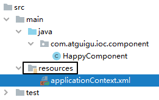​

#### ⑤标识组件的常用注解

> @Component：将类标识为普通组件
>
>  @Controller：将类标识为控制层组件 
>
> @Service：将类标识为业务层组件 
>
> @Repository：将类标识为持久层组件
>

问：以上四个注解有什么关系和区别？

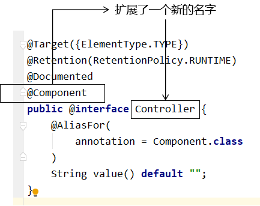​

> 通过查看源码我们得知，@Controller、@Service、@Repository这三个注解只是在@Component注解的基础上起了三个新的名字。
>
> 对于Spring使用IOC容器管理这些组件来说没有区别。所以@Controller、@Service、@Repository这
>
> 三个注解只是给开发人员看的，让我们能够便于分辨组件的作用。
>
> 注意：虽然它们本质上一样，但是为了代码的可读性，为了程序结构严谨我们肯定不能随便胡乱标记。
>

#### ⑥创建组件

创建控制层组件

```java
@Controller
public class UserController {
}
```

创建接口UserService

```java
public interface UserService {
}
```

创建业务层组件UserServiceImpl

```java
@Service
public class UserServiceImpl implements UserService {
}
```

创建接口UserDao

```java
public interface UserDao {
}
```

创建持久层组件UserDaoImpl

```java
@Repository
public class UserDaoImpl implements UserDao {
}
```

#### ⑦扫描组件

情况一：最基本的扫描方式

```xml
<!--扫描组件  > 该包中的类都可以使用注解-->
    <context:component-scan base-package="com.atguigu.spring"/>
```

情况二：指定要排除的组件

```xml
<context:component-scan base-package="com.atguigu">
    <!-- context:exclude-filter标签：指定排除规则 -->
    <!--
        type：设置排除或包含的依据
        type="annotation"，根据注解排除，expression中设置要排除的注解的全类名
        type="assignable"，根据类型排除，expression中设置要排除的类型的全类名
    -->
<context:exclude-filter type="annotation" expression="org.springframework.stereotype.Controller"/>
<!--<context:exclude-filter type="assignable" expression="com.atguigu.controller.UserController"/>-->
</context:component-scan>
```

情况三：仅扫描指定组件

```xml
 <context:component-scan base-package="com.atguigu"
                            use-default-filters="false"> 
        <!-- context:include-filter标签：指定在原有扫描规则的基础上追加的规则 --> 
        <!-- use-default-filters属性：取值false表示关闭默认扫描规则 --> 
        <!-- 此时必须设置use-default-filters="false"，因为默认规则即扫描指定包下所有类 --> 
        <!--type：设置排除或包含的依据 
        type="annotation"，根据注解包含，expression中设置要排除的注解的全类名 
        type="assignable"，根据类型包含，expression中设置要排除的类型的全类名 -->
        <context:include-filter type="annotation"
                                expression="org.springframework.stereotype.Controller"/> 
        <!--<context:include-filter type="assignable" expression="com.atguigu.controller.UserController"/>-->
    </context:component-scan>
```

#### ⑧测试

```java
 @Test
    public void test(){
        ApplicationContext ioc = new ClassPathXmlApplicationContext("spring-ioc-annotation.xml");
        UserController userController = ioc.getBean("controller", UserController.class);
        System.out.println(userController);
        UserService userService = ioc.getBean("userServiceImpl", UserService.class);
        System.out.println(userService);
        UserDao userDao = ioc.getBean("userDaoImpl", UserDao.class);
        System.out.println(userDao);
    }
```

#### ⑨组件所对应的bean的id

> 默认情况
>
> 类名首字母小写就是bean的id。例如：UserController类对应的bean的id就是userController。
>
> 自定义bean的id
>
> 可通过标识组件的注解的value属性设置自定义的bean的id
>
> @Service("userService")//默认为userServiceImpl public class UserServiceImpl implements
>
> UserService {}
>

### 2.4.2、实验二：基于注解的自动装配

#### ①场景模拟

> 参考基于xml的自动装配
>
> 在UserController中声明UserService对象
>
> 在UserServiceImpl中声明UserDao对象
>

#### ②@Autowired注解

> 1、@Autowired注解能够标识的位置  
>      * a>标识在成员变量上，此时不需要设置成员变量的set方法  
>      * b>标识在set方法上  
>      * c>标识在为当前成员变量赋值的有参构造上
>
> 2、@Autowired注解的原理  
>      * a>默认通过byType的方式，在IOC容器中通过类型匹配某个bean为属性赋值  
>      * b>若有多个类型匹配的bean，此时会自动转换为byName的方式实现自动装配的效果  
>      * 即将要赋值的属性的属性名作为bean的id匹配某个bean为属性赋值  
>      * c>若byType和byName的方式都无妨实现自动装配，即IOC容器中有多个类型匹配的bean  
>      * 且这些bean的id和要赋值的属性的属性名都不一致，此时抛异常：NoUniqueBeanDefinitionException  
>      * d>此时可以在要赋值的属性上，添加一个注解==@Qualifier==  
>      * 通过该注解的value属性值，指定某个bean的id，将这个bean为属性赋值  
>      *  
>      * 注意：若IOC容器中没有任何一个类型匹配的bean，此时抛出异常：NoSuchBeanDefinitionException  
>      * 在@Autowired注解中有个属性required，默认值为true，要求必须完成自动装配  
>      * 可以将required设置为false，此时能装配则装配，无法装配则使用属性的默认值
>

> @Autowired工作流程
>

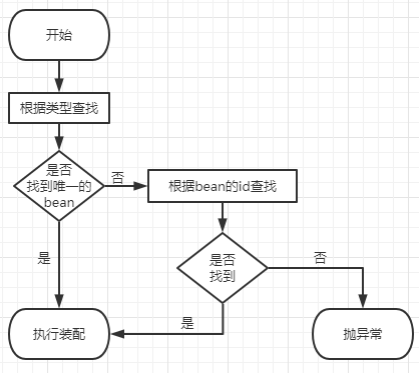​

* 首先根据所需要的组件类型到IOC容器中查找

  * 能够找到唯一的bean：直接执行装
  * 如果完全找不到匹配这个类型的bean：装配失败
  * 和所需类型匹配的bean不止一个

    * 没有@Qualifier注解：根据@Autowired标记位置成员变量的变量名作为bean的id进行匹配

      * 能够找到：执行装配
      * 找不到：装配失败
    * 使用@Qualifier注解：根据@Qualifier注解中指定的名称作为bean的id进行匹配

      * 能够找到：执行装配
      * 找不到：装配失败

# 3. AOP

## 3.1、场景模拟

### 3.1.1、声明接口

> 声明计算器接口Calculator，包含加减乘除的抽象方法
>

```java
package com.atguigu.spring.proxy;

/**
 * Date:2022/7/4
 * Author:ybc
 * Description:
 */
public interface Calculator {

    int add(int i, int j);

    int sub(int i, int j);

    int mul(int i, int j);

    int div(int i, int j);

}
```

### 3.1.2、创建实现类

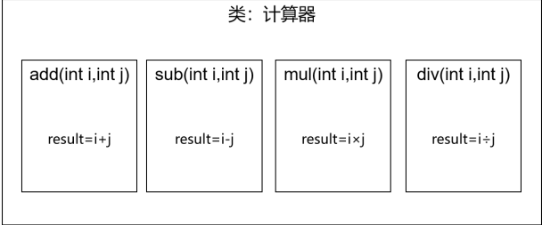

==如下核心代码==

```java
package com.atguigu.spring.proxy;

/**
 * Date:2022/7/4
 * Author:ybc
 * Description:
 */
public class CalculatorImpl implements Calculator {
    @Override
    public int add(int i, int j) {
        int result = i + j;
        System.out.println("方法内部，result："+result);
        return result;
    }

    @Override
    public int sub(int i, int j) {
        int result = i - j;
        System.out.println("方法内部，result："+result);
        return result;
    }

    @Override
    public int mul(int i, int j) {
        int result = i * j;
        System.out.println("方法内部，result："+result);
        return result;
    }

    @Override
    public int div(int i, int j) {
        int result = i / j;
        System.out.println("方法内部，result："+result);
        return result;
    }
}
```

### 3.1.3、创建带日志功能的实现类

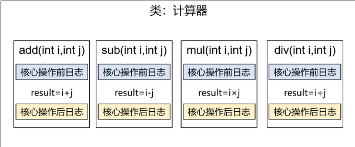

添加日志功能

```java
public class CalculatorImpl implements Calculator {
        @Override
        public int add(int i, int j) {
            System.out.println("[日志] add 方法开始了，参数是：" + i + "," + j);
            int result = i + j;
            System.out.println("方法内部 result = " + result);
            System.out.println("[日志] add 方法结束了，结果是：" + result);
            return result;
        }

        @Override
        public int sub(int i, int j) {
            System.out.println("[日志] sub 方法开始了，参数是：" + i + "," + j);
            int result = i - j;
            System.out.println("方法内部 result = " + result);
            System.out.println("[日志] sub 方法结束了，结果是：" + result);
            return result;
        }

        @Override
        public int mul(int i, int j) {
            System.out.println("[日志] mul 方法开始了，参数是：" + i + "," + j);
            int result = i * j;
            System.out.println("方法内部 result = " + result);
            System.out.println("[日志] mul 方法结束了，结果是：" + result);
            return result;
        }

        @Override
        public int div(int i, int j) {
            System.out.println("[日志] div 方法开始了，参数是：" + i + "," + j);
            int result = i / j;
            System.out.println("方法内部 result = " + result);
            System.out.println("[日志] div 方法结束了，结果是：" + result);
            return result;
        }
    }
```

### 3.1.4、提出问题

#### ①现有代码缺陷

> 针对带日志功能的实现类，我们发现有如下缺陷：
>

* 对核心业务功能有干扰，导致程序员在开发核心业务功能时分散了精力(如上日志代码为非核心代码，而它放到了核心业务代码中)
* 附加功能分散在各个业务功能方法中，不利于统一维护(即加入的日志功能一模一样，但是却无法抽取出来)

==即代码重复且分散==）

#### ②解决思路

解决这两个问题，核心就是：==解耦==。我们需要把附加功能从业务功能代码中抽取出来

#### ③困难

解决问题的困难：要抽取的代码在方法内部，靠以前把子类中的重复代码抽取到父类的方式或封装方法没法解决。所以需要引入新的技术。

## 3.2、代理模式

### 3.2.1、概念

#### ①介绍

> 二十三种设计模式中的一种，属于结构型模式。它的作用就是通过提供一个代理类，让我们在调用目标方法的时候，不再是直接对目标方法进行调用，而是通过代理类间接调用。让不属于目标方法核心逻辑的代码从目标方法中剥离出来——==解耦==。调用目标方法时先调用代理对象的方法，减少对目标方法的调用和打扰，同时让附加功能能够集中在一起也有利于统一维护。
>

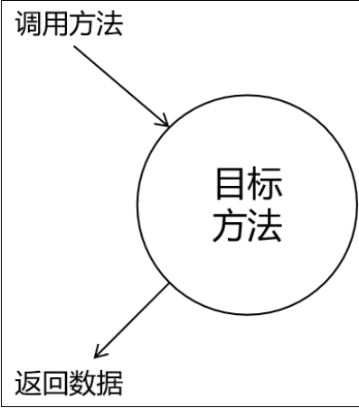​

使用代理后：

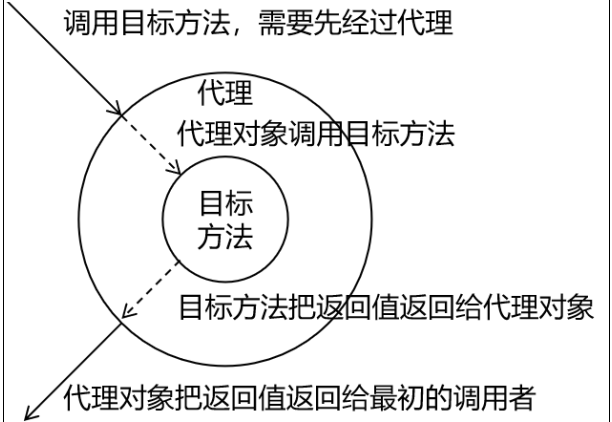​

#### ②生活中的代理

* 广告商找大明星拍广告需要经过经纪人
* 合作伙伴找大老板谈合作要约见面时间需要经过秘书
* 房产中介是买卖双方的代理

#### ③相关术语

* 代理：将非核心逻辑剥离出来以后，封装这些非核心逻辑的类、对象、方法
* 目标：被代理“套用”了非核心逻辑代码的类、对象、方法。

即在不改目标对象的情况下对代理对象添加一个额外的操作

### 3.2.2、静态代理

> 将CalculatorImpl 类中的日志功能删掉，只保留核心代码
>

> 创建静态代理类：
>

```java
package com.atguigu.spring.proxy;

/**
 * Date:2022/7/4
 * Author:ybc
 * Description:
 */
public class CalculatorStaticProxy implements Calculator {
	// 将被代理的目标对象声明为成员变量
    private CalculatorImpl target;

    public CalculatorStaticProxy(CalculatorImpl target) {
        this.target = target;
    }

    @Override
    public int add(int i, int j) {
        System.out.println("日志，方法：add，参数："+i+","+j);
        int result = target.add(i, j);
        System.out.println("日志，方法：add，结果："+result);
        return result;
    }

    @Override
    public int sub(int i, int j) {
        System.out.println("日志，方法：sub，参数："+i+","+j);
        int result = target.sub(i, j);
        System.out.println("日志，方法：sub，结果："+result);
        return result;
    }

    @Override
    public int mul(int i, int j) {
        System.out.println("日志，方法：mul，参数："+i+","+j);
        int result = target.mul(i, j);
        System.out.println("日志，方法：mul，结果："+result);
        return result;
    }

    @Override
    public int div(int i, int j) {
        System.out.println("日志，方法：div，参数："+i+","+j);
        int result = target.div(i, j);
        System.out.println("日志，方法：div，结果："+result);
        return result;
    }
}

```

> 静态代理确实实现了解耦，但是由于代码都写死了，完全不具备任何的灵活性。就拿日志功能来说，将来其他地方也需要附加日志，那还得再声明更多个静态代理类，那就产生了大量重复的代码，日志功能还是分散的，没有统一管理
>
> 提出进一步的需求：将日志功能集中到一个代理类中，将来有任何日志需求，都通过这一个代理类来实现。这就需要使用动态代理技术了。
>

> 同样该代理类中分别对应着AOP的4种通知
>
> 前置通知：核心代码执行前通知
>
> 返回通知：核心代码执行完成后通知
>
> 后置通知：核心代码执行完后通知
>
> 异常通知：抛出异常后通知
>

> 图示
>

​

测试

```java
 @Test
    public void testProxy(){
        CalculatorStaticProxy proxy = new CalculatorStaticProxy(new CalculatorImpl());
        proxy.add(1, 2);
    }
```

执行结果

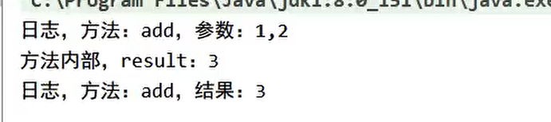

### 3.2.3、动态代理

==动态：指动态的生成目标类所生成的代理类==

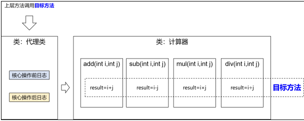​

==生产代理对象的工厂类：==

```java
package com.atguigu.spring.proxy;

import java.lang.reflect.InvocationHandler;
import java.lang.reflect.InvocationTargetException;
import java.lang.reflect.Method;
import java.lang.reflect.Proxy;
import java.util.Arrays;

/**
 * Date:2022/7/4
 * Author:ybc
 * Description:
 */
public class ProxyFactory {
	//因为不确定目标对象是谁，因此未object
    private Object target;

    public ProxyFactory(Object target) {
        this.target = target;
    }

    public Object getProxy(){
        /**JDK动态代理
	 //newProxyInstance();创建一个代理实例
         * ClassLoader loader：指定加载动态生成的代理类的类加载器
         * Class[] interfaces：获取目标对象实现的所有接口的class对象的数组
         * InvocationHandler h：设置代理对象实现目标对象方法的过程，即代理类中如何重写接口中的抽象方法
         */
        ClassLoader classLoader = this.getClass().getClassLoader();
        Class<?>[] interfaces = target.getClass().getInterfaces();
	//因为他是一个接口，所以要么创建一个实现类，要么使用匿名内部类
        InvocationHandler h = new InvocationHandler() {
            @Override
            public Object invoke(Object proxy, Method method, Object[] args) throws Throwable {
                Object result = null;
                try {
                    System.out.println("日志，方法："+method.getName()+"，参数："+ Arrays.toString(args));
                    //proxy表示代理对象，
		    //method表示要执行的方法，即其中需要重写的方法
		    //args表示要执行的方法到的参数列表
                    result = method.invoke(target, args);
                    System.out.println("日志，方法："+method.getName()+"，结果："+ result);
                } catch (Exception e) {
                    e.printStackTrace();
                    System.out.println("日志，方法："+method.getName()+"，异常："+ e);
                } finally {
                    System.out.println("日志，方法："+method.getName()+"，方法执行完毕");
                }
                return result;
            }
        };
        return Proxy.newProxyInstance(classLoader, interfaces, h);
    }
}

```

> 测试
>

```java
 @Test
    public void testProxy(){
        /*CalculatorStaticProxy proxy = new CalculatorStaticProxy(new CalculatorImpl());
        proxy.add(1, 2);*/
        ProxyFactory proxyFactory = new ProxyFactory(new CalculatorImpl());
        //我们不知道当前动态生成代理类的类型，但是我们知道它实现了接口，因此向上转型
        Calculator proxy = (Calculator) proxyFactory.getProxy();
        proxy.div(1,0);
    }
```

### 3.2.4、总结

> /**  
>      * 动态代理有两种：  
>      * 1、jdk动态代理，要求必须有接口，最终生成的代理类和目标类实现相同的接口  
>      * 在com.sun.proxy包下，类名为$proxy2  
>      * 2、cglib动态代理，最终生成的代理类会继承目标类，并且和目标类在相同的包下  
>      */
>

## 3.3、AOP概念及相关术语

### 3.3.1、概述

> AOP（Aspect Oriented Programming）是一种设计思想，是软件设计领域中的面向切面编程，它是面向对象编程的一种补充和完善，它以通过预编译方式和运行期动态代理方式实现在不修改源代码的情况下给程序动态统一添加额外功能的一种技术。
>

### 3.3.2、相关术语

#### ①横切关注点

> 从每个方法中抽取出来的同一类非核心业务。在同一个项目中，我们可以使用多个横切关注点对相关方法进行多个不同方面的增强。
>
> 这个概念不是语法层面天然存在的，而是根据附加功能的逻辑上的需要：有十个附加功能，就有十个横切关注点。
>

​

#### ②通知

==每一个横切关注点上要做的事情都需要写一个方法来实现，这样的方法就叫通知方法。==

* 前置通知：在被代理的目标方法前执行
* 返回通知：在被代理的目标方法成功结束后执行（寿终正寝）
* 异常通知：在被代理的目标方法异常结束后执行（死于非命）
* 后置通知：在被代理的目标方法最终结束后执行（盖棺定论）
* 环绕通知：使用try...catch...finally结构围绕整个被代理的目标方法，包括上面四种通知对应的所有位置

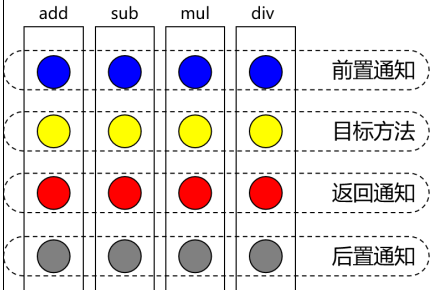​

#### ③切面

封装通知方法的类。

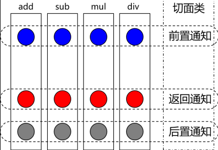​

#### ④目标

被代理的目标对象。

#### ⑤代理

向目标对象应用通知之后创建的代理对象。

#### ⑥连接点

这也是一个纯逻辑概念，不是语法定义的。

把方法排成一排，每一个横切位置看成x轴方向，把方法从上到下执行的顺序看成y轴，x轴和y轴的交叉

点就是连接点。

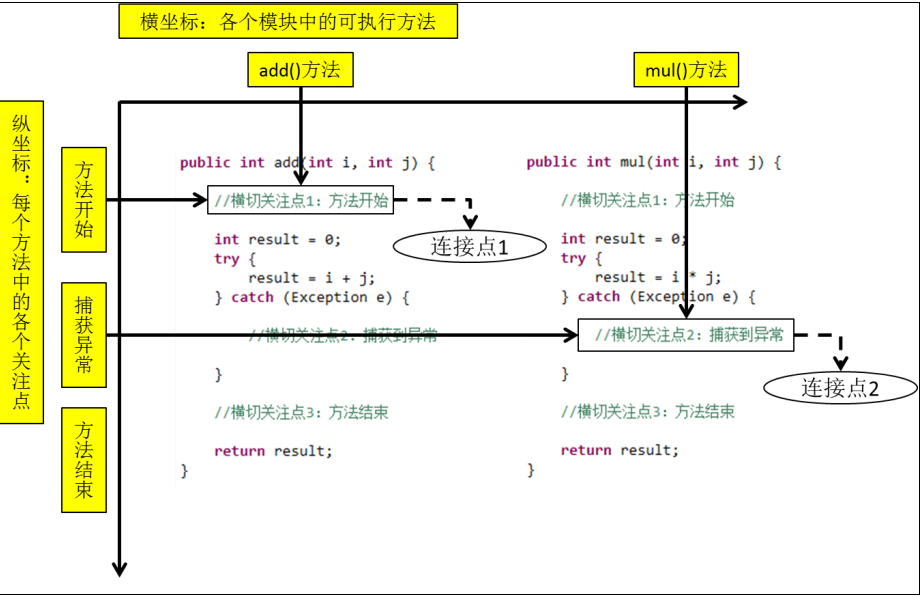​

#### ⑦切入点

> 定位连接点的方式。
>
> 每个类的方法中都包含多个连接点，所以连接点是类中客观存在的事物（从逻辑上来说）。
>
> 如果把连接点看作数据库中的记录，那么切入点就是查询记录的 SQL 语句。
>
> Spring 的 AOP 技术可以通过切入点定位到特定的连接点。
>
> 切点通过 org.springframework.aop.Pointcut 接口进行描述，它使用类和方法作为连接点的查询条
>
> 件。
>

### 3.3.3、作用

* 简化代码：把方法中固定位置的重复的代码抽取出来，让被抽取的方法更专注于自己的核心功能，提高内聚性。
* 代码增强：把特定的功能封装到切面类中，看哪里有需要，就往上套，被套用了切面逻辑的方法就被切面给增强了。

## 3.4、基于注解的AOP

### 3.4.1、技术说明

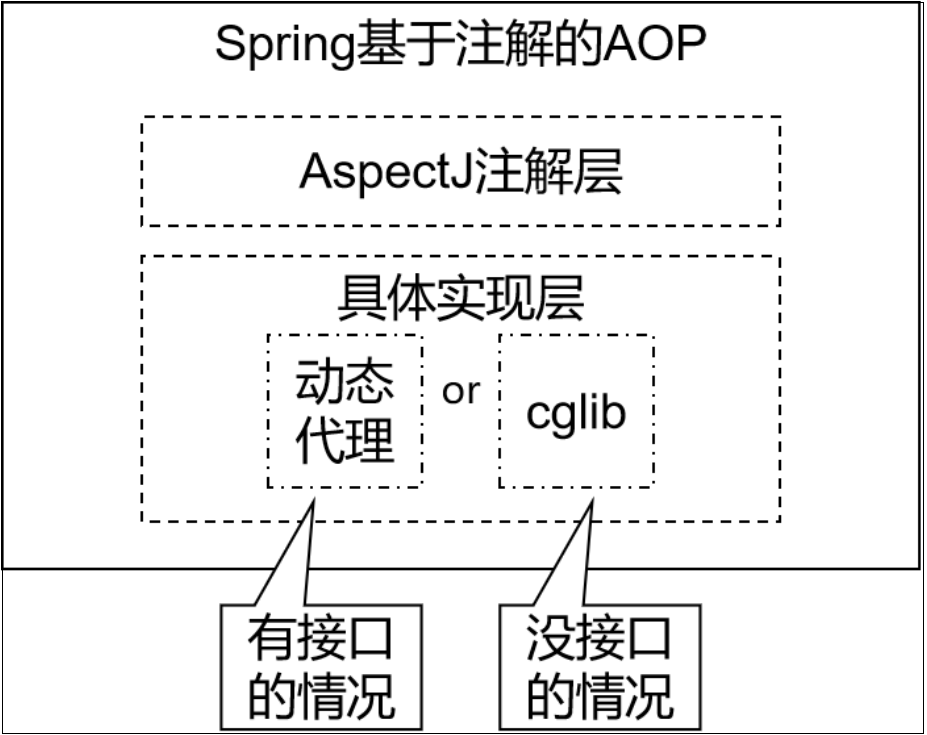​

* 动态代理（InvocationHandler）：JDK原生的实现方式，需要被代理的目标类必须实现接口。因为这个技术要求==代理对象和目标对象实现同样的接口==（兄弟两个拜把子模式）。

* cglib：通过==继承被代理的目标类==（认干爹模式）实现代理，所以不需要目标类实现接口。

* AspectJ：本质上是静态代理，==将代理逻辑“织入”被代理的目标类编译得到的字节码文件==，所以最终效果是==动态==的。weaver就是织入器。Spring只是借用了AspectJ中的注解。

### 3.4.2、准备工作

#### ①添加依赖

在IOC所需依赖基础上再加入下面依赖即可：

```xml
<!-- spring-aspects会帮我们传递过来aspectjweaver -->
        <dependency>
            <groupId>org.springframework</groupId>
            <artifactId>spring-aspects</artifactId>
            <version>5.3.1</version>
        </dependency>
```

#### ②准备被代理的目标资源

> 接口
>

```java
package com.atguigu.spring.aop.annotation;

/**
 * Date:2022/7/4
 * Author:ybc
 * Description:
 */
public interface Calculator {

    int add(int i, int j);

    int sub(int i, int j);

    int mul(int i, int j);

    int div(int i, int j);

}

```

> 实现类
>

```java
package com.atguigu.spring.aop.annotation;

import org.springframework.stereotype.Component;

/**
 * Date:2022/7/4
 * Author:ybc
 * Description:
 */
@Component
public class CalculatorImpl implements Calculator {
    @Override
    public int add(int i, int j) {
        int result = i + j;
        System.out.println("方法内部，result："+result);
        return result;
    }

    @Override
    public int sub(int i, int j) {
        int result = i - j;
        System.out.println("方法内部，result："+result);
        return result;
    }

    @Override
    public int mul(int i, int j) {
        int result = i * j;
        System.out.println("方法内部，result："+result);
        return result;
    }

    @Override
    public int div(int i, int j) {
        int result = i / j;
        System.out.println("方法内部，result："+result);
        return result;
    }
}

```

### 3.4.3、创建切面类并配置

> xml配置文件
>

```xml
<?xml version="1.0" encoding="UTF-8"?>
<beans xmlns="http://www.springframework.org/schema/beans"
       xmlns:xsi="http://www.w3.org/2001/XMLSchema-instance"
       xmlns:context="http://www.springframework.org/schema/context"
       xmlns:aop="http://www.springframework.org/schema/aop"
       xsi:schemaLocation="http://www.springframework.org/schema/beans http://www.springframework.org/schema/beans/spring-beans.xsd http://www.springframework.org/schema/context https://www.springframework.org/schema/context/spring-context.xsd http://www.springframework.org/schema/aop https://www.springframework.org/schema/aop/spring-aop.xsd">

    <!--
        AOP的注意事项：
        切面类和目标类都需要交给IOC容器管理
        切面类必须通过@Aspect注解标识为一个切面
        在Spring的配置文件中设置<aop:aspectj-autoproxy />开启基于注解的AOP
    -->
    <context:component-scan base-package="com.atguigu.spring.aop.annotation"/>

    <!--开启基于注解的AOP-->
    <aop:aspectj-autoproxy />

</beans>
```

> 创建切面类
>

```java
// @Aspect表示这个类是一个切面类
    @Aspect
    // @Component注解保证这个切面类能够放入IOC容器
    @Component
    public class LogAspect {
        @Before("execution(public int com.atguigu.aop.annotation.CalculatorImpl.* (..))")
        public void beforeMethod(JoinPoint joinPoint) {
            String methodName = joinPoint.getSignature().getName();
            String args = Arrays.toString(joinPoint.getArgs());
            System.out.println("Logger-->前置通知，方法名：" + methodName + "，参 数：" + args);
        }

        @After("execution(* com.atguigu.aop.annotation.CalculatorImpl.*(..))")
        public void afterMethod(JoinPoint joinPoint) {
            String methodName = joinPoint.getSignature().getName();
            System.out.println("Logger-->后置通知，方法名：" + methodName);
        }

        @AfterReturning(value = "execution(* com.atguigu.aop.annotation.CalculatorImpl.*(..))", returning = "result")
        public void afterReturningMethod(JoinPoint joinPoint, Object result) {
            String methodName = joinPoint.getSignature().getName();
            System.out.println("Logger-->返回通知，方法名：" + methodName + "，结 果：" + result);
        }

        @AfterThrowing(value = "execution(* com.atguigu.aop.annotation.CalculatorImpl.*(..))", throwing = "ex")
        public void afterThrowingMethod(JoinPoint joinPoint, Throwable ex) {
            String methodName = joinPoint.getSignature().getName();
            System.out.println("Logger-->异常通知，方法名：" + methodName + "，异常：" + ex);
        }

        @Around("execution(* com.atguigu.aop.annotation.CalculatorImpl.*(..))")
        public Object aroundMethod(ProceedingJoinPoint joinPoint) {
            String methodName = joinPoint.getSignature().getName();
            String args = Arrays.toString(joinPoint.getArgs());
            Object result = null;
            try {
                System.out.println("环绕通知-->目标对象方法执行之前");
                //目标对象（连接点）方法的执行 
                result = joinPoint.proceed();
                System.out.println("环绕通知-->目标对象方法返回值之后");
            } catch (Throwable throwable) {
                throwable.printStackTrace();
                System.out.println("环绕通知-->目标对象方法出现异常时");
            } finally {
                System.out.println("环绕通知-->目标对象方法执行完毕");
            }
            return result;
        }
    }
```

### 3.4.4、测试

```java
 @Test
    public void testAOPByAnnotation(){
	//先获取IOC容器
        ApplicationContext ioc = new ClassPathXmlApplicationContext("aop-annotation.xml");
       //获取代理对象，因为我们不知道代理对象的类型，但是我们知道它实现了Calculator接口，因此向上转型
	//详见上面的动态代理
	//注意：目前Calscuator没有加注解
	 Calculator calculator = ioc.getBean(Calculator.class);
        calculator.div(10, 1);
    }
```

结果

​

### 3.4.5、各种通知

* 前置通知：使用@Before注解标识，在被代理的目标方法前执行
* 返回通知：使用@AfterReturning注解标识，在被代理的目标方法成功结束后执行（寿终正寝）
* 异常通知：使用@AfterThrowing注解标识，在被代理的目标方法异常结束后执行（死于非命）
* 后置通知：使用@After注解标识，在被代理的目标方法最终结束后执行（盖棺定论）
* 环绕通知：使用@Around注解标识，使用try...catch...finally结构围绕整个被代理的目标方法，包括上面四种通知对应的所有位置
* > 各种通知的执行顺序：
  >
  > Spring版本5.3.x以前：
  >
  > 前置通知
  >
  > 目标操作
  >
  > 后置通知
  >
  > 返回通知或异常通知
  >
  > Spring版本5.3.x以后：
  >
  > 前置通知
  >
  > 目标操作
  >
  > 返回通知或异常通知
  >
  > 后置通知
  >

### 3.4.6、切入点表达式语法

#### ①作用

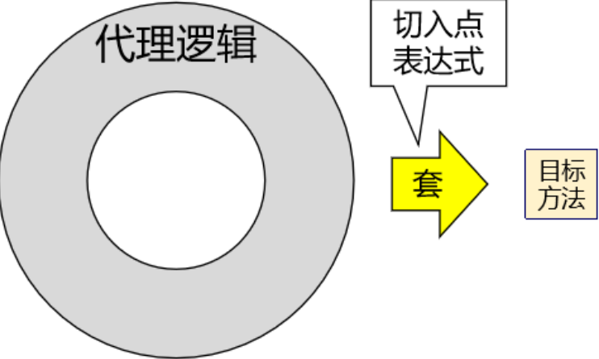​

#### ②语法细节

* *用*号代替“权限修饰符”和“返回值”部分表示“权限修饰符”和“返回值”不限
* 在包名的部分，一个“*”号只能代表包的层次结构中的一层，表示这一层是任意的。

  * 例如：*.Hello匹配com.Hello，不匹配com.atguigu.Hello
* 在包名的部分，使用“*..”表示包名任意、包的层次深度任意
* 在类名的部分，类名部分整体用*号代替，表示类名任意
* 在类名的部分，可以使用*号代替类名的一部分

  * 例如：*Service匹配所有名称以Service结尾的类或接口
* 在方法名部分，可以使用*号表示方法名任意
* 在方法名部分，可以使用*号代替方法名的一部分

  * 例如：*Operation匹配所有方法名以Operation结尾的方法
* 在方法参数列表部分，使用(..)表示参数列表任意
* 在方法参数列表部分，使用(int,..)表示参数列表以一个int类型的参数开头
* 在方法参数列表部分，基本数据类型和对应的包装类型是不一样的

  * 切入点表达式中使用 int 和实际方法中 Integer 是不匹配的
* 在方法返回值部分，如果想要明确指定一个返回值类型，那么必须同时写明权限修饰符

  * 例如：execution(public int ..Service.*(.., int)) 正确
  * 例如：execution(* int ..Service.*(.., int)) 错误

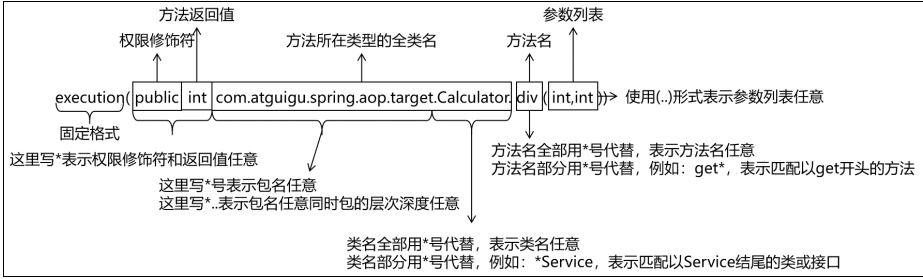

#### 测试

> 对代码进行修改，==注意，上面的代码跟下面的代码不匹配，但是意思一样==
>

```java

/**
 * Date:2022/7/4
 * Author:ybc
 * Description:
 * 1、在切面中，需要通过指定的注解将方法标识为通知方法
 * @Before：前置通知，在目标对象方法执行之前执行
 *execution(* com.atguigu.spring.aop.annotation.CalculatorImpl.*(..)
 * 第一个*表示任意的访问修饰符和返回值类型
 * 第二个*表示类中任意的方法
 * ..表示任意的参数列表
 * 类的地方也可以使用*，表示包下所有的类
 */
@Component
@Aspect //将当前组件标识为切面
public class LoggerAspect {

    //@Before("execution(public int com.atguigu.spring.aop.annotation.CalculatorImpl.add(int, int))")
    @Before("execution(* com.atguigu.spring.aop.annotation.CalculatorImpl.*(..))")
    public void beforeAdviceMethod(JoinPoint joinPoint) {
        System.out.println("LoggerAspect，前置通知");
    }
}
```


### 3.4.7、获取通知的相关信息

#### ①获取连接点信息

获取连接点信息可以在通知方法的参数位置设置JoinPoint类型的形参

```java
   //@Before("execution(public int com.atguigu.spring.aop.annotation.CalculatorImpl.add(int, int))")
    @Before("execution(* com.atguigu.spring.aop.annotation.CalculatorImpl.*(..))")
    public void beforeAdviceMethod(JoinPoint joinPoint) {
        //获取连接点所对应方法的签名信息
        Signature signature = joinPoint.getSignature();
        //获取连接点所对应方法的参数
        Object[] args = joinPoint.getArgs();
        System.out.println("LoggerAspect，方法："+signature.getName()+"，参数："+ Arrays.toString(args));
    }
```

#### ②获取目标方法的返回值

@AfterReturning中的属性returning，用来将通知方法的某个形参，接收目标方法的返回值

```java
@AfterReturning(value = "execution(* com.atguigu.aop.annotation.CalculatorImpl.* (..))", returning = "result")
    public void afterReturningMethod(JoinPoint joinPoint, Object result) {
        String methodName = joinPoint.getSignature().getName();
        System.out.println("Logger-->返回通知，方法名：" + methodName + "，结果：" + result);
    }
```

#### ③获取目标方法的异常

@AfterThrowing中的属性throwing，用来将通知方法的某个形参，接收目标方法的异常

```java
 @AfterThrowing(value = "execution(* com.atguigu.aop.annotation.CalculatorImpl.* (..))", throwing = "ex")
    public void afterThrowingMethod(JoinPoint joinPoint, Throwable ex) {
        String methodName = joinPoint.getSignature().getName();
        System.out.println("Logger-->异常通知，方法名：" + methodName + "，异常：" + ex);
    }
```

### 3.4.8、重用切入点表达式

#### ①声明

```java
 //@Pointcut声明一个公共的切入点表达式
    @Pointcut("execution(* com.atguigu.aop.annotation.*.*(..))")
    public void pointCut() {//方法名随意
    }
```

#### ②在同一个切面中使用

```java
 @Before("pointCut()")
    public void beforeMethod(JoinPoint joinPoint) {
        String methodName = joinPoint.getSignature().getName();
        String args = Arrays.toString(joinPoint.getArgs());
        System.out.println("Logger-->前置通知，方法名：" + methodName + "，参数：" + args);
    }
```

#### ③在不同切面中使用

```java
@Before("com.atguigu.aop.CommonPointCut.pointCut()")
    public void beforeMethod(JoinPoint joinPoint) {
        String methodName = joinPoint.getSignature().getName();
        String args = Arrays.toString(joinPoint.getArgs());
        System.out.println("Logger-->前置通知，方法名：" + methodName + "，参数：" + args);
    }
```

### 3.4.9、环绕通知

```java
@Around("execution(* com.atguigu.aop.annotation.CalculatorImpl.*(..))")
    //环绕通知的方法的返回值一定要和目标对象方法的返回值一致
    public Object aroundMethod(ProceedingJoinPoint joinPoint) {
        String methodName = joinPoint.getSignature().getName();
        String args = Arrays.toString(joinPoint.getArgs());
        Object result = null;
        try {
            System.out.println("环绕通知-->目标对象方法执行之前");
            //目标方法的执行，目标方法的返回值一定要返回给外界调用者
            result = joinPoint.proceed();
            System.out.println("环绕通知-->目标对象方法返回值之后");
        } catch (Throwable throwable) {
            throwable.printStackTrace();
            System.out.println("环绕通知-->目标对象方法出现异常时");
        } finally {
            System.out.println("环绕通知-->目标对象方法执行完毕");
        }
        return result;
    }
```

### 3.4.10、切面的优先级

相同目标方法上同时存在多个切面时，切面的优先级控制切面的==内外嵌套==顺序。

* 优先级高的切面：外面

* 优先级低的切面：里面

使用@Order注解可以控制切面的优先级：

* @Order(较小的数)：优先级高

* @Order(较大的数)：优先级低

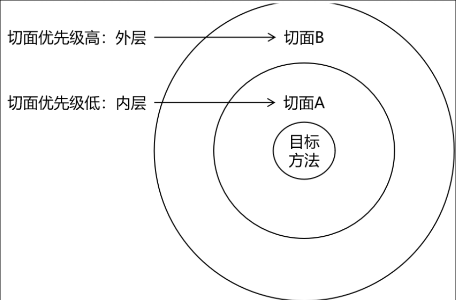​

```java

/**
 * Date:2022/7/5
 * Author:ybc
 * Description:
 */
@Component
@Aspect
@Order(1)
public class ValidateAspect {

    //@Before("execution(* com.atguigu.spring.aop.annotation.CalculatorImpl.*(..))")
    @Before("com.atguigu.spring.aop.annotation.LoggerAspect.pointCut()")
    public void beforeMethod(){
        System.out.println("ValidateAspect-->前置通知");
    }

}

```

## 3.5、基于XML的AOP（了解）

### 3.5.1、准备工作

参考基于注解的AOP环境

### 3.5.2、实现

```xml
<?xml version="1.0" encoding="UTF-8"?>
<beans xmlns="http://www.springframework.org/schema/beans"
       xmlns:xsi="http://www.w3.org/2001/XMLSchema-instance"
       xmlns:context="http://www.springframework.org/schema/context"
       xmlns:aop="http://www.springframework.org/schema/aop"
       xsi:schemaLocation="http://www.springframework.org/schema/beans http://www.springframework.org/schema/beans/spring-beans.xsd http://www.springframework.org/schema/context https://www.springframework.org/schema/context/spring-context.xsd http://www.springframework.org/schema/aop https://www.springframework.org/schema/aop/spring-aop.xsd">

    <!--扫描组件-->
    <context:component-scan base-package="com.atguigu.spring.aop.xml"></context:component-scan>

    <aop:config>
        <!--设置一个公共的切入点表达式-->
        <aop:pointcut id="pointCut" expression="execution(* com.atguigu.spring.aop.xml.CalculatorImpl.*(..))"/>
        <!--将IOC容器中的某个bean设置为切面-->
        <aop:aspect ref="loggerAspect">
            <aop:before method="beforeAdviceMethod" pointcut-ref="pointCut"></aop:before>
            <aop:after method="afterAdviceMethod" pointcut-ref="pointCut"></aop:after>
            <aop:after-returning method="afterReturningAdviceMethod" returning="result" pointcut-ref="pointCut"></aop:after-returning>
            <aop:after-throwing method="afterThrowingAdviceMethod" throwing="ex" pointcut-ref="pointCut"></aop:after-throwing>
            <aop:around method="aroundAdviceMethod" pointcut-ref="pointCut"></aop:around>
        </aop:aspect>
	<!--将IOC容器中的某个bean设置为切面并设置优先级-->
        <aop:aspect ref="validateAspect" order="1">
            <aop:before method="beforeMethod" pointcut-ref="pointCut"></aop:before>
        </aop:aspect>
    </aop:config>

</beans>
```

# 4. 声明式事务

## 4.1、JdbcTemplate

### 4.1.1、简介

Spring 框架对 JDBC 进行封装，使用 JdbcTemplate 方便实现对数据库操作

### 4.1.2、准备工作

#### ①加入依赖

```xml
<packaging>jar</packaging>

    <dependencies>

        <!-- ioc依赖
	基于Maven依赖传递性，导入spring-context依赖即可导入当前所需所有jar包 -->
        <dependency>
            <groupId>org.springframework</groupId>
            <artifactId>spring-context</artifactId>
            <version>5.3.1</version>
        </dependency>

        <!-- Spring 持久化层支持jar包 -->
        <!-- Spring 在执行持久化层操作、与持久化层技术进行整合过程中，需要使用orm、jdbc、tx三个jar包 -->
        <!-- 导入 orm 包就可以通过 Maven 的依赖传递性把其他两个也导入 -->
        <dependency>
            <groupId>org.springframework</groupId>
            <artifactId>spring-orm</artifactId>
            <version>5.3.1</version>
        </dependency>

        <!-- Spring 测试相关 -->
        <dependency>
            <groupId>org.springframework</groupId>
            <artifactId>spring-test</artifactId>
            <version>5.3.1</version>
        </dependency>

        <!-- junit测试 -->
        <dependency>
            <groupId>junit</groupId>
            <artifactId>junit</artifactId>
            <version>4.12</version>
            <scope>test</scope>
        </dependency>

        <!-- MySQL驱动 -->
        <dependency>
            <groupId>mysql</groupId>
            <artifactId>mysql-connector-java</artifactId>
            <version>8.0.16</version>
        </dependency>
        <!-- 数据源 -->
        <dependency>
            <groupId>com.alibaba</groupId>
            <artifactId>druid</artifactId>
            <version>1.0.31</version>
        </dependency>
	<!-- AOPjar包 -->
        <dependency>
            <groupId>org.springframework</groupId>
            <artifactId>spring-aspects</artifactId>
            <version>5.3.1</version>
        </dependency>

    </dependencies>
```

#### ②创建jdbc.properties

```properties
jdbc.driver=com.mysql.cj.jdbc.Driver
jdbc.url=jdbc:mysql://localhost:3306/ssm?serverTimezone=UTC
jdbc.username=root
jdbc.password=123456
```

#### ③配置Spring的配置文件

```xml
<?xml version="1.0" encoding="UTF-8"?>
<beans xmlns="http://www.springframework.org/schema/beans"
       xmlns:xsi="http://www.w3.org/2001/XMLSchema-instance"
       xmlns:context="http://www.springframework.org/schema/context"
       xsi:schemaLocation="http://www.springframework.org/schema/beans http://www.springframework.org/schema/beans/spring-beans.xsd http://www.springframework.org/schema/context https://www.springframework.org/schema/context/spring-context.xsd">

    <!--引入jdbc.properties-->
    <context:property-placeholder location="classpath:jdbc.properties"></context:property-placeholder>
    <!--数据源-->
    <bean id="dataSource" class="com.alibaba.druid.pool.DruidDataSource">
        <property name="driverClassName" value="${jdbc.driver}"></property>
        <property name="url" value="${jdbc.url}"></property>
        <property name="username" value="${jdbc.username}"></property>
        <property name="password" value="${jdbc.password}"></property>
    </bean>
    <!-- 因为我们要用jdbcTemplate，因此需要配置数据源引用上面的数据源 -->
    <bean class="org.springframework.jdbc.core.JdbcTemplate">
        <property name="dataSource" ref="dataSource"></property>
    </bean>

</beans>
```

### 4.1.3、测试

#### ①在测试类装配 JdbcTemplate

```java
//指定当前测试类在Spring的测试环境中执行，此时就可以通过注入的方式直接获取IOC容器中bean
@RunWith(SpringJUnit4ClassRunner.class)
//设置Spring测试环境的配置文件
@ContextConfiguration("classpath:spring-jdbc.xml")
public class JdbcTemplateTest {

    @Autowired
    private JdbcTemplate jdbcTemplate;
}
```

#### ②测试增删改功能

> 增删该都是同样的方法,update
>

```java
 @Test
    public void testInsert(){
        String sql = "insert into t_user values(null,?,?,?,?,?)";
        jdbcTemplate.update(sql, "root", "123", 23, "女", "123@qq.com");
    }
```

#### ③查询一条数据为实体类对象

> queryForObject为单个返回值，query为集合
>

```java
@Test
    public void testGetUserById(){
        String sql = "select * from t_user where id = ?";
        User user = jdbcTemplate.queryForObject(sql, new BeanPropertyRowMapper<>(User.class), 1);
        System.out.println(user);
    }
```

#### ④查询多条数据为一个list集合

```java
@Test
    public void testGetAllUser(){
        String sql = "select * from t_user";
        List<User> list = jdbcTemplate.query(sql, new BeanPropertyRowMapper<>(User.class));
        list.forEach(System.out::println);
    }
```

#### ⑤查询单行单列的值

```java
@Test
    public void testGetCount(){
        String sql = "select count(*) from t_user";
        Integer count = jdbcTemplate.queryForObject(sql, Integer.class);
        System.out.println(count);
    }
```

## 4.2、声明式事务概念

### 4.2.1、编程式事务

事务功能的相关操作全部通过自己编写代码来实现：

```java
Connection conn = ...; 
    try{
        // 开启事务：关闭事务的自动提交 
         conn.setAutoCommit(false); 

        // 核心操作 

        // 提交事务 
         conn.commit(); 

         }catch(Exception e){ 

        // 回滚事务 
         conn.rollBack(); 

         }finally{

        // 释放数据库连接 
	conn.close();
    }
```

编程式的实现方式存在缺陷：

* 细节没有被屏蔽：具体操作过程中，所有细节都需要程序员自己来完成，比较繁琐。

* 代码复用性不高：如果没有有效抽取出来，每次实现功能都需要自己编写代码，代码就没有得到复用。

### 4.2.2、声明式事务

既然事务控制的代码有规律可循，代码的结构基本是确定的，所以框架就可以将固定模式的代码抽取出来，进行相关的封装。

封装起来后，我们只需要在配置文件中进行简单的配置即可完成操作。

* 好处1：提高开发效率

* 好处2：消除了冗余的代码

* 好处3：框架会综合考虑相关领域中在实际开发环境下有可能遇到的各种问题，进行了健壮性、性能等各个方面的优化

所以，我们可以总结下面两个概念：

* ==编程式==：==自己写代码==实现功能

* ==声明式==：通过==配置==让==框架==实现功能

## 4.3、基于注解的声明式事务

### 准备工作

如上的依赖，xml配置文件都可用，配置文件只需要加上一个扫描注解即可

#### 创建数据库

```sql
CREATE TABLE `t_book` (
  `book_id`   int(11) NOT NULL AUTO_INCREMENT
  COMMENT '主键',
  `book_name` varchar(20)      DEFAULT NULL
  COMMENT '图书名称',
  `price`     int(11)          DEFAULT NULL
  COMMENT '价格',
  `stock`     int(10) unsigned DEFAULT NULL
  COMMENT '库存（无符号）',
  PRIMARY KEY (`book_id`)
)
  ENGINE = InnoDB
  AUTO_INCREMENT = 3
  DEFAULT CHARSET = utf8;
insert into `t_book` (`book_id`, `book_name`, `price`, `stock`)
values (1, '斗破苍 穹', 80, 100),
       (2, '斗罗大陆', 50, 100);
CREATE TABLE `t_user` (
  `user_id`  int(11) NOT NULL AUTO_INCREMENT
  COMMENT '主键',
  `username` varchar(20)      DEFAULT NULL
  COMMENT '用户名',
  `balance`  int(10) unsigned DEFAULT NULL
  COMMENT '余额（无符号）',
  PRIMARY KEY (`user_id`)
)
  ENGINE = InnoDB
  AUTO_INCREMENT = 2
  DEFAULT CHARSET = utf8;
insert into `t_user` (`user_id`, `username`, `balance`)
values (1, 'admin', 50);
```

#### 创建组件

> pojo
>

```java
package com.atguigu.spring.pojo;

/**
 * Date:2022/7/5
 * Author:ybc
 * Description:
 */
public class User {

    private Integer id;

    private String username;

    private String password;

    private Integer age;

    private String gender;

    private String email;

    public User() {
    }

    public User(Integer id, String username, String password, Integer age, String gender, String email) {
        this.id = id;
        this.username = username;
        this.password = password;
        this.age = age;
        this.gender = gender;
        this.email = email;
    }

    public Integer getId() {
        return id;
    }

    public void setId(Integer id) {
        this.id = id;
    }

    public String getUsername() {
        return username;
    }

    public void setUsername(String username) {
        this.username = username;
    }

    public String getPassword() {
        return password;
    }

    public void setPassword(String password) {
        this.password = password;
    }

    public Integer getAge() {
        return age;
    }

    public void setAge(Integer age) {
        this.age = age;
    }

    public String getGender() {
        return gender;
    }

    public void setGender(String gender) {
        this.gender = gender;
    }

    public String getEmail() {
        return email;
    }

    public void setEmail(String email) {
        this.email = email;
    }

    @Override
    public String toString() {
        return "User{" +
                "id=" + id +
                ", username='" + username + '\'' +
                ", password='" + password + '\'' +
                ", age=" + age +
                ", gender='" + gender + '\'' +
                ", email='" + email + '\'' +
                '}';
    }
}

```

> Controller
>

```java
@Controller
public class BookController {

    @Autowired
    private BookService bookService;
    @Autowired
    private CheckoutService checkoutService;

    public void buyBook(Integer userId, Integer bookId){
        bookService.buyBook(userId, bookId);
    }

}

```

> Service
>

> BookService 
>

```java
package com.atguigu.spring.service;
public interface BookService {

    /**
     * 买书
     * @param userId
     * @param bookId
     */
    void buyBook(Integer userId, Integer bookId);
}

```

> Impl
>

> BookServiceImpl 
>

```java


/**
 * Date:2022/7/6
 * Author:ybc
 * Description:
 */
@Service
public class BookServiceImpl implements BookService {

    @Autowired
    private BookDao bookDao;

    @Override
    public void buyBook(Integer userId, Integer bookId) {
   
        //查询图书的价格
        Integer price = bookDao.getPriceByBookId(bookId);
        //更新图书的库存
        bookDao.updateStock(bookId);
        //更新用户的余额
        bookDao.updateBalance(userId, price);
    }
}

```

> Dao
>

> BookDao
>

```java
package com.atguigu.spring.dao;

/**
 * Date:2022/7/6
 * Author:ybc
 * Description:
 */
public interface BookDao {
    /**
     * 根据图书的id查询图书的价格
     * @param bookId
     * @return
     */
    Integer getPriceByBookId(Integer bookId);

    /**
     * 更新图书的库存
     * @param bookId
     */
    void updateStock(Integer bookId);

    /**
     * 更新用户的余额
     * @param userId
     * @param price
     */
    void updateBalance(Integer userId, Integer price);
}

```

> Impl
>

> BookDaoImpl 
>

```java


/**
 * Date:2022/7/6
 * Author:ybc
 * Description:
 */
@Repository
public class BookDaoImpl implements BookDao {

    @Autowired
    private JdbcTemplate jdbcTemplate;

    @Override
    public Integer getPriceByBookId(Integer bookId) {
        String sql = "select price from t_book where book_id = ?";
        return jdbcTemplate.queryForObject(sql, Integer.class, bookId);
    }

    @Override
    public void updateStock(Integer bookId) {
        String sql = "update t_book set stock = stock - 1 where book_id = ?";
        jdbcTemplate.update(sql, bookId);
    }

    @Override
    public void updateBalance(Integer userId, Integer price) {
        String sql = "update t_user set balance = balance - ? where user_id = ?";
        jdbcTemplate.update(sql, price, userId);
    }
}

```

### 4.3.2、测试无事务情况

#### ①创建测试类

```java
@RunWith(SpringJUnit4ClassRunner.class)
    @ContextConfiguration("classpath:tx-annotation.xml")
    public class TxByAnnotationTest {
        @Autowired
        private BookController bookController;

        @Test
        public void testBuyBook() {
            bookController.buyBook(1, 1);
        }
    }
```

#### ②模拟场景

用户购买图书，先查询图书的价格，再更新图书的库存和用户的余额

假设用户id为1的用户，购买id为1的图书

用户余额为50，而图书价格为80

购买图书之后，用户的余额为-30，数据库中余额字段设置了无符号，因此无法将-30插入到余额字段

此时执行sql语句会抛出SQLException

#### ③观察结果

因为没有添加事务，图书的库存更新了，但是用户的余额没有更新

显然这样的结果是错误的，购买图书是一个完整的功能，更新库存和更新余额要么都成功要么都失败

### 4.3.3、加入事务

#### ①添加事务配置

在Spring的配置文件中添加配置：

```xml
<bean id="transactionManager"
      class="org.springframework.jdbc.datasource.DataSourceTransactionManager">
<property name="dataSource" ref="dataSource"></property>
</bean>
        <!--
            开启事务的注解驱动
            通过注解@Transactional所标识的方法或标识的类中所有的方法，都会被事务管理器管理事务 -->
        <!--
            transaction-manager属性的默认值是transactionManager，如果事务管理器bean的id正好就 是这个默认值，
        则可以省略这个属性 -->
<tx:annotation-driven transaction-manager="transactionManager"/>
```

注意：导入的名称空间需要 ==tx 结尾==的那个。

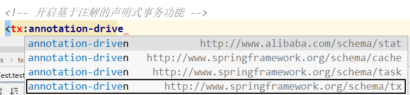​

#### ②添加事务注解

因为service层表示业务逻辑层，一个方法表示一个完成的功能，因此处理事务一般在service层处理

在BookServiceImpl的buybook()添加注解==@Transactional==

#### ③观察结果

由于使用了Spring的声明式事务，更新库存和更新余额都没有执行

### 4.3.4、@Transactional注解标识的位置

@Transactional标识在方法上，只会影响该方法

@Transactional标识的类上，会影响类中所有的方法

### 4.3.5、事务属性：只读

#### ①介绍

对一个查询操作来说，如果我们把它设置成只读，就能够明确告诉数据库，这个操作不涉及写操作。这样数据库就能够针对查询操作来进行优化。

#### ②使用方式

```java
 @Transactional(readOnly = true)
    public void buyBook(Integer bookId, Integer userId) {
        //查询图书的价格 
        Integer price = bookDao.getPriceByBookId(bookId);
        //更新图书的库存 
        bookDao.updateStock(bookId);
        //更新用户的余额 
        bookDao.updateBalance(userId, price);
        System.out.println(1 / 0);
    }
```

#### ③注意

对增删改操作设置只读会抛出下面异常：

> Caused by: java.sql.SQLException: Connection is read-only. Queries leading to data modificationare not allowed
>

### 4.3.6、事务属性：超时

#### ①介绍

事务在执行过程中，有可能因为遇到某些问题，导致程序卡住，从而长时间占用数据库资源。而长时间占用资源，大概率是因为程序运行出现了问题（可能是Java程序或MySQL数据库或网络连接等等）。

此时这个很可能出问题的程序应该被回滚，撤销它已做的操作，事务结束，把资源让出来，让其他正常程序可以执行。

==概括来说就是一句话：超时回滚，释放资源。==

#### ②使用方式

```java
@Transactional(timeout = 3)//超时时间 3秒，可以设置
    public void buyBook(Integer bookId, Integer userId) {
        try {
            TimeUnit.SECONDS.sleep(5);
        } catch (InterruptedException e) {
            e.printStackTrace();
        }//查询图书的价格 
        Integer price = bookDao.getPriceByBookId(bookId);
        //更新图书的库存 
        bookDao.updateStock(bookId);
        // 更新用户的余额 
        bookDao.updateBalance(userId, price);
        System.out.println(1 / 0);
    }
```

#### ③观察结果

执行过程中抛出异常：

> org.springframework.transaction.TransactionTimedOutException: Transaction timed out:deadline was Fri Jun 04 16:25:39 CST 2022
>

### 4.3.7、事务属性：回滚策略

#### ①介绍

声明式事务默认只针对运行时异常回滚，编译时异常不回滚。

可以通过@Transactional中相关属性设置回滚策略

* rollbackFor属性：需要设置一个Class类型的对象
* rollbackForClassName属性：需要设置一个字符串类型的全类名
* noRollbackFor属性：需要设置一个Class类型的对象//不因为为什么而回滚
* rollbackFor属性：需要设置一个字符串类型的全类名

#### ②使用方式

```java
@Transactional(noRollbackFor = ArithmeticException.class)
    //@Transactional(noRollbackForClassName = "java.lang.ArithmeticException") 
    public void buyBook(Integer bookId, Integer userId) {
        //查询图书的价格 
        Integer price = bookDao.getPriceByBookId(bookId);
        // 更新图书的库存 
        bookDao.updateStock(bookId);
        // 更新用户的余额 
        bookDao.updateBalance(userId, price);
        System.out.println(1 / 0);
    }

```

#### ③观察结果

> 虽然购买图书功能中出现了数学运算异常（ArithmeticException），但是我们设置的回滚策略是，当出现ArithmeticException不发生回滚，因此购买图书的操作正常执行
>

### 4.3.8、事务属性：事务隔离级别

#### ①介绍

> 数据库系统必须具有隔离并发运行各个事务的能力，使它们不会相互影响，避免各种并发问题。一个事务与其他事务隔离的程度称为隔离级别。SQL标准中规定了多种事务隔离级别，不同隔离级别对应不同的干扰程度，隔离级别越高，数据一致性就越好，但并发性越弱。
>

隔离级别一共有四种：

* 读未提交：READ UNCOMMITTED

  * 允许Transaction01读取Transaction02未提交的修改。
* 读已提交：READ COMMITTED、

  * 要求Transaction01只能读取Transaction02已提交的修改。
* 可重复读：REPEATABLE READ

  * 确保Transaction01可以多次从一个字段中读取到相同的值，即Transaction01执行期间禁止其它事务对这个字段进行更新。
* 串行化：SERIALIZABLE

  * 确保Transaction01可以多次从一个表中读取到相同的行，在Transaction01执行期间，禁止其它事务对这个表进行添加、更新、删除操作。可以避免任何并发问题，但性能十分低下。

各个隔离级别解决并发问题的能力见下表：

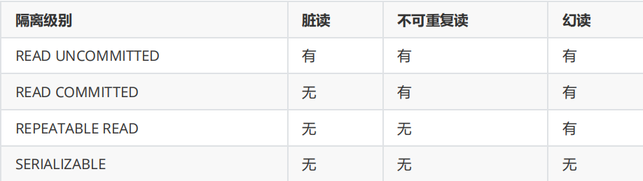​

各种数据库产品对事务隔离级别的支持程度：

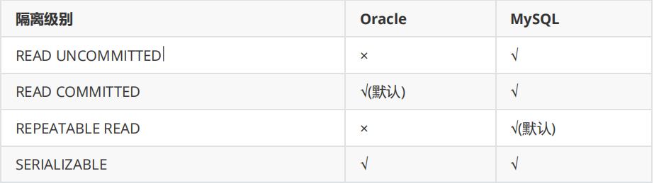​

②使用方式

```java
    @Transactional(isolation = Isolation.DEFAULT)//使用数据库默认的隔离级别 
    @Transactional(isolation = Isolation.READ_UNCOMMITTED)//读未提交 
    @Transactional(isolation = Isolation.READ_COMMITTED)//读已提交 
    @Transactional(isolation = Isolation.REPEATABLE_READ)//可重复读 
    @Transactional(isolation = Isolation.SERIALIZABLE)//串行化
```

### 4.3.9、事务属性：事务传播行为

#### ①介绍

> 当事务方法被另一个事务方法调用时，必须指定事务应该如何传播。例如：方法可能继续在现有事务中运行，也可能开启一个新事务，并在自己的事务中运行。
>

#### ②测试

创建接口CheckoutService：

```java
public interface CheckoutService {
        void checkout(Integer[] bookIds, Integer userId);
    }
```

创建实现类CheckoutServiceImpl：

```java
 @Service
    public class CheckoutServiceImpl implements CheckoutService {
        @Autowired
        private BookService bookService;

        @Override
        @Transactional //一次购买多本图书 
        public void checkout(Integer[] bookIds, Integer userId) {
            for (Integer bookId : bookIds) {
                bookService.buyBook(bookId, userId);
            }
        }
    }
```

在BookController中添加方法：

```java
@Autowired
    private CheckoutService checkoutService;

    public void checkout(Integer[] bookIds, Integer userId) {
        checkoutService.checkout(bookIds, userId);
    }
```

在数据库中将用户的余额修改为100元

#### ③观察结果

> 可以通过@Transactional中的propagation属性设置事务传播行为
>
> 修改BookServiceImpl中buyBook()上，注解@Transactional的propagation属性
>
> @Transactional(propagation = Propagation.REQUIRED)，默认情况，表示如果当前线程上有已经开启的事务可用，那么就在这个事务中运行。经过观察，购买图书的方法buyBook()在checkout()中被调用，checkout()上有事务注解，因此在此事务中执行。所购买的两本图书的价格为80和50，而用户的余额为100，因此在购买第二本图书时余额不足失败，导致整个checkout()回滚，即只要有一本书买不了，就都买不了
>
> @Transactional(propagation = Propagation.REQUIRES_NEW)，表示不管当前线程上是否有已经开启的事务，都要开启新事务。同样的场景，每次购买图书都是在buyBook()的事务中执行，因此第一本图书购买成功，事务结束，第二本图书购买失败，只在第二次的buyBook()中回滚，购买第一本图书不受影响，即能买几本就买几本
>

## 4.4、基于XML的声明式事务

### 4.3.1、场景模拟

参考基于注解的声明式事务

### 4.3.2、修改Spring配置文件

将Spring配置文件中去掉tx:annotation-driven 标签，并添加配置：

```xml
<aop:config>
<!-- 配置事务通知和切入点表达式 -->
<aop:advisor advice-ref="txAdvice" pointcut="execution(* com.atguigu.spring.tx.xml.service.impl.*.*(..))"></aop:advisor>
</aop:config>
        <!-- tx:advice标签：配置事务通知 --> 
        <!-- id属性：给事务通知标签设置唯一标识，便于引用 -->
        <!-- transaction-manager属性：关联事务管理器 -->
<tx:advice id="txAdvice" transaction-manager="transactionManager">
<tx:attributes>
    <!-- tx:method标签：配置具体的事务方法 --> 
    <!-- name属性：指定方法名，可以使用星号代表多个字符 -->
    <tx:method name="get*" read-only="true"/>
    <tx:method name="query*" read-only="true"/>
    <tx:method name="find*" read-only="true"/> 
    <!-- read-only属性：设置只读属性 --> 
    <!-- rollback-for属性：设置回滚的异常 --> 
    <!-- no-rollback-for属性：设置不回滚的异常 --> 
    <!-- isolation属性：设置事务的隔离级别 --> 
    <!-- timeout属性：设置事务的超时属性 --> 
    <!-- propagation属性：设置事务的传播行为 -->
    <tx:method name="save*" read-only="false" rollback- for="java.lang.Exception" propagation="REQUIRES_NEW"/>
    <tx:method name="update*" read-only="false" rollback- for="java.lang.Exception" propagation="REQUIRES_NEW"/>
    <tx:method name="delete*" read-only="false" rollback- for="java.lang.Exception" propagation="REQUIRES_NEW"/>
</tx:attributes>
</tx:advice>
```

