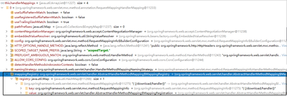
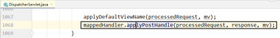
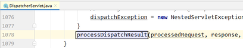

# SpringMVC

# 1、SpringMVC简介

## 1.1、什么是MVC

MVC是==一种软件架构的思想，将软件按照模型、视图、控制器来划分==

M：==Model==，模型层，指工程中的JavaBean，作用是==处理数据==

JavaBean分为两类：

* 一类称为实体类Bean：专门存储业务数据的，如 Student、User 等

* 一类称为业务处理 Bean：指 Service 或 Dao 对象，专门用于处理业务逻辑和数据访问。

V：==View==，视图层，指工程中的html或jsp等页面，作用是与用户进行交互，展示数据

C：==Controller==，控制层，指工程中的servlet，作用是接收请求和响应浏览器

==MVC的工作流程：== 用户通过视图层发送请求到服务器，在服务器中请求被Controller接收，Controller调用相应的Model层处理请求，处理完毕将结果返回到Controller，Controller再根据请求处理的结果找到相应的View视图，渲染数据后最终响应给浏览器

## 1.2、什么是SpringMVC

SpringMVC是Spring的一个后续产品，是Spring的一个子项目

SpringMVC 是 Spring 为表述层开发提供的一整套完备的解决方案。在表述层框架历经 Strust、WebWork、Strust2 等诸多产品的历代更迭之后，目前业界普遍选择了 SpringMVC 作为 Java EE 项目==表述层==开发的==首选方案。==

> 注：三层架构分为表述层（或表示层）、业务逻辑层、数据访问层，表述层表示前台页面和后台servlet
>

## 1.3、SpringMVC的特点

* ==Spring 家族原生产品==，与 IOC 容器等基础设施无缝对接
* ==基于原生的Servlet==，通过了功能强大的==前端控制器DispatcherServlet==，对请求和响应进行统一处理
* 表述层各细分领域需要解决的问题==全方位覆盖==，提供==全面解决方案==
* ==代码清新简洁==，大幅度提升开发效率
* 内部组件化程度高，可插拔式组件==即插即用==，想要什么功能配置相应组件即可
* ==性能卓著==，尤其适合现代大型、超大型互联网项目要求

# 2、入门案例

## 2.1、开发环境

> IDE：idea 2019.2
>
> 构建工具：maven3.5.4
>
> 服务器：tomcat8.5
>
> Spring版本：5.3.1
>
> thymeleaf
>

## 2.2、创建maven工程

### ①添加web模块

### ②打包方式：war

### ③引入依赖

```xml
<dependencies> 
<!-- SpringMVC -->
<dependency>
    <groupId>org.springframework</groupId>
    <artifactId>spring-webmvc</artifactId>
    <version>5.3.1</version>
</dependency> 
<!-- 日志 -->
<dependency>
    <groupId>ch.qos.logback</groupId>
    <artifactId>logback-classic</artifactId>
    <version>1.2.3</version>
</dependency> 
<!-- ServletAPI -->
<dependency>
    <groupId>javax.servlet</groupId>
    <artifactId>javax.servlet-api</artifactId>
    <version>3.1.0</version>
    <scope>provided</scope>
</dependency> 
<!-- Spring5和Thymeleaf整合包 -->
<dependency>
    <groupId>org.thymeleaf</groupId>
    <artifactId>thymeleaf-spring5</artifactId>
    <version>3.0.12.RELEASE</version>
</dependency>
</dependencies>
```

注：由于 Maven 的传递性，我们不必将所有需要的包全部配置依赖，而是配置最顶端的依赖，其他靠传递性导入。

​

## 2.3、配置web.xml

注册SpringMVC的前端控制器DispatcherServlet

### ①默认配置方式

> 此配置作用下，==SpringMVC的配置文件默认位于WEB-INF下==，默认名称为<servlet-name>-servlet.xml，例如，以下配置所对应SpringMVC的配置文件位于WEB-INF下，文件名为springMVC-servlet.xml
>
> DispatcherServlet封装了Servlet
>

```xml
<!-- 配置SpringMVC的前端控制器，对浏览器发送的请求统一进行处理 -->
<servlet>
<!--名字无所谓，但是要保证mapping跟该名字相同-->
<servlet-name>springMVC</servlet-name>
<servlet-class>org.springframework.web.servlet.DispatcherServlet</servlet- class>
</servlet> 
<servlet-mapping>
<servlet-name>springMVC</servlet-name>
<!--设置springMVC的核心控制器所能处理的请求的请求路径
/所匹配的请求可以是/login或.html或.js或.css方式的请求路径
但是/不能匹配.jsp请求路径的请求
/*：匹配浏览器向服务器发送的所有请求(包括.jsp)
-->
<url-pattern>/</url-pattern>
</servlet-mapping>
```

### ②扩展配置方式

可通过`init-param`标签设置SpringMVC配置文件的位置和名称(即如果没有该标签，那么我们的springMVC-servlet.xml文件需要放在WEB-INF下,因为有了该文件，我们可以自己设置xml的文件名和路径)，通过`load-on-startup`标签设置SpringMVC前端控制器DispatcherServlet的初始化时间

```xml
 <!-- 配置SpringMVC的前端控制器，对浏览器发送的请求统一进行处理 --> 
<servlet>
<servlet-name>springMVC</servlet-name>
<servlet-class>org.springframework.web.servlet.DispatcherServlet</servlet- class>
<!-- 通过初始化参数指定SpringMVC配置文件的位置和名称 -->
<init-param> 
    <!-- contextConfigLocation为固定值 -->
    <param-name>contextConfigLocation</param-name> 
    <!-- 使用classpath:表示从类路径查找配置文件，例如maven工程中的 src/main/resources -->
    <param-value>classpath:springmvc.xml</param-value>
</init-param> 
<!--
    作为框架的核心组件，在启动过程中有大量的初始化操作要做,(看底层) 
    而这些操作放在第一次请求时才执行会严重影响访问速度 
    因此需要通过此标签将启动控制DispatcherServlet的初始化时间提前到服务器启动时 
-->
<load-on-startup>1</load-on-startup>
</servlet> 
<servlet-mapping>
<servlet-name>springMVC</servlet-name> 
<!--设置springMVC的核心控制器所能处理的请求的请求路径 
/所匹配的请求可以是/login或.html或.js或.css方式的请求路径 
但是/不能匹配.jsp请求路径的请求 -->
<url-pattern>/</url-pattern>

</servlet-mapping>

```

> 注：
>
> <url-pattern>标签中使用/和/*的区别：
>
> /所匹配的请求可以是/login或.html或.js或.css方式的请求路径，但是/不能匹配.jsp请求路径的请求
>
> 因此就可以避免在访问jsp页面时，该请求被DispatcherServlet处理，从而找不到相应的页面
>
> /*则能够匹配所有请求，例如在使用过滤器时，若需要对所有请求进行过滤，
>
> 就需要使用/*的写法
>

## 2.4、创建请求控制器

由于前端控制器对浏览器发送的请求进行了统一的处理，但是具体的请求有不同的处理过程，因此需要创建处理具体请求的类，即请求控制器

请求控制器中每一个处理请求的方法成为控制器方法

因为SpringMVC的控制器由一个POJO（普通的Java类）担任，因此需要通@Controller注解将其标识为一个控制层组件，交给Spring的IoC容器管理，此时SpringMVC才能够识别控制器的存在

```java
@Controller 
public class HelloController { 
}
```

## 2.5、创建SpringMVC的配置文件

springmvc.xml配置文件是在DispatcherServlet初始化的时候加载的

> springmvc.xml
>

```xml
<?xml version="1.0" encoding="UTF-8"?>
<beans xmlns="http://www.springframework.org/schema/beans"
       xmlns:xsi="http://www.w3.org/2001/XMLSchema-instance"
       xmlns:context="http://www.springframework.org/schema/context"
       xmlns:mvc="http://www.springframework.org/schema/mvc"
       xsi:schemaLocation="http://www.springframework.org/schema/beans http://www.springframework.org/schema/beans/spring-beans.xsd http://www.springframework.org/schema/context https://www.springframework.org/schema/context/spring-context.xsd http://www.springframework.org/schema/mvc https://www.springframework.org/schema/mvc/spring-mvc.xsd">

    <!--扫描控制层组件/ 自动扫描包-->
    <context:component-scan base-package="com.atguigu.controller"/>

    <!-- 配置Thymeleaf视图解析器 -->
    <bean id="viewResolver" class="org.thymeleaf.spring5.view.ThymeleafViewResolver">
        <property name="order" value="1"/>
        <property name="characterEncoding" value="UTF-8"/>
        <property name="templateEngine">
            <bean class="org.thymeleaf.spring5.SpringTemplateEngine">
                <property name="templateResolver">
                    <bean class="org.thymeleaf.spring5.templateresolver.SpringResourceTemplateResolver">
			<!--即当前物理视图：/WEB-INF/templates/index.html，逻辑视图：index
				通过配置我们只需要访问index即可访问到-->
                        <!-- 视图前缀 -->
                        <property name="prefix" value="/WEB-INF/templates/"/>
                        <!-- 视图后缀 -->
                        <property name="suffix" value=".html"/>
			<!--模板视图-->
                        <property name="templateMode" value="HTML5"/>
			<!--渲染视图的默认编码-->
                        <property name="characterEncoding" value="UTF-8" />
                    </bean>
                </property>
            </bean>
        </property>
    </bean>

</beans>
```

## 2.6、测试HelloWorld

### ①实现对首页的访问

在请求控制器中创建处理请求的方法

```java
@RequestMapping("/")
    public String protal(){
        //将逻辑视图返回，即跳转到index页面，注意配置文件
	//路径为：
	//前缀：/WEB-INF/templates/
	//逻辑视图：index
	//后缀：.html
        return "index";//相当于servlet中的转发
    }
```

## 2.7、总结

浏览器发送请求，若请求地址符合前端控制器的url-pattern，该请求就会被前端控制器

DispatcherServlet处理。==前端控制器会读取SpringMVC的核心配置文件==，通过扫描组件找到控制器，==将请求地址和控制器中@RequestMapping注解的value属性值进行匹配==，若匹配成功，该注解所标识的控制器方法就是处理请求的方法。==处理请求的方法需要返回一个字符串类型的视图名称，该视图名称会被视图解析器解析，加上前缀和后缀组成视图的路径，通过Thymeleaf对视图进行渲染，最终转发到视图所对应页面==

# 3、@RequestMapping注解

## 3.1、@RequestMapping注解的功能

从注解名称上我们可以看到，@RequestMapping注解的作用就是将请求和处理请求的控制器方法关联起来，建立映射关系。

SpringMVC 接收到指定的请求，就会来找到在映射关系中对应的控制器方法来处理这个请求。

## 3.2、@RequestMapping注解的位置

@RequestMapping标识一个类：设置映射请求的请求路径的初始信息

@RequestMapping标识一个方法：设置映射请求请求路径的具体信息

==如果控制器方法为void，也没有用response.getWrite.writer()响应浏览器数据，那么会将@RequestMapping的value作为逻辑视图来解析==

```java
 @Controller
    @RequestMapping("/test")
    public class RequestMappingController {
        //此时请求映射所映射的请求的请求路径为：/test/testRequestMapping 
        @RequestMapping("/testRequestMapping")
        public String testRequestMapping() {
            return "success";//相当于转发
        }
    }
```

## 3.3、@RequestMapping注解的value属性

@RequestMapping注解的value属性通过请求的请求地址 匹配 请求映射

@RequestMapping注解的value属性是一个字符串类型的数组，表示该请求映射能够匹配多个请求地址所对应的请求

@RequestMapping注解的value属性必须设置，至少通过请求地址匹配请求映射

```html
<a th:href="@{/testRequestMapping}">
测试@RequestMapping的value属性-- >/testRequestMapping
</a><br> 
<a th:href="@{/test}">
测试@RequestMapping的value属性-->/test
</a><br>
```

```java
 @RequestMapping(
            value = {"/testRequestMapping", "/test"}
            )
    public String testRequestMapping() {
        return "success";
    }
```

## 3.4、@RequestMapping注解的method属性

@RequestMapping注解的method属性通过请求的请求方式（get或post）匹配请求映射

@RequestMapping注解的method属性是一个RequestMethod类型的数组，表示该请求映射能够匹配多种请求方式的请求

若当前请求的请求地址满足请求映射的value属性，但是请求方式不满足method属性，则浏览器报错405：Request method 'POST' not supported

```html
<a th:href="@{/test}">
    测试@RequestMapping的value属性-->/test
</a><br>
<form th:action="@{/test}" method="post">
    <input type="submit">
</form>

```

```java
 @RequestMapping(
            value = {"/testRequestMapping", "/test"}, 
            method = {RequestMethod.GET, RequestMethod.POST}
            )
    public String testRequestMapping() {
        return "success";
    }
```

> 注：
>
> 1、对于处理指定请求方式的控制器方法，SpringMVC中提供了@RequestMapping的派生注解
>
> 处理get请求的映射-->@GetMapping
>
> 处理post请求的映射-->@PostMapping
>
> 处理put请求的映射-->@PutMapping
>
> 处理delete请求的映射-->@DeleteMapping
>
> 2、常用的请求方式有get，post，put，delete
>
> 但是目前浏览器只支持get和post，若在form表单提交时，为method设置了其他请求方式的字符串（put或delete），则按照默认的请求方式get处理
>
> 若要发送put和delete请求，则需要通过spring提供的过滤HiddenHttpMethodFilter，在RESTful部分会讲到
>

## 3.5、@RequestMapping注解的params属性（了解）

@RequestMapping注解的params属性通过请求的请求参数匹配请求映射

@RequestMapping注解的params属性是一个字符串类型的数组，可以通过四种表达式设置请求参数和请求映射的匹配关系

* "param"：表示当前所匹配请求的请求参数中必须携带param参数
* "!param"：表示当前所匹配请求的请求参数中一定不能携带param参数
* "param=value"：表示当前所匹配请求的请求参数中必须携带param参数且值必须为value
* "param!=value"：表示当前所匹配请求的请求参数中可以不携带param，若携带值一定不能是value

```html
<a th:href="@{/test(username='admin',password=123456)">
    测试@RequestMapping的 params属性-->/test
</a><br>
```

```java
@RequestMapping(
            value = {"/testRequestMapping", "/test"}, 
            method = {RequestMethod.GET, RequestMethod.POST}, 
            params = {"username", "password!=123456"}
            )
    public String testRequestMapping() {
        return "success";
    }
```

> 注：
>
> 若当前请求满足@RequestMapping注解的value和method属性，但是不满足params属性，此时
>
> 页面会报错400：Parameter conditions "username, password!=123456" not met for actualrequest parameters: username={admin}, password={123456}
>

## 3.6、@RequestMapping注解的headers属性（了解）

@RequestMapping注解的headers属性通过请求的请求头信息匹配请求映射

@RequestMapping注解的headers属性是一个字符串类型的数组，可以通过四种表达式设置请求头信息和请求映射的匹配关系

"header"：要求请求映射所匹配的请求必须携带header请求头信息

"!header"：要求请求映射所匹配的请求必须不能携带header请求头信息

"header=value"：要求请求映射所匹配的请求必须携带header请求头信息header=value

"header!=value"：要求请求映射所匹配的请求必须携带header请求头信息且header!=value

若当前请求满足@RequestMapping注解的value和method属性，但是不满足headers属性，此时页面显示404错误，即资源未找到

用法同上params

## 3.7、SpringMVC支持ant风格的路径

```html
 在@RequestMapping注解的value属性值中设置一些特殊字符
 ?:任意的单个字符（不包括?）
 *:任意个数的任意字符（不包括?和/）
 **:任意层数的任意目录，注意使用方式只能**写在双斜线中，前后不能有任何的其他字符
```

```java
//@RequestMapping("/ab?d/test/ant")
    //@RequestMapping("/ab*d/test/ant")
    @RequestMapping("/**/test/ant")
    public String testAnt(){
        return "success";
    }
```

```html
<a th:href="@{/abcd/test/ant}">
测试@RequestMapping注解支持ant风格的路径 ?
</a><br>

<a th:href="@{/abcswegwd/test/ant}">
测试@RequestMapping注解支持ant风格的路径 *
</a><br>

<a th:href="@{/adsbs/test/ant}">
测试@RequestMapping注解支持ant风格的路径 **
</a><br>

```

## 3.8、SpringMVC支持路径中的占位符（重点）

原始方式：/deleteUser?id=1

rest方式：/user/delete/1

SpringMVC路径中的占位符常用于RESTful风格中，当请求路径中将某些数据通过路径的方式传输到服务器中，就可以在相应的@RequestMapping注解的value属性中==通过占位符{xxx}表示传输的数据==，==在通过@PathVariable注解，将占位符所表示的数据赋值给控制器方法的形参==

```html
<a th:href="@{/test/rest/admin/1}">
测试@RequestMapping注解的value属性中的占位符
</a>
```

```java
@RequestMapping("/test/rest/{username}/{id}")
    public String testRest(@PathVariable("id") Integer id, @PathVariable("username") String username){
        System.out.println("id:"+id+",username:"+username);
        return "success";
    }
//最终输出的内容为-->id:1,username:admin
```

# 4、SpringMVC获取请求参数

## 4.1、通过ServletAPI获取

只需要在控制器方法的形参位置设置HttpServletRequest类型的形参就可以在控制器方法中使用request对象获取请求参数

```html
<form th:action="@{/param/pojo}" method="post">
    用户名：<input type="text" name="username"><br>
    密码：<input type="password" name="password"><br>
    <input type="submit" value="登录"><br>
</form>
```

```java
 @RequestMapping("/param/servletAPI")
    public String getParamByServletAPI(HttpServletRequest request){
        String username = request.getParameter("username");
        String password = request.getParameter("password");
        System.out.println("username:"+username+",password:"+password);
        return "success";
    }
```

## 4.2、通过控制器方法的形参获取请求参数

通过控制器方法的形参获取

只需要在控制器方法的形参位置，设置一个形参，形参的名字和请求参数的名字一致即可

```java
    @RequestMapping("/param/servletAPI")
    public String getParamByServletAPI(String username, String password){
  
        System.out.println("username:"+username+",password:"+password);
        return "success";
    }
```

> 注：
>
> 若请求所传输的请求参数中有==多个同名的请求参数==，此时可以在控制器方法的形参中设置字符串数组或者字符串类型的形参接收此请求参数
>
> 若使用字符串数组类型的形参，此参数的数组中包含了每一个数据
>
> 若使用字符串类型的形参，此参数的值为每个数据中间使用逗号拼接的结果
>

## 4.3、@RequestParam

@RequestParam是将请求参数和控制器方法的形参创建映射关系

@RequestParam注解一共有三个属性：

* ==value==：指定为形参赋值的请求参数的参数名
* ==required==：设置是否必须传输此请求参数，默认值为true

  * 若设置为true时，则当前请求必须传输value所指定的请求参数，若没有传输该请求参数，且没有设置defaultValue属性，则页面报错400：Required String parameter 'xxx' is not present；
  * 若设置为false，则当前请求不是必须传输value所指定的请求参数，若没有传输，则注解所标识的形参的值为null
* ==defaultValue==：不管required属性值为true或false，当value所指定的请求参数没有传输或传输的值为""时，则使用默认值为形参赋值

```java
 @RequestMapping("/param")
    public String getParam(
            @RequestParam(value = "userName", required = true, defaultValue = "hello") String username,
            String password
    ){
        System.out.println("jsessionId:"+jsessionId);
        System.out.println("referer:"+referer);
        System.out.println("username:"+username+",password:"+password);
        return "success";
    }
```

## 4.4、@RequestHeader

@RequestHeader是将请求头信息和控制器方法的形参创建映射关系

@RequestHeader注解一共有三个属性：value、required、defaultValue，用法同@RequestParam

## 4.5、@CookieValue

@CookieValue是将cookie数据和控制器方法的形参创建映射关系

@CookieValue注解一共有三个属性：value、required、defaultValue，用法同@RequestParam

## 4.6、通过POJO获取请求参数

通过控制器方法的实体类类型的形参获取请求参数需要在控制器方法的形参位置设置实体类类型的形参，==要保证实体类中的属性的属性名和请求参数的名字一致==可以通过==实体类类型的形参获取请求参数==

```java
@RequestMapping("/param/pojo")
    public String getParamByPojo(User user){
        System.out.println(user);
        return "success";
    }
```

## 4.7、解决获取请求参数的乱码问题

get乱码：修改tomcat配置文件添加编码与工程编码一致，对参数进行重新编码，如图

conf/server.xml中进行修改

​

post请求乱码：可以使用SpringMVC提供的编码过滤器CharacterEncodingFilter，但是必须在web.xml中进行注册

```xml
<filter>
<filter-name>CharacterEncodingFilter</filter-name>
<filter-class>org.springframework.web.filter.CharacterEncodingFilter</filter-class>
<init-param>
    <param-name>encoding</param-name>
    <param-value>UTF-8</param-value>
</init-param>
<init-param>
    <param-name>forceEncoding</param-name>
    <param-value>true</param-value>
</init-param>
</filter> 
<filter-mapping>
<filter-name>CharacterEncodingFilter</filter-name>
<url-pattern>/*</url-pattern>
</filter-mapping>

```

> 注：
>
> 如果只设置encoding，那么当前只会设置==请求的编码==request.setCharacterEncoding(UTF-8）
>
> 如果还设置了forceEncoding，那么不但会设置请求的编码，还会设置==响应的编码==response.setCharacterEncoding(UTF-8)
>
> ==SpringMVC中处理编码的过滤器一定要配置到其他过滤器之前，否则无效==
>

# 5、域对象共享数据

## 5.1、使用ServletAPI向request域对象共享数据

```java

@RequestMapping("/testServletAPI")
    public String testServletAPI(HttpServletRequest request) {
        request.setAttribute("testScope", "hello,servletAPI");
        return "success";
    }
```

## 5.2、使用ModelAndView向request域对象共享数据（推荐）

使用ModelAndView时，可以使用其Model功能向请求域共享数据

使用View功能设置逻辑视图，但是控制器方法一定要将ModelAndView作为方法的返回值

```java
 @RequestMapping("/test/mav")
    public ModelAndView testMAV(){
        /**
         * ModelAndView包含Model和View的功能
         * Model：向请求域中共享数据
         * View：设置逻辑视图实现页面跳转
         */
        ModelAndView mav = new ModelAndView();
        //向请求域中共享数据
        mav.addObject("testRequestScope", "hello,ModelAndView");
        //设置逻辑视图
        mav.setViewName("success");
        return mav;
    }
```

## 5.3、使用Model向request域对象共享数据

```java
@RequestMapping("/test/model")
    public String testModel(Model model){
        //org.springframework.validation.support.BindingAwareModelMap
        System.out.println(model.getClass().getName());
        model.addAttribute("testRequestScope", "hello,Model");
        return "success";
    }

```

## 5.4、使用map向request域对象共享数据

```java
@RequestMapping("/test/map")
    public String testMap(Map<String, Object> map){
        //org.springframework.validation.support.BindingAwareModelMap
        System.out.println(map.getClass().getName());
        map.put("testRequestScope", "hello,map");
        return "success";
    }
```

## 5.5、使用ModelMap向request域对象共享数据

```java
 @RequestMapping("/test/modelMap")
    public String testModelMap(ModelMap modelMap){
        //org.springframework.validation.support.BindingAwareModelMap
        System.out.println(modelMap.getClass().getName());
        modelMap.addAttribute("testRequestScope", "hello,ModelMap");
        return "success";
    }
```

## 5.6、Model、ModelMap、Map的关系

> * 其实在底层中，这些类型的形参最终都是通过BindingAwareModelMap创建
> * public class BindingAwareModelMap extends ExtendedModelMap {}
> * public class ExtendedModelMap extends ModelMap implements Model {}
> * public class ModelMap extends LinkedHashMap<String, Object> {}
>

## 5.7、向session域共享数据

```java
  @RequestMapping("/test/session")
    public String testSession(HttpSession session){
        session.setAttribute("testSessionScope", "hello,session");
        return "success";
    }
```

## 5.8、向application域共享数据

```java
@RequestMapping("/test/application")
    public String testApplication(HttpSession session){
        ServletContext servletContext = session.getServletContext();
        servletContext.setAttribute("testApplicationScope", "hello,application");
        return "success";
    }
```

# 6、SpringMVC的视图

SpringMVC中的视图是View接口，视图的作用渲染数据，将模型Model中的数据展示给用户

SpringMVC视图的种类很多，默认有转发视图和重定向视图

当工程引入jstl的依赖，转发视图会自动转换为JstlView

若使用的视图技术为Thymeleaf，在SpringMVC的配置文件中配置了Thymeleaf的视图解析器，由此视图解析器解析之后所得到的是ThymeleafView

## 6.1、ThymeleafView

当控制器方法中所设置的视图名称没有任何前缀时，此时的视图名称会被SpringMVC配置文件中所配置的视图解析器解析，视图名称拼接视图前缀和视图

后缀所得到的最终路径，会通过转发的方式实现跳转

```java
 @RequestMapping("/testHello")
    public String testThymeleafView(){
        return "hello";
    }
```

​

## 6.2、转发视图

SpringMVC中默认的转发视图是InternalResourceView

SpringMVC中创建转发视图的情况：

当控制器方法中所设置的视图名称以"forward:"为前缀时，创建InternalResourceView视图，==此时的视图名称不会被SpringMVC配置文件中所配置的视图解析器解析==，(即就无法对ThymeleafView语法进行解析)而是会将前缀"forward:"去掉，剩余部分作为最终路径通过转发的方式实现跳转

例如"forward:/"，"forward:/employee"

```java
@RequestMapping("/testForward")
    public String testInternalResourceView(){
        return "forward:/testHello";
    }
```

​

## 6.3、重定向视图

当控制器方法中所设置的视图名称以"redirect:"为前缀时，创建RedirectView视图，此时的视图名称不会被SpringMVC配置文件中所配置的视图解析器解析，而是会将前缀"redirect:"去掉，剩余部分作为最终路径通过重定向的方式实现跳转

例如"redirect:/"，"redirect:/employee"

```java
 @RequestMapping("/test/view/redirect")
    public String testRedirectView(){
        return "redirect:/testHello";
    }
```

​

> 注：
>
> 重定向视图在解析时，会先将redirect:前缀去掉，然后会判断剩余部分是否以/开头，若是则会自动拼接上下文路径
>

## 6.4、视图控制器view-controller

当控制器方法中，仅仅用来实现页面跳转，即只需要设置视图名称时，可以将处理器方法使用view-controller标签进行表示

```xml
<!--
	path：设置处理的请求地址 
	view-name：设置请求地址所对应的视图名称 
--> 
<mvc:view-controller path="/testView" view-name="success"/>
```

> 注：
>
> 当SpringMVC中设置任何一个view-controller时，其他控制器中的请求映射将全部失效，此时需要在SpringMVC的核心配置文件中设置开启mvc注解驱动的标签：
>
> ==<mvc:annotation-driven />==
>

> 如上相当于
>

```java
//帮助跳转的页面，即打开服务器就跳转到testView页面，前提不能有index.jsp 
@RequestMapping("/")
    public String testRedirectView(){
        return "testView";
    }
```

# 7、RESTful

## 7.1、RESTful简介

REST：Representational State Transfer，表现层资源状态转移。

### ①资源

资源是一种看待服务器的方式，即，将服务器看作是由很多离散的资源组成。每个资源是服务器上一个可命名的抽象概念。因为资源是一个抽象的概念，所以它不仅仅能代表服务器文件系统中的一个文件、数据库中的一张表等等具体的东西，可以将资源设计的要多抽象有多抽象，只要想象力允许而且客户端应用开发者能够理解。与面向对象设计类似，资源是以名词为核心来组织的，首先关注的是名词。一个资源可以由一个或多个URI来标识。URI既是资源的名称，也是资源在Web上的地址。对某个资源感兴趣的客户端应用，可以通过资源的URI与其进行交互。

即java中万物皆可对象，RESTful是万物皆可资源

### ②资源的表述

资源的表述是一段对于资源在某个特定时刻的状态的描述。可以在客户端-服务器端之间转移（交换）。资源的表述可以有多种格式，例如HTML/XML/JSON/纯文本/图片/视频/音频等等。资源的表述格式可以通过协商机制来确定。请求-响应方向的表述通常使用不同的格式。

### ③状态转移

状态转移说的是：在客户端和服务器端之间转移（transfer）代表资源状态的表述。通过转移和操作资源的表述，来间接实现操作资源的目的。

## 7.2、RESTful的实现

具体说，就是 HTTP 协议里面，四个表示操作方式的动词：GET、POST、PUT、DELETE。

它们分别对应四种基本操作：GET 用来获取资源，POST 用来新建资源，PUT 用来更新资源，DELETE用来删除资源。

REST 风格提倡 URL 地址使用统一的风格设计，从前到后各个单词使用斜杠分开，不使用问号键值对方式携带请求参数，而是将要发送给服务器的数据作为 URL 地址的一部分，以保证整体风格的一致性。

|操作|传统方式|REST风格|
| ----------| ------------------| -------------------------|
|查询操作|getUserById?id=1|user/1-->get请求方式|
|保存操作|saveUser|user-->post请求方式|
|删除操作|deleteUser?id=1|user/1-->delete请求方式|
|更新操作|updateUser|user-->put请求方式|

## 7.3、HiddenHttpMethodFilter

由于浏览器只支持发送get和post方式的请求，那么该如何发送put和delete请求呢？

SpringMVC 提供了 `HiddenHttpMethodFilter` 帮助我们==将 POST 请求转换为 DELETE 或 PUT 请求==

`HiddenHttpMethodFilter`处理put和delete请求的条件：

a>当前请求的请求方式必须为post

b>当前请求必须传输请求参数_method

满足以上条件，`HiddenHttpMethodFilter` 过滤器就会将当前请求的请求方式转换为请求参数`_method`的值，因此请求参数`_method`的值才是最终的请求方式

==在web.xml中注册HiddenHttpMethodFilter==

```xml
<!--设置处理请求方式的过滤器-->
    <filter>
        <filter-name>HiddenHttpMethodFilter</filter-name>
        <filter-class>org.springframework.web.filter.HiddenHttpMethodFilter</filter-class>
    </filter>
    <filter-mapping>
        <filter-name>HiddenHttpMethodFilter</filter-name>
        <url-pattern>/*</url-pattern>
    </filter-mapping>
```

> 注：
>
> 目前为止，SpringMVC中提供了两个过滤器：CharacterEncodingFilter和HiddenHttpMethodFilter
>
> 在web.xml中注册时，==必须先注册CharacterEncodingFilter，再注册HiddenHttpMethodFilter==
>
> 原因：
>
> * 在 CharacterEncodingFilter 中通过 request.setCharacterEncoding(encoding) 方法设置字符集的
>
> * request.setCharacterEncoding(encoding) 方法要求前面不能有任何获取请求参数的操作
>
> * 而 HiddenHttpMethodFilter 恰恰有一个获取请求方式的操作：
> * ```java
>   String paramValue = request.getParameter(this.methodParam);
>   ```
>

## 7.4、测试

```html
<!DOCTYPE html>
<html lang="en" xmlns:th="http://www.thymeleaf.org">
<head>
    <meta charset="UTF-8">
    <title>首页</title>
</head>
<body>
<h1>index.html</h1>
<a th:href="@{/user}">查询所有的用户信息</a><br>
<a th:href="@{/user/1}">查询id为1的用户信息</a><br>
<form th:action="@{/user}" method="post">
    <input type="submit" value="添加用户信息">
</form>
<form th:action="@{/user}" method="post">
    <input type="hidden" name="_method" value="put">
    <input type="submit" value="修改用户信息">
</form>
<form th:action="@{/user/5}" method="post">
    <input type="hidden" name="_method" value="delete">
    <input type="submit" value="删除用户信息">
</form>
<hr>
<a th:href="@{/employee}">查询所有的员工信息</a>
</body>
</html>
```

```java
@Controller
public class TestRestController {

    //@RequestMapping(value = "/user", method = RequestMethod.GET)
    @GetMapping("/user")
    public String getAllUser(){
        System.out.println("查询所有的用户信息-->/user-->get");
        return "success";
    }

    //@RequestMapping(value = "/user/{id}", method = RequestMethod.GET)
    @GetMapping("/user/{id}")
    public String getUserById(@PathVariable("id") Integer id){
        System.out.println("根据id查询用户信息-->/user/"+id+"-->get");
        return "success";
    }

    //@RequestMapping(value = "/user", method = RequestMethod.POST)
    @PostMapping("/user")
    public String insertUser(){
        System.out.println("添加用户信息-->/user-->post");
        return "success";
    }

    //@RequestMapping(value = "/user", method = RequestMethod.PUT)
    @PutMapping("/user")
    public String updateUser(){
        System.out.println("修改用户信息-->/user-->put");
        return "success";
    }

    //@RequestMapping(value = "/user/{id}", method = RequestMethod.DELETE)
    @DeleteMapping("/user/{id}")
    public String deleteUser(@PathVariable("id") Integer id){
        System.out.println("删除用户信息-->/user/"+id+"-->delete");
        return "success";
    }

}
```

# 8、RESTful案例

## 8.1、准备工作

和传统 CRUD 一样，实现对员工信息的增删改查。

### 搭建环境

### 准备实体类

```java
package com.atguigu.pojo;

/**
 * Date:2022/7/8
 * Author:ybc
 * Description:
 */
public class Employee {

    private Integer id;
    private String lastName;

    private String email;
    //1 male, 0 female
    private Integer gender;

    public Integer getId() {
        return id;
    }

    public void setId(Integer id) {
        this.id = id;
    }

    public String getLastName() {
        return lastName;
    }

    public void setLastName(String lastName) {
        this.lastName = lastName;
    }

    public String getEmail() {
        return email;
    }

    public void setEmail(String email) {
        this.email = email;
    }

    public Integer getGender() {
        return gender;
    }

    public void setGender(Integer gender) {
        this.gender = gender;
    }

    public Employee(Integer id, String lastName, String email, Integer gender) {
        super();
        this.id = id;
        this.lastName = lastName;
        this.email = email;
        this.gender = gender;
    }

    public Employee() {
    }

}

```

### 准备dao模拟数据

```java
package com.atguigu.dao;

import com.atguigu.pojo.Employee;
import org.springframework.stereotype.Repository;

import java.util.Collection;
import java.util.HashMap;
import java.util.Map;

/**
 * Date:2022/7/8
 * Author:ybc
 * Description:
 */
@Repository
public class EmployeeDao {

    private static Map<Integer, Employee> employees = null;

    static{
        employees = new HashMap<Integer, Employee>();

        employees.put(1001, new Employee(1001, "E-AA", "aa@163.com", 1));
        employees.put(1002, new Employee(1002, "E-BB", "bb@163.com", 1));
        employees.put(1003, new Employee(1003, "E-CC", "cc@163.com", 0));
        employees.put(1004, new Employee(1004, "E-DD", "dd@163.com", 0));
        employees.put(1005, new Employee(1005, "E-EE", "ee@163.com", 1));
    }

    private static Integer initId = 1006;

    public void save(Employee employee){
        if(employee.getId() == null){
            employee.setId(initId++);
        }
        employees.put(employee.getId(), employee);
    }

    public Collection<Employee> getAll(){
        return employees.values();
    }

    public Employee get(Integer id){
        return employees.get(id);
    }

    public void delete(Integer id){
        employees.remove(id);
    }

}

```

### 创建Controller层

```java
package com.atguigu.controller;

@Controller
public class EmployeeController {

    @Autowired
    private EmployeeDao employeeDao;
}

```

## 8.2、功能清单

|功能|URL 地址|请求方式|
| ----------------------| -------------| ----------|
|访问首页√|/|GET|
|查询全部数据√|/employee|GET|
|删除√|/employee/2|DELETE|
|跳转到添加数据页面√|/toAdd|GET|
|执行保存√|/employee|POST|
|跳转到更新数据页面√|/employee/2|GET|
|执行更新√|/employee|PUT|

## 8.3、具体功能：访问首页

### ①配置view-controller

```xml
<mvc:view-controller path="/" view-name="index"/>
```

### ②创建页面

```html
<!DOCTYPE html>
<html lang="en" xmlns:th="http://www.thymeleaf.org">
<head>
    <meta charset="UTF-8">
    <title>首页</title>
</head>
<body>
<h1>index.html</h1>

<a th:href="@{/employee}">查询所有的员工信息</a>
</body>
</html>
```

## 8.4、具体功能：查询所有员工数据

### ①控制器方法

```java
 @RequestMapping(value = "/employee", method = RequestMethod.GET)
    public String getAllEmployee(Model model){
        //获取所有的员工信息
        Collection<Employee> allEmployee = employeeDao.getAll();
        //将所有的员工信息在请求域中共享
        model.addAttribute("allEmployee", allEmployee);
        //跳转到列表页面
        return "employee_list";
    }
```

### ②创建employee_list.html

```html
<!DOCTYPE html>
<html lang="en" xmlns:th="http://www.thymeleaf.org">
<head>
    <meta charset="UTF-8">
    <title>employee list</title>
    <link rel="stylesheet" th:href="@{/static/css/index_work.css}">
</head>
<body>
<div id="app">
<table>
        <tr>
            <th colspan="5">employee list</th>
        </tr>
        <tr>
            <th>id</th>
            <th>lastName</th>
            <th>email</th>
            <th>gender</th>
            <th>options（<a th:href="@{/to/add}">add</a>）</th>
        </tr>
        <tr th:each="employee : ${allEmployee}">
            <td th:text="${employee.id}"></td>
            <td th:text="${employee.lastName}"></td>
            <td th:text="${employee.email}"></td>
            <td th:text="${employee.gender}"></td>
            <td>
                <a @click="deleteEmployee()" th:href="@{'/employee/'+${employee.id}}">delete</a>
                <a th:href="@{'/employee/'+${employee.id}}">update</a>
            </td>
        </tr>
    </table>
</div>
</body>
</html>
```

### 效果

​

### 加上样式&处理静态资源

> 为什么会访问不到？404
>
> 因为我们在web.xml配置了DispatcherServlet，它会处理所有从浏览器向服务器发送的请求，所以我们当前访问css的请求也会被DispatcherServlet进行处理
>
> DispatcherServlet是怎么进行处理请求的
>
> 在Controller层编写一个请求映射(即@RequestMapping),然后保证value值跟所要处理的请求的路径一致，然后就可以通过该方法处理请求
>
> 为什么处理不了？
>
> 因为我们web.xml跟tomcat中处理静态资源的配置发生了冲突(我们当前的web.xml可以理解为继承了tomcat中的web.xml)，因此默认使用web.xml中的配置，但是DispatcherServlet无法处理静态资源
>
> 解决方法：配置默认的servlet处理静态资源
>
> ```xml
>  <!--
>         配置默认的servlet处理静态资源
>         当前工程的web.xml配置的前端控制器DispatcherServlet的url-pattern是/
>         tomcat的web.xml配置的DefaultServlet的url-pattern也是/
>         此时，浏览器发送的请求会优先被DispatcherServlet进行处理，但是DispatcherServlet无法处理静态资源
>         若配置了<mvc:default-servlet-handler />，此时浏览器发送的所有请求都会被DefaultServlet处理
>         若配置了<mvc:default-servlet-handler />和<mvc:annotation-driven />
>         浏览器发送的请求会先被DispatcherServlet处理，无法处理在交给DefaultServlet处理
>     -->
> <!--配置默认的servlet处理静态资源-->
>     <mvc:default-servlet-handler />
>
>     <!--开启mvc的注解驱动-->
>     <mvc:annotation-driven />
> ```
>

> 效果
>

​

## 8.5、具体功能：添加功能

在查询所有页面添加一个添加的超链接

### ①配置view-controller

```xml
<mvc:view-controller path="/toAdd" view-name="employee_add"/>
```

> 注：
>
> 可以配置多个view-controller
>

### ②创建employee_add.html

```html
 <!DOCTYPE html>
<html lang="en" xmlns:th="http://www.thymeleaf.org">
<head>
    <meta charset="UTF-8">
    <title>add employee</title>
    <link rel="stylesheet" th:href="@{/static/css/index_work.css}">
</head>
<body>
<form th:action="@{/employee}" method="post">
    <table>
        <tr>
            <th colspan="2">add employee</th>
        </tr>
        <tr>
            <td>lastName</td>
            <td>
                <input type="text" name="lastName">
            </td>
        </tr>
        <tr>
            <td>email</td>
            <td>
                <input type="text" name="email">
            </td>
        </tr>
        <tr>
            <td>gender</td>
            <td>
                <input type="radio" name="gender" value="1">male
                <input type="radio" name="gender" value="0">female
            </td>
        </tr>
        <tr>
            <td colspan="2">
                <input type="submit" value="add">
            </td>
        </tr>
    </table>
</form>
</body>
</html>
```

### 控制器方法

```java
 @RequestMapping(value = "/employee", method = RequestMethod.POST)
    public String addEmployee(Employee employee){
        //保存员工信息
        employeeDao.save(employee);
        //重定向到列表功能：/employee
        return "redirect:/employee";
    }
```

### 效果

​

## 8.6、具体功能：修改

### ①修改超链接

```html
<a th:href="@{'/employee/'+${employee.id}}">update</a>
```

### 根据id查找信息

```java
@RequestMapping(value = "/employee/{id}", method = RequestMethod.GET)
    public String toUpdate(@PathVariable("id") Integer id, Model model){
        //根据id查询员工信息
        Employee employee = employeeDao.get(id);
        //将员工信息共享到请求域中
        model.addAttribute("employee", employee);
        //跳转到employee_update.html
        return "employee_update";
    }
```

### 创建employee_update.html

```html
<!DOCTYPE html>
<html lang="en" xmlns:th="http://www.thymeleaf.org">
<head>
    <meta charset="UTF-8">
    <title>update employee</title>
    <link rel="stylesheet" th:href="@{/static/css/index_work.css}">
</head>
<body>
<form th:action="@{/employee}" method="post">
    <input type="hidden" name="_method" value="put">
    <input type="hidden" name="id" th:value="${employee.id}">
    <table>
        <tr>
            <th colspan="2">update employee</th>
        </tr>
        <tr>
            <td>lastName</td>
            <td>
                <input type="text" name="lastName" th:value="${employee.lastName}">
            </td>
        </tr>
        <tr>
            <td>email</td>
            <td>
                <input type="text" name="email" th:value="${employee.email}">
            </td>
        </tr>
        <tr>
            <td>gender</td>
            <td>
                <input type="radio" name="gender" value="1" th:field="${employee.gender}">male
                <input type="radio" name="gender" value="0" th:field="${employee.gender}">female
            </td>
        </tr>
        <tr>
            <td colspan="2">
                <input type="submit" value="update">
            </td>
        </tr>
    </table>
</form>
</body>
</html>
```

> 注：`th:field`用于回显信息
>

### 效果

​

### 修改后台

```java
@RequestMapping(value = "/employee", method = RequestMethod.PUT)
    public String updateEmployee(Employee employee){
        //修改员工信息
        employeeDao.save(employee);
        //重定向到列表功能：/employee
        return "redirect:/employee";
    }
```

## 8.7、删除

### 前端页面

```html
 <form method="post">
        <input type="hidden" name="_method" value="delete">
</form>


```

> 引入vue
>

```html
<script type="text/javascript" th:src="@{/static/js/vue.js}"></script>
<script type="text/javascript">
    var vue = new Vue({
        el:"#app",
        methods:{
            deleteEmployee(){
                //获取form表单，因为当前页面只有一个form表单，因此可以根据标签获取对象
                var form = document.getElementsByTagName("form")[0];
                //将超链接的href属性值赋值给form表单的action属性
                //event.target表示当前触发事件的标签
                form.action = event.target.href;
                //表单提交
                form.submit();
                //阻止超链接的默认行为
                event.preventDefault();
            }
        }
    });
</script>

```

### 后台

```java
  @RequestMapping(value = "/employee/{id}", method = RequestMethod.DELETE)
    public String deleteEmployee(@PathVariable("id") Integer id){
        //删除员工信息
        employeeDao.delete(id);
        //重定向到列表功能：/employee
        return "redirect:/employee";
    }
```

## 8.8、全部代码

> employee_list.html
>

```html
<!DOCTYPE html>
<html lang="en" xmlns:th="http://www.thymeleaf.org">
<head>
    <meta charset="UTF-8">
    <title>employee list</title>
    <link rel="stylesheet" th:href="@{/static/css/index_work.css}">
</head>
<body>
<div id="app">
    <table>
        <tr>
            <th colspan="5">employee list</th>
        </tr>
        <tr>
            <th>id</th>
            <th>lastName</th>
            <th>email</th>
            <th>gender</th>
            <th>options（<a th:href="@{/to/add}">add</a>）</th>
        </tr>
        <tr th:each="employee : ${allEmployee}">
            <td th:text="${employee.id}"></td>
            <td th:text="${employee.lastName}"></td>
            <td th:text="${employee.email}"></td>
            <td th:text="${employee.gender}"></td>
            <td>
                <a @click="deleteEmployee()" th:href="@{'/employee/'+${employee.id}}">delete</a>
                <a th:href="@{'/employee/'+${employee.id}}">update</a>
            </td>
        </tr>
    </table>
    <form method="post">
        <input type="hidden" name="_method" value="delete">
    </form>
</div>

<script type="text/javascript" th:src="@{/static/js/vue.js}"></script>
<script type="text/javascript">
    var vue = new Vue({
        el:"#app",
        methods:{
            deleteEmployee(){
                //获取form表单
                var form = document.getElementsByTagName("form")[0];
                //将超链接的href属性值赋值给form表单的action属性
                //event.target表示当前触发事件的标签
                form.action = event.target.href;
                //表单提交
                form.submit();
                //阻止超链接的默认行为
                event.preventDefault();
            }
        }
    });
</script>
</body>
</html>
```

> employee_update.html
>

```html
<!DOCTYPE html>
<html lang="en" xmlns:th="http://www.thymeleaf.org">
<head>
    <meta charset="UTF-8">
    <title>update employee</title>
    <link rel="stylesheet" th:href="@{/static/css/index_work.css}">
</head>
<body>
<form th:action="@{/employee}" method="post">
    <input type="hidden" name="_method" value="put">
    <input type="hidden" name="id" th:value="${employee.id}">
    <table>
        <tr>
            <th colspan="2">update employee</th>
        </tr>
        <tr>
            <td>lastName</td>
            <td>
                <input type="text" name="lastName" th:value="${employee.lastName}">
            </td>
        </tr>
        <tr>
            <td>email</td>
            <td>
                <input type="text" name="email" th:value="${employee.email}">
            </td>
        </tr>
        <tr>
            <td>gender</td>
            <td>
                <input type="radio" name="gender" value="1" th:field="${employee.gender}">male
                <input type="radio" name="gender" value="0" th:field="${employee.gender}">female
            </td>
        </tr>
        <tr>
            <td colspan="2">
                <input type="submit" value="update">
            </td>
        </tr>
    </table>
</form>
</body>
</html>
```

> employee_add.html
>

```html
<!DOCTYPE html>
<html lang="en" xmlns:th="http://www.thymeleaf.org">
<head>
    <meta charset="UTF-8">
    <title>add employee</title>
    <link rel="stylesheet" th:href="@{/static/css/index_work.css}">
</head>
<body>
<form th:action="@{/employee}" method="post">
    <table>
        <tr>
            <th colspan="2">add employee</th>
        </tr>
        <tr>
            <td>lastName</td>
            <td>
                <input type="text" name="lastName">
            </td>
        </tr>
        <tr>
            <td>email</td>
            <td>
                <input type="text" name="email">
            </td>
        </tr>
        <tr>
            <td>gender</td>
            <td>
                <input type="radio" name="gender" value="1">male
                <input type="radio" name="gender" value="0">female
            </td>
        </tr>
        <tr>
            <td colspan="2">
                <input type="submit" value="add">
            </td>
        </tr>
    </table>
</form>
</body>
</html>
```

> EmployeeController
>

```java
package com.atguigu.controller;

import com.atguigu.dao.EmployeeDao;
import com.atguigu.pojo.Employee;
import org.springframework.beans.factory.annotation.Autowired;
import org.springframework.stereotype.Controller;
import org.springframework.ui.Model;
import org.springframework.web.bind.annotation.PathVariable;
import org.springframework.web.bind.annotation.RequestMapping;
import org.springframework.web.bind.annotation.RequestMethod;

import java.util.Collection;

/**
 * Date:2022/7/8
 * Author:ybc
 * Description:
 * 查询所有的员工信息-->/employee-->get
 * 跳转到添加页面-->/to/add-->get
 * 新增员工信息-->/employee-->post
 * 跳转到修改页面-->/employee/1-->get
 * 修改员工信息-->/employee-->put
 * 删除员工信息-->/employee/1-->delete
 */
@Controller
public class EmployeeController {

    @Autowired
    private EmployeeDao employeeDao;

    @RequestMapping(value = "/employee", method = RequestMethod.GET)
    public String getAllEmployee(Model model){
        //获取所有的员工信息
        Collection<Employee> allEmployee = employeeDao.getAll();
        //将所有的员工信息在请求域中共享
        model.addAttribute("allEmployee", allEmployee);
        //跳转到列表页面
        return "employee_list";
    }

    @RequestMapping(value = "/employee", method = RequestMethod.POST)
    public String addEmployee(Employee employee){
        //保存员工信息
        employeeDao.save(employee);
        //重定向到列表功能：/employee
        return "redirect:/employee";
    }

    @RequestMapping(value = "/employee/{id}", method = RequestMethod.GET)
    public String toUpdate(@PathVariable("id") Integer id, Model model){
        //根据id查询员工信息
        Employee employee = employeeDao.get(id);
        //将员工信息共享到请求域中
        model.addAttribute("employee", employee);
        //跳转到employee_update.html
        return "employee_update";
    }

    @RequestMapping(value = "/employee", method = RequestMethod.PUT)
    public String updateEmployee(Employee employee){
        //修改员工信息
        employeeDao.save(employee);
        //重定向到列表功能：/employee
        return "redirect:/employee";
    }

    @RequestMapping(value = "/employee/{id}", method = RequestMethod.DELETE)
    public String deleteEmployee(@PathVariable("id") Integer id){
        //删除员工信息
        employeeDao.delete(id);
        //重定向到列表功能：/employee
        return "redirect:/employee";
    }
}

```

# 9、SpringMVC处理ajax请求

## 9.1、@RequestBody

@RequestBody可以获取请求体信息，使用@RequestBody注解标识控制器方法的形参，当前请求的请求体就会为当前注解所标识的形参赋值

```html
<!--此时必须使用post请求方式，因为get请求没有请求体-->
<form th:action="@{/test/RequestBody}" method="post"> 
    用户名：<input type="text" name="username"><br> 
    密码：<input type="password" name="password"><br> 
    <input type="submit">
</form>
```

```java
 @RequestMapping("/test/RequestBody")
    public String testRequestBody(@RequestBody String requestBody) {
        System.out.println("requestBody:" + requestBody);
        return "success";
    }
```

输出结果：requestBody:username=admin&password=123456

## 9.2、@RequestBody获取json格式的请求参数

> 在使用了axios发送ajax请求之后，浏览器发送到服务器的请求参数有两种格式：
>
> 1、name=value&name=value...，此时的请求参数可以通过request.getParameter()获取，对应SpringMVC中，可以直接通过控制器方法的形参获取此类请求参数
>
> 2、{key:value,key:value,...}，此时无法通过request.getParameter()获取，之前我们使用操作json的相关jar包gson或jackson处理此类请求参数，可以将其转换为指定的实体类对象或map集合。在SpringMVC中，直接使用@RequestBody注解标识控制器方法的形参即可将此类请求参数转换为java对象
>

使用@RequestBody获取json格式的请求参数的条件：

1. 导入jackson的依赖

```xml

        <dependency>
            <groupId>com.fasterxml.jackson.core</groupId>
            <artifactId>jackson-databind</artifactId>
            <version>2.12.1</version>
        </dependency>
```

2. SpringMVC的配置文件中设置开启mvc的注解驱动

```xml
<!--开启mvc的注解驱动-->
<mvc:annotation-driven />
```

3. 在控制器方法的形参位置，设置json格式的请求参数要转换成的java类型（实体类或map）的参数，并使用@RequestBody注解标识

```html
<input type="button" value="测试@RequestBody获取json格式的请求参数" @click="testRequestBody()"><br>
<script type="text/javascript" th:src="@{/js/vue.js}"></script>
<script type="text/javascript" th:src="@{/js/axios.min.js}"></script>
<script type="text/javascript"> 
    var vue = new Vue({
    el: "#app", 
	methods: {
        testRequestBody() {
            axios.post("/SpringMVC/test/RequestBody/json", {
                username: "admin",
                password: "123456"
            }).then(response = > {
		console.log(response.data);
        });
        }
    }
}); 
</script>
```

```java
//将json格式的数据转换为map集合 
@RequestMapping("/test/RequestBody/json")
    public void testRequestBody(@RequestBody Map<String, Object> map, HttpServletResponse response) throws IOException {
        System.out.println(map); 
        //{username=admin, password=123456} 
        response.getWriter().print("hello,axios"); 
    }
```

```java
//将json格式的数据转换为实体类对象
@RequestMapping("/test/RequestBody/json")
 public void testRequestBody(@RequestBody User user, HttpServletResponse response) throws IOException {
        System.out.println(user); 
        //User{id=null, username='admin', password='123456', age=null, gender='null'} 
        response.getWriter().print("hello,axios"); 
    }
```

## 9.3、@ResponseBody

@ResponseBody用于标识一个控制器方法，可以将该方法的返回值直接作为响应报文的响应体响应到浏览器

```java
@RequestMapping("/testResponseBody")
    public String testResponseBody() { 
        //此时会跳转到逻辑视图success所对应的页面 
        return "success"; 
    }

 @RequestMapping("/testResponseBody")
    @ResponseBody
    public String testResponseBody() { 
        //此时响应浏览器数据success 
        return "success"; 
    }
```

## 9.4、@ResponseBody响应浏览器json数据

服务器处理ajax请求之后，大多数情况都需要向浏览器响应一个java对象，此时必须将java对象转换为json字符串才可以响应到浏览器，之前我们使用操作json数据的jar包gson或jackson将java对象转换为json字符串。在SpringMVC中，我们可以直接使用@ResponseBody注解实现此功能

@ResponseBody响应浏览器json数据的条件：

1. 导入jackson的依赖

```xml
<dependency>
            <groupId>com.fasterxml.jackson.core</groupId>
            <artifactId>jackson-databind</artifactId>
            <version>2.12.1</version>
        </dependency>
```

2. SpringMVC的配置文件中设置开启mvc的注解驱动

```xml
<!--开启mvc的注解驱动-->
<mvc:annotation-driven />
```

3. 使用@ResponseBody注解标识控制器方法，在方法中，将需要转换为json字符串并响应到浏览器的java对象作为控制器方法的返回值，此时SpringMVC就可以将此对象直接转换为json字符串并响应到浏览器

```javascript
testResponseBody(){
                axios.post("/SpringMVC/test/ResponseBody/json").then(response=>{
                    console.log(response.data);
                });
            }
```

```java
//list集合
    @RequestMapping("/test/ResponseBody/json")
    @ResponseBody
    public List<User> testResponseBodyJson(){
        User user1 = new User(1001, "admin1", "123456", 20, "男");
        User user2 = new User(1002, "admin2", "123456", 20, "男");
        User user3 = new User(1003, "admin3", "123456", 20, "男");
        List<User> list = Arrays.asList(user1, user2, user3);
        return list;
    }
    //map集合
    public Map<String, Object> testResponseBodyJson(){
        User user1 = new User(1001, "admin1", "123456", 20, "男");
        User user2 = new User(1002, "admin2", "123456", 20, "男");
        User user3 = new User(1003, "admin3", "123456", 20, "男");
        Map<String, Object> map = new HashMap<>();
        map.put("1001", user1);
        map.put("1002", user2);
        map.put("1003", user3);
        return map;
    }
    //对象
   public User testResponseBodyJson(){
        User user = new User(1001, "admin", "123456", 20, "男");
        return user;
    }
```

## 9.5、@RestController注解

@RestController注解是springMVC提供的一个复合注解，标识在控制器的类上，就相当于为类添加了@Controller注解，并且为其中的每个方法添加了@ResponseBody注解

# 10、文件上传和下载

## 10.1、文件下载

ResponseEntity用于控制器方法的返回值类型，该控制器方法的返回值就是响应到浏览器的响应报文使用ResponseEntity实现下载文件的功能

```java
@RequestMapping("/test/down")
    public ResponseEntity<byte[]> testResponseEntity(HttpSession session) throws IOException {
        //获取ServletContext对象
        ServletContext servletContext = session.getServletContext();
        //获取服务器中文件的真实路径，File.separator文件的分隔符，会自动匹配,(即/或\或\\等)
        String realPath = servletContext.getRealPath("img");
        realPath = realPath + File.separator + "1.jpg";
        //创建输入流
        InputStream is = new FileInputStream(realPath);
        //创建字节数组，is.available()获取输入流所对应文件的字节数
        byte[] bytes = new byte[is.available()];
        //将流读到字节数组中
        is.read(bytes);
        //创建HttpHeaders对象设置响应头信息
        MultiValueMap<String, String> headers = new HttpHeaders();
        //设置要下载方式以及下载文件的名字
        headers.add("Content-Disposition", "attachment;filename=1.jpg");
        //设置响应状态码
        HttpStatus statusCode = HttpStatus.OK;
        //创建ResponseEntity对象
        ResponseEntity<byte[]> responseEntity = new ResponseEntity<>(bytes, headers, statusCode);
        //关闭输入流
        is.close();
        return responseEntity;
    }
```

## 10.2、文件上传

文件上传要求form表单的请求方式必须为post，并且添加属性enctype="multipart/form-data"SpringMVC中将上传的文件封装到MultipartFile对象中，通过此对象可以获取文件相关信息

上传步骤：

### ①添加依赖：

```xml
 <!-- https://mvnrepository.com/artifact/commons-fileupload/commons-fileupload -->
        <dependency>
            <groupId>commons-fileupload</groupId>
            <artifactId>commons-fileupload</artifactId>
            <version>1.3.1</version>
        </dependency>
```

### ②在SpringMVC的配置文件中添加配置：

```xml
<!--必须通过文件解析器的解析才能将文件转换为MultipartFile对象--> 
<bean id="multipartResolver" 
	class="org.springframework.web.multipart.commons.CommonsMultipartResolver"> </bean>
```

可以设置文件上传限制

```xml
<bean id="multipartResolver"
          class="org.springframework.web.multipart.commons.CommonsMultipartResolver">
        <property name="maxUploadSize" value="104857600" />
        <property name="maxInMemorySize" value="4096" />
        <property name="defaultEncoding" value="UTF-8"/>
    </bean>
```

### ③控制器方法：

```java
@RequestMapping("/test/up")
    public String testUp(MultipartFile photo, HttpSession session) throws IOException {
        //获取上传的文件的文件名
        String fileName = photo.getOriginalFilename();
        //获取上传的文件的后缀名
        String hzName = fileName.substring(fileName.lastIndexOf("."));
        //获取uuid
        String uuid = UUID.randomUUID().toString();
        //拼接一个新的文件名
        fileName = uuid + hzName;
        //获取ServletContext对象
        ServletContext servletContext = session.getServletContext();
        //获取当前工程下photo目录的真实路径
        String photoPath = servletContext.getRealPath("photo");
        //创建photoPath所对应的File对象
        File file = new File(photoPath);
        //判断file所对应目录是否存在
        if(!file.exists()){
            file.mkdir();
        }
        String finalPath = photoPath + File.separator + fileName;
        //上传文件
        photo.transferTo(new File(finalPath));
        return "success";
    }
```

# 11、拦截器

## 11.1、拦截器的配置

SpringMVC中的拦截器用于拦截控制器方法的执行

SpringMVC中的拦截器需要实现==HandlerInterceptor==接口

SpringMVC的拦截器必须在SpringMVC的配置文件中进行配置：

```xml
 <!--方式一：配置拦截器对象-->
    <bean class="com.atguigu.interceptor.FirstInterceptor"/>
    <!--方式二：直接引用来进行创建，可以在创建一个bean，引用该bean的id，
                也可以通过注解将该对象交给ioc进行管理-->
    <ref bean="firstInterceptor"/>
    <!-- 以上两种所配置的拦截器默认对DispatcherServlet处理的所有的请求进行拦截 -->
    <!--方式三：-->
    <mvc:interceptor>
        <!--配置需要拦截的请求的请求路径，
        /**表示所有请求，
        /*表示当前上下文的一层请求(例如：/test就是一层，/test/interceptor就是两层)-->
        <mvc:mapping path="/**"/>
        <!--设置需要排除的请求，即不需要拦截的请求-->
        <mvc:exclude-mapping path="/testRequestEntity"/>
        <!--通过ref或bean标签设置拦截器-->
        <ref bean="firstInterceptor"/>
    </mvc:interceptor>
```

## 11.2、拦截器的三个抽象方法

SpringMVC中的拦截器有三个抽象方法：

`preHandle`：在控制器方法执行之前执行`preHandle()`，其返回值表示对控制器方法的拦截(false)或放行(true)

`postHandle`：控制器方法执行之后执行`postHandle()`

`afterCompletion`：处理完视图和模型数据，渲染视图完毕之后执行`afterCompletion()`

## 11.3、多个拦截器的执行顺序

①若每个拦截器的preHandle()都返回true

此时多个拦截器的执行顺序和拦截器在SpringMVC的配置文件的==配置顺序有关==：

preHandle()会按照配置的顺序执行，而postHandle()和afterCompletion()会按照配置的反序执行

②若某个拦截器的preHandle()返回了false

preHandle()返回false和它之前的拦截器的preHandle()都会执行，postHandle()都不执行，返回false的拦截器之前的拦截器的afterCompletion()会执行

# 12、异常处理器

## 12.1、基于配置的异常处理

SpringMVC提供了一个处理控制器方法执行过程中所出现的异常的接口：HandlerExceptionResolver

HandlerExceptionResolver接口的实现类有：DefaultHandlerExceptionResolver和

SimpleMappingExceptionResolver

SpringMVC提供了自定义的异常处理器SimpleMappingExceptionResolver，使用方式：

```xml
 <bean class="org.springframework.web.servlet.handler.SimpleMappingExceptionResolver">
        <property name="exceptionMappings">
            <props>
                <!--props是给priperty属性赋值
                key设置要处理的异常，
                value设置出现该异常时要跳转的页面所对应的逻辑视图-->
                <prop key="java.lang.ArithmeticException">error</prop>
            </props>
        </property>
       <!--设置共享在请求域中的异常信息的属性名-->
        <property name="exceptionAttribute" value="ex"></property>
    </bean>
```

```xml
<!DOCTYPE html>
<html lang="en" xmlns:th="http://www.thymeleaf.org">
<head>
    <meta charset="UTF-8">
    <title>错误</title>
</head>
<body>
<h1>error.html</h1>
<p th:text="${ex}"></p>
</body>
</html>
```

​

## 12.2、基于注解的异常处理

```java
package com.atguigu.controller;

import org.springframework.ui.Model;
import org.springframework.web.bind.annotation.ControllerAdvice;
import org.springframework.web.bind.annotation.ExceptionHandler;

//将当前类标识为异常处理的组件
@ControllerAdvice
public class ExceptionController {

    //设置要处理的异常信息
    @ExceptionHandler(ArithmeticException.class)
    public String handleException(Throwable ex, Model model){
        //ex表示控制器方法所出现的异常
        model.addAttribute("ex", ex);
        return "error";
    }

}

```

# 13、注解配置SpringMVC

使用配置类和注解代替web.xml和SpringMVC配置文件的功能

## 13.1、创建初始化类，代替web.xml

在Servlet3.0环境中，容器会在类路径中查找实现javax.servlet.ServletContainerInitializer接口的类，如果找到的话就用它来配置Servlet容器。 Spring提供了这个接口的实现，名为SpringServletContainerInitializer，这个类反过来又会查找实现WebApplicationInitializer的类并将配置的任务交给它们来完成。Spring3.2引入了一个便利的WebApplicationInitializer基础实现，名为AbstractAnnotationConfigDispatcherServletInitializer，当我们的类扩展了AbstractAnnotationConfigDispatcherServletInitializer并将其部署到Servlet3.0容器的时候，容器会自动发现它，并用它来配置Servlet上下文。

```java
package com.atguigu.config;

import org.springframework.web.filter.CharacterEncodingFilter;
import org.springframework.web.filter.HiddenHttpMethodFilter;
import org.springframework.web.servlet.support.AbstractAnnotationConfigDispatcherServletInitializer;

import javax.servlet.Filter;

/**
 * Date:2022/7/10
 * Author:ybc
 * Description: 代替web.xml
 */
public class WebInit extends AbstractAnnotationConfigDispatcherServletInitializer {
    @Override
    //设置一个配置类代替Spring的配置文件
    protected Class<?>[] getRootConfigClasses() {
        return new Class[]{SpringConfig.class};
    }

    @Override
    //设置一个配置类代替SpringMVC的配置文件
    protected Class<?>[] getServletConfigClasses() {
        return new Class[]{WebConfig.class};
    }

    @Override
    //设置SpringMVC的前端控制器DispatcherServlet的url-pattern
    protected String[] getServletMappings() {
        return new String[]{"/"};
    }

    @Override
    //设置当前的过滤器
    protected Filter[] getServletFilters() {
        //创建编码过滤器
        CharacterEncodingFilter characterEncodingFilter = new CharacterEncodingFilter();
        characterEncodingFilter.setEncoding("UTF-8");
        characterEncodingFilter.setForceEncoding(true);
        //创建处理请求方式的过滤器
        HiddenHttpMethodFilter hiddenHttpMethodFilter = new HiddenHttpMethodFilter();
        return new Filter[]{characterEncodingFilter, hiddenHttpMethodFilter};
    }
}

```

## 13.2、创建SpringConfig配置类，代替spring的配置文件

```java
package com.atguigu.config;

import org.springframework.context.annotation.Configuration;

/**
 * Date:2022/7/10
 * Author:ybc
 * Description:代替Spring的配置文件
 */
//将类标识为配置类
@Configuration
public class SpringConfig {
}

```

## 13.3、创建建WebConfig配置类，代替springMVC的配置文件

```java
package com.atguigu.config;

import com.atguigu.interceptor.FirstInterceptor;
import org.springframework.context.annotation.Bean;
import org.springframework.context.annotation.ComponentScan;
import org.springframework.context.annotation.Configuration;
import org.springframework.web.context.ContextLoader;
import org.springframework.web.context.WebApplicationContext;
import org.springframework.web.multipart.commons.CommonsMultipartResolver;
import org.springframework.web.servlet.HandlerExceptionResolver;
import org.springframework.web.servlet.ViewResolver;
import org.springframework.web.servlet.config.annotation.*;
import org.springframework.web.servlet.handler.SimpleMappingExceptionResolver;
import org.thymeleaf.spring5.SpringTemplateEngine;
import org.thymeleaf.spring5.view.ThymeleafViewResolver;
import org.thymeleaf.templatemode.TemplateMode;
import org.thymeleaf.templateresolver.ITemplateResolver;
import org.thymeleaf.templateresolver.ServletContextTemplateResolver;

import java.util.List;
import java.util.Properties;

/**
 * Date:2022/7/10
 * Author:ybc
 * Description:代替SpringMVC的配置文件
 * 扫描组件、视图解析器、默认的servlet、mvc的注解驱动
 * 视图控制器、文件上传解析器、拦截器、异常解析器
 */
//将类标识为配置类
@Configuration
//扫描组件
@ComponentScan("com.atguigu.controller")
//开启mvc的注解驱动
@EnableWebMvc
public class WebConfig implements WebMvcConfigurer {

    @Override
    //默认的servlet处理静态资源
    public void configureDefaultServletHandling(DefaultServletHandlerConfigurer configurer) {
        configurer.enable();
    }

    @Override
    //配置视图解析器
    public void addViewControllers(ViewControllerRegistry registry) {
        registry.addViewController("/").setViewName("index");
    }

     //配置文件上传解析器
    //@Bean注解可以将标识的方法的返回值作为bean进行管理，bean的id为方法的方法名
    @Bean
    public CommonsMultipartResolver multipartResolver(){
        return new CommonsMultipartResolver();
    }

    @Override
    public void addInterceptors(InterceptorRegistry registry) {
        FirstInterceptor firstInterceptor = new FirstInterceptor();
        registry.addInterceptor(firstInterceptor).addPathPatterns("/**");
    }

    @Override
    //配置异常解析器
    public void configureHandlerExceptionResolvers(List<HandlerExceptionResolver> resolvers) {
        SimpleMappingExceptionResolver exceptionResolver = new SimpleMappingExceptionResolver();
        Properties prop = new Properties();
        prop.setProperty("java.lang.ArithmeticException", "error");
	//设置异常映射
        exceptionResolver.setExceptionMappings(prop);
	//设置共享异常信息的键
        exceptionResolver.setExceptionAttribute("ex");
        resolvers.add(exceptionResolver);
    }

    //配置生成模板解析器
    @Bean
    public ITemplateResolver templateResolver() {
        WebApplicationContext webApplicationContext = ContextLoader.getCurrentWebApplicationContext();
        // ServletContextTemplateResolver需要一个ServletContext作为构造参数，可通过WebApplicationContext 的方法获得
        ServletContextTemplateResolver templateResolver = new ServletContextTemplateResolver(
                webApplicationContext.getServletContext());
        templateResolver.setPrefix("/WEB-INF/templates/");
        templateResolver.setSuffix(".html");
        templateResolver.setCharacterEncoding("UTF-8");
        templateResolver.setTemplateMode(TemplateMode.HTML);
        return templateResolver;
    }

    //生成模板引擎并为模板引擎注入模板解析器
    @Bean
    public SpringTemplateEngine templateEngine(ITemplateResolver templateResolver) {
        SpringTemplateEngine templateEngine = new SpringTemplateEngine();
        templateEngine.setTemplateResolver(templateResolver);
        return templateEngine;
    }

    //生成视图解析器并未解析器注入模板引擎
    @Bean
    public ViewResolver viewResolver(SpringTemplateEngine templateEngine) {
        ThymeleafViewResolver viewResolver = new ThymeleafViewResolver();
        viewResolver.setCharacterEncoding("UTF-8");
        viewResolver.setTemplateEngine(templateEngine);
        return viewResolver;
    }
}

```

## 13.4、测试功能

```html
<!DOCTYPE html>
<html lang="en" xmlns:th="http://www.thymeleaf.org">
<head>
    <meta charset="UTF-8">
    <title>首页</title>
</head>
<body>
<h1>index.html</h1>
</body>
</html>
```

# 14、SpringMVC执行流程

## 14.1、SpringMVC执行流程


​

SpringMVC 的执行流程如下。

1. 用户点击某个请求路径，发起一个 HTTP request 请求，该请求会被提交到 DispatcherServlet（前端控制器）；
2. 由 DispatcherServlet 请求一个或多个 HandlerMapping（处理器映射器），并返回一个执行链（HandlerExecutionChain）。
3. DispatcherServlet 将执行链返回的 Handler 信息发送给 HandlerAdapter（处理器适配器）；
4. HandlerAdapter 根据 Handler 信息找到并执行相应的 Handler（常称为 Controller）；
5. Handler 执行完毕后会返回给 HandlerAdapter 一个 ModelAndView 对象（Spring MVC的底层对象，包括 Model 数据模型和 View 视图信息）；
6. HandlerAdapter 接收到 ModelAndView 对象后，将其返回给 DispatcherServlet；
7. DispatcherServlet 接收到 ModelAndView 对象后，会请求 ViewResolver（视图解析器）对视图进行解析；
8. ViewResolver 根据 View 信息匹配到相应的视图结果，并返回给DispatcherServlet；
9. DispatcherServlet 接收到具体的 View 视图后，进行视图渲染，将 Model 中的模型数据填充到 View 视图中的 request 域，生成最终的 View（视图）；
10. 视图负责将结果显示到浏览器（客户端）。

## 14.2、SpringMVC常用组件

* DispatcherServlet：前端控制器，不需要工程师开发，由框架提供

  * 作用：统一处理请求和响应，整个流程控制的中心，由它调用其它组件处理用户的请求
* HandlerMapping：处理器映射器，不需要工程师开发，由框架提供

  * 作用：根据请求的url、method等信息查找Handler，即控制器方法
* Handler：处理器(Controller)，需要工程师开发

  * 作用：在DispatcherServlet的控制下Handler对具体的用户请求进行处理
* HandlerAdapter：处理器适配器，不需要工程师开发，由框架提供

  * 作用：通过HandlerAdapter对处理器（控制器方法）进行执行
* ViewResolver：视图解析器，不需要工程师开发，由框架提供

  * 作用：进行视图解析，得到相应的视图，例如：ThymeleafView、InternalResourceView、RedirectView
* View：视图

  * 作用：将模型数据通过页面展示给用户

## 14.3、DispatcherServlet初始化过程

### 1、Servlet 生命周期回顾

​

|生命周期环节|调用的方法|
| --------------| -------------------------------------------------------------------------|
|创建对象|无参构造器|
|初始化|init(ServletConfig servletConfig)|
|处理请求|service(ServletRequest servletRequest, ServletResponse servletResponse)|
|清理操作|destroy()|

### 2、初始化操作调用路线图

#### ①类和接口之间的关系

​

#### ②调用线路图

调用线路图所示是方法调用的顺序，但是实际运行的时候本质上都是调用 DispatcherServlet 对象的方法。包括这里涉及到的接口的方法，也不是去调用接口中的『抽象方法』。毕竟抽象方法是没法执行的。抽象方法一定是在某个实现类中有具体实现才能被调用。

而对于最终的实现类：DispatcherServlet 来说，所有父类的方法最后也都是在 DispatcherServlet 对象中被调用的。

​

### 3、IOC 容器创建

所在类：org.springframework.web.servlet.FrameworkServlet

```java
protected WebApplicationContext createWebApplicationContext(@Nullable ApplicationContext parent) {
  Class<?> contextClass = getContextClass();
  if (!ConfigurableWebApplicationContext.class.isAssignableFrom(contextClass)) {
    throw new ApplicationContextException(
        "Fatal initialization error in servlet with name '" + getServletName() +
        "': custom WebApplicationContext class [" + contextClass.getName() +
        "] is not of type ConfigurableWebApplicationContext");
  }
  
    // 通过反射创建 IOC 容器对象
  ConfigurableWebApplicationContext wac =
      (ConfigurableWebApplicationContext) BeanUtils.instantiateClass(contextClass);

  wac.setEnvironment(getEnvironment());
  
    // 设置父容器
  wac.setParent(parent);
  String configLocation = getContextConfigLocation();
  if (configLocation != null) {
    wac.setConfigLocation(configLocation);
  }
  
  // 配置并且刷新：在这个过程中就会去读XML配置文件并根据配置文件创建bean、加载各种组件
  configureAndRefreshWebApplicationContext(wac);

  return wac;
}
```

### 4、将 IOC 容器对象存入应用域

所在类：org.springframework.web.servlet.FrameworkServlet

```java
protected WebApplicationContext initWebApplicationContext() {
  WebApplicationContext rootContext =
      WebApplicationContextUtils.getWebApplicationContext(getServletContext());
  WebApplicationContext wac = null;

  if (this.webApplicationContext != null) {
    wac = this.webApplicationContext;
    if (wac instanceof ConfigurableWebApplicationContext) {
      ConfigurableWebApplicationContext cwac = (ConfigurableWebApplicationContext) wac;
      if (!cwac.isActive()) {
        if (cwac.getParent() == null) {
          cwac.setParent(rootContext);
        }
        configureAndRefreshWebApplicationContext(cwac);
      }
    }
  }
  if (wac == null) {
    wac = findWebApplicationContext();
  }
  if (wac == null) {
        // 创建 IOC 容器
    wac = createWebApplicationContext(rootContext);
  }

  if (!this.refreshEventReceived) {
    synchronized (this.onRefreshMonitor) {
      onRefresh(wac);
    }
  }

  if (this.publishContext) {
    // 获取存入应用域时专用的属性名
    String attrName = getServletContextAttributeName();
      
        // 存入
    getServletContext().setAttribute(attrName, wac);
  }

  return wac;
}
```

看到这一点的意义：SpringMVC 有一个工具方法，可以从应用域获取 IOC 容器对象的引用。

工具类：org.springframework.web.context.support.**WebApplicationContextUtils**

工具方法： **getWebApplicationContext** ()

```java
@Nullable
public static WebApplicationContext getWebApplicationContext(ServletContext sc) {
  return getWebApplicationContext(sc, WebApplicationContext.ROOT_WEB_APPLICATION_CONTEXT_ATTRIBUTE);
}
```

作用：将来假如我们自己开发时，在IOC容器之外需要从IOC容器中获取bean，那么就可以通过这个工具方法获取IOC容器对象的引用。IOC容器之外的场景会有很多，比如在一个我们自己创建的Filter中。

### 5、请求映射初始化

FrameworkServlet.createWebApplicationContext()→configureAndRefreshWebApplicationContext()→wac.refresh()→触发刷新事件→org.springframework.web.servlet.DispatcherServlet.initStrategies()→org.springframework.web.servlet.DispatcherServlet.initHandlerMappings()

​

### 6、小结

整个启动过程我们关心如下要点：

* DispatcherServlet 本质上是一个 Servlet，所以天然的遵循 Servlet 的生命周期。所以宏观上是 Servlet 生命周期来进行调度。
* DispatcherServlet 的父类是 FrameworkServlet。

  * FrameworkServlet 负责框架本身相关的创建和初始化。
  * DispatcherServlet 负责请求处理相关的初始化。
* FrameworkServlet 创建 IOC 容器对象之后会存入应用域。
* FrameworkServlet 完成初始化会调用 IOC 容器的刷新方法。
* 刷新方法完成触发刷新事件，在刷新事件的响应函数中，调用 DispatcherServlet 的初始化方法。
* 在 DispatcherServlet 的初始化方法中初始化了请求映射等。

## 14.4、请求处理过程

### 1、总体阶段

#### ①流程描述

* 目标 handler 方法执行**前**

  * 建立调用链，确定整个执行流程
  * 拦截器的 preHandle() 方法
  * 注入请求参数
  * 准备目标 handler 方法所需所有参数
* **调用**目标 handler 方法
* 目标 handler 方法执行**后**

  * 拦截器的 postHandle() 方法
  * 渲染视图
  * 拦截器的 afterCompletion() 方法

#### ②核心代码

整个请求处理过程都是doDispatch()方法在宏观上协调和调度，把握了这个方法就理解了 SpringMVC 总体上是如何处理请求的。

所在类：**DispatcherServlet**

所在方法：doDispatch()

核心方法中的核心代码：

```Java
// Actually invoke the handler.
mv = ha.handle(processedRequest, response, mappedHandler.getHandler());
```

### 2、调用前阶段

#### ①建立调用链

##### [1]相关组件

全类名：org.springframework.web.servlet.HandlerExecutionChain

​

拦截器索引默认是 -1，说明开始的时候，它指向第一个拦截器前面的位置。每执行一个拦截器，就把索引向前移动一个位置。所以这个索引每次都是指向当前拦截器。所以它相当于拦截器的 **指针** 。

##### [2]对应操作

所在类：org.springframework.web.servlet.handler.AbstractHandlerMapping

所在方法：getHandlerExecutionChain()

关键操作：

* 把目标handler对象存入
* 把当前请求要经过的拦截器存入

​

结论：调用链是由拦截器和目标 handler 对象组成的。

#### ②调用拦截器preHandle()

所在类：org.springframework.web.servlet.DispatcherServlet

所在方法：doDispatch()

​

具体调用细节：正序调用

所在类：org.springframework.web.servlet.HandlerExecutionChain

所在方法：applyPreHandle

​

从这部分代码我们也能看到，为什么拦截器中的 preHandle() 方法通过返回布尔值能够控制是否放行。

* 每一个拦截器的 preHandle() 方法都返回 true：applyPreHandle() 方法返回 true，被取反就不执行 if 分支，继续执行后续操作，这就是放行。
* 任何一个拦截器的 preHandle() 方法返回 false：applyPreHandle() 方法返回 false，被取反执行 if 分支，return，导致 doDispatch() 方法结束，不执行后续操作，就是不放行。

#### ③注入请求参数

##### [1]相关组件

接口：org.springframework.web.servlet.HandlerAdapter

作用：字面含义是适配器的意思，具体功能有三个

* 将请求参数绑定到实体类对象中
* 给目标 handler 方法准备所需的其他参数，例如：

  * Model、ModelMap、Map……
  * 原生 Servlet API：request、response、session……
  * BindingResult
  * @RequestParam 注解标记的零散请求参数
  * @PathVariable 注解标记的路径变量
* 调用目标 handler 方法

所以 HandlerAdapter 这个适配器是将底层的 HTTP 报文、原生的 request 对象进行解析和封装，『适配』到我们定义的 handler 方法上。

##### [2]创建并获取这个组件

所在类：org.springframework.web.servlet.DispatcherServlet

所在方法：doDispatch()

​

##### [3]具体操作：调用目标 handler 方法

所在类：org.springframework.web.servlet.DispatcherServlet

所在方法：doDispatch()

​

##### [4]具体操作：注入请求参数

​

通过反射给对应属性注入请求参数应该是下面的过程：

* 获取请求参数名称
* 将请求参数名称首字母设定为大写
* 在首字母大写后的名称前附加 set，得到目标方法名
* 通过反射调用 setXxx() 方法

#### ④准备其他参数

以 Model 为例来进行说明。

##### [1]背景

在 handler 方法中，如果需要 Model、ModelMap、Map 等对象用来存放模型数据，那么直接在 handler 方法中声明这些类型的形参即可。

而不管我们声明 Model、ModelMap、Map 三者中的任何一个，其实实际传入的对象都是 BindingAwareModelMap 类型的。

##### [2]相关组件

组件类：org.springframework.web.method.support.ModelAndViewContainer

相关属性：defaultModel

```Java
private final ModelMap defaultModel = new BindingAwareModelMap();
```

从这个属性的声明能够看出：defaultModel 直接就是用 BindingAwareModelMap 对象来初始化的。

##### [3]相关操作

相关接口：org.springframework.web.servlet.HandlerAdapter

所在类：org.springframework.web.servlet.mvc.method.annotation.RequestMappingHandlerAdapter

所在方法：invokeHandlerMethod()

操作1：创建 ModelAndViewContainer 对象

​

操作2：把 ModelAndViewContainer 对象传给 invokeAndHandle() 方法

​

### 3、调用后阶段

#### ①调用拦截器的 postHandle() 方法

所在类：org.springframework.web.servlet.DispatcherServlet

所在方法：doDispatch()

​

调用细节：从拦截器集合长度 - 1 开始循环，循环到 0 为止。所以是**倒序**执行，从而让各个拦截器形成**嵌套执行**的效果，和AOP有异曲同工之妙。

​

#### ②渲染视图

##### [1]所有后续操作的入口

所在类：org.springframework.web.servlet.DispatcherServlet

所在方法：doDispatch()

​

##### [2]后续细节1：处理异常

所在类：org.springframework.web.servlet.DispatcherServlet

所在方法：processDispatchResult()

​

##### [3]后续细节2：渲染视图

所在类：org.springframework.web.servlet.DispatcherServlet

所在方法：processDispatchResult()

​

补充细节：模型数据存入请求域的具体位置

所在类：org.thymeleaf.context.WebEngineContext.RequestAttributesVariablesMap

所在方法：setVariable()

​

#### ③调用拦截器的 afterCompletion() 方法

所在类：org.springframework.web.servlet.DispatcherServlet

所在方法：processDispatchResult()

​

调用细节：从拦截器索引开始循环，直到循环变量 i 被减到 0 为止。这样的效果是前面执行拦截器到哪里，就从哪里倒回去执行；前面没有执行的拦截器，现在也不执行。

​

### 4、所有断点总结

断点位置基准：SpringMVC 版本采用 5.3.1 且源码已经下载，包含注释。

|所在类|所在方法|断点行数|作用|
| -------------------------------------------------------------| ----------------------------| ----------| ---------------------------------------------------------|
|DispatcherServlet|doDispatch()|1037|创建调用链对象|
|DispatcherServlet|doDispatch()|1044|创建 HandlerAdapter 对象|
|DispatcherServlet|doDispatch()|1056|调用拦截器 preHandle()方法|
|DispatcherServlet|doDispatch()|1061|执行目标 handler 方法|
|DispatcherServlet|doDispatch()|1068|调用拦截器 postHandle()方法|
|DispatcherServlet|doDispatch()|1078|执行所有后续操作|
|AbstractHandlerMapping|getHandlerExecutionChain()|592|创建调用链对象|
|AbstractHandlerMapping|getHandlerExecutionChain()|599|在调用链中添加拦截器|
|HandlerExecutionChain|applyPreHandle()|146|调用拦截器 preHandle()方法|
|HandlerExecutionChain|applyPostHandle()|163|调用拦截器 postHandle()方法|
|HandlerExecutionChain|triggerAfterCompletion|175|调用拦截器 afterCompletion()方法|
|DataBinder|doBind()|747|执行数据绑定|
|RequestMappingHandlerAdapter|invokeHandlerMethod()|868|创建 ModelAndViewContainer 对象|
|RequestMappingHandlerAdapter|invokeHandlerMethod()|893|将ModelAndViewContainer 对象传入调用目标 handler 的方法|
|DispatcherServlet|processDispatchResult()|1125|处理异常|
|DispatcherServlet|processDispatchResult()|1139|渲染视图|
|DispatcherServlet|processDispatchResult()|1157|调用拦截器 afterCompletion()方法|
|WebEngineContext的内部类：<br>RequestAttributesVariablesMap|setVariable()|783|将模型数据存入请求域|

## 14.5、ContextLoaderListener


### 1、提出问题

目前情况：DispatcherServlet 加载 spring-mvc.xml，此时整个 Web 应用中只创建一个 IOC 容器。将来整合Mybatis、配置声明式事务，全部在 spring-mvc.xml 配置文件中配置也是可以的。可是这样会导致配置文件太长，不容易维护。

所以想到把配置文件分开：

处理浏览器请求相关：spring-mvc.xml 配置文件

声明式事务和整合Mybatis相关：spring-persist.xml 配置文件

配置文件分开之后，可以让 DispatcherServlet 加载多个配置文件。例如：

```xml
<servlet>
    <servlet-name>dispatcherServlet</servlet-name>
    <servlet-class>org.springframework.web.servlet.DispatcherServlet</servlet-class>
    <init-param>
        <param-name>contextConfigLocation</param-name>
        <param-value>classpath:spring-*.xml</param-value>
    </init-param>
    <load-on-startup>1</load-on-startup>
</servlet>
```

如果希望这两个配置文件使用不同的机制来加载：

* DispatcherServlet 加载 spring-mvc.xml 配置文件：它们和处理浏览器请求相关
* ContextLoaderListener 加载 spring-persist.xml 配置文件：不需要处理浏览器请求，需要配置持久化层相关功能

此时会带来一个新的问题：在一个 Web 应用中就会出现两个 IOC 容器

* DispatcherServlet 创建一个 IOC 容器
* ContextLoaderListener 创建一个 IOC 容器

注意：本节我们探讨的这个技术方案并不是『必须』这样做，而仅仅是『可以』这样做。

### 2、配置 ContextLoaderListener

#### ①创建 spring-persist.xml

​

#### ②配置 ContextLoaderListener

```xml
<!-- 通过全局初始化参数指定 Spring 配置文件的位置 -->
<context-param>
    <param-name>contextConfigLocation</param-name>
    <param-value>classpath:spring-persist.xml</param-value>
</context-param>
 
<listener>
    <!-- 指定全类名，配置监听器 -->
    <listener-class>org.springframework.web.context.ContextLoaderListener</listener-class>
</listener>
```

#### ③ContextLoaderListener

​

|方法名|执行时机|作用|
| ----------------------| --------------------| -----------------------|
|contextInitialized()|Web 应用启动时执行|创建并初始化 IOC 容器|
|contextDestroyed()|Web 应用卸载时执行|关闭 IOC 容器|

#### ④ContextLoader

ContextLoader 类是 ContextLoaderListener 类的父类。

##### [1]指定配置文件位置的参数名

```java
/**
 * Name of servlet context parameter (i.e., {@value}) that can specify the
 * config location for the root context, falling back to the implementation's
 * default otherwise.
 * @see org.springframework.web.context.support.XmlWebApplicationContext#DEFAULT_CONFIG_LOCATION
 */
public static final String CONFIG_LOCATION_PARAM = "contextConfigLocation";
```

##### [2]初始化 IOC 容器

方法名：initWebApplicationContext()

##### [3]创建 IOC 容器

方法名：createWebApplicationContext()

### 3、探讨两个IOC容器之间的关系

打印两个 IOC 容器对象的 toString() 方法：

```java
Object springMVCIOC = servletContext.getAttribute("org.springframework.web.servlet.FrameworkServlet.CONTEXT.dispatcherServlet");
log.debug(springMVCIOC.toString());

```

打印效果是：

> Root WebApplicationContext, started on Thu Jun 17 14:49:17 CST 2021  
> ……  
> WebApplicationContext for namespace 'dispatcherServlet-servlet', started on Thu Jun 17 14:49:18 CST 2021, parent: Root WebApplicationContext
>

结论：两个组件分别创建的 IOC 容器是父子关系。

* 父容器：ContextLoaderListener 创建的 IOC 容器
* 子容器：DispatcherServlet 创建的 IOC 容器

父子关系是如何决定的？

* Tomcat 在读取 web.xml 之后，加载组件的顺序就是监听器、过滤器、Servlet。
* ContextLoaderListener 初始化时如果检查到有已经存在的根级别 IOC 容器，那么会抛出异常。
* DispatcherServlet 创建的 IOC 容器会在初始化时先检查当前环境下是否存在已经创建好的 IOC 容器。

  * 如果有：则将已存在的这个 IOC 容器设置为自己的父容器
  * 如果没有：则将自己设置为 root 级别的 IOC 容器

DispatcherServlet 创建的 IOC 容器设置父容器的源码截图：

所在类：org.springframework.web.servlet.FrameworkServlet

所在方法：createWebApplicationContext()

​

### 4、探讨两个 IOC 容器之间 bean 的互相访问

​

spring-mvc.xml配置方式：

```xml
<context:component-scan base-package="com.atguigu.spring.component.controller"/>
```

spring-persist.xml配置方式：

```xml
<context:component-scan base-package="com.atguigu.spring.component.service,com.atguigu.spring.component.dao"/>
```

所以bean所属IOC容器的关系：

* 父容器
* EmpService
* EmpDao
* 子容器
* EmpController

结论：子容器中的 EmpController 装配父容器中的 EmpService 能够正常工作。说明子容器可以访问父容器中的bean。

分析：“子可用父，父不能用子”的根本原因是子容器中有一个属性 <span style="color:blue;font-weight:bold;">getParent()</span> 可以获取到父容器这个对象的引用。

源码依据：

* 在 AbstractApplicationContext 类中，有 parent 属性
* 在 AbstractApplicationContext 类中，有获取 parent 属性的 getParent() 方法
* 子容器可以通过 getParent() 方法获取到父容器对象的引用
* 进而调用父容器中类似 “getBean()” 这样的方法获取到需要的 bean 完成装配
* 而父容器中并没有类似 “getChildren()“ 这样的方法，所以没法拿到子容器对象的引用

​

### 5、有可能重复创建对象

​

#### ①查看日志确认是否重复创建了对象

> Root WebApplicationContext: initialization started  
> ……
>
> Creating shared instance of singleton bean 'helloDao'  
> Creating shared instance of singleton bean 'helloHandler'  
> Creating shared instance of singleton bean 'helloService'
>
> ……  
> Root WebApplicationContext initialized in 1150 ms  
> Refreshing WebApplicationContext for namespace 'dispatcherServlet-servlet'  
> ……
>
> Creating shared instance of singleton bean 'helloDao'  
> Creating shared instance of singleton bean 'helloHandler'  
> Creating shared instance of singleton bean 'helloService'
>

#### ②重复创建对象的问题

* 浪费内存空间
* 两个 IOC 容器能力是不同的

  * spring-mvc.xml：仅配置和处理请求相关的功能。所以不能给 service 类附加声明式事务功能。  
    结论：基于 spring-mvc.xml 配置文件创建的 EmpService 的 bean 不带有声明式事务的功能  
    影响：DispatcherServlet 处理浏览器请求时会调用自己创建的 EmpController，然后再调用自己创建的EmpService，而这个 EmpService 是没有事务的，所以处理请求时<span style="color:blue;font-weight:bold;">没有事务功能的支持</span>。
  * spring-persist.xml：配置声明式事务。所以可以给 service 类附加声明式事务功能。  
    结论：基于 spring-persist.xml 配置文件创建的 EmpService 有声明式事务的功能  
    影响：由于 DispatcherServlet 的 IOC 容器会优先使用自己创建的 EmpController，进而装配自己创建的EmpService，所以基于 spring-persist.xml 配置文件创建的有声明式事务的 EmpService 用不上。

#### ③解决重复创建对象的问题

##### [1]解决方案一[建议使用]

让两个配置文件配置自动扫描的包时，各自扫描各自的组件。

* SpringMVC 就扫描 XxxHandler、XXXController
* Spring 扫描 XxxService 和 XxxDao

##### [2]解决方案二

如果由于某种原因，必须扫描同一个包，确实存在重复创建对象的问题，可以采取下面的办法处理。

* spring-mvc.xml 配置文件在整体扫描的基础上进一步配置：仅包含被 @Controller 注解标记的类。
* spring-persist.xml 配置在整体扫描的基础上进一步配置：排除被 @Controller 注解标记的类。

具体spring-mvc.xml配置文件中的配置方式如下：

```xml
<!-- 两个Spring的配置文件扫描相同的包 -->
<!-- 为了解决重复创建对象的问题，需要进一步制定扫描组件时的规则 -->
<!-- 目标：『仅』包含@Controller注解标记的类 -->
<!-- use-default-filters="false"表示关闭默认规则，表示什么都不扫描，此时不会把任何组件加入IOC容器；
        再配合context:include-filter实现“『仅』包含”效果 -->
<context:component-scan base-package="com.atguigu.spring.component" use-default-filters="false">

    <!-- context:include-filter标签配置一个“扫描组件时要包含的类”的规则，追加到默认规则中 -->
    <!-- type属性：指定规则的类型，根据什么找到要包含的类，现在使用annotation表示基于注解来查找 -->
    <!-- expression属性：规则的表达式。如果type属性选择了annotation，那么expression属性配置注解的全类名 -->
    <context:include-filter type="annotation" expression="org.springframework.stereotype.Controller"/>
</context:component-scan>
```

具体spring-persist.xml配置文件中的配置方式如下：

```xml
<!-- 两个Spring的配置文件扫描相同的包 -->
<!-- 在默认规则的基础上排除标记了@Controller注解的类 -->
<context:component-scan base-package="com.atguigu.spring.component">

    <!-- 配置具体排除规则：把标记了@Controller注解的类排除在扫描范围之外 -->
    <context:exclude-filter type="annotation" expression="org.springframework.stereotype.Controller"/>
</context:component-scan>
```

### 6、小结

* DispatcherServlet 和 ContextLoaderListener 并存

  * DispatcherServlet 负责加载 SpringMVC 的配置文件，例如：spring-mvc.xml
  * ContextLoaderListener 负责加载 Spring 的配置文件，例如：spring-persist.xml
* 两个 IOC 容器的关系：

  * ContextLoaderListener 创建的容器是父容器
  * DispatcherServlet 创建的容器是子容器
* bean 的装配

  * 子容器可以访问父容器中的 bean
  * 父容器不能访问子容器中的 bean
* 两个容器扫描同一个包会导致重复创建对象

  * 解决办法一：各自扫描各自的包
  * 解决办法二：

    * DispatcherServlet 创建的容器仅扫描 handler
    * ContextLoaderListener 创建的容器不扫描 handler
