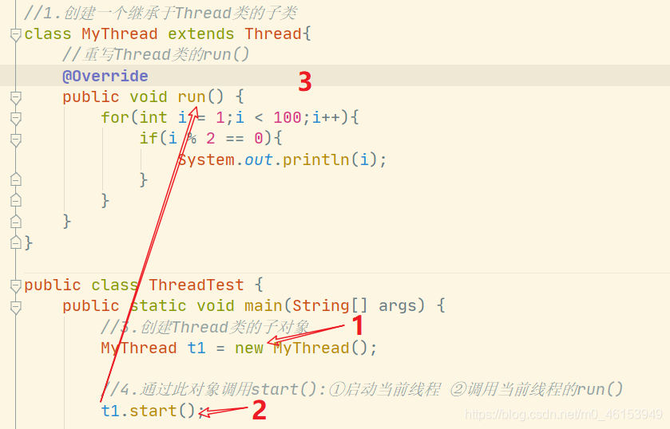
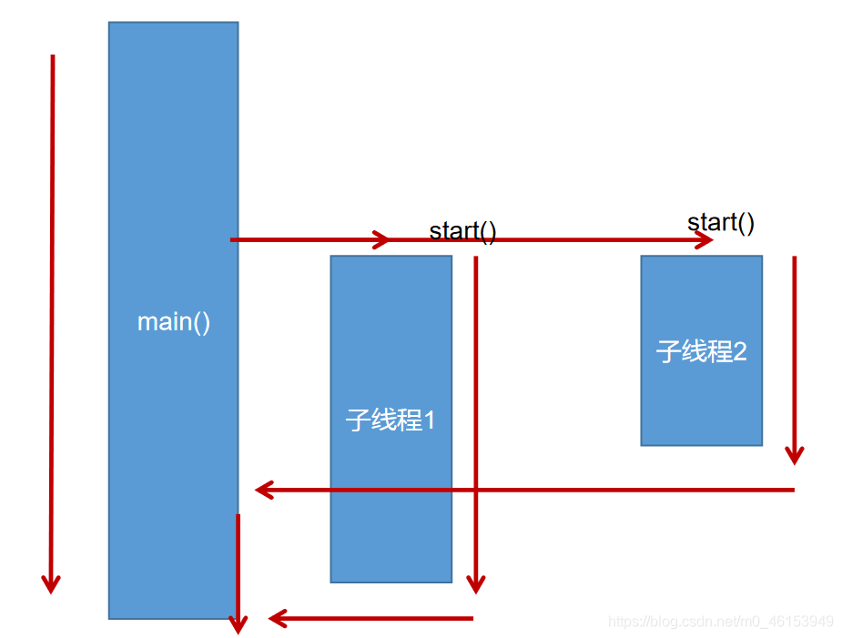
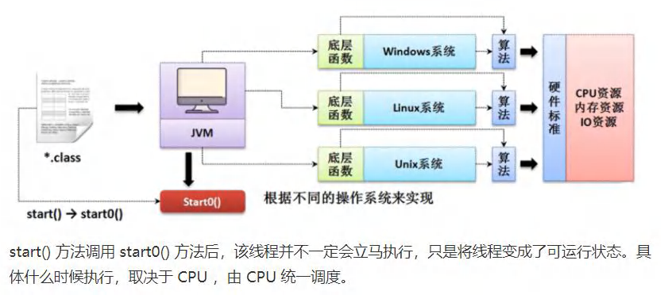
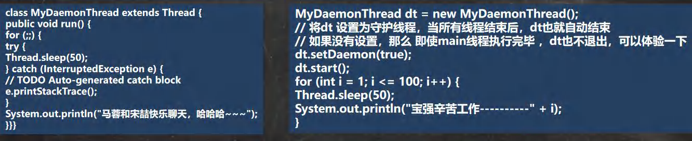

- Java语言的JVM允许程序运行多个线程，它通过`java.lang.Thread`类来体现。

- ```
  Thread
  ```

  类的特性

  - 每个线程都是通过某个特定`Thread`对象的`run()`方法来完成操作的，经常把`run()`方法的主体称为线程体
  - 通过该`Thread`对象的`start()`方法来启动这个线程，而非直接调用`run()`

## 2.2、[Thread类](https://so.csdn.net/so/search?q=Thread类&spm=1001.2101.3001.7020)

- `Thread()`：创建新的Thread对象
- `Thread(String threadname)`：创建线程并指定线程实例名
- `Thread(Runnable target)`：指定创建线程的目标对象，它实现了Runnable接口中的run方法
- `Thread(Runnable target, String name)`：创建新的Thread对象

## 2.3、[API](https://so.csdn.net/so/search?q=API&spm=1001.2101.3001.7020)中创建线程的两种方式

- JDK1.5之前创建新执行线程有两种方法：
  - 继承`Thread`类的方式
  - 实现`Runnable`接口的方式

### 2.3.1、创建多线程的方式一：继承Thread类

```java
/**
 * 多线程的创建，方式一：继承于Thread类
 * 1.创建一个继承于Thread类的子类
 * 2.重写Thread的run()方法 ---> 将此线程的方法声明在run()中
 * 3.创建Thread类的子对象
 * 4.通过此对象调用start()
 *
 * 例子:遍历100以内的所有的偶数
 */

//1.创建一个继承于Thread类的子类
class MyThread extends Thread{ 
    //重写Thread类的run()
    @Override
    public void run() { 
        for(int i = 1;i < 100;i++){ 
            if(i % 2 == 0){ 
                System.out.println(i);
            }
        }
    }
}

public class ThreadTest { 
    public static void main(String[] args) { 
        //3.创建Thread类的子对象
        MyThread t1 = new MyThread();

        //4.通过此对象调用start():①启动当前线程 ②调用当前线程的run()
        t1.start();

        //如下操作仍在main线程中执行的
        for(int i = 1;i < 100;i++){ 
            if(i % 2 == 0){ 
                System.out.println(i + "***main()***");
            }
        }
    }
}
```

> mt子线程的创建和启动过程






### 2.3.2、创建过程中的两个问题说明

1. 我们不能通过直接调用`run()`的方式启动线程
2. 如果要在启动一个线程，不可以让已经`start()`的线程去执行，会报`IllegalThreadStateException`错误，我们需要重新创建一个对象

### 2.3.3、匿名内部类方式创建线程

> 匿名内部类完成开启线程

```java
/**
 * 练习:创建两个分线程，其中一个遍历100以内的偶数，另一个遍历100以内的奇数
 */
public class ThreadDemo { 
    public static void main(String[] args) { 

        //创建Thread类的匿名子类的方式
        new Thread(){ 
            @Override
            public void run() { 
                for(int i = 0;i < 100;i++){ 
                    if(i % 2 == 0){ 
                        System.out.println(Thread.currentThread().getName() + ":" + i);
                    }
                }
            }
        }.start();
    }
}
```

### 2.3.4、演示Thread类创建过程

```Java
package com.hspedu.threaduse;

/**
 * @author 韩顺平
 * @version 1.0
 * 演示通过继承Thread 类创建线程
 */
public class Thread01 {
    public static void main(String[] args) throws InterruptedException {

        //创建Cat对象，可以当做线程使用
        Cat cat = new Cat();

        //老韩读源码
        /*
            (1)
            public synchronized void start() {
                start0();
            }
            (2)
            //start0() 是本地方法，是JVM调用, 底层是c/c++实现
            //真正实现多线程的效果， 是start0(), 而不是 run
            private native void start0();

         */

        cat.start();//启动线程-> 最终会执行cat的run方法


        //cat.run();//run方法就是一个普通的方法, 没有真正的启动一个线程，就会把run方法执行完毕，才向下执行
        //说明: 当main线程启动一个子线程 Thread-0, 主线程不会阻塞, 会继续执行
        //这时 主线程和子线程是交替执行..
        System.out.println("主线程继续执行" + Thread.currentThread().getName());//名字main
        for(int i = 0; i < 60; i++) {
            System.out.println("主线程 i=" + i);
            //让主线程休眠
            Thread.sleep(1000);
        }

    }
}

//老韩说明
//1. 当一个类继承了 Thread 类， 该类就可以当做线程使用
//2. 我们会重写 run方法，写上自己的业务代码
//3. run Thread 类 实现了 Runnable 接口的run方法
/*
    @Override
    public void run() {
        if (target != null) {
            target.run();
        }
    }
 */


class Cat extends Thread {

    int times = 0;
    @Override
    public void run() {//重写run方法，写上自己的业务逻辑

        while (true) {
            //该线程每隔1秒。在控制台输出 “喵喵, 我是小猫咪”
            System.out.println("喵喵, 我是小猫咪" + (++times) + " 线程名=" + Thread.currentThread().getName());
            //让该线程休眠1秒 ctrl+alt+t
            try {
                Thread.sleep(1000);
            } catch (InterruptedException e) {
                e.printStackTrace();
            }
            if(times == 80) {
                break;//当times 到80, 退出while, 这时线程也就退出..
            }
        }
    }
}
```



### 2.3.5、模拟Thread类(代理模式)

```Java
package com.hspedu.threaduse;

/**
 * @author 韩顺平
 * @version 1.0
 * 通过实现接口Runnable 来开发线程
 */
public class Thread02 {
    public static void main(String[] args) {
        Dog dog = new Dog();
        //dog.start(); 这里不能调用start
        //创建了Thread对象，把 dog对象(实现Runnable),放入Thread
        Thread thread = new Thread(dog);
        thread.start();

//        Tiger tiger = new Tiger();//实现了 Runnable
//        ThreadProxy threadProxy = new ThreadProxy(tiger);
//        threadProxy.start();
    }
}

class Animal {
}

class Tiger extends Animal implements Runnable {

    @Override
    public void run() {
        System.out.println("老虎嗷嗷叫....");
    }
}

//线程代理类 , 模拟了一个极简的Thread类
class ThreadProxy implements Runnable {//你可以把Proxy类当做 ThreadProxy

    private Runnable target = null;//属性，类型是 Runnable

    @Override
    public void run() {
        if (target != null) {
            target.run();//动态绑定（运行类型Tiger）
        }
    }

    public ThreadProxy(Runnable target) {
        this.target = target;
    }

    public void start() {
        start0();//这个方法时真正实现多线程方法
    }

    public void start0() {
        run();
    }
}


class Dog implements Runnable { //通过实现Runnable接口，开发线程

    int count = 0;

    @Override
    public void run() { //普通方法
        while (true) {
            System.out.println("小狗汪汪叫..hi" + (++count) + Thread.currentThread().getName());

            //休眠1秒
            try {
                Thread.sleep(1000);
            } catch (InterruptedException e) {
                e.printStackTrace();
            }

            if (count == 10) {
                break;
            }
        }
    }
}
```

### 2.3.6、Thread类的有关方法

```java
/**
 * 测试Thread类的常用方法
 * 1.start():启动当前线程，执行当前线程的run()
 * 2.run():通常需要重写Thread类中的此方法，将创建的线程要执行的操作声明在此方法中
 * 3.currentThread(): 静态方法，返回当前代码执行的线程
 * 4.getName():获取当前线程的名字
 * 5.setName():设置当前线程的名字
 * 6.yield():线程让步，释放当前CPU的执行权
 * 7.join():线程插队，在线程a中调用线程b的join(),此时线程a就进入阻塞状态，直到线程b完全执行完以后，线程a才
 *          结束阻塞状态。
 * 8.stop():已过时。当执行此方法时，强制结束当前线程。
 * 9.sleep(long millitime)：让当前线程“睡眠”指定时间的millitime毫秒)。在指定的millitime毫秒时间内，
 *                          当前线程是阻塞状态的。
 * 10.interrupt();中断线程，但并没有真正的结束线程。所以一般用于中断正在休眠的线程
 * 10.isAlive()：返回boolean，判断线程是否还活着
 */

class HelloThread extends Thread{ 
    @Override
    public void run() { 
        for(int i = 0;i < 100; i++){ 

            try { 
              //线程睡眠
                sleep(10);
            } catch (InterruptedException e) { 
                e.printStackTrace();
            }

            if(i % 2 == 0){ 
                System.out.println(Thread.currentThread().getName() + ":" + i);
            }
//            if(i % 20 == 0){ 
//               线程让步  
//                yield();
//            }
        }
    }

    public HelloThread(String name){ 
        super(name);
    }
}

public class ThreadModeTest { 
    public static void main(String[] args) { 
        HelloThread h1 = new HelloThread("Thread : 1");

//        h1.setName("线程一");
        //开启线程
        h1.start();

        //给主线程命名
        Thread.currentThread().setName("主线程");

        for(int i = 0;i < 100; i++){ 
            if(i % 2 == 0){ 
                System.out.println(Thread.currentThread().getName() + ":" + i);
            }

            if(i == 20){ 
                try { 
                    //线程插队
                    h1.join();
                } catch (InterruptedException e) { 
                    e.printStackTrace();
                }
            }
        }

        System.out.println(h1.isAlive());
    }
}
```

### 2.3.7、线程的调度

- 调度策略

  - 时间片

  

  - **抢占式：高优先级的线程抢占CPU**

- Java的调度方法

  - 同优先级线程组成先进先出队列（先到先服务），使用时间片策略
  - 对高优先级，使用优先调度的抢占式策略

### 2.3.8、线程的[优先级](https://so.csdn.net/so/search?q=优先级&spm=1001.2101.3001.7020)

```java
/**
 * - 线程的优先级等级
 *   - MAX_PRIORITY：10
 *   - MIN _PRIORITY：1
 *   - NORM_PRIORITY：5 --->默认优先级
 * - 涉及的方法
 *   - getPriority() ：返回线程优先值
 *   - setPriority(intnewPriority) ：改变线程的优先级
 *
 *   说明:高优先级的线程要抢占低优先级线程cpu的执行权。
 *       但是只是从概率上讲，高优先级的线程高概率的情况下被执行。
 *       并不意味着只有当高优先级的线程执行完以后，低优先级的线程才会被执行。
 */

class HelloThread extends Thread { 
    @Override
    public void run() { 
        for (int j = 0; j < 100; j++) { 
            if (j % 2 == 0) { 
                System.out.println(getName() + ":" + getPriority() + ":" + j);
            }
        }
    }
    public HelloThread(String name){ 
        super(name);
    }
}

public class ThreadModeTest { 
    public static void main(String[] args) { 
        HelloThread h2 = new HelloThread("Thread : 1");
        h2.start();

        //设置分线程的优先级
        h2.setPriority(Thread.MAX_PRIORITY);

        //给主线程命名
        Thread.currentThread().setName("主线程");
        Thread.currentThread().setPriority((Thread.MIN_PRIORITY));

        for(int j = 0;j < 100; j++){ 
            if(j % 2 == 0){ 
                System.out.println(Thread.currentThread().getName() + ":" + Thread.currentThread().getPriority() + ":" + j);
            }
        }

        System.out.println(h2.isAlive());
    }
}
```

### 2.3.9、练习（多窗口卖票）

> 1、多窗口卖票

```java
/**
 * 例子：创建三个c窗口卖票，总票数为100张
 *
 * 存在线程的安全问题，待解决。
 */
class Windows extends Thread{ 

    private static int ticket = 100;

    @Override
    public void run() { 
        while(true){ 
            if(ticket > 0){ 
                System.out.println(getName() + ":卖票，票号为: " + ticket);
                ticket--;
            }else{ 
                break;
            }
        }
    }
}

public class WindowsTest { 
    public static void main(String[] args) { 
        Windows t1 = new Windows();
        Windows t2 = new Windows();
        Windows t3 = new Windows();

        t1.setName("窗口1");
        t2.setName("窗口2");
        t3.setName("窗口3");

        t1.start();
        t2.start();
        t3.start();
    }
}
```

### 2.3.10、创建多线程的方式二：实现Runnable接口

```java
/**
 * 创建多线程的方式二：实现Runnable接口
 * 1.创建一个实现了Runnable接口得类
 * 2.实现类去实现Runnable中的抽象方法:run()
 * 3.创建实现类的对象
 * 4.将此对象作为参数传递到Thread类的构造器中，创建Thread类的对象
 * 5.通过Thread类的对象调用start()
 */
//1.创建一个实现了Runnable接口得类
class MThread implements Runnable{ 

    //2.实现类去实现Runnable中的抽象方法:run()
    @Override
    public void run() { 
        for(int i = 0;i < 100;i++){ 
            if(i % 2 == 0){ 
                System.out.println(Thread.currentThread().getName() + ":" + i);
            }
        }
    }
}

public class ThreadTest1 { 
    public static void main(String[] args) { 
        //3.创建实现类的对象
        MThread m1 = new MThread();
        //4.将此对象作为参数传递到Thread类的构造器中，创建Thread类的对象
        Thread t1 = new Thread(m1);
        //5.通过Thread类的对象调用start():①启动线程 ②调用当前线程的run() --> 调用了Runnable类型的target的run()
        t1.start();

        //再启动一个线程，遍历100以内的偶数
        Thread t2 = new Thread(m1);
        t2.setName("线程2");
        t2.start();
    }
}
```

### 2.3.11、继承方式和实现方式的联系与区别

```java
/**
 *  比较创建线程的两种方式。
 *  开发中：优先选择：实现Runnable接口的方式
 *  原因：1. 实现的方式没有类的单继承性的局限性
 *       2. 实现的方式更适合来处理多个线程有共享数据的情况。
 *  
 *  联系：public class Thread implements Runnable
 *  相同点：两种方式都需要重写run(),将线程要执行的逻辑声明在run()中。
 */
```

### 2.3.12、用户线程和守护线程

> Java中的线程分为两类：一种是守护线程，一种是用户线程。

- 用户线程：也叫工作线程，当线程的任务执行
- 守护线程：一般是为工作线程服务的，当所有用户线程结束，守护线程自动结束
- 它们在几乎每个方面都是相同的，唯一的区别是判断JVM何时离开。
- 守护线程是用来服务用户线程的，通过在`start()`方法前调用**`thread.setDaemon(true)`**可以把一个用户线程变成一个守护线程。
- Java垃圾回收就是一个典型的守护线程。
- 若JVM中都是守护线程，当前JVM将退出。
- 形象理解：兔死狗烹，鸟尽弓藏

> 测试

