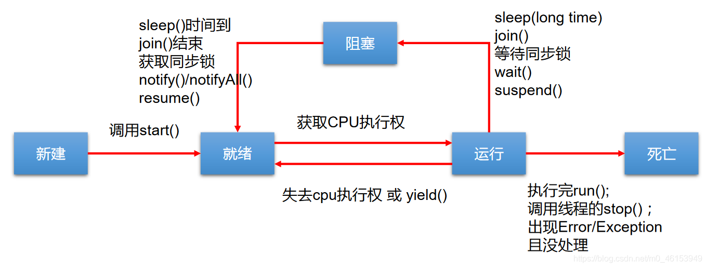
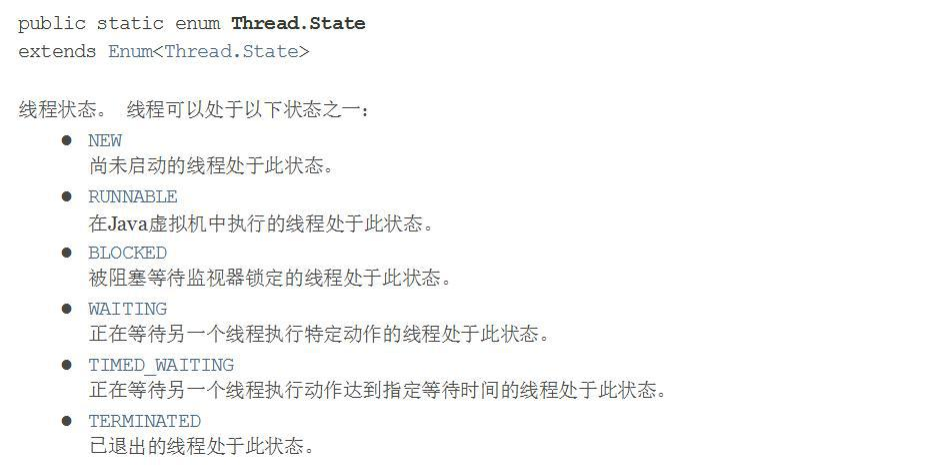
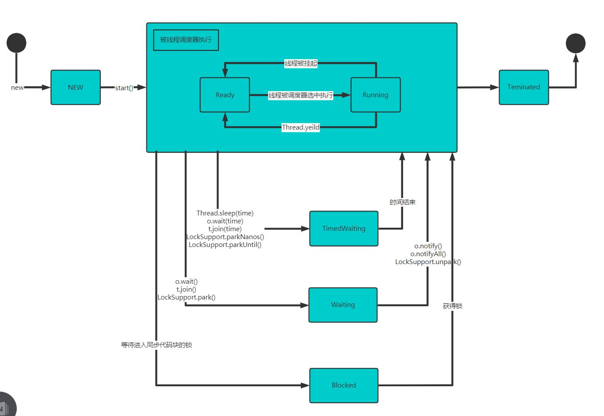

> JDK中用Thread.State类定义了线程的几种状态

- 新建：当一个Thread类或其子类的对象被声明并创建时，新生的线程对象处于新建状态
- 就绪：处于新建状态的线程被`start()`后，将进入线程队列等待CPU时间片，此时它已具备了运行的条件，只是没分配到CPU资源
- 运行：当就绪的线程被调度并获得CPU资源时,便进入运行状态，`run()`方法定义了线程的操作和功能
- 阻塞：在某种特殊情况下，被人为挂起或执行输入输出操作时（例如sleep/suspend），让出CPU并临时中止自己的执行，进入阻塞状态
- 死亡：线程完成了它的全部工作或线程被提前强制性地中止或出现异常导致结束

> 线程的生命周期




> JDK 中用 Thread.State 枚举表示了线程的几种状态



> 线程状态转换图



> 写程序查看线程状态

```Java
package com.hspedu.state_;

/**
 * @author 韩顺平
 * @version 1.0
 */
public class ThreadState_ {
    public static void main(String[] args) throws InterruptedException {
        T t = new T();
        System.out.println(t.getName() + " 状态 " + t.getState());
        t.start();

        while (Thread.State.TERMINATED != t.getState()) {
            System.out.println(t.getName() + " 状态 " + t.getState());
            Thread.sleep(500);
        }

        System.out.println(t.getName() + " 状态 " + t.getState());

    }
}

class T extends Thread {
    @Override
    public void run() {
        while (true) {
            for (int i = 0; i < 10; i++) {
                System.out.println("hi " + i);
                try {
                    Thread.sleep(1000);
                } catch (InterruptedException e) {
                    e.printStackTrace();
                }
            }
            break;
        }
    }
}
```