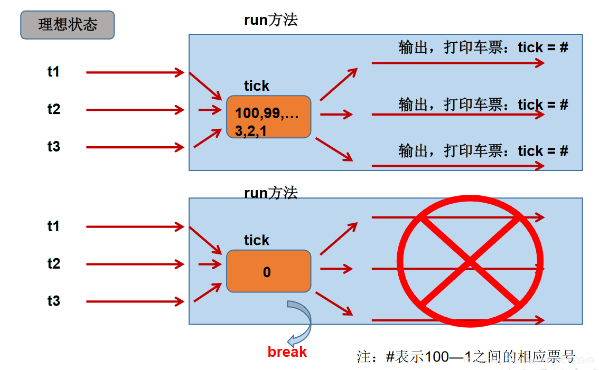
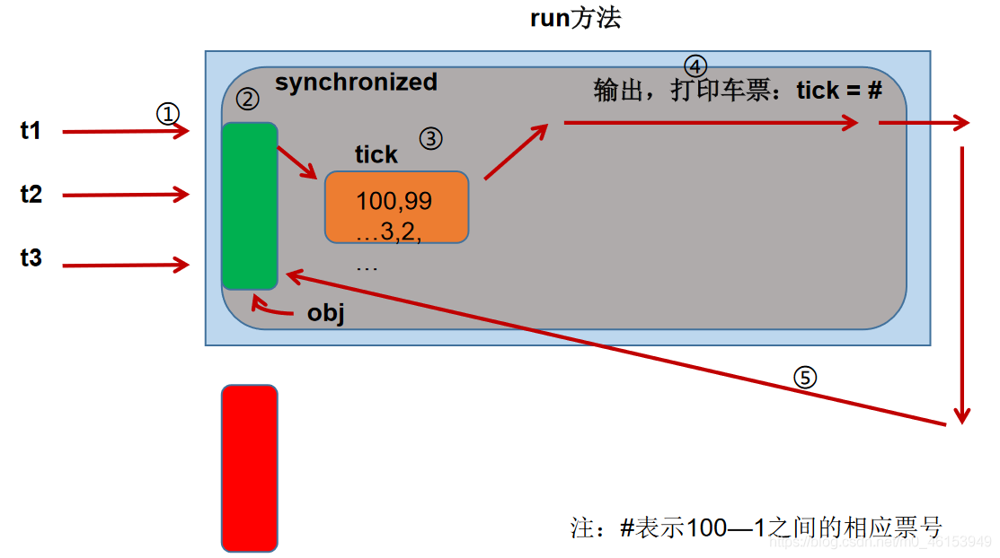
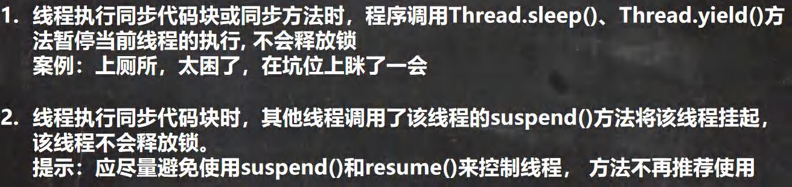

> 1、提出问题：  多个线程执行的不确定性引起执行结果的不稳定  多个线程对账本的共享，会造成操作的不完整性，会破坏数据。


> 2、例题：模拟火车站售票程序，开启三个窗口售票。

```java
class Windows1 implements Runnable{ 

    private int ticket = 100;

    @Override
    public void run() { 
        while(true){ 
            if(ticket > 0){ 
                System.out.println(Thread.currentThread().getName() + ":卖票，票号为: " + ticket);
                ticket--;
            }else{ 
                break;
            }
        }
    }
}

public class WindowsTest1 { 
    public static void main(String[] args) { 
        Windows1 w = new Windows1();

        Thread t1 = new Thread(w);
        Thread t2 = new Thread(w);
        Thread t3 = new Thread(w);

        t1.setName("窗口1");
        t2.setName("窗口2");
        t3.setName("窗口3");

        t1.start();
        t2.start();
        t3.start();
    }
}
```

> 3、理想状态




> 4、极端状态


## 4.1、同步代码块处理实现Runnable的线程安全问题

```java
/**
 *  例子：创建三个窗口卖票，总票数为100张.使用实现Runnable接口的方式
 *  1.卖票过程中出现重票、错票 ---》出现了线程的安全问题
 *  2.问题出现的原因:当某个线程操作车票的过程中，尚未操作完成时，其他线程参与进来，也操作车票
 *  3.如何解决：当一个线程在操作ticket的时候，其他线程不能参与进来。直到线程a操作完ticket时，其他
 *            线程才可以操作ticket。这种情况即使线程a出现了阻塞，也不能被改变。
 *  4.在java中，我们通过同步机制，来解决线程的安全问题。
 *
 *  方式一：同步代码块
 *  synchronized(同步监视器){
 *      //需要被同步的代码
 *
 *  }
 *  说明：1.操作共享数据的代码，即为需要被同步的代码 --->不能包含代码多了，也不能包含代码少了。
 *       2.共享数据：多个线程共同操作的变量。比如：ticket就是共享数据
 *       3.同步监视器，俗称：锁，或互斥锁。任何一个类的对象，都可以来充当锁。
 *          要求：多个线程必须要共用同一把锁。
 *
 *       补充：在实现Runnable接口创建多线程的方式中，我们可以考虑使用this充当同步监视器。
 *
 *  方式二：同步方法
 *      如果操作共享数据的代码完整的声明在一个方法中，我们不妨将此方法声明同步的
 *
 *  5.同步的方式，解决了线程的安全问题。---好处
 *    操作同步代码时，只能有一个线程参与，其他线程等待。相当于是一个单线程的过程，效率低。---局限性
 */

class Windows1 implements Runnable{ 

    private int ticket = 100;
   
//    Object obj = new Object();
//    Dog dog = new Dog();

    @Override
    public void run() { 
        while(true){ 
            synchronized (this) { //此时的this:唯一的windows1的对象 //方式二:synchronized (dog) { 
                if (ticket > 0) { 

                    try{ 
                        Thread.sleep(100);
                    }catch (InterruptedException e){ 
                        e.printStackTrace();
                    }

                    System.out.println(Thread.currentThread().getName() + ":卖票，票号为: " + ticket);
                    ticket--;
                } else { 
                    break;
                }
            }
        }
    }
}

public class WindowsTest1 { 
    public static void main(String[] args) { 
        Windows1 w = new Windows1();

        Thread t1 = new Thread(w);
        Thread t2 = new Thread(w);
        Thread t3 = new Thread(w);

        t1.setName("窗口1");
        t2.setName("窗口2");
        t3.setName("窗口3");

        t1.start();
        t2.start();
        t3.start();
    }
}
class Dog{ 

}
```

> 分析同步原理




## 4.2、同步代码块处理继承Thread类的线程安全问题

```java
/**
 * 使用同步代码块解决继承Thread类的方式的线程安全问题
 *
 * 例子：创建三个c窗口卖票，总票数为100张
 */
class Windows extends Thread{ 

    private static int ticket = 100;
    private static Object obj = new Object();

    @Override
    public void run() { 
        while(true){ 
            //正确的
//            synchronized (obj) { 
            synchronized (Windows.class){    //Class clazz = Windows.class
            //错误的，因为此时this表示的是t1,t2,t3三个对象
//            synchronized (this) { 
                if (ticket > 0) { 

                    try { 
                        Thread.sleep(100);
                    } catch (InterruptedException e) { 
                        e.printStackTrace();
                    }

                    System.out.println(getName() + ":卖票，票号为: " + ticket);
                    ticket--;
                } else { 
                    break;
                }
            }
        }
    }
}

public class WindowsTest2 { 
    public static void main(String[] args) { 
        Windows t1 = new Windows();
        Windows t2 = new Windows();
        Windows t3 = new Windows();

        t1.setName("窗口1");
        t2.setName("窗口2");
        t3.setName("窗口3");

        t1.start();
        t2.start();
        t3.start();
    }
}
```

## 4.3、同步方法处理实现Runnable的线程安全问题

```java
/**
 * 使用同步方法解决实现Runnable接口的线程安全问题
 *
 * 关于同步方法的总结:
 *  1. 同步方法仍然涉及到同步监视器，只是不需要我们显式的声明。
 *  2. 非静态的同步方法，同步监视器是：this
 *     静态的同步方法，同步监视器是：当前类本身
 */

class Windows3 implements Runnable { 

    private int ticket = 100;

    @Override
    public void run() { 
        while (true) { 
            show();
        }
    }

    public synchronized void show() {  //同步监视器:this
//        synchronized (this){ 
            if (ticket > 0) { 
                try { 
                    Thread.sleep(100);
                } catch (InterruptedException e) { 
                    e.printStackTrace();
                }
                System.out.println(Thread.currentThread().getName() + ":卖票，票号为: " + ticket);
                ticket--;
            }
//        }
    }
}

public class WindowsTest3 { 
    public static void main(String[] args) { 
        Windows3 w3 = new Windows3();

        Thread t1 = new Thread(w3);
        Thread t2 = new Thread(w3);
        Thread t3 = new Thread(w3);

        t1.setName("窗口1");
        t2.setName("窗口2");
        t3.setName("窗口3");

        t1.start();
        t2.start();
        t3.start();
    }
}
```

## 4.4、同步方法处理继承Thread类的线程安全问题

```java
/**
 * 使用同步方法处理继承Thread类的方式中的线程安全问题
 */
class Windows4 extends Thread { 

    private static int ticket = 100;

    @Override
    public void run() { 

        while (true) { 

            show();
        }

    }
    private static synchronized void show(){ //同步监视器：Window4.class
        //private synchronized void show(){ //同步监视器：t1,t2,t3。此种解决方式是错误的
        if (ticket > 0) { 

            try { 
                Thread.sleep(100);
            } catch (InterruptedException e) { 
                e.printStackTrace();
            }

            System.out.println(Thread.currentThread().getName() + "：卖票，票号为：" + ticket);
            ticket--;
        }
    }
}


public class WindowsTest4 { 
    public static void main(String[] args) { 
        Windows4 t1 = new Windows4();
        Windows4 t2 = new Windows4();
        Windows4 t3 = new Windows4();


        t1.setName("窗口1");
        t2.setName("窗口2");
        t3.setName("窗口3");

        t1.start();
        t2.start();
        t3.start();

    }
}
```

## 4.5、注意事项总结


## 4.6、线程安全的单例模式之懒汉式

```java
/**
 * 使用同步机制将单例模式中的懒汉式改写为线程安全的
 */
public class BankTest { 
}
class Bank{ 

    private Bank(){ }

    private static Bank instance = null;

    public static Bank getInstance(){ 
        //方式一：效率稍差
        //快捷键:Alt+Shift+Z
//        synchronized (Bank.class) { 
//            if(instance == null){ 
//                instance = new Bank();
//            }
//            return instance;
//        }

        //方式二：效率较高
        if(instance == null) { 
            synchronized (Bank.class) { 
                if (instance == null) { 
                    instance = new Bank();
                }
            }
        }
        return instance;
    }
}
```

## 4.7、死锁的问题

```Java
 * 1.死锁的理解：不同的线程分别占用对方需要的同步资源不放弃，
 *       都在等待对方放弃自己需要的同步资源，就形成了线程的死锁
 * 2.说明:
 *      》出现死锁后，不会出现异常，不会出现提示，只是所有的线程都处于阻塞状态，无法继续
 *      》我们使用同步时，要避免出现死锁。
```

> 死锁的必要条件

```Java
互斥条件：同一资源同时只能由一个线程读取

不可抢占条件：不能强行剥夺线程占有的资源

请求和保持条件：请求其他资源的同时对自己手中的资源保持不放

循环等待条件：在相互等待资源的过程中，形成一个闭环

想要预防死锁，只需要破坏其中一个条件即可，比如使用定时锁、尽量让线程用相同的加锁顺序，还可以用银行家算法可以预防死锁 
```

> 例1

```Java
package com.hspedu.syn;

/**
 * @author 韩顺平
 * @version 1.0
 * 模拟线程死锁
 */
public class DeadLock_ {
    public static void main(String[] args) {
        //模拟死锁现象
        DeadLockDemo A = new DeadLockDemo(true);
        A.setName("A线程");
        DeadLockDemo B = new DeadLockDemo(false);
        B.setName("B线程");
        A.start();
        B.start();
    }
}


//线程
class DeadLockDemo extends Thread {
    static Object o1 = new Object();// 保证多线程，共享一个对象,这里使用static
    static Object o2 = new Object();
    boolean flag;

    public DeadLockDemo(boolean flag) {//构造器
        this.flag = flag;
    }

    @Override
    public void run() {

        //下面业务逻辑的分析
        //1. 如果flag 为 T, 线程A 就会先得到/持有 o1 对象锁, 然后尝试去获取 o2 对象锁
        //2. 如果线程A 得不到 o2 对象锁，就会Blocked
        //3. 如果flag 为 F, 线程B 就会先得到/持有 o2 对象锁, 然后尝试去获取 o1 对象锁
        //4. 如果线程B 得不到 o1 对象锁，就会Blocked
        if (flag) {
            synchronized (o1) {//对象互斥锁, 下面就是同步代码
                System.out.println(Thread.currentThread().getName() + " 进入1");
                synchronized (o2) { // 这里获得li对象的监视权
                    System.out.println(Thread.currentThread().getName() + " 进入2");
                }
              
            }
        } else {
            synchronized (o2) {
                System.out.println(Thread.currentThread().getName() + " 进入3");
                synchronized (o1) { // 这里获得li对象的监视权
                    System.out.println(Thread.currentThread().getName() + " 进入4");
                }
            }
        }
    }
}
```

> 1、例2

```java
/**
 * 演示线程的死锁
 *
 */
public class ThreadTest { 
    public static void main(String[] args) { 

        StringBuffer s1 = new StringBuffer();
        StringBuffer s2 = new StringBuffer();

        new Thread(){ 
            @Override
            public void run() { 

                synchronized (s1){ 
                    s1.append("a");
                    s2.append("1");

                    try { 
                        Thread.sleep(100);
                    } catch (InterruptedException e) { 
                        e.printStackTrace();
                    }

                    synchronized (s2){ 
                        s1.append("b");
                        s2.append("2");

                        System.out.println(s1);
                        System.out.println(s2);
                    }
                }
            }
        }.start();

        new Thread(new Runnable() { 
            @Override
            public void run() { 
                synchronized (s2){ 
                    s1.append("c");
                    s2.append("3");

                    try { 
                        Thread.sleep(100);
                    } catch (InterruptedException e) { 
                        e.printStackTrace();
                    }

                    synchronized (s1){ 
                        s1.append("d");
                        s2.append("4");

                        System.out.println(s1);
                        System.out.println(s2);
                    }
                }
            }
        }).start();
    }
}
```

> 2、例3

```java
class A { 
  public synchronized void foo(B b) { 
    System.out.println("当前线程名: " + Thread.currentThread().getName()
        + " 进入了A实例的foo方法"); // ①
    try { 
      Thread.sleep(200);
    } catch (InterruptedException ex) { 
      ex.printStackTrace();
    }
    System.out.println("当前线程名: " + Thread.currentThread().getName()
        + " 企图调用B实例的last方法"); // ③
    b.last();
  }

  public synchronized void last() { 
    System.out.println("进入了A类的last方法内部");
  }
}

class B { 
  public synchronized void bar(A a) { 
    System.out.println("当前线程名: " + Thread.currentThread().getName()
        + " 进入了B实例的bar方法"); // ②
    try { 
      Thread.sleep(200);
    } catch (InterruptedException ex) { 
      ex.printStackTrace();
    }
    System.out.println("当前线程名: " + Thread.currentThread().getName()
        + " 企图调用A实例的last方法"); // ④
    a.last();
  }

  public synchronized void last() { 
    System.out.println("进入了B类的last方法内部");
  }
}

public class DeadLock implements Runnable { 
  A a = new A();
  B b = new B();

  public void init() { 
    Thread.currentThread().setName("主线程");
    // 调用a对象的foo方法
    a.foo(b);
    System.out.println("进入了主线程之后");
  }

  public void run() { 
    Thread.currentThread().setName("副线程");
    // 调用b对象的bar方法
    b.bar(a);
    System.out.println("进入了副线程之后");
  }

  public static void main(String[] args) { 
    DeadLock dl = new DeadLock();
    new Thread(dl).start();
    dl.init();
  }
}
```

## 4.8、Lock锁方式解决线程安全问题

- `java.util.concurrent.locks.Lock`接口是控制多个线程对共享资源进行访问的工具。锁提供了对共享资源的独占访问，每次只能有一个线程对`Lock`对象加锁，线程开始访问共享资源之前应先获得`Lock`对象。
- `ReentrantLock`类实现了`Lock` ，它拥有与`synchronized`相同的并发性和内存语义，在实现线程安全的控制中，比较常用的是`ReentrantLock`，可以显式加锁、释放锁。
- 从JDK 5.0开始，Java提供了更强大的线程同步机制——通过显式定义同步锁对象来实现同步。同步锁使用`Lock`对象充当。

```java
import java.util.concurrent.locks.ReentrantLock;

/**
 * 解决线程安全问题的方式三：lock锁---》JDK5.0新增
 *
 * 注意：如果同步代码有异常，要将unlock()写入finally语句块
 *
 * 1. 面试题：synchronized 与 Lock的异同？
 *    相同：二者都可以解决线程安全问题
 *    不同：1.synchronized是关键字，lock是一个类
 *         2.synchronized机制在执行完相应的同步代码以后，自动的释放同步监视器
 *           Lock需要手动的启动同步（lock()），同时结束同步也需要手动的实现（unlock()）
 *         3.synchronized在发生异常时会自动释放锁，lock需要手动释放锁
 *         4.synchronized是可重入锁、非公平锁、不可中断锁，
 *           lock的ReentrantLock是可重入锁，可中断锁，可以是公平锁也可以是非公平锁
 *         5.synchronized是JVM层次通过监视器实现的，Lock是通过AQS实现的
 *
 * 2.优先使用顺序：
 *      Lock 同步代码块（已经进入了方法体，分配了相应资源）同步方法（在方法体之外）
 *
 * 面试题：如何解决线程安全问题？有几种方式
 *    3种 同步代码块，同步方法，Lock锁
 */

class Windows implements Runnable{ 

    private int ticket = 100;
    //1.实例化ReentrantLock
    private ReentrantLock lock = new ReentrantLock();


    @Override
    public void run() { 
        while(true){ 
            try{ 

                //调用锁定方法：lock()
                lock.lock();

                if(ticket > 0){ 

                    try { 
                        Thread.sleep(100);
                    } catch (InterruptedException e) { 
                        e.printStackTrace();
                    }

                    System.out.println(Thread.currentThread().getName() + ":售票，票号为: " + ticket);
                    ticket --;
                }else{ 
                    break;
                }
            }finally { 
                //3.调用解锁方法：unlock()
                lock.unlock();
            }
        }
    }
}

public class LockTest { 
    public static void main(String[] args) { 
        Windows w = new Windows();

        Thread t1 = new Thread(w);
        Thread t2 = new Thread(w);
        Thread t3 = new Thread(w);

        t1.setName("窗口1");
        t2.setName("窗口2");
        t3.setName("窗口3");

        t1.start();
        t2.start();
        t3.start();
    }
}
```

> 练习

```java
/**
 * 银行有一个账户。
 * 有两个储户分别向同一个账户存3000元，每次存1000，存3次。
 * 每次存完打印账户余额。
 *
 * 分析：
 *      1.是否是多线程问题？是，两个储户线程
 *      2.是否有共享数据？有，账户（或账户余额）
 *      3.是否有线程安全问题？有
 *      4.需要考虑如何解决线程安全问题？同步机制：有三种方式。
 */
class Account{ 
    private double balance;

    public Account(double balance){ 
        this.balance = balance;
    }

    //存钱
    public synchronized void deposit(double amt){ 
        if(amt > 0){ 

            try { 
                Thread.sleep(1000);
            } catch (InterruptedException e) { 
                e.printStackTrace();
            }

            balance += amt;
            System.out.println(Thread.currentThread().getName() + ":" + "存钱成功，当前余额:" + balance);
        }
    }
}

class Customer extends Thread{ 

    private Account acct;
    public Customer(Account acct){ 
        this.acct = acct;
    }

    @Override
    public void run() { 

        for(int i = 0;i < 3;i++){ 
            acct.deposit(1000);
        }
    }
}

public class AccountTest { 
    public static void main(String[] args) { 
        Account acct = new Account(0);
        Customer c1 = new Customer(acct);
        Customer c2 = new Customer(acct);

        c1.setName("甲");
        c2.setName("乙");

        c1.start();
        c2.start();
    }
}
```

## 4.9、释放锁


> 下面操作不会释放锁

