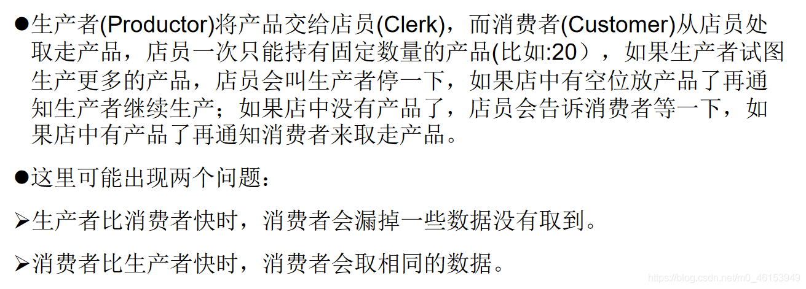

```java
/**
 * 线程通信的例子：使用两个线程打印1-100。线程1, 线程2 交替打印
 *
 * 涉及到的三个方法：
 * wait():一旦执行此方法，当前线程就进入阻塞状态，并释放同步监视器。
 * notify():一旦执行此方法，就会唤醒被wait的一个线程。如果有多个线程被wait，就唤醒优先级高的那个。
 * notifyAll():一旦执行此方法，就会唤醒所有被wait的线程。
 *
 * 说明：
 *      1.wait()，notify()，notifyAll()三个方法必须使用在同步代码块或同步方法中。
 *      2.wait()，notify()，notifyAll()三个方法的调用者必须是同步代码块或同步方法中的同步监视器。
 *         否则，会出现IllegalMonitorStateException异常
 *      3.wait()，notify()，notifyAll()三个方法是定义在java.lang.Object类中。
 */

class Number implements Runnable{ 

    private int number = 1;
    public Object obj = new Object();

    @Override
    public void run() { 

        while (true){ 
            synchronized (obj) { 

                obj.notify();

                if(number <= 100){ 

                    try { 
                        Thread.sleep(10);
                    } catch (InterruptedException e) { 
                        e.printStackTrace();
                    }

                    System.out.println(Thread.currentThread().getName() + ":" + number);
                    number++;

                    try { 
                        //使得调用如下wait()方法的线程进入阻塞状态
                        obj.wait();
                    } catch (InterruptedException e) { 
                        e.printStackTrace();
                    }

                }else{ 
                    break;
                }
            }
        }
    }
}

public class CommunicationTest { 
    public static void main(String[] args) { 
        Number number = new Number();
        Thread t1 = new Thread(number);
        Thread t2 = new Thread(number);

        t1.setName("线程1");
        t2.setName("线程2");

        t1.start();
        t2.start();
    }
}
```

## 5.1、sleep()和wait()的异同

```java
 /**
 * 面试题：sleep() 和 wait()的异同？
 * 1.相同点：一旦执行方法，都可以使得当前的线程进入阻塞状态。
 * 2.不同点：1）两个方法声明的位置不同：Thread类中声明sleep() , Object类中声明wait()
 *          2）调用的要求不同：sleep()可以在任何需要的场景下调用。 wait()必须使用在同步代码块或同步方法中
 *          3）关于是否释放同步监视器：如果两个方法都使用在同步代码块或同步方法中，sleep()不会释放锁，wait()会释放锁。
 */
```

## 5.2、经典例题：生产者/消费者问题




```java
/**
 * 线程通信的应用：经典例题：生产者/消费者问题
 *
 * 生产者(Productor)将产品交给店员(Clerk)，而消费者(Customer)从店员处取走产品，
 * 店员一次只能持有固定数量的产品(比如:20），如果生产者试图生产更多的产品，
 * 店员会叫生产者停一下，如果店中有空位放产品了再通知生产者继续生产；
 * 如果店中没有产品了，店员会告诉消费者等一下，
 * 如果店中有产品了再通知消费者来取走产品。
 *
 * 分析：
 *      1.是否是多线程的问题？是，生产者的线程，消费者的线程
 *      2.是否有共享数据的问题？是，店员、产品、产品数
 *      3.如何解决线程的安全问题？同步机制，有三种方法
 *      4.是否涉及线程的通信？是
 */

class Clerk{ 

    private int productCount = 0;

    //生产产品
    public synchronized void produceProduct() { 

        if(productCount < 20){ 
            productCount++;
            System.out.println(Thread.currentThread().getName() + ": 开始生产第" + productCount + "个产品");

            notify();
        }else{ 
            //等待
            try { 
                wait();
            } catch (InterruptedException e) { 
                e.printStackTrace();
            }
        }

    }

    //消费产品
    public synchronized void consumeProduct() { 

        if(productCount > 0){ 
            System.out.println(Thread.currentThread().getName() + ":开始消费第" + productCount + "个产品");
            productCount--;

            notify();
        }else{ 
            //等待
            try { 
                wait();
            } catch (InterruptedException e) { 
                e.printStackTrace();
            }
        }
    }

}

class Producer extends Thread{ //生产者
    private Clerk clerk;

    public Producer(Clerk clerk){ 
        this.clerk = clerk;
    }

    @Override
    public void run() { 
        System.out.println(getName() + ": 开始生产产品......");

        while(true){ 

            try { 
                Thread.sleep(10);
            } catch (InterruptedException e) { 
                e.printStackTrace();
            }

            clerk.produceProduct();
        }
    }
}

class Consumer extends Thread{   //消费者
    private Clerk clerk;

    public Consumer(Clerk clerk){ 
        this.clerk = clerk;
    }

    @Override
    public void run() { 
        System.out.println(getName() + ": 开始消费产品......");

        while(true){ 

            try { 
                Thread.sleep(20);
            } catch (InterruptedException e) { 
                e.printStackTrace();
            }

            clerk.consumeProduct();
        }

    }
}

public class ProductTest { 
    public static void main(String[] args) { 
        Clerk clerk = new Clerk();

        Producer p1 = new Producer(clerk);
        p1.setName("生产者1");

        Consumer c1 = new Consumer(clerk);
        c1.setName("消费者1");
        Consumer c2 = new Consumer(clerk);
        c2.setName("消费者2");

        p1.start();
        c1.start();
        c2.start();
    }
}      
```