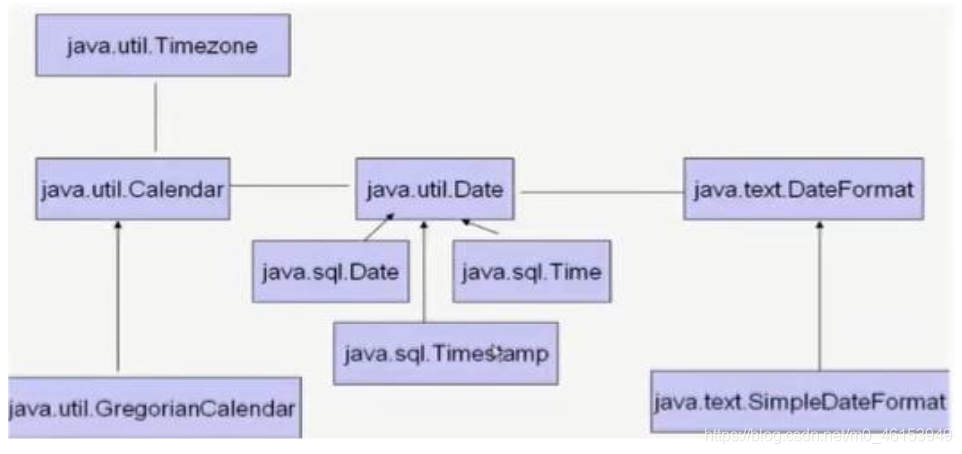

## 2.1、System类中获取时间戳的方法

> `System`类提供的`public static long currentTimeMillis()`用来返回**当前时间与1970年1月1日0时0分0秒之间以毫秒为单位的时间差。**

- 此方法适于计算时间差。
- 计算世界时间的主要标准有：
  - UTC(Coordinated Universal Time)
  - GMT(Greenwich Mean Time)
  - CST(Central Standard Time)

```java
import org.junit.Test;

/**
 * JDK 8之前日期和时间的API测试
 */
public class DateTimeTest { 

    //1.System类中的currentTimeMillis()
    @Test
    public void test1(){ 
        long time = System.currentTimeMillis();
        //返回当前时间与1970年1月1日0时0分0秒之间以毫秒为单位的时间差。
        //称为时间戳
        System.out.println(time);
    }
}
```

## 2.2、Java中两个Date类的使用

```java
import org.junit.Test;

import java.util.Date;

/**
 * JDK 8之前日期和时间的API测试
 */
public class DateTimeTest { 

    /**
     * java.util.Date类 ---> 表示特定的瞬间，精确到毫秒
     *            |---java.sql.Date类
     *
     * 1.两个构造器的使用
     *     >构造器一：Date()：创建一个对应当前时间的Date对象
     *     >构造器二：创建指定毫秒数的Date对象
     * 2.两个方法的使用
     *     >toString():显示当前的年、月、日、时、分、秒
     *     >getTime():获取当前Date对象对应的毫秒数。（时间戳）
     *
     * 3. java.sql.Date对应着数据库中的日期类型的变量
     *     >如何实例化
     *     >如何将java.util.Date对象转换为java.sql.Date对象
     *
     */
    @Test
    public void test2(){ 
        //构造器一：Date()：创建一个对应当前时间的Date对象
        Date date1 = new Date();
        System.out.println(date1.toString());   //Sat May 09 20:09:11 CST 2020

        System.out.println(date1.getTime());    //1589026216998

        //构造器二：创建指定毫秒数的Date对象
        Date date2 = new Date(1589026216998L);
        System.out.println(date2.toString());

        //创建java.sql.Date对象
        java.sql.Date date3 = new java.sql.Date(35235325345L);
        System.out.println(date3);  //1971-02-13

        //如何将java.util.Date对象转换为java.sql.Date对象
        //情况一：
//        Date date4 = new java.sql.Date(2343243242323L);
//        java.sql.Date date5 = (java.sql.Date) date4;
        //情况二：
        Date date6 = new Date();
        java.sql.Date date7 = new java.sql.Date(date6.getTime());
    }
}
```