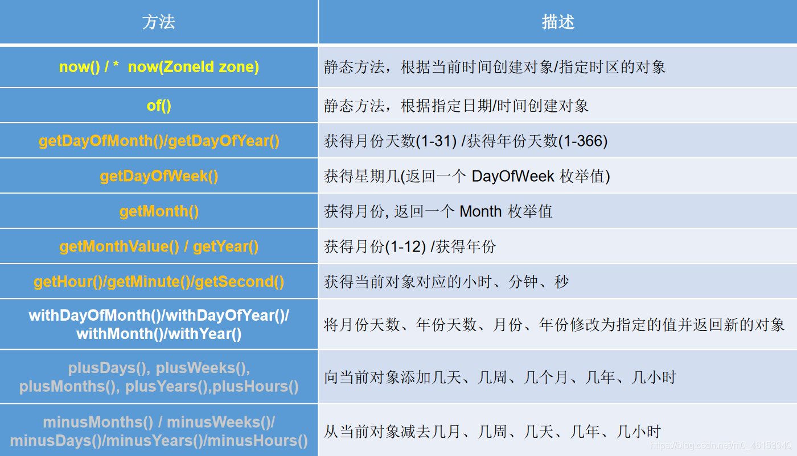
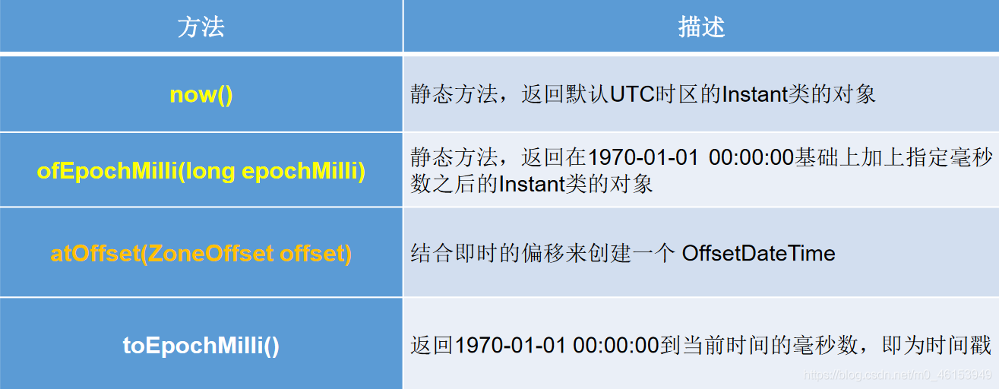
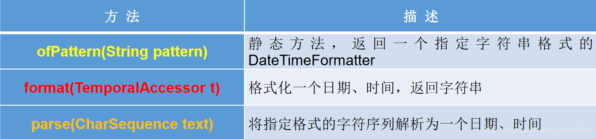
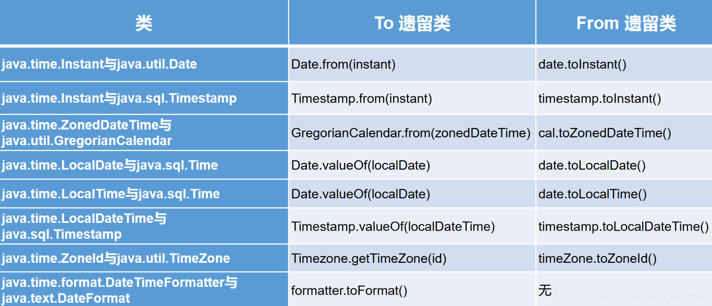

> 1、新日期时间API出现的背景

如果我们可以跟别人说：“我们在1502643933071见面，别晚了！”那么就再简单不过了。但是我们希望时间与昼夜和四季有关，于是事情就变复杂了。JDK 1.0中包含了一个java.util.Date类，但是它的大多数方法已经在JDK 1.1引入Calendar类之后被弃用了。而Calendar并不比Date好多少。它们面临的问题是：

- 可变性：像日期和时间这样的类应该是不可变的。
- 偏移性：Date中的年份是从1900开始的，而月份都从0开始。
- 格式化：格式化只对Date有用，Calendar则不行。
- 此外，它们也不是线程安全的；不能处理闰秒等。

```java
import org.junit.Test;
import java.util.Date;

/**
 * jdk 8中日期时间API的测试
 *
 */
public class JDK8DateTimeTest { 

    @Test
    public void testDate(){ 
        //偏移量
        Date date1 = new Date(2020,9,8);
        System.out.println(date1);  //Fri Oct 08 00:00:00 CST 3920

        Date date2 = new Date(2020 - 1900,9 - 1,8);
        System.out.println(date2); //Tue Sep 08 00:00:00 CST 2020
    }
}
```

第三次引入的API是成功的，并且Java 8中引入的`java.time` API 已经纠正了过去的缺陷，将来很长一段时间内它都会为我们服务。

Java 8 吸收了Joda-Time 的精华，以一个新的开始为Java 创建优秀的API。新的`java.time` 中包含了所有关于 **本地日期（LocalDate）、本地时间（LocalTime）、本地日期时间（LocalDateTime）、时区（ZonedDateTime）和持续时间（Duration）的类** 。历史悠久的Date 类新增了`toInstant()`方法，用于把Date 转换成新的表示形式。这些新增的本地化时间日期API 大大简化了日期时间和本地化的管理。

```java
java.time–包含值对象的基础包
java.time.chrono–提供对不同的日历系统的访问java.time.format–格式化和解析时间和日期java.time.temporal–包括底层框架和扩展特性java.time.zone–包含时区支持的类

说明：大多数开发者只会用到基础包和format包，也可能会用到temporal包。因此，尽管有68个新的公开类型，大多数开发者，大概将只会用到其中的三分之一。
```

## 4.1、LocalDate、LocalTime、LocalDateTime的使用

- ```
  LocalDate、LocalTime、LocalDateTime
  ```

  类是其中较重要的几个类，它们的实例是 

  不可变的对象

   ，分别表示使用ISO-8601日历系统的日期、时间、日期和时间。它们提供了简单的本地日期或时间，并不包含当前的时间信息，也不包含与时区相关的信息。

  - `LocalDate`代表IOS格式（yyyy-MM-dd）的日期,可以存储生日、纪念日等日期。
  - `LocalTime`表示一个时间，而不是日期。
  - `LocalDateTime`是用来表示日期和时间的， **这是一个最常用的类之一** 。

- 注：ISO-8601日历系统是国际标准化组织制定的现代公民的日期和时间的表示法，也就是公历。

```java
import org.junit.Test;

import java.time.LocalDate;
import java.time.LocalDateTime;
import java.time.LocalTime;

/**
 * jdk 8中日期时间API的测试
 */
public class JDK8DateTimeTest { 

    /**
     * LocalDate、LocalTime、LocalDateTime的使用
     *
     */
    @Test
    public void test1(){ 
        //now():获取当前的日期、时间、日期+时间
        LocalDate localDate = LocalDate.now();
        LocalTime localTime = LocalTime.now();
        LocalDateTime localDateTime = LocalDateTime.now();

        System.out.println(localDate);
        System.out.println(localTime);
        System.out.println(localDateTime);

        //of():设置指定的年、月、日、时、分、秒。没有偏移量
        LocalDateTime localDateTime1 = LocalDateTime.of(2020, 10, 6, 13, 23, 43);
        System.out.println(localDateTime1);

        //getXxx()：获取相关的属性
        System.out.println(localDateTime.getDayOfMonth());
        System.out.println(localDateTime.getDayOfWeek());
        System.out.println(localDateTime.getMonth());
        System.out.println(localDateTime.getMonthValue());
        System.out.println(localDateTime.getMinute());

        //体现不可变性
        //withXxx():设置相关的属性
        LocalDate localDate1 = localDate.withDayOfMonth(22);
        System.out.println(localDate);
        System.out.println(localDate1);

        LocalDateTime localDateTime2 = localDateTime.withHour(4);
        System.out.println(localDateTime);
        System.out.println(localDateTime2);

        //不可变性
        LocalDateTime localDateTime3 = localDateTime.plusMonths(3);
        System.out.println(localDateTime);
        System.out.println(localDateTime3);

        LocalDateTime localDateTime4 = localDateTime.minusDays(6);
        System.out.println(localDateTime);
        System.out.println(localDateTime4);
    }
}
```




## 4.2、Instant类的使用

- `Instant`：时间线上的一个瞬时点。这可能被用来记录应用程序中的事件时间戳。
- 在处理时间和日期的时候，我们通常会想到年,月,日,时,分,秒。然而，这只是时间的一个模型，是面向人类的。第二种通用模型是面向机器的，或者说是连续的。在此模型中，时间线中的一个点表示为一个很大的数，这有利于计算机处理。在UNIX中，这个数从1970年开始，以秒为的单位；同样的，在Java中，也是从1970年开始，但以毫秒为单位。
- `java.time`包通过值类型`Instan`t提供机器视图，不提供处理人类意义上的时间单位。`Instant`表示时间线上的一点，而不需要任何上下文信息，例如，时区。概念上讲，它只是简单的表示自1970年1月1日0时0分0秒（UTC）开始的秒数。因为`java.time`包是基于纳秒计算的，所以`Instant`的精度可以达到纳秒级。

> (1 ns = 10-9s) 1秒= 1000毫秒=106微秒=109纳秒




> 时间戳是指格林威治时间1970年01月01日00时00分00秒(北京时间1970年01月01日08时00分00秒)起至现在的总秒数。


```java
import org.junit.Test;

import java.time.*;

/**
 * jdk 8中日期时间API的测试
 */
public class JDK8DateTimeTest { 

    /**
     * Instant的使用
     */
    @Test
    public void test2(){ 
        //now():获取本初子午线对应的标准时间
        Instant instant = Instant.now();
        System.out.println(instant);    //2020-05-10T09:55:55.561Z

        //添加时间的偏移量
        OffsetDateTime offsetDateTime = instant.atOffset(ZoneOffset.ofHours(8));//东八区
        System.out.println(offsetDateTime); //2020-05-10T18:00:00.641+08:00

        //toEpochMilli():获取自1970年1月1日0时0分0秒（UTC）开始的毫秒数  ---> Date类的getTime()
        long milli = instant.toEpochMilli();
        System.out.println(milli);  //1589104867591

        //ofEpochMilli():通过给定的毫秒数，获取Instant实例  -->Date(long millis)
        Instant instant1 = Instant.ofEpochMilli(1550475314878L);
        System.out.println(instant1);   //2019-02-18T07:35:14.878Z
    }
}
```

## 4.3、DateTimeFormatter的使用

> `java.time.format.DateTimeFormatter` 类：该类提供了三种格式化方法：

- 预定义的标准格式。如：**`ISO_LOCAL_DATE_TIME;ISO_LOCAL_DATE;ISO_LOCAL_TIME`**
- 本地化相关的格式。如：`ofLocalizedDateTime(FormatStyle.LONG)`
- **自定义的格式。如：\**\**`ofPattern(“yyyy-MM-dd hh:mm:ss”)`**




```java
import org.junit.Test;

import java.time.*;
import java.time.format.DateTimeFormatter;
import java.time.format.FormatStyle;
import java.time.temporal.TemporalAccessor;

/**
 * jdk 8中日期时间API的测试
 */
public class JDK8DateTimeTest { 

    /**
     * DateTimeFormatter:格式化或解析日期、时间
     *     类似于SimpleDateFormat
     */
    @Test
    public void test3(){ 
        //方式一：预定义的标准格式。如：ISO_LOCAL_DATE_TIME;ISO_LOCAL_DATE;ISO_LOCAL_TIME
        DateTimeFormatter formatter = DateTimeFormatter.ISO_LOCAL_DATE_TIME;
        //格式化:日期-->字符串
        LocalDateTime localDateTime = LocalDateTime.now();
        String str1 = formatter.format(localDateTime);
        System.out.println(localDateTime);
        System.out.println(str1);//2020-05-10T18:26:40.234

        //解析：字符串 -->日期
        TemporalAccessor parse = formatter.parse("2020-05-10T18:26:40.234");
        System.out.println(parse);

        //方式二：
        //本地化相关的格式。如：ofLocalizedDateTime()
        //FormatStyle.LONG / FormatStyle.MEDIUM / FormatStyle.SHORT :适用于LocalDateTime
        DateTimeFormatter formatter1 = DateTimeFormatter.ofLocalizedDateTime(FormatStyle.LONG);
        //格式化
        String str2 = formatter1.format(localDateTime);
        System.out.println(str2);//2020年5月10日 下午06时26分40秒

        //本地化相关的格式。如：ofLocalizedDate()
        //FormatStyle.FULL / FormatStyle.LONG / FormatStyle.MEDIUM / FormatStyle.SHORT : 适用于LocalDate
        DateTimeFormatter formatter2 = DateTimeFormatter.ofLocalizedDate(FormatStyle.MEDIUM);
        //格式化
        String str3 = formatter2.format(LocalDate.now());
        System.out.println(str3);//2020-5-10


       //重点： 方式三：自定义的格式。如：ofPattern(“yyyy-MM-dd hh:mm:ss”)
        DateTimeFormatter formatter3 = DateTimeFormatter.ofPattern("yyyy-MM-dd hh:mm:ss");
        //格式化
        String str4 = formatter3.format(LocalDateTime.now());
        System.out.println(str4);//2020-05-10 06:26:40

        //解析
        TemporalAccessor accessor = formatter3.parse("2020-05-10 06:26:40");
        System.out.println(accessor);

    }
}
```

## 4.4、其它日期时间相关API的使用

- ZoneId：该类中包含了所有的时区信息，一个时区的ID，如Europe/Paris
- ZonedDateTime：一个在ISO-8601日历系统时区的日期时间，如2007-12-03T10:15:30+01:00Europe/Paris。
  - 其中每个时区都对应着ID，地区ID都为“{区域}/{城市}”的格式，例如：Asia/Shanghai等

```java
import org.junit.Test;

import java.time.*;
import java.util.Set;

/**
 * jdk 8中日期时间API的测试
 */
public class JDK8DateTimeTest { 

  @Test
  public void test1(){ 
    //ZoneId:类中包含了所有的时区信息
    // ZoneId的getAvailableZoneIds():获取所有的ZoneId
    Set<String> zoneIds= ZoneId.getAvailableZoneIds();
    for(String s: zoneIds) { 
      System.out.println(s);
    }
    // ZoneId的of():获取指定时区的时间
    LocalDateTime localDateTime= LocalDateTime.now(ZoneId.of("Asia/Tokyo"));
    System.out.println(localDateTime);
  
    //ZonedDateTime:带时区的日期时间
    // ZonedDateTime的now():获取本时区的ZonedDateTime对象
    ZonedDateTime zonedDateTime= ZonedDateTime.now();
    System.out.println(zonedDateTime);
    // ZonedDateTime的now(ZoneId id):获取指定时区的ZonedDateTime对象
    ZonedDateTime zonedDateTime1= ZonedDateTime.now(ZoneId.of("Asia/Tokyo"));
    System.out.println(zonedDateTime1);
  }
}
```

- Clock：使用时区提供对当前即时、日期和时间的访问的时钟。
- 持续时间：Duration，用于计算两个“时间”间隔
- 日期间隔：Period，用于计算两个“日期”间隔
- TemporalAdjuster : 时间校正器。有时我们可能需要获取例如：将日期调整到“下一个工作日”等操作。
- TemporalAdjusters : 该类通过静态方法(firstDayOfXxx()/lastDayOfXxx()/nextXxx())提供了大量的常用TemporalAdjuster 的实现。

```java
import java.time.Duration;
import java.time.LocalDateTime;
import java.time.LocalTime;

import org.junit.Test;

public class JDK8APITest { 

  @Test
  public void test2(){ 
    //Duration:用于计算两个“时间”间隔，以秒和纳秒为基准
    LocalTime localTime= LocalTime.now();
    LocalTime localTime1= LocalTime.of(15, 23, 32);
    //between():静态方法，返回Duration对象，表示两个时间的间隔
    Duration duration= Duration.between(localTime1, localTime);
    System.out.println(duration);
  
    System.out.println(duration.getSeconds());
    System.out.println(duration.getNano());
  
    LocalDateTime localDateTime= LocalDateTime.of(2016, 6, 12, 15, 23, 32);
    LocalDateTime localDateTime1= LocalDateTime.of(2017, 6, 12, 15, 23, 32);
  
    Duration duration1= Duration.between(localDateTime1, localDateTime);
    System.out.println(duration1.toDays());
  }
}
import java.time.Period;
import org.junit.Test;

public class JDK8APITest { 

  @Test
  public void test3(){ 
    //Period:用于计算两个“日期”间隔，以年、月、日衡量
    LocalDate localDate= LocalDate.now();
    LocalDate localDate1= LocalDate.of(2028, 3, 18);
  
    Period period= Period.between(localDate, localDate1);
    System.out.println(period);
        System.out.println(period.getYears());
  
    System.out.println(period.getMonths());
    System.out.println(period.getDays());
  
    Period period1= period.withYears(2);
    System.out.println(period1);
  }
}
```

### 4.4.1、参考：与传统日期处理的转换


