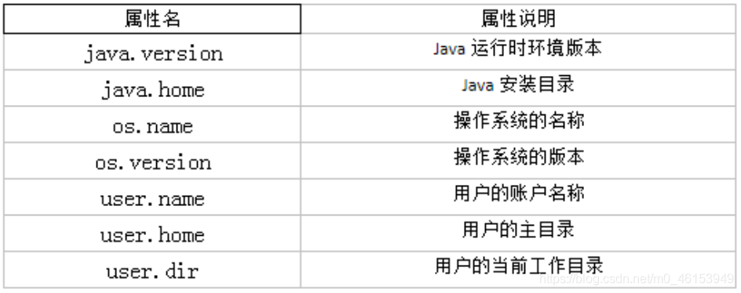
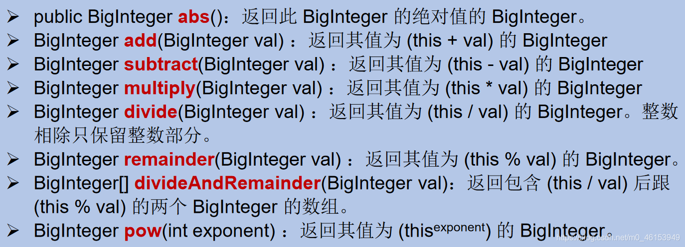

## 6.1、System类

- `System`类代表系统，系统级的很多属性和控制方法都放置在该类的内部。该类位于`java.lang`包。

- 由于该类的构造器是`private`的，所以无法创建该类的对象，也就是无法实例化该类。其内部的成员变量和成员方法都是`static`的，所以也可以很方便的进行调用。

- 成员变量

  - `System`类内部包含`in、out`和`err`三个成员变量，分别代表标准输入流(键盘输入)，标准输出流(显示器)和标准错误输出流(显示器)。

- 成员方法

  - `native long currentTimeMillis()`： 该方法的作用是返回当前的计算机时间，时间的表达格式为当前计算机时间和GMT时间(格林威治时间)1970年1月1号0时0分0秒所差的毫秒数。
  - `void exit(int status)`： 该方法的作用是退出程序。其中status的值为0代表正常退出，非零代表异常退出。使用该方法可以在图形界面编程中实现程序的退出功能等。
  - `void gc()`： 该方法的作用是请求系统进行垃圾回收。至于系统是否立刻回收，则取决于系统中垃圾回收算法的实现以及系统执行时的情况。String
  - `getProperty(String key)`： 该方法的作用是获得系统中属性名为key的属性对应的值。系统中常见的属性名以及属性的作用如下表所示： 

  

```java
import org.junit.Test;

/**
 * 其他常用类的使用
 * 1.System
 * 2.Math
 * 3.BigInteger 和 BigDecimal
 */
public class OtherClassTest { 

    @Test
    public void test1() { 
        String javaVersion = System.getProperty("java.version");
        System.out.println("java的version:" + javaVersion);

        String javaHome = System.getProperty("java.home");
        System.out.println("java的home:" + javaHome);

        String osName = System.getProperty("os.name");
        System.out.println("os的name:" + osName);

        String osVersion = System.getProperty("os.version");
        System.out.println("os的version:" + osVersion);

        String userName = System.getProperty("user.name");
        System.out.println("user的name:" + userName);

        String userHome = System.getProperty("user.home");
        System.out.println("user的home:" + userHome);

        String userDir = System.getProperty("user.dir");
        System.out.println("user的dir:" + userDir);

    }
}
```

## 6.2、Math类

> `java.lang.Math`提供了一系列静态方法用于科学计算。其方法的参数和返回值类型一般为`double`型。

- abs 绝对值
- acos,asin,atan,cos,sin,tan 三角函数
- sqrt 平方根
- pow(double a,doble b) a的b次幂
- log 自然对数
- exp e为底指数
- max(double a,double b)
- min(double a,double b)
- random() 返回0.0到1.0的随机数
- long round(double a) double型数据a转换为long型（四舍五入）
- toDegrees(double angrad) 弧度—>角度
- toRadians(double angdeg) 角度—>弧度

## 6.3、BigInteger与BigDecimal

- `Integer`类作为`int`的包装类，能存储的最大整型值为`2^31 -1`，`Long`类也是有限的，最大为`2^63 -1`。如果要表示再大的整数，不管是基本数据类型还是他们的包装类都无能为力，更不用说进行运算了。
- `java.math`包的`BigInteger`可以表示不可变的任意精度的整数。`BigInteger`提供所有Java 的基本整数操作符的对应物，并提供`java.lang.Math` 的所有相关方法。另外，`BigInteger`还提供以下运算：模算术、GCD 计算、质数测试、素数生成、位操作以及一些其他操作。
- 构造器
  - `BigInteger(String val)`：根据字符串构建`BigInteger`对象
- 常用方法 



- 一般的Float类和Double类可以用来做科学计算或工程计算，但 **在商业计算中，要求数字精度比较高，故用到****`java.math.BigDecimal`****类** 。
- BigDecimal类支持不可变的、任意精度的有符号十进制定点数。
- 构造器
  - `public BigDecimal(double val)`
  - `public BigDecimal(String val)`
- 常用方法
  - `public BigDecimal add(BigDecimal augend)`
  - `public BigDecimal subtract(BigDecimal subtrahend)`
  - `public BigDecimal multiply(BigDecimal multiplicand)`
  - `public BigDecimal divide(BigDecimal divisor, int scale, int roundingMode)`

```java
import org.junit.Test;

import java.math.BigDecimal;
import java.math.BigInteger;

/**
 * 其他常用类的使用
 * 1.System
 * 2.Math
 * 3.BigInteger 和 BigDecimal
 */
public class OtherClassTest { 

    @Test
    public void test2() { 
        BigInteger bi = new BigInteger("1243324112234324324325235245346567657653");
        BigDecimal bd = new BigDecimal("12435.351");
        BigDecimal bd2 = new BigDecimal("11");
        System.out.println(bi);
//         System.out.println(bd.divide(bd2));
        System.out.println(bd.divide(bd2, BigDecimal.ROUND_HALF_UP));
        System.out.println(bd.divide(bd2, 25, BigDecimal.ROUND_HALF_UP));

    }
}
```