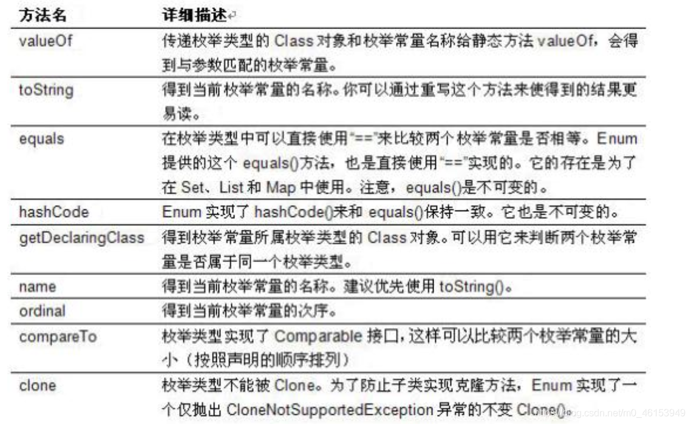

## 1.1、枚举类的理解

- 类的对象只有有限个，确定的。举例如下：
  - 星期：Monday(星期一)、…、Sunday(星期天)
  - 性别：Man(男)、Woman(女)
  - 季节：Spring(春节)…Winter(冬天)
  - 支付方式：Cash（现金）、WeChatPay（微信）、Alipay(支付宝)、BankCard(银行卡)、CreditCard(信用卡)
  - 就职状态：Busy、Free、Vocation、Dimission
  - 订单状态：Nonpayment（未付款）、Paid（已付款）、Delivered（已发货）、Return（退货）、Checked（已确认）Fulfilled（已配货）、
  - 线程状态：创建、就绪、运行、阻塞、死亡
- 当需要定义一组常量时，强烈建议使用枚举类
- 枚举类的实现
  - JDK1.5之前需要自定义枚举类
  - JDK 1.5 新增的enum 关键字用于定义枚举类
- 若枚举只有一个对象, 则可以作为一种单例模式的实现方式。

## 1.2、自定义枚举类

> 枚举类的属性

- 枚举类对象的属性不应允许被改动, 所以应该使用`private final`修饰
- 枚举类的使用`private final` 修饰的属性应该在构造器中为其赋值
- 若枚举类显式的定义了带参数的构造器, 则在列出枚举值时也必须对应的传入参数

```java
/**
 * 一、枚举类的使用
 * 1.枚举类的理解：类的对象只有有限个，确定的。我们称此类为枚举类。
 * 2.当需要定义一组常量时，强烈建议使用枚举类
 * 3.若枚举只有一个对象, 则可以作为一种单例模式的实现方式。
 *
 * 二、如何定义枚举类
 *     方式一：JDK1.5之前需要自定义枚举类
 *     方式二：JDK 1.5 新增的enum 关键字用于定义枚举类
 *
 */
public class SeasonTest { 
    public static void main(String[] args) { 
        Season spring = Season.SPRING;
        System.out.println(spring);
    }
}
//自定义枚举类
class Season{ 
    //1.声明Season对象的属性:private final修饰
    private final String seasonName;
    private final String seasonDesc;

    //2.私有化类的构造器,并给对象属性赋值
    private Season(String seasonName,String seasonDesc){ 
        this.seasonName = seasonName;
        this.seasonDesc = seasonDesc;
    }

    //3.提供当前枚举类的多个对象
    public static final Season SPRING = new Season("春天","万物复苏");
    public static final Season SUMMER = new Season("夏天","烈日炎炎");
    public static final Season AUTUMN = new Season("秋天","金秋送爽");
    public static final Season WINTER = new Season("冬天","白雪皑皑");

    //4.其他诉求：获取枚举类对象的属性
    public String getSeasonName() { 
        return seasonName;
    }

    public String getSeasonDesc() { 
        return seasonDesc;
    }

    //4.其他诉求1：提供toString()
    @Override
    public String toString() { 
        return "Season{" +
                "seasonName='" + seasonName + '\'' +
                ", seasonDesc='" + seasonDesc + '\'' +
                '}';
    }
}
```

## 1.3、使用[enum](https://so.csdn.net/so/search?q=enum&spm=1001.2101.3001.7020)关键字定义枚举类

> 使用说明

- 使用enum定义的枚举类默认继承了java.lang.Enum类，因此不能再继承其他类
- 枚举类的构造器只能使用private 权限修饰符
- 枚举类的所有实例必须在枚举类中显式列出(, 分隔; 结尾)。列出的实例系统会自动添加public static final 修饰
- 必须在枚举类的第一行声明枚举类对象

> JDK 1.5 中可以在switch 表达式中使用Enum定义的枚举类的对象作为表达式, case 子句可以直接使用枚举值的名字, 无需添加枚举类作为限定。

```java
/**
 * 使用enum关键字定义枚举类
 * 说明：定义的枚举类默认继承于java.lang.Enum类
 */
public class SeasonTest1 { 
    public static void main(String[] args) { 
        Season1 summer = Season1.SUMMER;
        //toString():
        System.out.println(summer.toString());
      
        System.out.println(Season1.class.getSuperclass());
    }
}

//使用enum关键字枚举类
enum Season1{ 
    //1.提供当前枚举类的对象，多个对象之间用","隔开，末尾对象";"结束
    SPRING("春天","万物复苏"),
    SUMMER("夏天","烈日炎炎"),
    AUTUMN("秋天","金秋送爽"),
    WINTER("冬天","白雪皑皑");

    //2.声明Season对象的属性:private final修饰
    private final String seasonName;
    private final String seasonDesc;

    //3.私有化类的构造器,并给对象属性赋值
    private Season1(String seasonName,String seasonDesc){ 
        this.seasonName = seasonName;
        this.seasonDesc = seasonDesc;
    }

    //4.其他诉求：获取枚举类对象的属性
    public String getSeasonName() { 
        return seasonName;
    }

    public String getSeasonDesc() { 
        return seasonDesc;
    }

    //4.其他诉求1：提供toString()
//    @Override
//    public String toString() { 
//        return "Season{" +
//                "seasonName='" + seasonName + '\'' +
//                ", seasonDesc='" + seasonDesc + '\'' +
//                '}';
//    }
}
```

## 1.4、Enum类中的常用方法




> Enum类的主要方法：

- `values()`方法：返回枚举类型的对象数组。该方法可以很方便地遍历所有的枚举值。
- `valueOf(String str)`：可以把一个字符串转为对应的枚举类对象。要求字符串必须是枚举类对象的“名字”。如不是，会有运行时异常：IllegalArgumentException。
- `toString()`：返回当前枚举类对象常量的名称

```java
/**
 * 使用enum关键字定义枚举类
 * 说明：定义的枚举类默认继承于java.lang.Enum类
 *
 * 三、Enum类的常用方法
 *      values()方法：返回枚举类型的对象数组。该方法可以很方便地遍历所有的枚举值。
 *      valueOf(String str)：可以把一个字符串转为对应的枚举类对象。要求字符串必须是枚举类对象的“名字”。如不是，会有运行时异常：IllegalArgumentException。
 *      toString()：返回当前枚举类对象常量的名称
 */
public class SeasonTest1 { 
    public static void main(String[] args) { 
        Season1 summer = Season1.SUMMER;
        //toString():
        System.out.println(summer.toString());

//        System.out.println(Season1.class.getSuperclass());
        System.out.println("**************************");
        //values():返回所有的枚举类对象构成的数组
        Season1[] values = Season1.values();
        for(int i = 0;i < values.length;i++){ 
            System.out.println(values[i]);
        }
        System.out.println("****************************");
        Thread.State[] values1 = Thread.State.values();
        for(int i = 0;i < values1.length;i++){ 
            System.out.println(values1[i]);
        }

        //valueOf(String objName):返回枚举类中对象名是objName的对象。
        Season1 winter = Season1.valueOf("WINTER");
        //如果没有objName的枚举类对象，则抛异常：IllegalArgumentException
//        Season1 winter = Season1.valueOf("WINTER1");
        System.out.println(winter);

    }
}

//使用enum关键字枚举类
enum Season1{ 
    //1.提供当前枚举类的对象，多个对象之间用","隔开，末尾对象";"结束
    SPRING("春天","万物复苏"),
    SUMMER("夏天","烈日炎炎"),
    AUTUMN("秋天","金秋送爽"),
    WINTER("冬天","白雪皑皑");

    //2.声明Season对象的属性:private final修饰
    private final String seasonName;
    private final String seasonDesc;

    //3.私有化类的构造器,并给对象属性赋值
    private Season1(String seasonName,String seasonDesc){ 
        this.seasonName = seasonName;
        this.seasonDesc = seasonDesc;
    }

    //4.其他诉求：获取枚举类对象的属性
    public String getSeasonName() { 
        return seasonName;
    }

    public String getSeasonDesc() { 
        return seasonDesc;
    }

    //4.其他诉求1：提供toString()
//    @Override
//    public String toString() { 
//        return "Season{" +
//                "seasonName='" + seasonName + '\'' +
//                ", seasonDesc='" + seasonDesc + '\'' +
//                '}';
//    }
}
```

## 1.5、使用enum关键字定义的枚举类实现接口

```java
/**
 * 使用enum关键字定义枚举类
 * 说明：定义的枚举类默认继承于java.lang.Enum类
 *
 * 四、使用enum关键字定义的枚举类实现接口的情况
 *   情况一：实现接口，在enum类中实现抽象方法
 *   情况二：让枚举类的对象分别实现接口中的抽象方法
 */
public class SeasonTest1 { 
    public static void main(String[] args) { 
        //values():返回所有的枚举类对象构成的数组
        Season1[] values = Season1.values();
        for(int i = 0;i < values.length;i++){ 
            System.out.println(values[i]);
            values[i].show();
        }

        //valueOf(String objName):返回枚举类中对象名是objName的对象。
        Season1 winter = Season1.valueOf("WINTER");
        winter.show();
    }
}

interface Info{ 
    void show();
}

//使用enum关键字枚举类
enum Season1 implements Info{ 
    //1.提供当前枚举类的对象，多个对象之间用","隔开，末尾对象";"结束
    SPRING("春天","春暖花开"){ 
        @Override
        public void show() { 
            System.out.println("一元复始、万物复苏");
        }
    },
    SUMMER("夏天","夏日炎炎"){ 
        @Override
        public void show() { 
            System.out.println("蝉声阵阵、烈日当空");
        }
    },
    AUTUMN("秋天","秋高气爽"){ 
        @Override
        public void show() { 
            System.out.println("天高气清、金桂飘香");
        }
    },
    WINTER("冬天","冰天雪地"){ 
        @Override
        public void show() { 
            System.out.println("寒冬腊月、滴水成冰");
        }
    };

    //2.声明Season对象的属性:private final修饰
    private final String seasonName;
    private final String seasonDesc;

    //3.私有化类的构造器,并给对象属性赋值
    private Season1(String seasonName,String seasonDesc){ 
        this.seasonName = seasonName;
        this.seasonDesc = seasonDesc;
    }

    //4.其他诉求：获取枚举类对象的属性
    public String getSeasonName() { 
        return seasonName;
    }

    public String getSeasonDesc() { 
        return seasonDesc;
    }

    //4.其他诉求1：提供toString()
//    @Override
//    public String toString() { 
//        return "Season{" +
//                "seasonName='" + seasonName + '\'' +
//                ", seasonDesc='" + seasonDesc + '\'' +
//                '}';
//    }

//    @Override
//    public void show() { 
//        System.out.println("这是一个季节。");
//    }
}
```