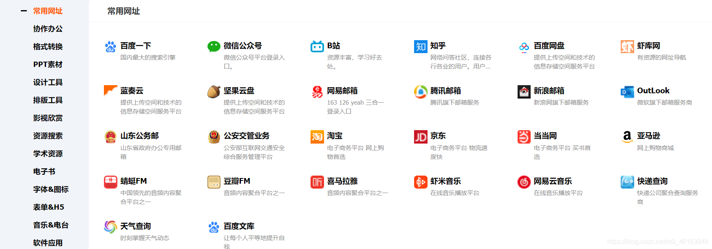
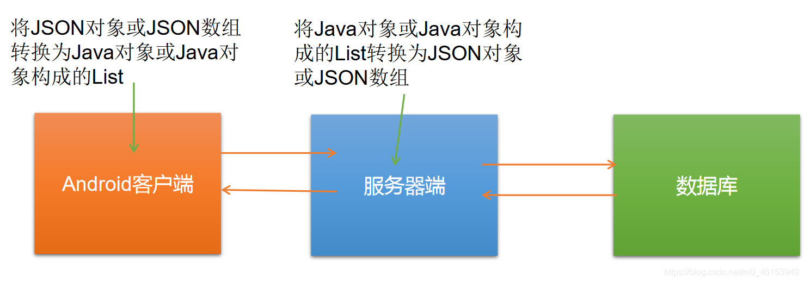
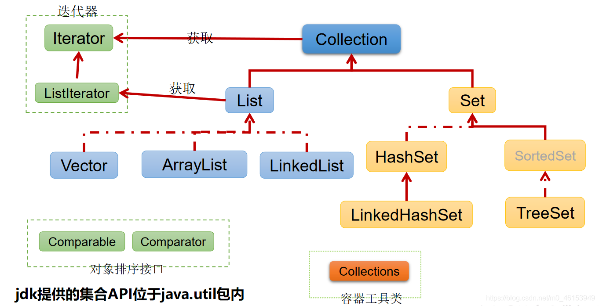
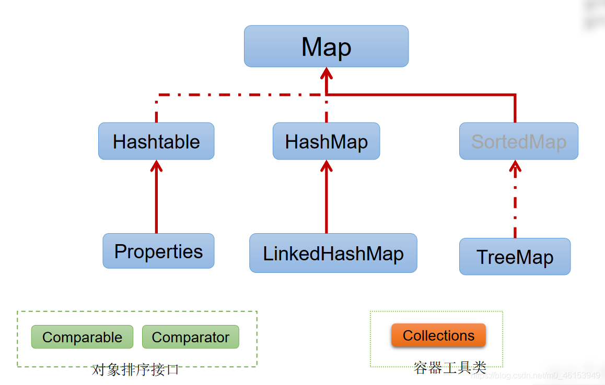

## 1.1、集合[框架](https://so.csdn.net/so/search?q=框架&spm=1001.2101.3001.7020)与数组的对比及概述

```java
/**
 * 一、集合的框架
 *
 * 1.集合、数组都是对多个数据进行存储操作的结构，简称Java容器。
 *   说明；此时的存储，主要是指能存层面的存储，不涉及到持久化的存储（.txt,.jpg,.avi,数据库中）
 *
 * 2.1数组在存储多个数据封面的特点：
 *      》一旦初始化以后，它的长度就确定了。
 *      》数组一旦定义好，它的数据类型也就确定了。我们就只能操作指定类型的数据了。
 *      比如：String[] arr;int[] str;
 * 2.2数组在存储多个数据方面的特点：
 *      》一旦初始化以后，其长度就不可修改。
 *      》数组中提供的方法非常有限，对于添加、删除、插入数据等操作，非常不便，同时效率不高。
 *      》获取数组中实际元素的个数的需求，数组没有现成的属性或方法可用
 *      》数组存储数据的特点：有序、可重复。对于无序、不可重复的需求，不能满足。
 *
 */
```

> 1、集合的使用场景





## 1.2、集合框架涉及到的[API](https://so.csdn.net/so/search?q=API&spm=1001.2101.3001.7020)

- Java 集合可分为

  ```
  Collection
  ```

  和

  ```
  Map
  ```

  两种体系

  - ```
    Collection
    ```

    接口：单列数据，定义了存取一组对象的方法的集合

    - `List`：元素有序、可重复的集合
    - `Set`：元素无序、不可重复的集合

  - `Map`接口：双列数据，保存具有映射关系“key-value对”的集合

> 1、**Collection接口继承树**




> 2、**Map接口继承树**




```java
/**
 *
 * 二、集合框架
 *      &---Collection接口：单列集合，用来存储一个一个的对象
 *          &---List接口：存储有序的、可重复的数据。  -->“动态”数组
 *              &---ArrayList、LinkedList、Vector
 *
 *          &---Set接口：存储无序的、不可重复的数据   -->高中讲的“集合”
 *              &---HashSet、LinkedHashSet、TreeSet
 *
 *      &---Map接口：双列集合，用来存储一对(key - value)一对的数据   -->高中函数：y = f(x)
 *          &---HashMap、LinkedHashMap、TreeMap、Hashtable、Properties
 *
 */
```