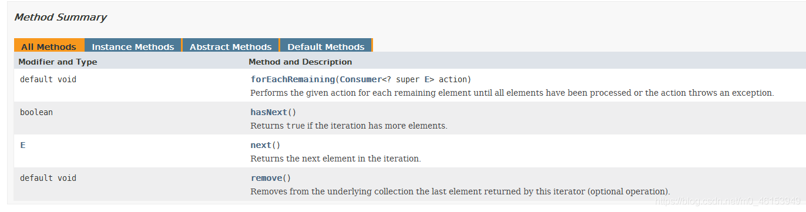
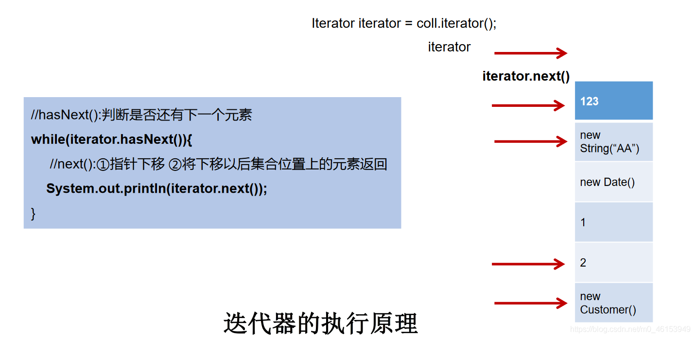
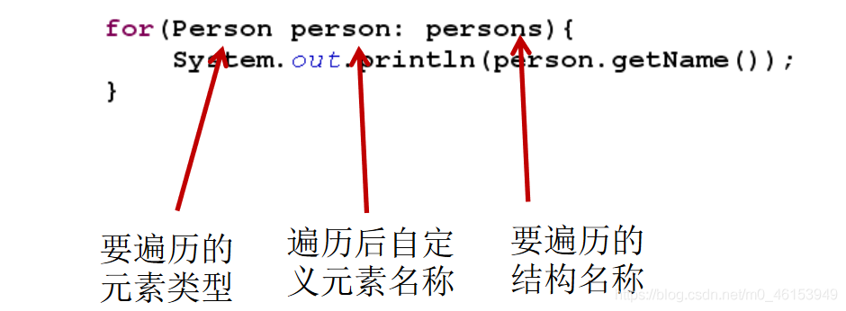

- Iterator对象称为迭代器(设计模式的一种)，主要用于遍历Collection 集合中的元素。
- GOF给迭代器模式的定义为：提供一种方法访问一个容器(container)对象中各个元素，而又不需暴露该对象的内部细节。 **迭代器模式，就是为容器而生** 。类似于“公交车上的售票员”、“火车上的乘务员”、“空姐”。
- Collection接口继承了java.lang.Iterable接口，该接口有一个iterator()方法，那么所有实现了Collection接口的集合类都有一个iterator()方法，用以返回一个实现了Iterator接口的对象。
- **Iterator 仅用于遍历集合** ，Iterator本身并不提供承装对象的能力。如果需要创建Iterator 对象，则必须有一个被迭代的集合。
- **集合对象每次调用iterator()方法都得到一个全新的迭代器对象** ，默认游标都在集合的第一个元素之前。




## 3.1、使用Iterator[遍历](https://so.csdn.net/so/search?q=遍历&spm=1001.2101.3001.7020)Collection

```java
import org.junit.Test;

import java.util.ArrayList;
import java.util.Collection;
import java.util.Iterator;

/**
 * 集合元素的遍历操作，使用迭代器Iterator接口
 * 内部的方法：hasNext()和 next()
 *
 */
public class IteratorTest { 

    @Test
    public void test(){ 
        Collection coll = new ArrayList();
        coll.add(123);
        coll.add(456);
        coll.add(new Person("Jerry",20));
        coll.add(new String("Tom"));
        coll.add(false);

        Iterator iterator = coll.iterator();

        //方式一：
//        System.out.println(iterator.next());
//        System.out.println(iterator.next());
//        System.out.println(iterator.next());
//        System.out.println(iterator.next());
//        System.out.println(iterator.next());
//        //报异常：NoSuchElementException
//        //因为：在调用it.next()方法之前必须要调用it.hasNext()进行检测。若不调用，且下一条记录无效，直接调用it.next()会抛出NoSuchElementException异常。
//        System.out.println(iterator.next());

        //方式二：不推荐
//        for(int i = 0;i < coll.size();i++){ 
//            System.out.println(iterator.next());
//        }

        //方式三：推荐
        while(iterator.hasNext()){ 
            System.out.println(iterator.next());
        }
    }
}
```

## 3.2、[迭代器](https://so.csdn.net/so/search?q=迭代器&spm=1001.2101.3001.7020)Iterator的执行原理




## 3.3、Iterator遍历集合的两种错误写法

```java
import org.junit.Test;

import java.util.ArrayList;
import java.util.Collection;
import java.util.Iterator;

/**
 * 集合元素的遍历操作，使用迭代器Iterator接口
 * 1.内部的方法：hasNext()和 next()
 * 2.集合对象每次调用iterator()方法都得到一个全新的迭代器对象，默认游标都在集合的第一个元素之前。
 */
public class IteratorTest { 

    @Test
    public void test2(){ 
        Collection coll = new ArrayList();
        coll.add(123);
        coll.add(456);
        coll.add(new Person("Jerry",20));
        coll.add(new String("Tom"));
        coll.add(false);

        //错误方式一：
//        Iterator iterator = coll.iterator();
//        while(iterator.next() != null){ 
//            System.out.println(iterator.next());
//        }

        //错误方式二：
        //集合对象每次调用iterator()方法都得到一个全新的迭代器对象，默认游标都在集合的第一个元素之前。
        while(coll.iterator().hasNext()){ 
            System.out.println(coll.iterator().next());
        }
    }
}
```

## 3.4、Iterator迭代器remove()的使用

```java
import org.junit.Test;

import java.util.ArrayList;
import java.util.Collection;
import java.util.Iterator;

/**
 * 集合元素的遍历操作，使用迭代器Iterator接口
 * 1.内部的方法：hasNext()和 next()
 * 2.集合对象每次调用iterator()方法都得到一个全新的迭代器对象，默认游标都在集合的第一个元素之前。
 * 3.内部定义了remove(),可以在遍历的时候，删除集合中的元素。此方法不同于集合直接调用remove()
 */
public class IteratorTest { 

    //测试Iterator中的remove()方法
    @Test
    public void test3(){ 
        Collection coll = new ArrayList();
        coll.add(123);
        coll.add(456);
        coll.add(new Person("Jerry",20));
        coll.add(new String("Tom"));
        coll.add(false);

        //删除集合中”Tom”
        //如果还未调用next()或在上一次调用 next 方法之后已经调用了 remove 方法，
        // 再调用remove都会报IllegalStateException。
        Iterator iterator = coll.iterator();
        while(iterator.hasNext()){ 
//            iterator.remove();
            Object obj = iterator.next();
            if("Tom".equals(obj)){ 
                iterator.remove();
//                iterator.remove();              
            }
        }

        //遍历集合
        iterator = coll.iterator();
        while(iterator.hasNext()){ 
            System.out.println(iterator.next());
        }

    }
}
```

> 注意：

- Iterator可以删除集合的元素，但是是遍历过程中通过迭代器对象的remove方法，不是集合对象的remove方法。
- **如果还未调用next()或在上一次调用next方法之后已经调用了remove方法，再调用remove都会报IllegalStateException** 。

## 3.5、新特性foreach循环遍历集合或数组

- Java 5.0 提供了foreach循环迭代访问Collection和数组。
- 遍历操作不需获取Collection或数组的长度，无需使用索引访问元素。
- 遍历集合的底层调用Iterator完成操作。
- foreach还可以用来遍历数组。




```java
import org.junit.Test;

import java.util.ArrayList;
import java.util.Collection;

/**
 * jdk 5.0 新增了foreach循环，用于遍历集合、数组
 *
 */
public class ForTest { 

    @Test
    public void test(){ 
        Collection coll = new ArrayList();
        coll.add(123);
        coll.add(456);
        coll.add(new Person("Jerry",20));
        coll.add(new String("Tom"));
        coll.add(false);

        //for(集合元素的类型 局部变量 : 集合对象),内部仍然调用了迭代器。
        for(Object obj : coll){ 
            System.out.println(obj);
        }
    }

    @Test
    public void test2(){ 
        int[] arr = new int[]{ 1,2,3,4,5,6};
        //for(数组元素的类型 局部变量 : 数组对象)
        for(int i : arr){ 
            System.out.println(i);
        }
    }

    //练习题
    @Test
    public void test3(){ 
        String[] arr = new String[]{ "SS","KK","RR"};

//        //方式一：普通for赋值
//        for(int i = 0;i < arr.length;i++){ 
//            arr[i] = "HH";
//        }

        //方式二：增强for循环
        for(String s : arr){ 
            s = "HH";
        }

        for(int i = 0;i < arr.length;i++){ 
            System.out.println(arr[i]);
        }
    }
}
```