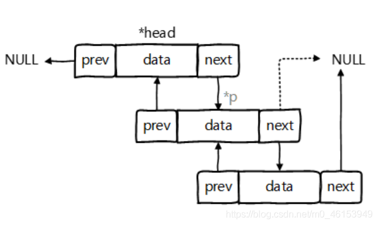

- 鉴于Java中数组用来存储数据的局限性，我们通常使用List替代数组
- List集合类中元素有序、且可重复，集合中的每个元素都有其对应的顺序索引。
- List容器中的元素都对应一个整数型的序号记载其在容器中的位置，可以根据序号存取容器中的元素。
- JDK API中List接口的实现类常用的有：ArrayList、LinkedList和Vector。

## 4.1、List接口常用实现类的对比

```java
/**
 * 1. List接口框架
 *
 *    |----Collection接口：单列集合，用来存储一个一个的对象
 *          |----List接口：存储有序的、可重复的数据。  -->“动态”数组,替换原有的数组
 *              |----ArrayList：作为List接口的主要实现类；线程不安全的，效率高；底层使用Object[] elementData存储
 *              |----LinkedList：对于频繁的插入、删除操作，使用此类效率比ArrayList高；底层使用双向链表存储
 *              |----Vector：作为List接口的古老实现类；线程安全的，效率低；底层使用Object[] elementData存储
 *
 *
 * 面试题：比较ArrayList、LinkedList、Vector三者的异同？
 *        同：三个类都是实现了List接口，存储数据的特点相同：存储有序的、可重复的数据
 *        不同：见上
 *
 */
```

## 4.2、ArrayList的源码分析

- ArrayList是List 接口的典型实现类、主要实现类
- 本质上，ArrayList是对象引用的一个”变长”数组

```java
/** 
 * 2.ArrayList的源码分析：
 *   2.1 jdk 7情况下
 *      ArrayList list = new ArrayList();//底层创建了长度是10的Object[]数组elementData
 *      list.add(123);//elementData[0] = new Integer(123);
 *      ...
 *      list.add(11);//如果此次的添加导致底层elementData数组容量不够，则扩容。
 *      默认情况下，扩容为原来的容量的1.5倍，同时需要将原有数组中的数据复制到新的数组中。
 *
 *      结论：建议开发中使用带参的构造器：ArrayList list = new ArrayList(int capacity)
 *
 *   2.2 jdk 8中ArrayList的变化：
 *      ArrayList list = new ArrayList();//底层Object[] elementData初始化为{}.并没有创建长度为10的数组
 *
 *      list.add(123);//第一次调用add()时，底层才创建了长度10的数组，并将数据123添加到elementData[0]
 *      ...
 *      后续的添加和扩容操作与jdk 7 无异。
 *   2.3 小结：jdk7中的ArrayList的对象的创建类似于单例的饿汉式，而jdk8中的ArrayList的对象
 *            的创建类似于单例的懒汉式，延迟了数组的创建，节省内存。
 * 
 */
```


## 4.3、LinkedList的源码分析

- 对于频繁的插入或删除元素的操作，建议使用LinkedList类，效率较高
- LinkedList：双向链表，内部没有声明数组，而是定义了Node类型的first和last，用于记录首末元素。同时，定义内部类Node，作为LinkedList中保存数据的基本结构。




```java
/**
  * 3.LinkedList的源码分析：
  *       LinkedList list = new LinkedList(); 内部声明了Node类型的first和last属性，默认值为null
  *       list.add(123);//将123封装到Node中，创建了Node对象。
  *
  *       其中，Node定义为：体现了LinkedList的双向链表的说法
  *       private static class Node<E> {
  *            E item;
  *            Node<E> next;
  *            Node<E> prev;
  *
  *            Node(Node<E> prev, E element, Node<E> next) {
  *            this.item = element;
  *            this.next = next;     //next变量记录下一个元素的位置
  *            this.prev = prev;     //prev变量记录前一个元素的位置
  *            }
  *        }
  */
```

## 4.4、Vector的源码分析

- Vector 是一个古老的集合，JDK1.0就有了。大多数操作与ArrayList相同，区别之处在于Vector是线程安全的。
- 在各种list中，最好把ArrayList作为缺省选择。当插入、删除频繁时，使用LinkedList；Vector总是比ArrayList慢，所以尽量避免使用。

```java
/** 
  * 4.Vector的源码分析：jdk7和jdk8中通过Vector()构造器创建对象时，底层都创建了长度为10的数组。
  *      在扩容方面，默认扩容为原来的数组长度的2倍。
  */ 
package com.hspedu.list_;

import java.util.Vector;

/**
 * @author 韩顺平
 * @version 1.0
 */
@SuppressWarnings({"all"})
public class Vector_ {
    public static void main(String[] args) {
        //无参构造器
        //有参数的构造
        Vector vector = new Vector(8);
        for (int i = 0; i < 10; i++) {
            vector.add(i);
        }
        vector.add(100);
        System.out.println("vector=" + vector);
        //老韩解读源码
        //1. new Vector() 底层
        /*
            public Vector() {
                this(10);
            }
         补充：如果是  Vector vector = new Vector(8);
            走的方法:
            public Vector(int initialCapacity) {
                this(initialCapacity, 0);
            }
         2. vector.add(i)
         2.1  //下面这个方法就添加数据到vector集合
            public synchronized boolean add(E e) {
                modCount++;
                ensureCapacityHelper(elementCount + 1);
                elementData[elementCount++] = e;
                return true;
            }
          2.2  //确定是否需要扩容 条件 ： minCapacity - elementData.length>0
            private void ensureCapacityHelper(int minCapacity) {
                // overflow-conscious code
                if (minCapacity - elementData.length > 0)
                    grow(minCapacity);
            }
          2.3 //如果 需要的数组大小 不够用，就扩容 , 扩容的算法
              //newCapacity = oldCapacity + ((capacityIncrement > 0) ?
              //                             capacityIncrement : oldCapacity);
              //就是扩容两倍.
            private void grow(int minCapacity) {
                // overflow-conscious code
                int oldCapacity = elementData.length;
                int newCapacity = oldCapacity + ((capacityIncrement > 0) ?
                                                 capacityIncrement : oldCapacity);
                if (newCapacity - minCapacity < 0)
                    newCapacity = minCapacity;
                if (newCapacity - MAX_ARRAY_SIZE > 0)
                    newCapacity = hugeCapacity(minCapacity);
                elementData = Arrays.copyOf(elementData, newCapacity);
            }
         */

    }
}
```

## 4.5、List接口中的常用方法测试

> List除了从Collection集合继承的方法外，List 集合里添加了一些根据索引来操作集合元素的方法。

- `void add(intindex, Object ele)`:在index位置插入ele元素
- `boolean addAll(int index, Collection eles)`:从index位置开始将eles中的所有元素添加进来
- `Object get(int index)`:获取指定index位置的元素
- `int indexOf(Object obj)`:返回obj在集合中首次出现的位置
- `int lastIndexOf(Object obj)`:返回obj在当前集合中末次出现的位置
- `Object remove(int index)`:移除指定index位置的元素，并返回此元素
- `Object set(int index, Object ele)`:设置指定index位置的元素为ele
- `List subList(int fromIndex, int toIndex)`:返回从fromIndex到toIndex位置的子集合

```java
import org.junit.Test;
import java.util.ArrayList;
import java.util.Arrays;
import java.util.Iterator;
import java.util.List;

/**
 *
 * 5.List接口的常用方法
 */
public class ListTest { 
    /**
     *
     * void add(int index, Object ele):在index位置插入ele元素
     * boolean addAll(int index, Collection eles):从index位置开始将eles中的所有元素添加进来
     * Object get(int index):获取指定index位置的元素
     * int indexOf(Object obj):返回obj在集合中首次出现的位置
     * int lastIndexOf(Object obj):返回obj在当前集合中末次出现的位置
     * Object remove(int index):移除指定index位置的元素，并返回此元素
     * Object set(int index, Object ele):设置指定index位置的元素为ele
     * List subList(int fromIndex, int toIndex):返回从fromIndex到toIndex位置的子集合
     *
     * 总结：常用方法
     * 增：add(Object obj)
     * 删：remove(int index) / remove(Object obj)
     * 改：set(int index, Object ele)
     * 查：get(int index)
     * 插：add(int index, Object ele)
     * 长度：size()
     * 遍历：① Iterator迭代器方式
     *      ② 增强for循环
     *      ③ 普通的循环
     *
     */

    @Test
    public void test3(){ 
        ArrayList list = new ArrayList();
        list.add(123);
        list.add(456);
        list.add("AA");

        //方式一：Iterator迭代器方式
        Iterator iterator = list.iterator();
        while(iterator.hasNext()){ 
            System.out.println(iterator.next());
        }

        System.out.println("***************");

        //方式二：增强for循环
        for(Object obj : list){ 
            System.out.println(obj);
        }

        System.out.println("***************");

        //方式三：普通for循环
        for(int i = 0;i < list.size();i++){ 
            System.out.println(list.get(i));
        }
    }

    @Test
    public void tets2(){ 
        ArrayList list = new ArrayList();
        list.add(123);
        list.add(456);
        list.add("AA");
        list.add(new Person("Tom",12));
        list.add(456);
        //int indexOf(Object obj):返回obj在集合中首次出现的位置。如果不存在，返回-1.
        int index = list.indexOf(4567);
        System.out.println(index);

        //int lastIndexOf(Object obj):返回obj在当前集合中末次出现的位置。如果不存在，返回-1.
        System.out.println(list.lastIndexOf(456));

        //Object remove(int index):移除指定index位置的元素，并返回此元素
        Object obj = list.remove(0);
        System.out.println(obj);
        System.out.println(list);

        //Object set(int index, Object ele):设置指定index位置的元素为ele
        list.set(1,"CC");
        System.out.println(list);

        //List subList(int fromIndex, int toIndex):返回从fromIndex到toIndex位置的左闭右开区间的子集合
        List subList = list.subList(2, 4);
        System.out.println(subList);
        System.out.println(list);
    }

    @Test
    public void test(){ 
        ArrayList list = new ArrayList();
        list.add(123);
        list.add(456);
        list.add("AA");
        list.add(new Person("Tom",12));
        list.add(456);

        System.out.println(list);

        //void add(int index, Object ele):在index位置插入ele元素
        list.add(1,"BB");
        System.out.println(list);

        //boolean addAll(int index, Collection eles):从index位置开始将eles中的所有元素添加进来
        List list1 = Arrays.asList(1, 2, 3);
        list.addAll(list1);
//        list.add(list1);
        System.out.println(list.size());//9

        //Object get(int index):获取指定index位置的元素
        System.out.println(list.get(2));

    }
}
```

## 4.6、List的一个面试小题

> 1、面试题1

请问ArrayList/LinkedList/Vector的异同？谈谈你的理解？ArrayList底层是什么？扩容机制？Vector和ArrayList的最大区别?

```java
   /**
     * 请问ArrayList/LinkedList/Vector的异同？谈谈你的理解？
     * ArrayList底层是什么？扩容机制？Vector和ArrayList的最大区别?
     * 
     * ArrayList和LinkedList的异同二者都线程不安全，相对线程安全的Vector，执行效率高。
     * 此外，ArrayList是实现了基于动态数组的数据结构，LinkedList基于链表的数据结构。
     * 对于随机访问get和set，ArrayList优于LinkedList，因为LinkedList要移动指针。
     * 对于新增和删除操作add(特指插入)和remove，LinkedList比较占优势，因为ArrayList要移动数据。
     * 
     * ArrayList和Vector的区别Vector和ArrayList几乎是完全相同的,
     * 唯一的区别在于Vector是同步类(synchronized)，属于强同步类。
     * 因此开销就比ArrayList要大，访问要慢。正常情况下,
     * 大多数的Java程序员使用ArrayList而不是Vector,
     * 因为同步完全可以由程序员自己来控制。Vector每次扩容请求其大小的2倍空间，
     * 而ArrayList是1.5倍。Vector还有一个子类Stack。
     */
```

> 2、面试题2

```java
import org.junit.Test;

import java.util.ArrayList;
import java.util.List;

public class ListEver { 
    /**
     * 区分List中remove(int index)和remove(Object obj)
     */

    @Test
    public void testListRemove() { 
        List list = new ArrayList();
        list.add(1);
        list.add(2);
        list.add(3);
        updateList(list);
        System.out.println(list);//
    }

    private void updateList(List list) { 
//        list.remove(2);
        list.remove(new Integer(2));
    }
}
```