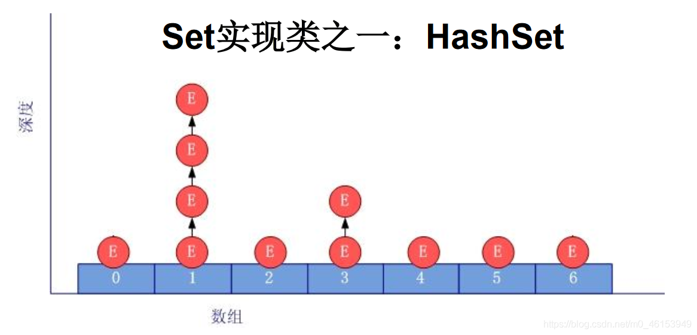
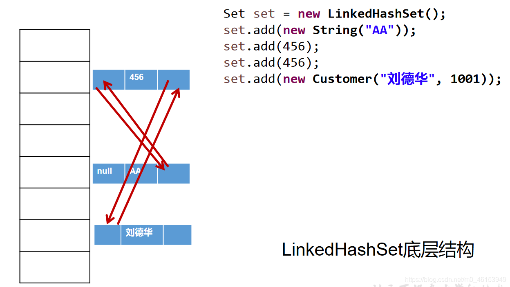
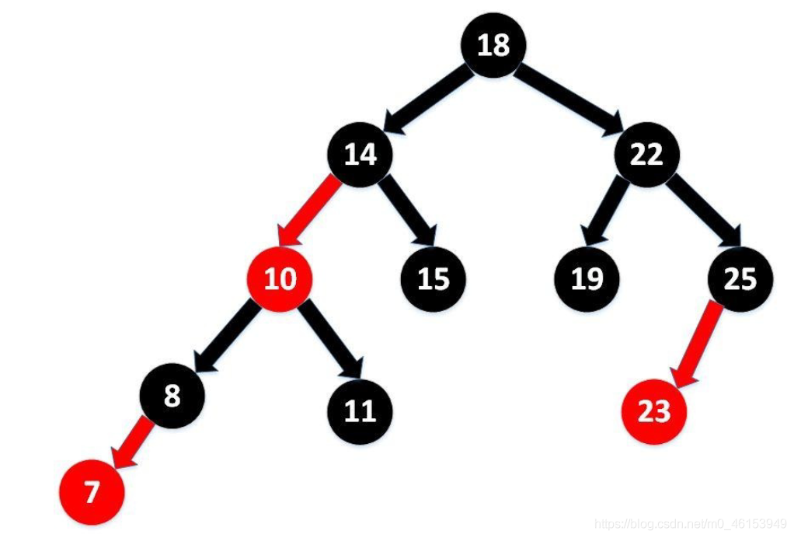
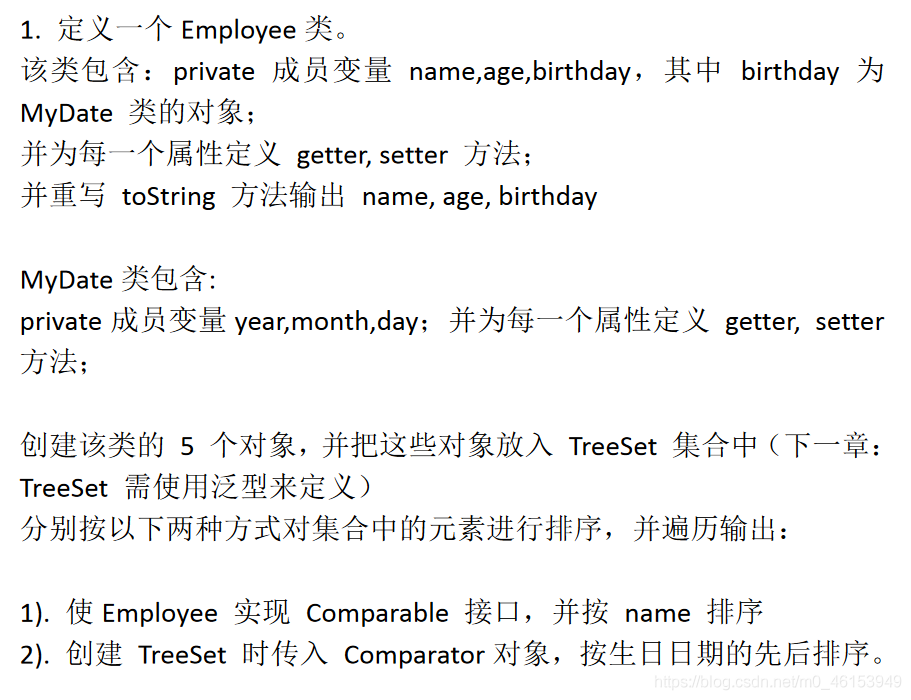

- Set接口是Collection的子接口，set接口没有提供额外的方法
- Set 集合不允许包含相同的元素，如果试把两个相同的元素加入同一个Set 集合中，则添加操作失败。
- **Set 判断两个对象是否相同不是使用****`==`***\*运算符，而是根据\****`equals()`****方法**

## 5.1、Set接口实现类的对比

```java
/**
 * 1.Set接口的框架：
 * |----Collection接口：单列集合，用来存储一个一个的对象
 *          |----Set接口：存储无序的、不可重复的数据   -->高中讲的“集合”
 *             |----HashSet：作为Set接口的主要实现类；线程不安全的；可以存储null值
 *                 |----LinkedHashSet：作为HashSet的子类；遍历其内部数据时，可以按照添加的顺序遍历
 *                                    对于频繁的遍历操作，LinkedHashSet效率高于HashSet.
 *             |----TreeSet：可以按照添加对象的指定属性，进行排序。
 */
```

## 5.2、Set的无序性与不可重复性的理解

> 1、测试类

```java
import org.junit.Test;

import java.util.HashSet;
import java.util.Iterator;
import java.util.Set;

/**
 *
 * 1.Set接口中没有定义额外的方法，使用的都是Collection中声明过的方法。
 *
 */
public class SetTest { 

    /**
     * 一、Set:存储无序的、不可重复的数据
     *      1.无序性：不等于随机性。存储的数据在底层数组中并非按照数组索引的顺序添加，而是根据数据的哈希值决定的。
     *
     *      2.不可重复性：保证添加的元素按照equals()判断时，不能返回true.即：相同的元素只能添加一个。
     *
     * 二、添加元素的过程：以HashSet为例：
     *
     *
     */
    @Test
    public void test(){ 
        Set set = new HashSet();
        set.add(123);
        set.add(456);
        set.add("fgd");
        set.add("book");
        set.add(new User("Tom",12));
        set.add(new User("Tom",12));
        set.add(129);

        Iterator iterator = set.iterator();
        while(iterator.hasNext()){ 
            System.out.println(iterator.next());
        }
    }
}
```

> 2、User类

```java
public class User{ 
    private String name;
    private int age;

    public User() { 
    }

    public User(String name, int age) { 
        this.name = name;
        this.age = age;
    }

    public String getName() { 
        return name;
    }

    public void setName(String name) { 
        this.name = name;
    }

    public int getAge() { 
        return age;
    }

    public void setAge(int age) { 
        this.age = age;
    }

    @Override
    public String toString() { 
        return "User{" +
                "name='" + name + '\'' +
                ", age=" + age +
                '}';
    }

    @Override
    public boolean equals(Object o) { 
        System.out.println("User equals()....");
        if (this == o) return true;
        if (o == null || getClass() != o.getClass()) return false;

        User user = (User) o;

        if (age != user.age) return false;
        return name != null ? name.equals(user.name) : user.name == null;
    }

    @Override
    public int hashCode() {  
        int result = name != null ? name.hashCode() : 0;
        result = 31 * result + age;
        return result;
    }
}
```

## 5.3、HashSet中元素的添加过程

- `HashSet`是`Set` 接口的典型实现，大多数时候使用Set 集合时都使用这个实现类。

- `HashSe`t按`Hash` 算法来存储集合中的元素，因此具有很好的存取、查找、删除性能。

- ```
  HashSet
  ```

  具有以下特点：不能保证元素的排列顺序

  - **`HashSet`****不是线程安全的**
  - **集合元素可以是****`null`**

- **底层也是数组，初始容量为16，当如果使用率超过0.75，（16\*0.75=12）就会扩大容量为原来的2倍。（16扩容为32，依次为64,128…等）**

- **`HashSet`**** 集合判断两个元素相等的标准：两个对象通过****`hashCode()`**** 方法比较相等，并且两个对象的****`equals()`****方法返回值也相等。**

- 对于存放在`Set`容器中的对象，对应的类一定要重写`equals()`和`hashCode(Object obj)`方法，以实现对象相等规则。即：“ **相等的对象必须具有相等的散列码** ”。

```java
/**
     * 一、Set:存储无序的、不可重复的数据
     *      1.无序性：不等于随机性。存储的数据在底层数组中并非按照数组索引的顺序添加，而是根据数据的哈希值决定的。
     *
     *      2.不可重复性：保证添加的元素按照equals()判断时，不能返回true.即：相同的元素只能添加一个。
     *
     * 二、添加元素的过程：以HashSet为例：
     *      我们向HashSet中添加元素a,首先调用元素a所在类的hashCode()方法，计算元素a的哈希值，
     *      此哈希值接着通过某种算法计算出在HashSet底层数组中的存放位置（即为：索引位置），判断
     *      数组此位置上是否已经有元素：
     *          如果此位置上没有其他元素，则元素a添加成功。 --->情况1
     *          如果此位置上有其他元素b(或以链表形式存在的多个元素），则比较元素a与元素b的hash值：
     *              如果hash值不相同，则元素a添加成功。--->情况2
     *              如果hash值相同，进而需要调用元素a所在类的equals()方法：
     *                    equals()返回true,元素a添加失败
     *                    equals()返回false,则元素a添加成功。--->情况2
     *
     *      对于添加成功的情况2和情况3而言：元素a 与已经存在指定索引位置上数据以链表的方式存储。
     *      jdk 7 :元素a放到数组中，指向原来的元素。
     *      jdk 8 :原来的元素在数组中，指向元素a
     *      总结：七上八下
     *
     * HashSet底层：数组+链表的结构。
     *
     */
```




## 5.4、关于hashCode()和equals()的重写

### 5.4.1、重写hashCode() 方法的基本原则

- 在程序运行时，同一个对象多次调用`hashCode()`方法应该返回相同的值。
- 当两个对象的`equals()`方法比较返回`true`时，这两个对象的`hashCode()`方法的返回值也应相等。
- 对象中用作`equals()` 方法比较的`Field`，都应该用来计算`hashCode`值。

### 5.4.2、重写equals() 方法的基本原则

> 以自定义的Customer类为例，何时需要重写equals()？

- 当一个类有自己特有的“逻辑相等”概念,当改写equals()的时候，总是要改写`hashCode()`，根据一个类的`equals`方法（改写后），两个截然不同的实例有可能在逻辑上是相等的，但是，根据`Object.hashCode()`方法，它们仅仅是两个对象。
- 因此，违反了“ **相等的对象必须具有相等的散列码** ”。
- 结论：复写`equals`方法的时候一般都需要同时复写`hashCode`方法。通常参与计算`hashCod`e的对象的属性也应该参与到`equals()`中进行计算。

### 5.4.3、Eclipse/IDEA工具里hashCode()的重写

> 以Eclipse/IDEA为例，在自定义类中可以调用工具自动重写equals和hashCode。问题：为什么用Eclipse/IDEA复写hashCode方法，有31这个数字？

- 选择系数的时候要选择尽量大的系数。因为如果计算出来的hash地址越大，所谓的“冲突”就越少，查找起来效率也会提高。（减少冲突）
- 并且31只占用5bits,相乘造成数据溢出的概率较小。
- 31可以由i*31== (i<<5)-1来表示,现在很多虚拟机里面都有做相关优化。（提高算法效率）
- 31是一个素数，素数作用就是如果我用一个数字来乘以这个素数，那么最终出来的结果只能被素数本身和被乘数还有1来整除！(减少冲突)

```java
/**
  * 2.要求：向Set(主要指：HashSet、LinkedHashSet)中添加的数据，其所在的类一定要重写hashCode()和equals()
  *   要求：重写的hashCode()和equals()尽可能保持一致性：相等的对象必须具有相等的散列码
  *        重写两个方法的小技巧：对象中用作 equals() 方法比较的 Field，都应该用来计算 hashCode 值。
 */
```

## 5.5、LinkedHashSet的使用

- `LinkedHashSet`是`HashSet`的子类
- `LinkedHashSet`根据元素的`hashCode`值来决定元素的存储位置，但它同时使用双向链表维护元素的次序，这使得元素看起来是以**插入顺序保存**的。
- **`LinkedHashSet`\**\*\*插入性能略低于\*\**\*`HashSet`** ，但在迭代访问Set 里的全部元素时有很好的性能。
- LinkedHashSet不允许集合元素重复。




> 1、测试类

```java
import org.junit.Test;

import java.util.Iterator;
import java.util.LinkedHashSet;
import java.util.Set;

public class SetTest { 

    /**
     * LinkedHashSet的使用
     * LinkedHashSet作为HashSet的子类，在添加数据的同时，每个数据还维护了两个引用，记录此数据前一个
     * 数据和后一个数据。
     * 优点：对于频繁的遍历操作，LinkedHashSet效率高于HashSet
     */
    @Test
    public void test2(){ 
        Set set = new LinkedHashSet();
        set.add(456);
        set.add(123);
        set.add(123);
        set.add("AA");
        set.add("CC");
        set.add(new User("Tom",12));
        set.add(new User("Tom",12));
        set.add(129);

        Iterator iterator = set.iterator();
        while(iterator.hasNext()){ 
            System.out.println(iterator.next());
        }
    }
}
```

> 2、User类

```java
public class User{ 
    private String name;
    private int age;

    public User() { 
    }

    public User(String name, int age) { 
        this.name = name;
        this.age = age;
    }

    public String getName() { 
        return name;
    }

    public void setName(String name) { 
        this.name = name;
    }

    public int getAge() { 
        return age;
    }

    public void setAge(int age) { 
        this.age = age;
    }

    @Override
    public String toString() { 
        return "User{" +
                "name='" + name + '\'' +
                ", age=" + age +
                '}';
    }

    @Override
    public boolean equals(Object o) { 
        System.out.println("User equals()....");
        if (this == o) return true;
        if (o == null || getClass() != o.getClass()) return false;

        User user = (User) o;

        if (age != user.age) return false;
        return name != null ? name.equals(user.name) : user.name == null;
    }

    @Override
    public int hashCode() {  //return name.hashCode() + age;
        int result = name != null ? name.hashCode() : 0;
        result = 31 * result + age;
        return result;
    }
}
```

## 5.6、TreeSet的自然排序

- `TreeSet`是`SortedSet`接口的实现类，`TreeSet`可以确保集合元素处于排序状态。

- `TreeSet`底层使用**红黑树**结构存储数据

- 新增的方法如下：(了解)

  - `Comparator comparator()`
  - `Object first()`
  - `Object last()`
  - `Object lower(Object e)`
  - `Object higher(Object e)`
  - `SortedSet subSet(fromElement, toElement)`
  - `SortedSet headSet(toElement)`
  - `SortedSet tailSet(fromElement)`

- `TreeSet`两种排序方法： **自然排序和定制排序** 。默认情况下，`TreeSet`采用自然排序。

- `TreeSet`和后面要讲的`TreeMap`采用红黑树的存储结构

- 特点：有序，查询速度比`List`快

- **自然排序** ：`TreeSet`会调用集合元素的`compareTo(Object obj)`方法来比较元素之间的大小关系，然后将集合元素按升序(默认情况)排列。

- 如果试图把一个对象添加到TreeSet时，则该对象的类必须实现Comparable 接口

   。

  - 实现`Comparable` 的类必须实现`compareTo(Object obj)`方法，两个对象即通过`compareTo(Object obj)`方法的返回值来比较大小。

- ```
  Comparable
  ```

   的典型实现：

  - `BigDecimal、BigInteger`以及所有的数值型对应的包装类：按它们对应的数值大小进行比较
  - `Character`：按字符的unicode值来进行比较
  - `Boolean`：true 对应的包装类实例大于false 对应的包装类实例
  - `String`：按字符串中字符的unicode 值进行比较
  - `Date、Time`：后边的时间、日期比前面的时间、日期大

- `向TreeSet`中添加元素时，只有第一个元素无须比较`compareTo()`方法，后面添加的所有元素都会调用`compareTo()`方法进行比较。

- **因为只有相同类的两个实例才会比较大小，所以向****`TreeSet`****中添加的应该是同一个类的对象** 。

- 对于`TreeSet`集合而言，它**判断两个对象是否相等的唯一标准**是：两个对象通过`compareTo(Object obj)`方法比较返回值。

- 当需要把一个对象放入`TreeSet`中，重写该对象对应的`equals()`方法时，应保证该方法与`compareTo(Object obj)` 方法有一致的结果：如果两个对象通过`equals()`方法比较返回true，则通过`compareTo(Object obj)`方法比较应返回0。否则，让人难以理解。

> 红黑树




> 1、测试类

```java
import org.junit.Test;

import java.util.Iterator;
import java.util.TreeSet;

/**
 * 1.向TreeSet中添加的数据，要求是相同类的对象。
 * 2.两种排序方式：自然排序（实现Comparable接口） 和 定制排序（Comparator）
 * 3.自然排序中，比较两个对象是否相同的标准为：compareTo()返回0.不再是equals().
 * 4.定制排序中，比较两个对象是否相同的标准为：compare()返回0.不再是equals().
 */
public class TreeSetTest { 

    @Test
    public void test() { 
        TreeSet set = new TreeSet();

        //失败：不能添加不同类的对象
//        set.add(123);
//        set.add(456);
//        set.add("AA");
//        set.add(new User("Tom",12));

        //举例一：
//        set.add(34);
//        set.add(-34);
//        set.add(43);
//        set.add(11);
//        set.add(8);

        //举例二：
        set.add(new User("Tom",12));
        set.add(new User("Jerry",32));
        set.add(new User("Jim",2));
        set.add(new User("Mike",65));
        set.add(new User("Jack",33));
        set.add(new User("Jack",56));

        Iterator iterator = set.iterator();
        while(iterator.hasNext()){ 
            System.out.println(iterator.next());
        }
    }
}
```

> 2、User类

```java
public class User implements Comparable{ 
    private String name;
    private int age;

    public User() { 
    }

    public User(String name, int age) { 
        this.name = name;
        this.age = age;
    }

    public String getName() { 
        return name;
    }

    public void setName(String name) { 
        this.name = name;
    }

    public int getAge() { 
        return age;
    }

    public void setAge(int age) { 
        this.age = age;
    }

    @Override
    public String toString() { 
        return "User{" +
                "name='" + name + '\'' +
                ", age=" + age +
                '}';
    }

    @Override
    public boolean equals(Object o) { 
        System.out.println("User equals()....");
        if (this == o) return true;
        if (o == null || getClass() != o.getClass()) return false;

        User user = (User) o;

        if (age != user.age) return false;
        return name != null ? name.equals(user.name) : user.name == null;
    }

    @Override
    public int hashCode() {  //return name.hashCode() + age;
        int result = name != null ? name.hashCode() : 0;
        result = 31 * result + age;
        return result;
    }

    //按照姓名从大到小排列,年龄从小到大排列
    @Override
    public int compareTo(Object o) { 
        if (o instanceof User) { 
            User user = (User) o;
//            return this.name.compareTo(user.name);  //按照姓名从小到大排列
//            return -this.name.compareTo(user.name);  //按照姓名从大到小排列
            int compare = -this.name.compareTo(user.name);  //按照姓名从大到小排列
            if(compare != 0){    //年龄从小到大排列
                return compare;
            }else{ 
                return Integer.compare(this.age,user.age);
            }
        } else { 
            throw new RuntimeException("输入的类型不匹配");
        }
    }
}
```

## 5.7、TreeSet的定制排序

- `TreeSet`的**自然排序**要求元素所属的类实现`Comparable`接口，如果元素所属的类没有实现`Comparable`接口，或不希望按照升序(默认情况)的方式排列元素或希望按照其它属性大小进行排序，则考虑使用定制排序。定制排序，通过`Comparator`接口来实现。需要重写`compare(T o1,T o2`)方法。
- 利用`int compare(T o1,T o2)`方法，比较o1和o2的大小：如果方法返回正整数，则表示o1大于o2；如果返回0，表示相等；返回负整数，表示o1小于o2。
- 要实现 **定制排序** ，需要将实现`Comparator`接口的实例作为形参传递给`TreeSe`t的构造器。
- 此时，仍然只能向`TreeSet`中添加类型相同的对象。否则发生`ClassCastException`异常。
- 使用定制排序判断两个元素相等的标准是：通过Comparator比较两个元素返回了0。

> 1、测试类

```java
import org.junit.Test;

import java.util.Comparator;
import java.util.Iterator;
import java.util.TreeSet;

/**
 * 1.向TreeSet中添加的数据，要求是相同类的对象。
 * 2.两种排序方式：自然排序（实现Comparable接口） 和 定制排序（Comparator）
 * 3.自然排序中，比较两个对象是否相同的标准为：compareTo()返回0.不再是equals().
 * 4.定制排序中，比较两个对象是否相同的标准为：compare()返回0.不再是equals().
 */
public class TreeSetTest { 

    @Test
    public void tets2(){ 
        Comparator com = new Comparator() { 
            //按照年龄从小到大排列
            @Override
            public int compare(Object o1, Object o2) { 
                if(o1 instanceof User && o2 instanceof User){ 
                    User u1 = (User)o1;
                    User u2 = (User)o2;
                    return Integer.compare(u1.getAge(),u2.getAge());
                }else{ 
                    throw new RuntimeException("输入的数据类型不匹配");
                }
            }
        };

        TreeSet set = new TreeSet(com);
        set.add(new User("Tom",12));
        set.add(new User("Jerry",32));
        set.add(new User("Jim",2));
        set.add(new User("Mike",65));
        set.add(new User("Mary",33));
        set.add(new User("Jack",33));
        set.add(new User("Jack",56));


        Iterator iterator = set.iterator();
        while(iterator.hasNext()){ 
            System.out.println(iterator.next());
        }
    }
}
```

> 2、User类

```java
public class User implements Comparable{ 
    private String name;
    private int age;

    public User() { 
    }

    public User(String name, int age) { 
        this.name = name;
        this.age = age;
    }

    public String getName() { 
        return name;
    }

    public void setName(String name) { 
        this.name = name;
    }

    public int getAge() { 
        return age;
    }

    public void setAge(int age) { 
        this.age = age;
    }

    @Override
    public String toString() { 
        return "User{" +
                "name='" + name + '\'' +
                ", age=" + age +
                '}';
    }

    @Override
    public boolean equals(Object o) { 
        System.out.println("User equals()....");
        if (this == o) return true;
        if (o == null || getClass() != o.getClass()) return false;

        User user = (User) o;

        if (age != user.age) return false;
        return name != null ? name.equals(user.name) : user.name == null;
    }

    @Override
    public int hashCode() {  //return name.hashCode() + age;
        int result = name != null ? name.hashCode() : 0;
        result = 31 * result + age;
        return result;
    }

    //按照姓名从大到小排列,年龄从小到大排列
    @Override
    public int compareTo(Object o) { 
        if (o instanceof User) { 
            User user = (User) o;
//            return this.name.compareTo(user.name);  //按照姓名从小到大排列
//            return -this.name.compareTo(user.name);  //按照姓名从大到小排列
            int compare = -this.name.compareTo(user.name);  //按照姓名从大到小排列
            if(compare != 0){    //年龄从小到大排列
                return compare;
            }else{ 
                return Integer.compare(this.age,user.age);
            }
        } else { 
            throw new RuntimeException("输入的类型不匹配");
        }
    }
}
```

## 5.8、TreeSet的课后练习




> 1、MyDate类

```java
/**
 * MyDate类包含:
 * private成员变量year,month,day；并为每一个属性定义getter,  setter 方法；
 */
public class MyDate implements Comparable{ 
    private int year;
    private int month;
    private int day;

    public int getYear() { 
        return year;
    }

    public void setYear(int year) { 
        this.year = year;
    }

    public int getMonth() { 
        return month;
    }

    public void setMonth(int month) { 
        this.month = month;
    }

    public int getDay() { 
        return day;
    }

    public void setDay(int day) { 
        this.day = day;
    }

    public MyDate() { 
    }

    public MyDate(int year, int month, int day) { 
        this.year = year;
        this.month = month;
        this.day = day;
    }

    @Override
    public String toString() { 
        return "MyDate{" +
                "year=" + year +
                ", month=" + month +
                ", day=" + day +
                '}';
    }

    @Override
    public int compareTo(Object o) { 
        if(o instanceof MyDate){ 
            MyDate m = (MyDate)o;

            //比较年
            int minusYear = this.getYear() - m.getYear();
            if(minusYear != 0){ 
                return minusYear;
            }
            //比较月
            int minusMonth = this.getMonth() - m.getMonth();
            if(minusMonth != 0){ 
                return minusMonth;
            }
            //比较日
            return this.getDay() - m.getDay();
        }

        throw new RuntimeException("传入的数据类型不一致！");

    }
}
```

> 2、Employee类

```java
/**
 * 定义一个Employee类。
 * 该类包含：private成员变量name,age,birthday，
 * 其中birthday 为MyDate 类的对象；
 * 并为每一个属性定义getter, setter 方法；
 * 并重写toString 方法输出name, age, birthday
 */
public class Employee implements Comparable{ 
    private String name;
    private int age;
    private MyDate birthday;

    public String getName() { 
        return name;
    }

    public void setName(String name) { 
        this.name = name;
    }

    public int getAge() { 
        return age;
    }

    public void setAge(int age) { 
        this.age = age;
    }

    public MyDate getBirthday() { 
        return birthday;
    }

    public void setBirthday(MyDate birthday) { 
        this.birthday = birthday;
    }

    public Employee() { 
    }

    public Employee(String name, int age, MyDate birthday) { 
        this.name = name;
        this.age = age;
        this.birthday = birthday;
    }

    @Override
    public String toString() { 
        return "Employee{" +
                "name='" + name + '\'' +
                ", age=" + age +
                ", birthday=" + birthday +
                '}';
    }

    //按name排序
    @Override
    public int compareTo(Object o){ 
        if(o instanceof Employee){ 
            Employee e = (Employee)o;
            return this.name.compareTo(e.name);
        }
//        return 0;
        throw new RuntimeException("传入的数据类型不一致");
    }
}
```

> 3、测试类

```java
import org.junit.Test;

import java.util.Comparator;
import java.util.Iterator;
import java.util.TreeSet;

/**
 * 创建该类的5 个对象，并把这些对象放入TreeSet 集合中
 * （下一章：TreeSet 需使用泛型来定义）分别按以下两种方式
 * 对集合中的元素进行排序，并遍历输出：
 *
 * 1). 使Employee 实现Comparable 接口，并按name 排序
 * 2). 创建TreeSet 时传入Comparator对象，按生日日期的先后排序。
 */
public class EmployeeTest { 

    //问题二：按生日日期的先后排序
    @Test
    public void test2(){ 
        TreeSet set = new TreeSet(new Comparator() { 
            @Override
            public int compare(Object o1, Object o2) { 
                if(o1 instanceof Employee && o2 instanceof Employee){ 
                    Employee e1 = (Employee)o1;
                    Employee e2 = (Employee)o2;

                    MyDate b1 = e1.getBirthday();
                    MyDate b2 = e2.getBirthday();

                    //方式一：
//                    //比较年
//                    int minusYear = b1.getYear() - b2.getYear();
//                    if(minusYear != 0){ 
//                        return minusYear;
//                    }
//
//                    //比较月
//                    int minusMonth = b1.getMonth() - b2.getMonth();
//                    if(minusMonth != 0){ 
//                        return minusMonth;
//                    }
//
//                    //比较日
//                    return b1.getDay() - b2.getDay();

                    //方式二：
                    return b1.compareTo(b2);
                }
//                return 0;
                throw new RuntimeException("传入的数据类型不一致！");
            }
        });

        Employee e1 = new Employee("wangxianzhi",41,new MyDate(334,5,4));
        Employee e2 = new Employee("simaqian",43,new MyDate(-145,7,12));
        Employee e3 = new Employee("yanzhenqin",44,new MyDate(709,5,9));
        Employee e4 = new Employee("zhangqian",51,new MyDate(-179,8,12));
        Employee e5 = new Employee("quyuan",21,new MyDate(-340,12,4));

        set.add(e1);
        set.add(e2);
        set.add(e3);
        set.add(e4);
        set.add(e5);

        Iterator iterator = set.iterator();
        while (iterator.hasNext()){ 
            System.out.println(iterator.next());
        }
    }

    //问题一：使用自然排序
    @Test
    public void test(){ 
        TreeSet set = new TreeSet();

        Employee e1 = new Employee("wangxianzhi",41,new MyDate(334,5,4));
        Employee e2 = new Employee("simaqian",43,new MyDate(-145,7,12));
        Employee e3 = new Employee("yanzhenqin",44,new MyDate(709,5,9));
        Employee e4 = new Employee("zhangqian",51,new MyDate(-179,8,12));
        Employee e5 = new Employee("quyuan",21,new MyDate(-340,12,4));

        set.add(e1);
        set.add(e2);
        set.add(e3);
        set.add(e4);
        set.add(e5);

        Iterator iterator = set.iterator();
        while (iterator.hasNext()){ 
            System.out.println(iterator.next());
        }
    }
}
```

## 5.9、Set课后两道面试题

> 练习：在List内去除重复数字值，要求尽量简单

```java
import org.junit.Test;

import java.util.ArrayList;
import java.util.Collection;
import java.util.HashSet;
import java.util.List;

public class CollectionTest { 

    //练习：在List内去除重复数字值，要求尽量简单
    public static List duplicateList(List list) { 
        HashSet set = new HashSet();
        set.addAll(list);
        return new ArrayList(set);
    }
    @Test
    public void test2(){ 
        List list = new ArrayList();
        list.add(new Integer(1));
        list.add(new Integer(2));
        list.add(new Integer(2));
        list.add(new Integer(4));
        list.add(new Integer(4));
        List list2 = duplicateList(list);
        for (Object integer : list2) { 
            System.out.println(integer);
        }
    }
}
```

> 2、面试题

```java
import org.junit.Test;

import java.util.ArrayList;
import java.util.Collection;
import java.util.HashSet;
import java.util.List;

public class CollectionTest { 

    @Test
    public void test3(){ 
        HashSet set = new HashSet();
        Person p1 = new Person(1001,"AA");
        Person p2 = new Person(1002,"BB");

        set.add(p1);
        set.add(p2);
        System.out.println(set);

        p1.name = "CC";
        set.remove(p1);
        System.out.println(set);
        set.add(new Person(1001,"CC"));
        System.out.println(set);
        set.add(new Person(1001,"AA"));
        System.out.println(set);

    }
}
```

> Person类

```java
public class Person { 

    int id;
    String name;

    public Person(int id, String name) { 
        this.id = id;
        this.name = name;
    }

    public Person() { 

    }

    @Override
    public String toString() { 
        return "Person{" +
                "id=" + id +
                ", name='" + name + '\'' +
                '}';
    }

    @Override
    public boolean equals(Object o) { 
        if (this == o) return true;
        if (o == null || getClass() != o.getClass()) return false;

        Person person = (Person) o;

        if (id != person.id) return false;
        return name != null ? name.equals(person.name) : person.name == null;
    }

    @Override
    public int hashCode() { 
        int result = id;
        result = 31 * result + (name != null ? name.hashCode() : 0);
        return result;
    }
}
```