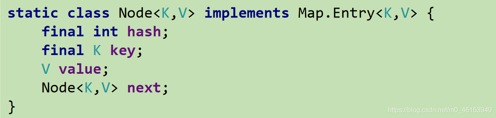
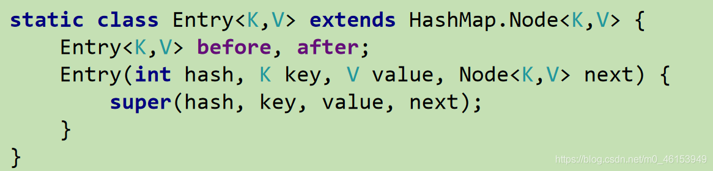

## 6.1、Map接口及其多个实现类的对比

```java
import org.junit.Test;

import java.util.HashMap;
import java.util.Map;

/**
 * 一、Map的实现类的结构：
 *  |----Map:双列数据，存储key-value对的数据   ---类似于高中的函数：y = f(x)
 *         |----HashMap:作为Map的主要实现类；线程不安全的，效率高；存储null的key和value
 *              |----LinkedHashMap:保证在遍历map元素时，可以按照添加的顺序实现遍历。
 *                      原因：在原有的HashMap底层结构基础上，添加了一对指针，指向前一个和后一个元素。
 *                      对于频繁的遍历操作，此类执行效率高于HashMap。
 *         |----TreeMap:保证按照添加的key-value对进行排序，实现排序遍历。此时考虑key的自然排序或定制排序
 *                      底层使用红黑树
 *         |----Hashtable:作为古老的实现类；线程安全的，效率低；不能存储null的key和value
 *              |----Properties:常用来处理配置文件。key和value都是String类型
 *
 *
 *      HashMap的底层：数组+链表  （jdk7及之前）
 *                    数组+链表+红黑树 （jdk 8）
 *
 *  面试题：
 *  1. HashMap的底层实现原理？
 *  2. HashMap 和 Hashtable的异同？
 *  3. CurrentHashMap 与 Hashtable的异同？（暂时不讲）
 *
 */
public class MapTest { 
    @Test
    public void test(){ 
        Map map = new HashMap();
//        map = new Hashtable();
        map.put(null,123);
    }
}
```

## 6.2、Map中存储的key-value的特点

- `Map`与`Collection`并列存在。用于保存具有映射关系的数据:`key-value`
- `Map`中的`key`和`value`都可以是任何引用类型的数据
- `Map` 中的`key` 用`Set`来存放，不允许重复，即同一个`Map` 对象所对应的类，须重写`hashCode()`和`equals()`方法
- 常用`String`类作为`Ma`p的“键”
- `key`和`value`之间存在单向一对一关系，即通过指定的`key`总能找到唯一的、确定的`value`
- `Map`接口的常用实现类：`HashMap、TreeMap、LinkedHashMap`和`Properties`。其中，`HashMap`是`Map`接口使用频率最高的实现类


```java
 /**
   *  二、Map结构的理解：
   *    Map中的key:无序的、不可重复的，使用Set存储所有的key  ---> key所在的类要重写equals()和hashCode() （以HashMap为例）
   *    Map中的value:无序的、可重复的，使用Collection存储所有的value --->value所在的类要重写equals()
   *    一个键值对：key-value构成了一个Entry对象。
   *    Map中的entry:无序的、不可重复的，使用Set存储所有的entry
   *
   */   
```

## 6.3、Map实现类之一：HashMap

- **`HashMap`***\*是\****`Map`****接口使用频率最高的实现类** 。
- 允许使用`null`键和`null`值，与`HashSet`一样，不保证映射的顺序。
- 所有的`key`构成的集合是`Set`:无序的、不可重复的。所以，`key`所在的类要重写：`equals()`和`hashCode()`
- 所有的`value`构成的集合是`Collection`:无序的、可以重复的。所以，`value`所在的类要重写：`equals()`
- 一个`key-value`构成一个`entry`
- 所有的`entry`构成的集合是`Set`:无序的、不可重复的
- `HashMap`判断两个`key`相等的标准是：两个`key`通过`equals()`方法返回`true`，`hashCode`值也相等。
- `HashMap`判断两个`value`相等的标准是：两个`value` 通过`equals()`方法返回`true`。

## 6.4、HashMap的底层实现原理

> **JDK 7及以前版本：HashMap是数组+链表结构(即为链地址法)** **JDK 8版本发布以后：HashMap是数组+链表+红黑树实现。**


> 流程示意图


> HashMap源码中的重要常量

```java
/*
 *      static final int DEFAULT_INITIAL_CAPACITY = 1 << 4; : HashMap的默认容量，16
 *      static final int MAXIMUM_CAPACITY = 1 << 30; : 最大容量
 *      DEFAULT_LOAD_FACTOR：HashMap的默认加载因子：0.75
 *      threshold：扩容的临界值，=容量*填充因子：16 * 0.75 => 12
 *      TREEIFY_THRESHOLD：Bucket中链表长度大于该默认值，转化为红黑树:8
 *      MIN_TREEIFY_CAPACITY：桶中的Node被树化时最小的hash表容量:64
*/
```

### 6.4.1、HashMap在JDK7中的底层实现原理

- `HashMap的`内部存储结构其实是 **数组和链表的结合** 。当实例化一个`HashMap`时，系统会创建一个长度为`Capacity`的`Entry`数组，这个长度在哈希表中被称为容量(`Capacity`)，在这个数组中可以存放元素的位置我们称之为“桶”(`bucket`)，每个`bucket`都有自己的索引，系统可以根据索引快速的查找`bucket`中的元素。
- 每个`bucket`中存储一个元素，即一个`Entry`对象，但每一个`Entry`对象可以带一个引用变量，用于指向下一个元素，因此，在一个桶中，就有可能生成一个`Entry`链。而且新添加的元素作为链表的`head`。
- 添加元素的过程：
  - 向`HashMap`中添加`entry1(key，value)`，需要首先计算`entry1`中`key`的哈希值(根据`key`所在类的`hashCode()`计算得到)，此哈希值经过处理以后，得到在底层`Entry[]`数组中要存储的位置`i`。
  - 如果位置`i`上没有元素，则`entry1`直接添加成功。
  - 如果位置`i`上已经存在`entry2`(或还有链表存在的`entry3，entry4`)，则需要通过循环的方法，依次比较`entry1`中`key`的`hash`值和其他的`entry`的`hash`值。
  - 如果彼此`hash`值不同，则直接添加成功。
  - 如果`hash`值相同，继续比较二者是否`equals`。如果返回值为`true`，则使用`entry1`的`value`去替换`equals`为`true`的`entry`的`value`。
  - 如果遍历一遍以后，发现所有的`equals`返回都为`false`,则`entry1`仍可添加成功。`entry1`指向原有的`entry`元素。

```java
/*
 * 三、HashMap的底层实现原理？以jdk7为例说明：
 *    HashMap map = new HashMap():
 *    在实例化以后，底层创建了长度是16的一维数组Entry[] table。
 *    ...可能已经执行过多次put...
 *    map.put(key1,value1):
 *    首先，调用key1所在类的hashCode()计算key1哈希值，此哈希值经过某种算法计算以后，得到在Entry数组中的存放位置。
 *    如果此位置上的数据为空，此时的key1-value1添加成功。 ----情况1
 *    如果此位置上的数据不为空，(意味着此位置上存在一个或多个数据(以链表形式存在)),比较key1和已经存在的一个或多个数据
 *    的哈希值：
 *           如果key1的哈希值与已经存在的数据的哈希值都不相同，此时key1-value1添加成功。----情况2
 *           如果key1的哈希值和已经存在的某一个数据(key2-value2)的哈希值相同，继续比较：调用key1所在类的equals(key2)方法，比较：
 *                如果equals()返回false:此时key1-value1添加成功。----情况3
 *                如果equals()返回true:使用value1替换value2。
 *
 *   补充：关于情况2和情况3：此时key1-value1和原来的数据以链表的方式存储。
 *
 *   在不断的添加过程中，会涉及到扩容问题，当超出临界值(且要存放的位置非空)时，扩容。默认的扩容方式：扩容为原来容量的2倍，并将原有的数据复制过来。
 *
 */

/**
  * HashMap的扩容
  *     当HashMap中的元素越来越多的时候，hash冲突的几率也就越来越高，
  *     因为数组的长度是固定的。所以为了提高查询的效率，
  *     就要对HashMap的数组进行扩容，而在HashMap数组扩容之后，
  *     最消耗性能的点就出现了：原数组中的数据必须重新计算其在新数组中的位置，
  *     并放进去，这就是resize。
  *   
  * 那么HashMap什么时候进行扩容呢？
  *      当HashMap中的元素个数超过数组大小(数组总大小length,
  *      不是数组中个数size)*loadFactor时，就 会 进 行 数 组 扩 容，
  *      loadFactor的默认值(DEFAULT_LOAD_FACTOR)为0.75，这是一个折中的取值。
  *      也就是说，默认情况下，数组大小(DEFAULT_INITIAL_CAPACITY)为16，
  *      那么当HashMap中元素个数超过16*0.75=12（这个值就是代码中的threshold值，
  *      也叫做临界值）的时候，就把数组的大小扩展为2*16=32，即扩大一倍，
  *      然后重新计算每个元素在数组中的位置，而这是一个非常消耗性能的操作，
  *      所以如果我们已经预知HashMap中元素的个数，
  *      那么预设元素的个数能够有效的提高HashMap的性能。
  */
```

### 6.4.2、HashMap在JDK8中的底层实现原理

> 简单介绍


- `HashMap`的内部存储结构其实是**数组+链表+红黑树**的结合。当实例化一个`HashMap`时，会初始化`initialCapacity`和`loadFactor`，在`put`第一对映射关系时，系统会创建一个长度为`initialCapacity`的`Node`数组，这个长度在哈希表中被称为容量(`Capacity`)，在这个数组中可以存放元素的位置我们称之为“桶”(`bucket`)，每个`bucket`都有自己的索引，系统可以根据索引快速的查找`bucket`中的元素
- 每个`bucket`中存储一个元素，即一个`Node`对象，但每一个`Node`对象可以带一个引用变量`next`，用于指向下一个元素，因此，在一个桶中，就有可能生成一个`Node`链。也可能是一个一个`TreeNode`对象，每一个`TreeNode`对象可以有两个叶子结点`left`和`right`，因此，在一个桶中，就有可能生成一个`TreeNode`树。而新添加的元素作为链表的`last`，或树的叶子结点。
- **那么HashMap什么时候进行扩容和树形化呢？** 当`HashMap`中的元素个数超过`数组大小(数组总大小length,不是数组中个数size)*loadFactor`时，就会进行数组扩容，`loadFactor`的默认值(DEFAULT_LOAD_FACTOR)为`0.75`，这是一个折中的取值。也就是说，默认情况下，数组大小(DEFAULT_INITIAL_CAPACITY)为16，那么当HashMap中元素个数超过`16*0.75=12`（这个值就是代码中的`threshold`值，也叫做临界值）的时候，就把数组的大小扩展为`2*16=32`，即扩大一倍，然后重新计算每个元素在数组中的位置，而这是一个非常消耗性能的操作，所以如果我们已经预知`HashMap`中元素的个数，那么预设元素的个数能够有效的提高`HashMap`的性能。
- 当`HashMap`中的其中一个链的对象个数如果达到了`8`个，此时如果`capacity`没有达到`64`，那么`HashMap`会先扩容解决，如果已经达到了`64`，那么这个链会变成红黑树，结点类型由`Node`变成`TreeNode`类型。当然，如果当映射关系被移除后，下次`resize`方法时判断树的结点个数低于`6`个，也会把红黑树再转为链表。
- **关于映射关系的****`key`****是否可以修改？answer：不要修改** 映射关系存储到`HashMap`中会存储`key`的`hash`值，这样就不用在每次查找时重新计算每一个`Entry`或`Node（TreeNode）`的`hash`值了，因此如果已经`put`到`Map`中的映射关系，再修改`key`的属性，而这个属性又参与`hashcode`值的计算，那么会导致匹配不上。

```java
/* 总结：
 *   jdk8 相较于jdk7在底层实现方面的不同：
 *      1.new HashMap():底层没有创建一个长度为16的数组
 *      2.jdk 8底层的数组是：Node[],而非Entry[]
 *      3.首次调用put()方法时，底层创建长度为16的数组
 *      4.jdk7底层结构只有：数组+链表。jdk8中底层结构：数组+链表+红黑树。
 *         4.1形成链表时，七上八下（jdk7:新的元素指向旧的元素。jdk8：旧的元素指向新的元素）
 *         4.2当数组的某一个索引位置上的元素以链表形式存在的数据个数 > 8 且当前数组的长度 > 64时，此时此索引位置上的所数据改为使用红黑树存储。
 */
```

> 源码分析

```Java
package com.hspedu.map_;

import java.util.HashMap;

/**
 * @author 韩顺平
 * @version 1.0
 */
@SuppressWarnings({"all"})
public class HashMapSource1 {
    public static void main(String[] args) {
        HashMap map = new HashMap();
        map.put("java", 10);//ok
        map.put("php", 10);//ok
        map.put("java", 20);//替换value

        System.out.println("map=" + map);//

        /*老韩解读HashMap的源码+图解
        1. 执行构造器 new HashMap()
           初始化加载因子 loadfactor = 0.75
           HashMap$Node[] table = null
        2. 执行put 调用 hash方法，计算 key的 hash值 (h = key.hashCode()) ^ (h >>> 16)
            public V put(K key, V value) {//K = "java" value = 10
                return putVal(hash(key), key, value, false, true);
            }
         3. 执行 putVal
         final V putVal(int hash, K key, V value, boolean onlyIfAbsent,
                   boolean evict) {
                Node<K,V>[] tab; Node<K,V> p; int n, i;//辅助变量
                //如果底层的table 数组为null, 或者 length =0 , 就扩容到16
                if ((tab = table) == null || (n = tab.length) == 0)
                    n = (tab = resize()).length;
                //取出hash值对应的table的索引位置的Node, 如果为null, 就直接把加入的k-v
                //, 创建成一个 Node ,加入该位置即可
                if ((p = tab[i = (n - 1) & hash]) == null)
                    tab[i] = newNode(hash, key, value, null);
                else {
                    Node<K,V> e; K k;//辅助变量
                // 如果table的索引位置的key的hash相同和新的key的hash值相同，
                 // 并 满足(table现有的结点的key和准备添加的key是同一个对象  || equals返回真)
                 // 就认为不能加入新的k-v
                    if (p.hash == hash &&
                        ((k = p.key) == key || (key != null && key.equals(k))))
                        e = p;
                    else if (p instanceof TreeNode)//如果当前的table的已有的Node 是红黑树，就按照红黑树的方式处理
                        e = ((TreeNode<K,V>)p).putTreeVal(this, tab, hash, key, value);
                    else {
                        //如果找到的结点，后面是链表，就循环比较
                        for (int binCount = 0; ; ++binCount) {//死循环
                            if ((e = p.next) == null) {//如果整个链表，没有和他相同,就加到该链表的最后
                                p.next = newNode(hash, key, value, null);
                                //加入后，判断当前链表的个数，是否已经到8个，到8个，后
                                //就调用 treeifyBin 方法进行红黑树的转换
                                if (binCount >= TREEIFY_THRESHOLD - 1) // -1 for 1st
                                    treeifyBin(tab, hash);
                                break;
                            }
                            if (e.hash == hash && //如果在循环比较过程中，发现有相同,就break,就只是替换value
                                ((k = e.key) == key || (key != null && key.equals(k))))
                                break;
                            p = e;
                        }
                    }
                    if (e != null) { // existing mapping for key
                        V oldValue = e.value;
                        if (!onlyIfAbsent || oldValue == null)
                            e.value = value; //替换，key对应value
                        afterNodeAccess(e);
                        return oldValue;
                    }
                }
                ++modCount;//每增加一个Node ,就size++
                if (++size > threshold[12-24-48])//如size > 临界值，就扩容
                    resize();
                afterNodeInsertion(evict);
                return null;
            }

              5. 关于树化(转成红黑树)
              //如果table 为null ,或者大小还没有到 64，暂时不树化，而是进行扩容.
              //否则才会真正的树化 -> 剪枝
              final void treeifyBin(Node<K,V>[] tab, int hash) {
                int n, index; Node<K,V> e;
                if (tab == null || (n = tab.length) < MIN_TREEIFY_CAPACITY)
                    resize();

            }
         */


    }
}
```

## 6.7、LinkedHashMap的底层实现原理（了解）

- `LinkedHashMap`是`HashMap`的子类
- 在`HashMap`存储结构的基础上，使用了一对双向链表来记录添加元素的顺序
- 与`LinkedHashSet`类似，`LinkedHashMap`可以维护`Map` 的迭代顺序：迭代顺序与`Key-Value` 对的插入顺序一致
- `HashMap`中的内部类：`Node` 



- `LinkedHashMap`中的内部类：`Entry` 



```java
/*
 *  四、LinkedHashMap的底层实现原理（了解）
 *      源码中：
 *      static class Entry<K,V> extends HashMap.Node<K,V> {
 *            Entry<K,V> before, after;//能够记录添加的元素的先后顺序
 *            Entry(int hash, K key, V value, Node<K,V> next) {
 *               super(hash, key, value, next);
 *            }
 *        } 
 */
import org.junit.Test;

import java.util.HashMap;
import java.util.LinkedHashMap;
import java.util.Map;

public class MapTest { 

    @Test
    public void test2(){ 
        Map map = new HashMap();
        map = new LinkedHashMap();
        map.put(123,"AA");
        map.put(345,"BB");
        map.put(12,"CC");

        System.out.println(map);
    }
}
```

## 6.8、Map中的常用方法1

```java
import org.junit.Test;

import java.util.*;
/**
 *  五、Map中定义的方法：
 *      添加、删除、修改操作：
 *      Object put(Object key,Object value)：将指定key-value添加到(或修改)当前map对象中
 *      void putAll(Map m):将m中的所有key-value对存放到当前map中
 *      Object remove(Object key)：移除指定key的key-value对，并返回value
 *      void clear()：清空当前map中的所有数据
 *      元素查询的操作：
 *      Object get(Object key)：获取指定key对应的value
 *      boolean containsKey(Object key)：是否包含指定的key
 *      boolean containsValue(Object value)：是否包含指定的value
 *      int size()：返回map中key-value对的个数
 *      boolean isEmpty()：判断当前map是否为空
 *      boolean equals(Object obj)：判断当前map和参数对象obj是否相等
 *      元视图操作的方法：
 *      Set keySet()：返回所有key构成的Set集合
 *      Collection values()：返回所有value构成的Collection集合
 *      Set entrySet()：返回所有key-value对构成的Set集合
 *
 */
public class MapTest { 

    /**
     *  元素查询的操作：
     *  Object get(Object key)：获取指定key对应的value
     *  boolean containsKey(Object key)：是否包含指定的key
     *  boolean containsValue(Object value)：是否包含指定的value
     *  int size()：返回map中key-value对的个数
     *  boolean isEmpty()：判断当前map是否为空
     *  boolean equals(Object obj)：判断当前map和参数对象obj是否相等
     */
    @Test
    public void test4(){ 
        Map map = new HashMap();
        map.put("AA",123);
        map.put(45,123);
        map.put("BB",56);
        // Object get(Object key)
        System.out.println(map.get(45));
        //containsKey(Object key)
        boolean isExist = map.containsKey("BB");
        System.out.println(isExist);

        isExist = map.containsValue(123);
        System.out.println(isExist);

        map.clear();

        System.out.println(map.isEmpty());
    }

    /**
     * 添加、删除、修改操作：
     *  Object put(Object key,Object value)：将指定key-value添加到(或修改)当前map对象中
     *  void putAll(Map m):将m中的所有key-value对存放到当前map中
     *  Object remove(Object key)：移除指定key的key-value对，并返回value
     *  void clear()：清空当前map中的所有数据
     */
    @Test
    public void test3(){ 
        Map map = new HashMap();
        //添加
        map.put("AA",123);
        map.put(45,123);
        map.put("BB",56);
        //修改
        map.put("AA",87);

        System.out.println(map);

        Map map1 = new HashMap();
        map1.put("CC",123);
        map1.put("DD",456);
        map.putAll(map1);

        System.out.println(map);

        //remove(Object key)
        Object value = map.remove("CC");
        System.out.println(value);
        System.out.println(map);

        //clear()
        map.clear();//与map = null操作不同
        System.out.println(map.size());
        System.out.println(map);
    }
}
```

## 6.9、Map中的常用方法2

```java
import org.junit.Test;

import java.util.*;
/**
 *  五、Map中定义的方法：
 *      添加、删除、修改操作：
 *      Object put(Object key,Object value)：将指定key-value添加到(或修改)当前map对象中
 *      void putAll(Map m):将m中的所有key-value对存放到当前map中
 *      Object remove(Object key)：移除指定key的key-value对，并返回value
 *      void clear()：清空当前map中的所有数据
 *      元素查询的操作：
 *      Object get(Object key)：获取指定key对应的value
 *      boolean containsKey(Object key)：是否包含指定的key
 *      boolean containsValue(Object value)：是否包含指定的value
 *      int size()：返回map中key-value对的个数
 *      boolean isEmpty()：判断当前map是否为空
 *      boolean equals(Object obj)：判断当前map和参数对象obj是否相等
 *      元视图操作的方法：
 *      Set keySet()：返回所有key构成的Set集合
 *      Collection values()：返回所有value构成的Collection集合
 *      Set entrySet()：返回所有key-value对构成的Set集合
 *
 * 总结：常用方法：
 *    添加：put(Object key,Object value)
 *    删除：remove(Object key)
 *    修改：put(Object key,Object value)
 *    查询：get(Object key)
 *    长度：size()
 *    遍历：keySet() / values() / entrySet()
 *
 *  面试题：
 *  1. HashMap的底层实现原理？
 *  2. HashMap 和 Hashtable的异同？
 *      1.HashMap与Hashtable都实现了Map接口。由于HashMap的非线程安全性，效率上可能高于Hashtable。Hashtable的方法是Synchronize的，而HashMap不是，在多个线程访问Hashtable时，不需要自己为它的方法实现同步，而HashMap 就必须为之提供外同步。
 *      2.HashMap允许将null作为一个entry的key或者value，而Hashtable不允许。
 *      3.HashMap把Hashtable的contains方法去掉了，改成containsvalue和containsKey。因为contains方法容易让人引起误解。
 *      4.Hashtable继承自Dictionary类，而HashMap是Java1.2引进的Map interface的一个实现。
 *      5.Hashtable和HashMap采用的hash/rehash算法都大概一样，所以性能不会有很大的差异。
 *
 *  3. CurrentHashMap 与 Hashtable的异同？（暂时不讲）
 *
 */
public class MapTest { 

    /**
     *  元视图操作的方法：
     *  Set keySet()：返回所有key构成的Set集合
     *  Collection values()：返回所有value构成的Collection集合
     *  Set entrySet()：返回所有key-value对构成的Set集合
     */
    @Test
    public void test5(){ 
        Map map = new HashMap();
        map.put("AA",123);
        map.put(45,1234);
        map.put("BB",56);

        //遍历所有的key集：keySet()
        Set set = map.keySet();
        Iterator iterator = set.iterator();
        while(iterator.hasNext()){ 
            System.out.println(iterator.next());
        }
        System.out.println("*****************");

        //遍历所有的values集：values()
        Collection values = map.values();
        for(Object obj : values){ 
            System.out.println(obj);
        }
        System.out.println("***************");
        //遍历所有的key-values
        //方式一：
        Set entrySet = map.entrySet();
        Iterator iterator1 = entrySet.iterator();
        while (iterator1.hasNext()){ 
            Object obj = iterator1.next();
            //entrySet集合中的元素都是entry
            Map.Entry entry = (Map.Entry) obj;
            System.out.println(entry.getKey() + "---->" + entry.getValue());

        }
        System.out.println("/");

        //方式二：
        Set keySet = map.keySet();
        Iterator iterator2 = keySet.iterator();
        while(iterator2.hasNext()){ 
            Object key = iterator2.next();
            Object value = map.get(key);
            System.out.println(key + "=====" + value);
        }
    }
}
```

## 6.10、TreeMap两种添加方式的使用

- `TreeMap`存储`Key-Value` 对时，需要根据`key-value`对进行排序。`TreeMap`可以保证所有的`Key-Value` 对处于**有序**状态。

- `TreeSet`底层使用**红黑树**结构存储数据

- ```
  TreeMap
  ```

  的

  ```
  Key
  ```

  的排序：

  - **自然排序** ：`TreeMap`的所有的`Key` 必须实现`Comparable`接口，而且所有的`Key`应该是同一个类的对象，否则将会抛出`ClasssCastException`
  - **定制排序** ：创建`TreeMap`时，传入一个`Comparator` 对象，该对象负责对`TreeMap`中的所有`key` 进行排序。此时不需要`Map` 的`Key`实现`Comparable` 接口

- `TreeMap`判断**两个\**\**`key`\**\**相等**的标准：两个`key`通过`compareTo()`方法或者`compare()`方法返回`0`。

> 1、User类

```java
public class User implements Comparable{ 
    private String name;
    private int age;

    public User() { 
    }

    public User(String name, int age) { 
        this.name = name;
        this.age = age;
    }

    public String getName() { 
        return name;
    }

    public void setName(String name) { 
        this.name = name;
    }

    public int getAge() { 
        return age;
    }

    public void setAge(int age) { 
        this.age = age;
    }

    @Override
    public String toString() { 
        return "User{" +
                "name='" + name + '\'' +
                ", age=" + age +
                '}';
    }

    @Override
    public boolean equals(Object o) { 
        System.out.println("User equals()....");
        if (this == o) return true;
        if (o == null || getClass() != o.getClass()) return false;

        User user = (User) o;

        if (age != user.age) return false;
        return name != null ? name.equals(user.name) : user.name == null;
    }

    @Override
    public int hashCode() {  //return name.hashCode() + age;
        int result = name != null ? name.hashCode() : 0;
        result = 31 * result + age;
        return result;
    }

    //按照姓名从大到小排列,年龄从小到大排列
    @Override
    public int compareTo(Object o) { 
        if(o instanceof User){ 
            User user = (User)o;
//            return -this.name.compareTo(user.name);
            int compare = -this.name.compareTo(user.name);
            if(compare != 0){ 
                return compare;
            }else{ 
                return Integer.compare(this.age,user.age);
            }
        }else{ 
            throw new RuntimeException("输入的类型不匹配");
        }

    }
}
```

> 2、测试类

```java
import org.junit.Test;

import java.util.*;

public class TreeMapTest { 

    /**
     * 向TreeMap中添加key-value，要求key必须是由同一个类创建的对象
     * 因为要按照key进行排序：自然排序 、定制排序
     */
    //自然排序
    @Test
    public void test(){ 
        TreeMap map = new TreeMap();
        User u1 = new User("Tom",23);
        User u2 = new User("Jerry",32);
        User u3 = new User("Jack",20);
        User u4 = new User("Rose",18);

        map.put(u1,98);
        map.put(u2,89);
        map.put(u3,76);
        map.put(u4,100);

        Set entrySet = map.entrySet();
        Iterator iterator1 = entrySet.iterator();
        while (iterator1.hasNext()){ 
            Object obj = iterator1.next();
            Map.Entry entry = (Map.Entry) obj;
            System.out.println(entry.getKey() + "---->" + entry.getValue());

        }
    }

    //定制排序
    @Test
    public void test2(){ 
        TreeMap map = new TreeMap(new Comparator() { 
            @Override
            public int compare(Object o1, Object o2) { 
                if(o1 instanceof User && o2 instanceof User){ 
                    User u1 = (User)o1;
                    User u2 = (User)o2;
                    return Integer.compare(u1.getAge(),u2.getAge());
                }
                throw new RuntimeException("输入的类型不匹配！");
            }
        });
        User u1 = new User("Tom",23);
        User u2 = new User("Jerry",32);
        User u3 = new User("Jack",20);
        User u4 = new User("Rose",18);

        map.put(u1,98);
        map.put(u2,89);
        map.put(u3,76);
        map.put(u4,100);

        Set entrySet = map.entrySet();
        Iterator iterator1 = entrySet.iterator();
        while (iterator1.hasNext()){ 
            Object obj = iterator1.next();
            Map.Entry entry = (Map.Entry) obj;
            System.out.println(entry.getKey() + "---->" + entry.getValue());

        }
    }
}
```

## 6.12、Hashtable

- `Hashtable`是个古老的`Map` 实现类，JDK1.0就提供了。不同于`HashMap`，`Hashtable`是线程安全的。
- `Hashtable`实现原理和`HashMap`相同，功能相同。底层都使用哈希表结构，查询速度快，很多情况下可以互用。
- 与`HashMap`不同，**`Hashtable`\**\*\*不允许使用\*\**\*`null`\**\** 作为\**\**`key`\**\*\*和\*\**\*`value`**
- 与`HashMap`一样，`Hashtable`也不能保证其中`Key-Value` 对的顺序
- `Hashtable`判断两个`key`相等、两个`valu`e相等的标准，与`HashMap`一致。

## 6.13、Properties处理属性文件

- `Properties` 类是`Hashtable`的子类，该对象用于处理属性文件
- 由于属性文件里的`key、value`都是字符串类型，所以`Properties` 里的`key`和`value`都是字符串类型**
- 存取数据时，建议使用`setProperty(String key,Stringvalue)`方法和`getProperty(String key)`方法

> 1、新建jdbc.properties文件


> 2、编写源代码

```java
import java.io.FileInputStream;
import java.io.IOException;
import java.util.Properties;

public class PropertiesTest { 
    //Properties:常用来处理配置文件。key和value都是String类型
    public static void main(String[] args){ 
        //快捷键：ALT+Shift+Z
        FileInputStream fis = null;
        try { 
            Properties pros = new Properties();
            fis = new FileInputStream("jdbc.properties");
            pros.load(fis); //加载流对应文件

            String name = pros.getProperty("name");
            String password = pros.getProperty("password");

            System.out.println("name = " + name + ",password = " + password);
        } catch (IOException e) { 
            e.printStackTrace();
        } finally { 
            if(fis != null){ 
                try { 
                    fis.close();
                } catch (IOException e) { 
                    e.printStackTrace();
                }
            }
        }
    }
}
```

> 如果jdbc.properties文件中写入为中文； 防止jdbc.properties出现中文乱码，可根据如下解决：


> 新建jdbc.properties


