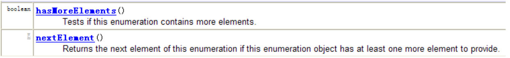

- 操作数组的工具类：`Arrays`

- `Collections` 是一个操作`Set、List`和`Map` 等集合的工具类

- `Collections`中提供了一系列静态的方法对集合元素进行排序、查询和修改等操作，还提供了对集合对象设置不可变、对集合对象实现同步控制等方法

- 排序操作：（均为

  ```
  static
  ```

  方法）

  - `reverse(List)`：反转List 中元素的顺序
  - `shuffle(List)`：对List集合元素进行随机排序
  - `sort(List)`：根据元素的自然顺序对指定List 集合元素按升序排序
  - `sort(List，Comparator)`：根据指定的Comparator 产生的顺序对List 集合元素进行排序
  - `swap(List，int，int)`：将指定list 集合中的i处元素和j 处元素进行交换

## 7.1、Collections工具类常用方法的测试

```java
import org.junit.Test;

import java.util.ArrayList;
import java.util.Arrays;
import java.util.Collections;
import java.util.List;

/**
 * Collections:操作Collection、Map的工具类
 *
 * 面试题：Collection 和 Collections的区别？
 *       Collection是集合类的上级接口，继承于他的接口主要有Set 和List.
 *       Collections是针对集合类的一个帮助类，他提供一系列静态方法实现对各种集合的搜索、排序、线程安全化等操作.
 */
public class CollectionTest { 
    /**
     * reverse(List)：反转 List 中元素的顺序
     * shuffle(List)：对 List 集合元素进行随机排序
     * sort(List)：根据元素的自然顺序对指定 List 集合元素按升序排序
     * sort(List，Comparator)：根据指定的 Comparator 产生的顺序对 List 集合元素进行排序
     * swap(List，int， int)：将指定 list 集合中的 i 处元素和 j 处元素进行交换
     *
     * Object max(Collection)：根据元素的自然顺序，返回给定集合中的最大元素
     * Object max(Collection，Comparator)：根据 Comparator 指定的顺序，返回给定集合中的最大元素
     * Object min(Collection)
     * Object min(Collection，Comparator)
     * int frequency(Collection，Object)：返回指定集合中指定元素的出现次数
     * void copy(List dest,List src)：将src中的内容复制到dest中
     * boolean replaceAll(List list，Object oldVal，Object newVal)：使用新值替换 List 对象的所有旧值
     *
     */

    @Test
    public void test(){ 
        List list = new ArrayList();
        list.add(123);
        list.add(43);
        list.add(765);
        list.add(765);
        list.add(765);
        list.add(-97);
        list.add(0);

        System.out.println(list);

//        Collections.reverse(list);
//        Collections.shuffle(list);
//        Collections.sort(list);
//        Collections.swap(list,1,2);
        int frequency = Collections.frequency(list, 123);

        System.out.println(list);
        System.out.println(frequency);
    }

    @Test
    public void test2(){ 
        List list = new ArrayList();
        list.add(123);
        list.add(43);
        list.add(765);
        list.add(-97);
        list.add(0);

        //报异常：IndexOutOfBoundsException("Source does not fit in dest")
//        List dest = new ArrayList();
//        Collections.copy(dest,list);
        //正确的：
        List dest = Arrays.asList(new Object[list.size()]);
        System.out.println(dest.size());//list.size();
        Collections.copy(dest,list);

        System.out.println(dest);

        /**
         * Collections 类中提供了多个 synchronizedXxx() 方法，
         * 该方法可使将指定集合包装成线程同步的集合，从而可以解决
         * 多线程并发访问集合时的线程安全问题
         */
        //返回的list1即为线程安全的List
        List list1 = Collections.synchronizedList(list);
    }
}
```

## 7.2、补充：Enumeration(了解！！！)

- `Enumeration` 接口是`Iterator`迭代器的“古老版本”




```java
Enumeration stringEnum = new StringTokenizer("a-b*c-d-e-g", "-");
    while(stringEnum.hasMoreElements()){ 
        Object obj= stringEnum.nextElement();System.out.println(obj); 
    }
```