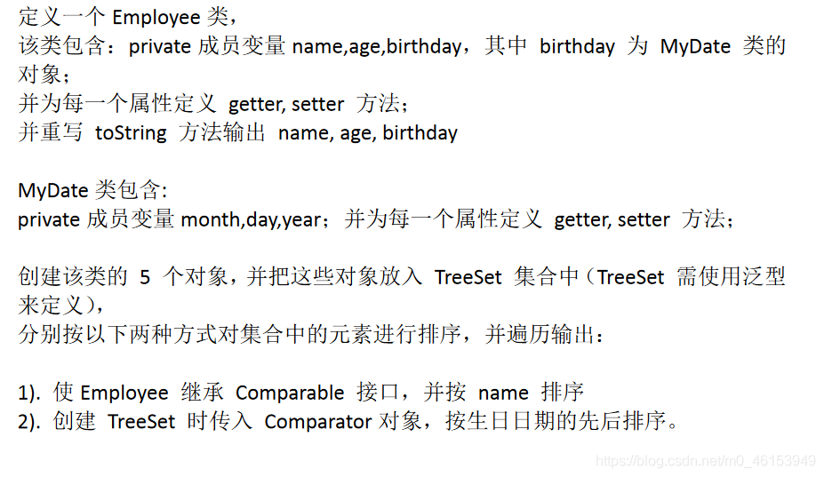

> 注意点：泛型的类型必须是类，不能是基本数据类型。需要用到基本数据类型的位置，拿包装类替换

## 2.1、举例

```java
import org.junit.Test;

import java.util.*;

/**
 * 泛型的使用
 * 1.jdk5.0新增的特征
 *
 * 2.在集合中使用泛型：
 *  总结：
 *  ①集合接口或集合类在jdk5.0时都修改为带泛型的结构。
 *  ②在实例化集合类时，可以指明具体的泛型类型
 *  ③指明完以后，在集合类或接口中凡是定义类或接口时，内部结构（比如：方法、构造器、属性等）使用到类的泛型的位置，都指定为实例化的泛型类型。
 *    比如：add(E e)  --->实例化以后：add(Integer e)
 *  ④注意点：泛型的类型必须是类，不能是基本数据类型。需要用到基本数据类型的位置，拿包装类替换
 *  ⑤如果实例化时，没有指明泛型的类型。默认类型为java.lang.Object类型。
 *
 * 3.如何自定义泛型结构：泛型类、泛型接口；泛型方法。见 GenericTest1.java
 *
 */
public class GenericTest { 

    //在集合中使用泛型的情况：以HashMap为例
    @Test
    public void test3(){ 
//        Map<String,Integer> map = new HashMap<String,Integer>();
        //jdk7新特性：类型推断
        Map<String,Integer> map = new HashMap<>();

        map.put("Tom",87);
        map.put("Tone",81);
        map.put("Jack",64);

//        map.put(123,"ABC");

        //泛型的嵌套
        Set<Map.Entry<String,Integer>> entry = map.entrySet();
        Iterator<Map.Entry<String, Integer>> iterator = entry.iterator();

        while(iterator.hasNext()){ 
            Map.Entry<String, Integer> e = iterator.next();
            String key = e.getKey();
            Integer value = e.getValue();
            System.out.println(key + "----" + value);
        }
    }

    //在集合中使用泛型的情况：以ArrayList为例
    @Test
    public void test2(){ 
        ArrayList<Integer> list = new ArrayList<Integer>();

        list.add(78);
        list.add(49);
        list.add(72);
        list.add(81);
        list.add(89);
        //编译时，就会进行类型检查，保证数据的安全
//        list.add("Tom");

        //方式一：
//        for(Integer score :list){ 
//            //避免了强转的操作
//            int stuScore = score;
//
//            System.out.println(stuScore);
//        }

        //方式二：
        Iterator<Integer> iterator = list.iterator();
        while(iterator.hasNext()){ 
            int stuScore = iterator.next();
            System.out.println(stuScore);
        }
    }
}
```

## 2.2、练习

> 练习1




> 1、MyDate类

```java
/**
 * MyDate类包含:
 * private成员变量year,month,day；并为每一个属性定义getter,  setter 方法；
 *
 */
public class MyDate implements Comparable<MyDate>{ 
    private int year;
    private int month;
    private int day;

    public int getYear() { 
        return year;
    }

    public void setYear(int year) { 
        this.year = year;
    }

    public int getMonth() { 
        return month;
    }

    public void setMonth(int month) { 
        this.month = month;
    }

    public int getDay() { 
        return day;
    }

    public void setDay(int day) { 
        this.day = day;
    }

    public MyDate() { 
    }

    public MyDate(int year, int month, int day) { 
        this.year = year;
        this.month = month;
        this.day = day;
    }

    @Override
    public String toString() { 
        return "MyDate{" +
                "year=" + year +
                ", month=" + month +
                ", day=" + day +
                '}';
    }

//    @Override
//    public int compareTo(Object o) { 
//        if(o instanceof MyDate){ 
//            MyDate m = (MyDate)o;
//
//            //比较年
//            int minusYear = this.getYear() - m.getYear();
//            if(minusYear != 0){ 
//                return minusYear;
//            }
//            //比较月
//            int minusMonth = this.getMonth() - m.getMonth();
//            if(minusMonth != 0){ 
//                return minusMonth;
//            }
//            //比较日
//            return this.getDay() - m.getDay();
//        }
//
//        throw new RuntimeException("传入的数据类型不一致！");
//
//    }

    @Override
    public int compareTo(MyDate m) { 
        //比较年
        int minusYear = this.getYear() - m.getYear();
        if(minusYear != 0){ 
            return minusYear;
        }
        //比较月
        int minusMonth = this.getMonth() - m.getMonth();
        if(minusMonth != 0){ 
            return minusMonth;
        }
        //比较日
        return this.getDay() - m.getDay();
    }
}
```

> 2、Employee类

```java
/**
 * 定义一个Employee类。
 * 该类包含：private成员变量name,age,birthday，
 * 其中birthday 为MyDate 类的对象；
 * 并为每一个属性定义getter, setter 方法；
 * 并重写toString 方法输出name, age, birthday
 *
 */
public class Employee implements Comparable<Employee>{ 
    private String name;
    private int age;
    private MyDate birthday;

    public String getName() { 
        return name;
    }

    public void setName(String name) { 
        this.name = name;
    }

    public int getAge() { 
        return age;
    }

    public void setAge(int age) { 
        this.age = age;
    }

    public MyDate getBirthday() { 
        return birthday;
    }

    public void setBirthday(MyDate birthday) { 
        this.birthday = birthday;
    }

    public Employee() { 
    }

    public Employee(String name, int age, MyDate birthday) { 
        this.name = name;
        this.age = age;
        this.birthday = birthday;
    }

    @Override
    public String toString() { 
        return "Employee{" +
                "name='" + name + '\'' +
                ", age=" + age +
                ", birthday=" + birthday +
                '}';
    }

    //没有指明泛型时的写法
    //按name排序
//    @Override
//    public int compareTo(Object o){ 
//        if(o instanceof Employee){ 
//            Employee e = (Employee)o;
//            return this.name.compareTo(e.name);
//        }
        return 0;
//        throw new RuntimeException("传入的数据类型不一致");
//    }

    //指明泛型时的写法
    @Override
    public int compareTo(Employee o) { 
        return this.name.compareTo(o.name);
    }
}
```

> 3、测试类

```java
import org.junit.Test;

import java.util.Comparator;
import java.util.Iterator;
import java.util.TreeSet;

/**
 * 创建该类的5 个对象，并把这些对象放入TreeSet 集合中
 * （下一章：TreeSet 需使用泛型来定义）分别按以下两种方式
 * 对集合中的元素进行排序，并遍历输出：
 *
 * 1). 使Employee 实现Comparable 接口，并按name 排序
 * 2). 创建TreeSet 时传入Comparator对象，按生日日期的先后排序。
 */
public class EmployeeTest { 

    //问题二：按生日日期的先后排序
    @Test
    public void test2(){ 
        TreeSet<Employee> set = new TreeSet<>(new Comparator<Employee>() { 
            //使用泛型以后的写法
            @Override
            public int compare(Employee o1, Employee o2) { 
                MyDate b1 = o1.getBirthday();
                MyDate b2 = o2.getBirthday();

                return b1.compareTo(b2);
            }
            //使用泛型之前的写法
            //@Override
//            public int compare(Object o1, Object o2) { 
//                if(o1 instanceof Employee && o2 instanceof Employee){ 
//                    Employee e1 = (Employee)o1;
//                    Employee e2 = (Employee)o2;
//
//                    MyDate b1 = e1.getBirthday();
//                    MyDate b2 = e2.getBirthday();
//                    //方式一：
                    //比较年
                    int minusYear = b1.getYear() - b2.getYear();
                    if(minusYear != 0){ 
                        return minusYear;
                    }
                    //比较月
                    int minusMonth = b1.getMonth() - b2.getMonth();
                    if(minusMonth != 0){ 
                        return minusMonth;
                    }
                    //比较日
                    return b1.getDay() - b2.getDay();
//
//                    //方式二：
//                    return b1.compareTo(b2);
//
//                }
                return 0;
//                throw new RuntimeException("传入的数据类型不一致！");
//            }
        });

        Employee e1 = new Employee("liudehua",55,new MyDate(1965,5,4));
        Employee e2 = new Employee("zhangxueyou",43,new MyDate(1987,5,4));
        Employee e3 = new Employee("guofucheng",44,new MyDate(1987,5,9));
        Employee e4 = new Employee("liming",51,new MyDate(1954,8,12));
        Employee e5 = new Employee("liangzhaowei",21,new MyDate(1978,12,4));

        set.add(e1);
        set.add(e2);
        set.add(e3);
        set.add(e4);
        set.add(e5);

        Iterator<Employee> iterator = set.iterator();
        while (iterator.hasNext()){ 
            System.out.println(iterator.next());
        }
    }

    //问题一：使用自然排序
    @Test
    public void test(){ 
        TreeSet<Employee> set = new TreeSet<Employee>();

        Employee e1 = new Employee("wangxianzhi",41,new MyDate(334,5,4));
        Employee e2 = new Employee("simaqian",43,new MyDate(-145,7,12));
        Employee e3 = new Employee("yanzhenqin",44,new MyDate(709,5,9));
        Employee e4 = new Employee("zhangqian",51,new MyDate(-179,8,12));
        Employee e5 = new Employee("quyuan",21,new MyDate(-340,12,4));

        set.add(e1);
        set.add(e2);
        set.add(e3);
        set.add(e4);
        set.add(e5);

        Iterator<Employee> iterator = set.iterator();
        while (iterator.hasNext()){ 
            Employee next = iterator.next();
            System.out.println(next);
        }
    }
}
```