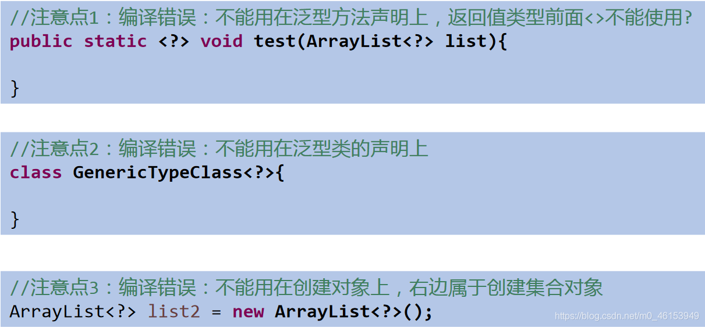

**说明：**

1. 使用类型 通配符：？
   1. 比如：List
   2. List<?>是List、List等各种泛型List的父类。
2. 读取List<?>的对象list中的元素时，永远是安全的，因为不管list的真实类型是什么，它包含的都是Object。
3. 写入list中的元素时，不行。因为我们不知道c的元素类型，我们不能向其中添加对象。
   - **唯一的例外是null，它是所有类型的成员。**
   - 将任意元素加入到其中不是类型安全的：

```java
* Collection<?> c = new ArrayList();
* c.add(new Object()); // 编译时错误因为我们不知道c的元素类型，我们不能向其中添加对象。add方法有类型参数E作为集合的元素类型。我们传给add的任何参数都必须是一个未知类型的子类。因为我们不知道那是什么类型，所以我们无法传任何东西进去。  
  
```

1. **另一方面，我们可以调用get()方法并使用其返回值。返回值是一个未知的类型，但是我们知道，它总是一个Object** 。

**代码演示：**

```java
import org.junit.Test;

import java.util.AbstractList;
import java.util.ArrayList;
import java.util.Iterator;
import java.util.List;

/**
 * 1.泛型在继承方面的体现
 * 2.通配符的使用
 */
public class GenericTest { 

    /**
     * 2.通配符的使用
     * 通配符：？
     *
     * 类A是类B的父类，G<A>和G<B>是没有关系的，二者共同的父类是：G<?>
     */
    @Test
    public void test3(){ 
        List<Object> list1 = null;
        List<String> list2 = null;

        List<?> list = null;

        list = list1;
        list = list2;

        //编译通过
        print(list1);
        print(list2);
    }

    public void print(List<?> list){ 
        Iterator<?> iterator = list.iterator();
        while(iterator.hasNext()){ 
            Object obj = iterator.next();
            System.out.println(obj);
        }
    }
}
```

## 5.1、使用通配符后数据的读取和写入要求




```java
import org.junit.Test;

import java.util.AbstractList;
import java.util.ArrayList;
import java.util.Iterator;
import java.util.List;

/**
 * 1.泛型在继承方面的体现
 *
 * 2.通配符的使用
 */
public class GenericTest { 

    /**
     * 2.通配符的使用
     * 通配符：？
     *
     * 类A是类B的父类，G<A>和G<B>是没有关系的，二者共同的父类是：G<?>
     */
    @Test
    public void test3(){ 
        List<Object> list1 = null;
        List<String> list2 = null;

        List<?> list = null;

        list = list1;
        list = list2;

        //编译通过
//        print(list1);
//        print(list2);

        List<String> list3 = new ArrayList<>();
        list3.add("AA");
        list3.add("BB");
        list3.add("CC");
        list = list3;
        //添加(写入)：对于List<?>就不能向其内部添加数据。
        //除了添加null之外。
//        list.add("DD");
//        list.add('?');

        list.add(null);

        //获取(读取)：允许读取数据，读取的数据类型为Object。
        Object o = list.get(0);
        System.out.println(o);
    }
}
```

## 5.2、有限制条件的通配符的使用

**说明：**

- 通配符指定上限上限 extends：使用时指定的类型必须是继承某个类，或者实现某个接口，即<=
- 通配符指定下限 下限super：使用时指定的类型不能小于操作的类，即>=
- 举例：

**代码演示：**

> 1、Person类

```java
public class Person { 
}
```

> 2、Student类

```java
public class Student extends Person{ 
}
```

> 3、测试类

```java
import org.junit.Test;

import java.util.AbstractList;
import java.util.ArrayList;
import java.util.Iterator;
import java.util.List;

/**
 * 1.泛型在继承方面的体现
 *
 * 2.通配符的使用
 */
public class GenericTest { 

    /**
     * 3.有限制条件的通配符的使用。
     *
     * ? extends A:
     *      G<? extends A> 可以作为G<A>和G<B>的父类，其中B是A的子类
     *
     * ? super A:
     *      G<? super A> 可以作为G<A>和G<B>的父类，其中B是A的父类
     */
    @Test
    public void test4(){ 
        List<? extends Person> list1 = null;
        List<? super Person> list2 = null;

//        List<Student> list3 = null;
//        List<Student> list4 = null;
//        List<Student> list5 = null;

        List<Student> list3 = new ArrayList<Student>();
        List<Person> list4 = new ArrayList<Person>();
        List<Object> list5 = new ArrayList<Object>();

        list1 = list3;
        list1 = list4;
//        list1 = list5;

//        list2 = list3;
        list2 = list4;
        list2 = list5;

        //读取数据：
        list1 = list3;
        Person p = list1.get(0);
        //编译不通过
        //Student s = list1.get(0);

        list2 = list4;
        Object obj = list2.get(0);
        编译不通过
//        Person obj = list2.get(0);

        //写入数据：
        //编译不通过
//        list1.add(new Student());

        //编译通过
        list2.add(new Person());
        list2.add(new Student());
    }

}
```