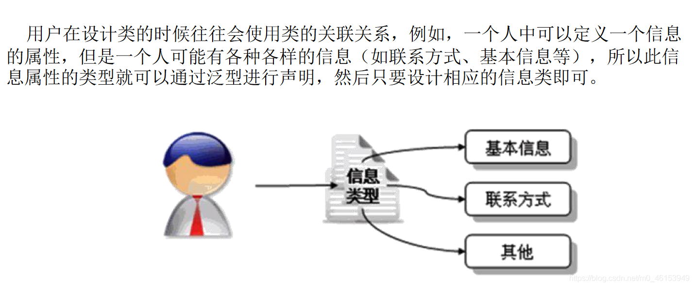

## 6.1、泛型嵌套

```java
public static void main(String[] args) { 
        HashMap<String, ArrayList<Citizen>> map= new HashMap<String, ArrayList<Citizen>>();
        ArrayList<Citizen> list= new ArrayList<Citizen>();
        list.add(new Citizen("刘恺威"));
        list.add(new Citizen("杨幂"));
        list.add(new Citizen("小糯米"));
        map.put("刘恺威", list);
        Set<Entry<String, ArrayList<Citizen>>> entrySet= map.entrySet();
        Iterator<Entry<String, ArrayList<Citizen>>> iterator= entrySet.iterator();
        while(iterator.hasNext()) { 
            Entry<String, ArrayList<Citizen>> entry= iterator.next();
            String key= entry.getKey();
            ArrayList<Citizen> value= entry.getValue();
            System.out.println("户主："+ key);
            System.out.println("家庭成员："+ value);
        }
    }
```

## 6.2、实际案例




```java
interface Info{     // 只有此接口的子类才是表示人的信息
}
class Contact implements Info{   // 表示联系方式
  private String address ;  // 联系地址
  private String telephone ;  // 联系方式
  private String zipcode ;  // 邮政编码
  public Contact(String address,String telephone,String zipcode){ 
    this.address = address;
    this.telephone = telephone;
    this.zipcode = zipcode;
  }
  public void setAddress(String address){ 
    this.address = address ;
  }
  public void setTelephone(String telephone){ 
    this.telephone = telephone ;
  }
  public void setZipcode(String zipcode){ 
    this.zipcode = zipcode;
  }
  public String getAddress(){ 
    return this.address ;
  }
  public String getTelephone(){ 
    return this.telephone ;
  }
  public String getZipcode(){ 
    return this.zipcode;
  }
  @Override
  public String toString() { 
    return "Contact [address=" + address + ", telephone=" + telephone
        + ", zipcode=" + zipcode + "]";
  }
}
class Introduction implements Info{ 
  private String name ;    // 姓名
  private String sex ;    // 性别
  private int age ;      // 年龄
  public Introduction(String name,String sex,int age){ 
    this.name = name;
    this.sex = sex;
    this.age = age;
  }
  public void setName(String name){ 
    this.name = name ;
  }
  public void setSex(String sex){ 
    this.sex = sex ;
  }
  public void setAge(int age){ 
    this.age = age ;
  }
  public String getName(){ 
    return this.name ;
  }
  public String getSex(){ 
    return this.sex ;
  }
  public int getAge(){ 
    return this.age ;
  }
  @Override
  public String toString() { 
    return "Introduction [name=" + name + ", sex=" + sex + ", age=" + age
        + "]";
  }
}
class Person<T extends Info>{ 
  private T info ;
  public Person(T info){     // 通过构造器设置信息属性内容
    this.info = info;
  }
  public void setInfo(T info){ 
    this.info = info ;
  }
  public T getInfo(){ 
    return info ;
  }
  @Override
  public String toString() { 
    return "Person [info=" + info + "]";
  }

}
public class GenericPerson{ 
  public static void main(String args[]){ 
    Person<Contact> per = null ;    // 声明Person对象
    per = new Person<Contact>(new Contact("北京市","01088888888","102206")) ;
    System.out.println(per);
  
    Person<Introduction> per2 = null ;    // 声明Person对象
    per2 = new Person<Introduction>(new Introduction("李雷","男",24));
    System.out.println(per2) ;
  }
}
```