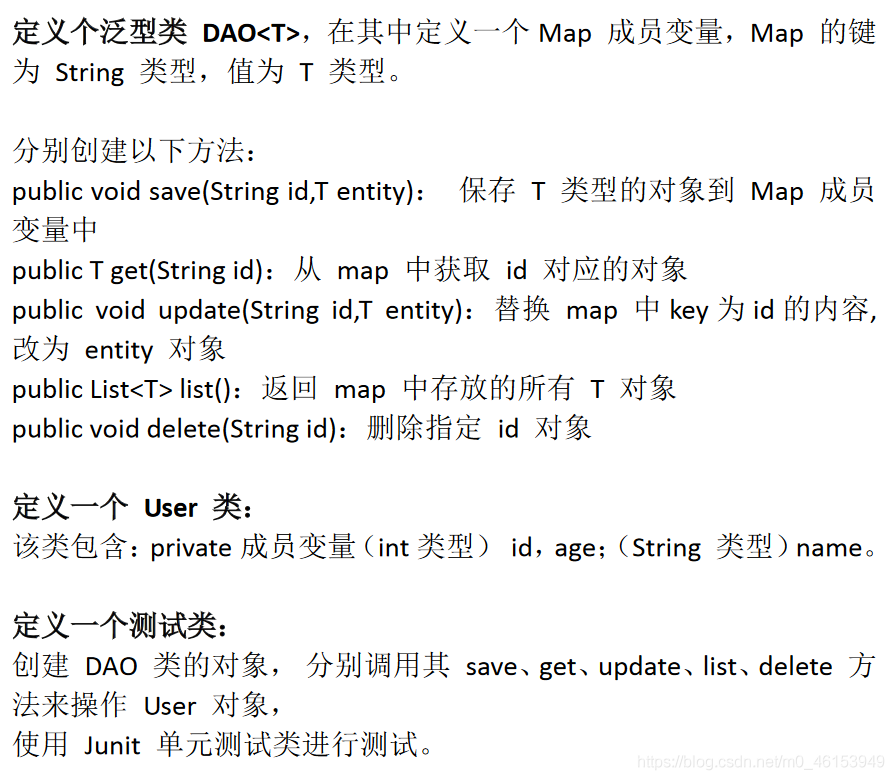

**代码演示：**

> 1、泛型类DAO

```java
import java.util.*;

/**
 * 定义个泛型类 DAO<T>，在其中定义一个Map 成员变量，Map 的键为 String 类型，值为 T 类型。
 *
 * 分别创建以下方法：
 * public void save(String id,T entity)： 保存 T 类型的对象到 Map 成员变量中
 * public T get(String id)：从 map 中获取 id 对应的对象
 * public void update(String id,T entity)：替换 map 中key为id的内容,改为 entity 对象
 * public List<T> list()：返回 map 中存放的所有 T 对象
 * public void delete(String id)：删除指定 id 对象
 */
public class DAO<T> { 
    private Map<String,T> map = new HashMap<String,T>();
    //保存 T 类型的对象到 Map 成员变量中
    public void save(String id,T entity){ 
        map.put(id,entity);
    }
    //从 map 中获取 id 对应的对象
    public T get(String id){ 
        return map.get(id);
    }
    //替换 map 中key为id的内容,改为 entity 对象
    public void update(String id,T entity){ 
        if(map.containsKey(id)){ 
            map.put(id,entity);
        }
    }
    //返回 map 中存放的所有 T 对象
    public List<T> list(){ 
        //错误的：
//        Collection<T> values = map.values();
//        return (List<T>) values;
        //正确的：
        ArrayList<T> list = new ArrayList<>();
        Collection<T> values = map.values();
        for(T t : values){ 
            list.add(t);
        }
        return list;

    }
    //删除指定 id 对象
    public void delete(String id){ 
        map.remove(id);
    }
}
```

> 2、User类

```java
/**
 * 定义一个 User 类：
 * 该类包含：private成员变量（int类型） id，age；（String 类型）name。
 */
public class User { 
    private int id;
    private int age;
    private String name;

    public int getId() { 
        return id;
    }

    public void setId(int id) { 
        this.id = id;
    }

    public int getAge() { 
        return age;
    }

    public void setAge(int age) { 
        this.age = age;
    }

    public String getName() { 
        return name;
    }

    public void setName(String name) { 
        this.name = name;
    }

    public User(int id, int age, String name) { 

        this.id = id;
        this.age = age;
        this.name = name;
    }

    public User() { 

    }

    @Override
    public String toString() { 
        return "User{" +
                "id=" + id +
                ", age=" + age +
                ", name='" + name + '\'' +
                '}';
    }

    @Override
    public boolean equals(Object o) { 
        if (this == o) return true;
        if (o == null || getClass() != o.getClass()) return false;

        User user = (User) o;

        if (id != user.id) return false;
        if (age != user.age) return false;
        return name != null ? name.equals(user.name) : user.name == null;
    }

    @Override
    public int hashCode() { 
        int result = id;
        result = 31 * result + age;
        result = 31 * result + (name != null ? name.hashCode() : 0);
        return result;
    }
}
```

> 3、测试类

```java
import java.util.List;

/**
 * 创建 DAO 类的对象， 分别调用其 save、get、update、list、delete
 * 方法来操作 User 对象，使用 Junit 单元测试类进行测试。
 */
public class DAOTest { 
    public static void main(String[] args) { 
        DAO<User> dao = new DAO<User>();

        dao.save("1001",new User(1001,34,"周杰伦"));
        dao.save("1002",new User(1002,20,"昆凌"));
        dao.save("1003",new User(1003,25,"蔡依林"));

        dao.update("1003",new User(1003,30,"方文山"));

        dao.delete("1002");

        List<User> list = dao.list();
//        System.out.println(list);
        list.forEach(System.out::println);
    }
}
```