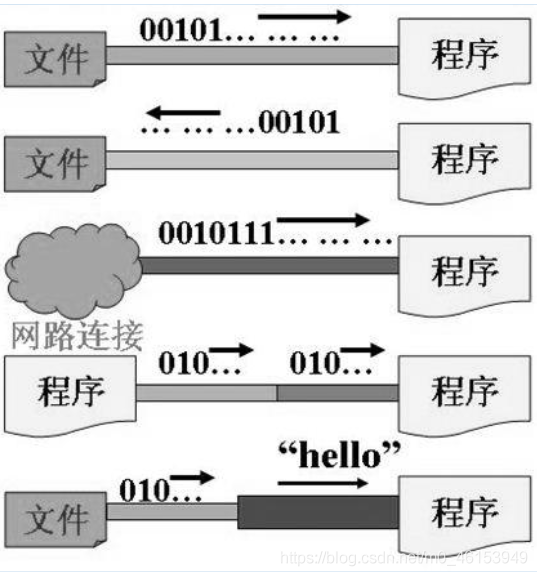
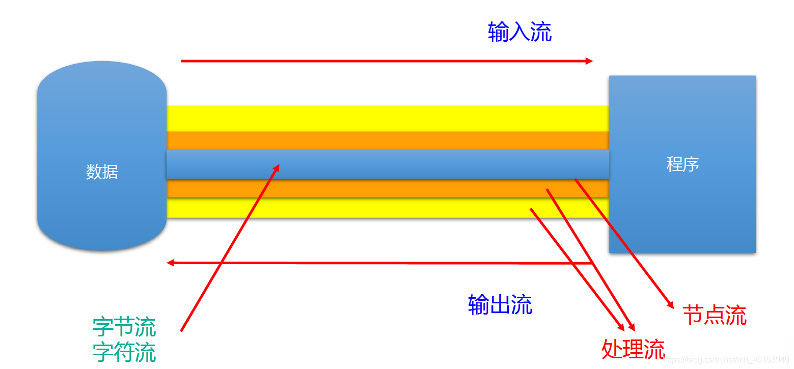
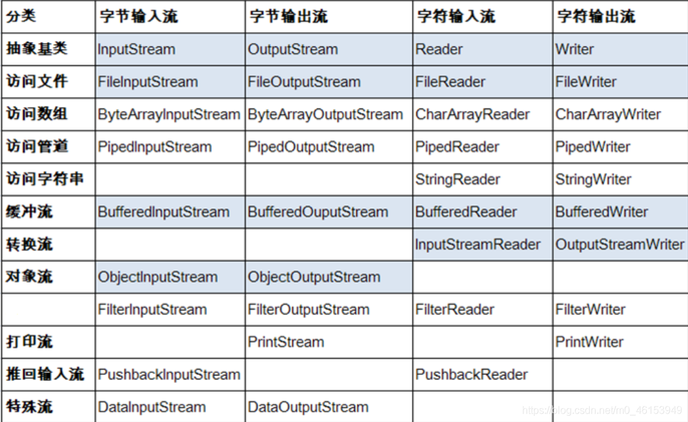

## 2.1、IO流原理

- I/O是Input/Output的缩写，I/O技术是非常实用的技术，用于处理设备之间的数据传输。如读/写文件，网络通讯等。
- Java程序中，对于数据的输入/输出操作以“流(stream)”的方式进行。
- java.io包下提供了各种“流”类和接口，用以获取不同种类的数据，并通过标准的方法输入或输出数据。
- 输入input：读取外部数据（磁盘、光盘等存储设备的数据）到程序（内存）中。
- 输出output：将程序（内存）数据输出到磁盘、光盘等存储设备中。

## 2.2、流的分类

- 按操作**数据单位**不同分为：字节流(8 bit)，字符流(16 bit)
- 按数据流的**流向**不同分为：输入流，输出流
- 按流的**角色**的不同分为：节点流，处理流

| 抽象基类 | 字节流       | 字符流 |
| -------- | ------------ | ------ |
| 输入流   | InputStream  | Reader |
| 输出流   | OutputStream | Writer |

1. Java的IO流共涉及40多个类，实际上非常规则，都是从如下4个抽象基类派生的。
2. 由这四个类派生出来的子类名称都是以其父类名作为子类名后缀。

## 2.3、IO 流体系

