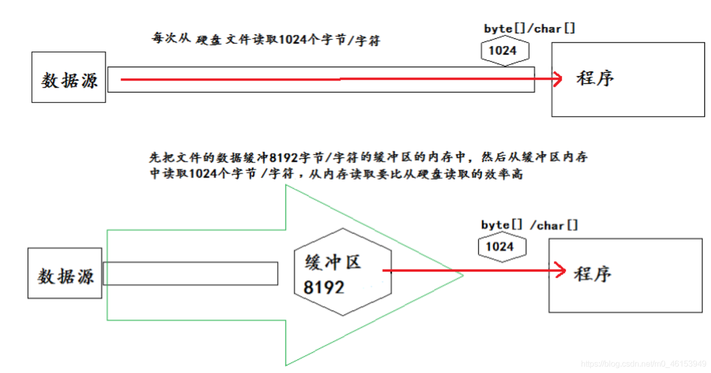

- 为了提高数据读写的速度，Java API提供了带缓冲功能的流类，在使用这些流类时，会创建一个内部缓冲区数组，缺省使用8192个字节(8Kb)的缓冲区。 


- 缓冲流要“套接”在相应的节点流之上，根据数据操作单位可以把缓冲流分为：
  - BufferedInputStream和BufferedOutputStream
  - BufferedReader和BufferedWriter
- 当读取数据时，数据按块读入缓冲区，其后的读操作则直接访问缓冲区
- 当使用BufferedInputStream读取字节文件时，BufferedInputStream会一次性从文件中读取8192个(8Kb)，存在缓冲区中，直到缓冲区装满了，才重新从文件中读取下一个8192个字节数组。
- 向流中写入字节时，不会直接写到文件，先写到缓冲区中直到缓冲区写满，BufferedOutputStream才会把缓冲区中的数据一次性写到文件里。使用方法flush()可以强制将缓冲区的内容全部写入输出流
- 关闭流的顺序和打开流的顺序相反。只要关闭最外层流即可，关闭最外层流也会相应关闭内层节点流
- flush()方法的使用：手动将buffer中内容写入文件
- 如果是带缓冲区的流对象的close()方法，不但会关闭流，还会在关闭流之前刷新缓冲区，关闭后不能再写出。
- 缓冲流的读写速度比节点流更快
- 底层为修饰器模式




## 5.1、缓冲流(字节型)实现非文本文件的复制

```java
import org.junit.Test;
import java.io.*;
/**
 * 处理流之一：缓冲流的使用
 *
 *  1.缓冲流：
 *  BufferedInputStream
 *  BufferedOutputStream
 *  BufferedReader
 *  BufferedWriter
 *
 *  2.作用：提供流的读取、写入的速度
 *    提高读写速度的原因：内部提供了一个缓冲区
 *
 *  3. 处理流，就是“套接”在已有的流的基础上。
 *
 */
public class BufferedTest { 

    //实现文件复制的方法
    public void copyFileWithBuffered(String srcPath,String destPath){ 
        BufferedInputStream bis = null;
        BufferedOutputStream bos = null;

        try { 
            //1.造文件
            File srcFile = new File(srcPath);
            File destFile = new File(destPath);
            //2.造流
            //2.1 造节点流
            FileInputStream fis = new FileInputStream((srcFile));
            FileOutputStream fos = new FileOutputStream(destFile);
            //2.2 造缓冲流
            bis = new BufferedInputStream(fis);
            bos = new BufferedOutputStream(fos);

            //3.复制的细节：读取、写入
            byte[] buffer = new byte[1024];
            int len;
            while((len = bis.read(buffer)) != -1){ 
                bos.write(buffer,0,len);
            }
        } catch (IOException e) { 
            e.printStackTrace();
        } finally { 
            //4.资源关闭
            //要求：先关闭外层的流，再关闭内层的流
            if(bos != null){ 
                try { 
                    bos.close();
                } catch (IOException e) { 
                    e.printStackTrace();
                }

            }
            if(bis != null){ 
                try { 
                    bis.close();
                } catch (IOException e) { 
                    e.printStackTrace();
                }

            }
            //说明：关闭外层流的同时，内层流也会自动的进行关闭。关于内层流的关闭，我们可以省略.
//        fos.close();
//        fis.close();
        }
    }

    @Test
    public void testCopyFileWithBuffered(){ 
        long start = System.currentTimeMillis();

        String srcPath = "C:\\Users\\29433\\Desktop\\book.flv";
        String destPath = "C:\\Users\\29433\\Desktop\\book1.flv";


        copyFileWithBuffered(srcPath,destPath);


        long end = System.currentTimeMillis();

        System.out.println("复制操作花费的时间为：" + (end - start));//1
    }

}
```


## 5.2、缓冲流(字符型)实现文本文件的复制

```java
import org.junit.Test;
import java.io.*;

public class BufferedTest { 
  /**
     * 使用BufferedReader和BufferedWriter实现文本文件的复制
     */
    @Test
    public void test4(){ 
        BufferedReader br = null;
        BufferedWriter bw = null;
        try { 
            //创建文件和相应的流
            br = new BufferedReader(new FileReader(new File("dbcp.txt")));
            bw = new BufferedWriter(new FileWriter(new File("dbcp1.txt")));

            //读写操作
            //方式一：使用char[]数组
//            char[] cbuf = new char[1024];
//            int len;
//            while((len = br.read(cbuf)) != -1){ 
//                bw.write(cbuf,0,len);
//    //            bw.flush();
//            }

            //方式二：使用String
            String data;
            while((data = br.readLine()) != null){ 
                //方法一：
//                bw.write(data + "\n");//data中不包含换行符
                //方法二：
                bw.write(data);//data中不包含换行符
                bw.newLine();//提供换行的操作
            }

        } catch (IOException e) { 
            e.printStackTrace();
        } finally { 
            //关闭资源
            if(bw != null){ 

                try { 
                    bw.close();
                } catch (IOException e) { 
                    e.printStackTrace();
                }
            }
            if(br != null){ 
                try { 
                    br.close();
                } catch (IOException e) { 
                    e.printStackTrace();
                }
            }
        }
    }
}
```


## 5.3、缓冲流课后练习


> 1、练习2

```java
package git;

import org.junit.Test;

import java.io.FileInputStream;
import java.io.FileOutputStream;
import java.io.IOException;

public class PicTest { 

    //图片的加密
    @Test
    public void test() { 
        FileInputStream fis = null;
        FileOutputStream fos = null;
        try { 
            fis = new FileInputStream("爱情与友情.jpg");
            fos = new FileOutputStream("爱情与友情secret.jpg");

            byte[] buffer = new byte[20];
            int len;
            while ((len = fis.read(buffer)) != -1) { 
                //字节数组进行修改
                //错误的
                //            for(byte b : buffer){ 
                //                b = (byte) (b ^ 5);
                //            }

                //正确的
                for (int i = 0; i < len; i++) { 
                    buffer[i] = (byte) (buffer[i] ^ 5);
                }

                fos.write(buffer, 0, len);
            }
        } catch (IOException e) { 
            e.printStackTrace();
        } finally { 
            if (fos != null) { 
                try { 
                    fos.close();
                } catch (IOException e) { 
                    e.printStackTrace();
                }
            }
            if (fis != null) { 
                try { 
                    fis.close();
                } catch (IOException e) { 
                    e.printStackTrace();
                }
            }
        }

    }

    //图片的解密
    @Test
    public void test2() { 

        FileInputStream fis = null;
        FileOutputStream fos = null;
        try { 
            fis = new FileInputStream("爱情与友情secret.jpg");
            fos = new FileOutputStream("爱情与友情4.jpg");

            byte[] buffer = new byte[20];
            int len;
            while ((len = fis.read(buffer)) != -1) { 
                //字节数组进行修改
                //错误的
                //            for(byte b : buffer){ 
                //                b = (byte) (b ^ 5);
                //            }
             
                //正确的
                for (int i = 0; i < len; i++) { 
                    buffer[i] = (byte) (buffer[i] ^ 5);
                }

                fos.write(buffer, 0, len);
            }
        } catch (IOException e) { 
            e.printStackTrace();
        } finally { 
            if (fos != null) { 
                try { 
                    fos.close();
                } catch (IOException e) { 
                    e.printStackTrace();
                }
            }
            if (fis != null) { 
                try { 
                    fis.close();
                } catch (IOException e) { 
                    e.printStackTrace();
                }
            }
        }
   
    }
}
```

> 2、练习3

```java
import org.junit.Test;

import java.io.BufferedWriter;
import java.io.FileReader;
import java.io.FileWriter;
import java.io.IOException;
import java.util.HashMap;
import java.util.Map;
import java.util.Set;

/**
 * 练习3:获取文本上字符出现的次数,把数据写入文件
 *
 * 思路：
 * 1.遍历文本每一个字符
 * 2.字符出现的次数存在Map中
 *
 * Map<Character,Integer> map = new HashMap<Character,Integer>();
 * map.put('a',18);
 * map.put('你',2);
 *
 * 3.把map中的数据写入文件
 */
public class WordCount { 

    /**
     * 说明：如果使用单元测试，文件相对路径为当前module
     *     如果使用main()测试，文件相对路径为当前工程
     */
    @Test
    public void testWordCount() { 
        FileReader fr = null;
        BufferedWriter bw = null;
        try { 
            //1.创建Map集合
            Map<Character, Integer> map = new HashMap<Character, Integer>();

            //2.遍历每一个字符,每一个字符出现的次数放到map中
            fr = new FileReader("dbcp.txt");
            int c = 0;
            while ((c = fr.read()) != -1) { 
                //int 还原 char
                char ch = (char) c;
                // 判断char是否在map中第一次出现
                if (map.get(ch) == null) { 
                    map.put(ch, 1);
                } else { 
                    map.put(ch, map.get(ch) + 1);
                }
            }

            //3.把map中数据存在文件count.txt
            //3.1 创建Writer
            bw = new BufferedWriter(new FileWriter("wordcount.txt"));

            //3.2 遍历map,再写入数据
            Set<Map.Entry<Character, Integer>> entrySet = map.entrySet();
            for (Map.Entry<Character, Integer> entry : entrySet) { 
                switch (entry.getKey()) { 
                    case ' ':
                        bw.write("空格=" + entry.getValue());
                        break;
                    case '\t'://\t表示tab 键字符
                        bw.write("tab键=" + entry.getValue());
                        break;
                    case '\r'://
                        bw.write("回车=" + entry.getValue());
                        break;
                    case '\n'://
                        bw.write("换行=" + entry.getValue());
                        break;
                    default:
                        bw.write(entry.getKey() + "=" + entry.getValue());
                        break;
                }
                bw.newLine();
            }
        } catch (IOException e) { 
            e.printStackTrace();
        } finally { 
            //4.关流
            if (fr != null) { 
                try { 
                    fr.close();
                } catch (IOException e) { 
                    e.printStackTrace();
                }

            }
            if (bw != null) { 
                try { 
                    bw.close();
                } catch (IOException e) { 
                    e.printStackTrace();
                }

            }
        }
    }
}
```