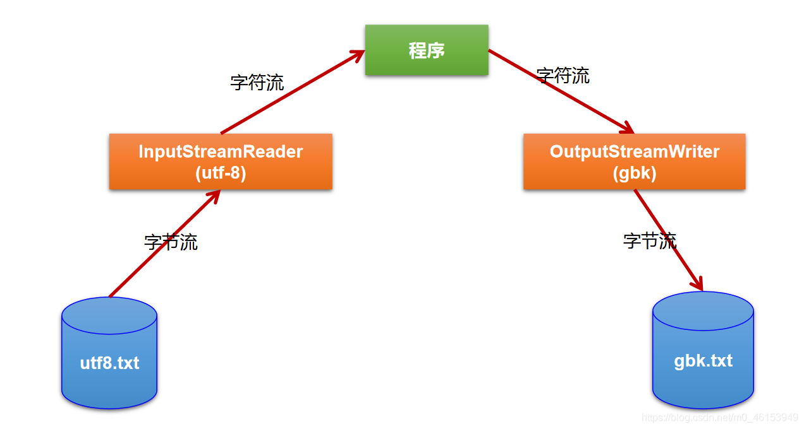
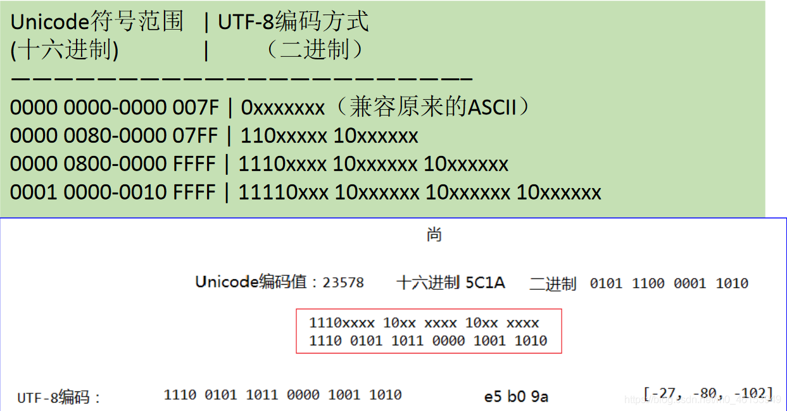
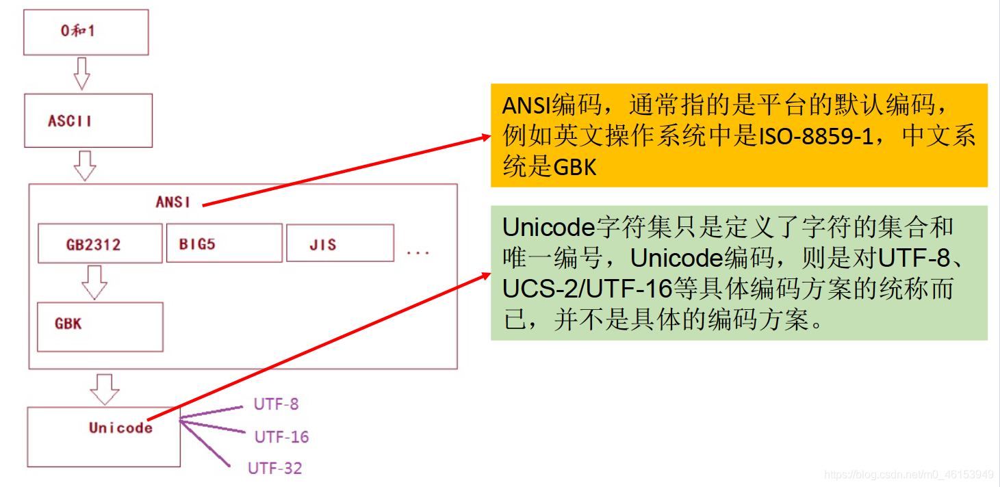
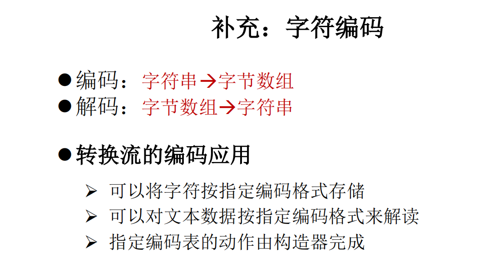

## 6.1、转换流概述与InputStreamReader的使用

- 转换流提供了在字节流和字符流之间的转换

- Java API提供了两个转换流：

  - ```
    InputStreamReader
    ```

    ：将InputStream转换为Reader

    - 实现将字节的输入流按指定字符集转换为字符的输入流。
    - 需要和`InputStream`“套接”。
    - 构造器
      - `public InputStreamReader(InputStreamin)`
      - `public InputSreamReader(InputStreamin,StringcharsetName)`
      - `如：Reader isr= new InputStreamReader(System.in,”gbk”);`

  - ```
    OutputStreamWriter
    ```

    ：将Writer转换为OutputStream

    - 实现将字符的输出流按指定字符集转换为字节的输出流。
    - 需要和`OutputStream`“套接”。
    - 构造器
      - `public OutputStreamWriter(OutputStreamout)`
      - `public OutputSreamWriter(OutputStreamout,StringcharsetName)`

- 字节流中的数据都是字符时，转成字符流操作更高效。

- 很多时候我们使用转换流来处理文件乱码问题。实现编码和解码的功能。




```java
import org.junit.Test;

import java.io.FileInputStream;
import java.io.IOException;
import java.io.InputStreamReader;

/**
 * 处理流之二：转换流的使用
 * 1.转换流：属于字符流
 *      InputStreamReader：将一个字节的输入流转换为字符的输入流
 *      OutputStreamWriter：将一个字符的输出流转换为字节的输出流
 *
 * 2.作用：提供字节流与字符流之间的转换
 *
 * 3.解码：字节、字节数组  --->字符数组、字符串
 *   编码：字符数组、字符串 ---> 字节、字节数组
 *
 * 4.字符集
 */
public class InputStreamReaderTest { 

    /**
     * 此时处理异常的话，仍然应该使用try-catch-finally
     * InputStreamReader的使用，实现字节的输入流到字符的输入流的转换
     */
    @Test
    public void test() throws IOException { 

        FileInputStream fis = new FileInputStream("dbcp.txt");
//        InputStreamReader isr = new InputStreamReader(fis);//使用系统默认的字符集
        //参数2指明了字符集，具体使用哪个字符集，取决于文件dbcp.txt保存时使用的字符集
        InputStreamReader isr = new InputStreamReader(fis,"UTF-8");//使用系统默认的字符集

        char[] cbuf = new char[20];
        int len;
        while((len = isr.read(cbuf)) != -1){ 
            String str = new String(cbuf,0,len);
            System.out.print(str);
        }

        isr.close();
    }

}
```

## 6.2、转换流实现文件的读入和写出

```java
import org.junit.Test;

import java.io.*;

/**
 * 处理流之二：转换流的使用
 * 1.转换流：属于字符流
 *      InputStreamReader：将一个字节的输入流转换为字符的输入流
 *      OutputStreamWriter：将一个字符的输出流转换为字节的输出流
 *
 * 2.作用：提供字节流与字符流之间的转换
 *
 * 3.解码：字节、字节数组  --->字符数组、字符串
 *   编码：字符数组、字符串 ---> 字节、字节数组
 *
 * 4.字符集
 */
public class InputStreamReaderTest { 
    /**
     * 此时处理异常的话，仍然应该使用try-catch-finally
     * 综合使用InputStreamReader和OutputStreamWriter
     */
    @Test
    public void test2() throws IOException { 
        //1.造文件、造流
        File file1 = new File("dbcp.txt");
        File file2 = new File("dbcp_gbk.txt");

        FileInputStream fis = new FileInputStream(file1);
        FileOutputStream fos = new FileOutputStream(file2);

        InputStreamReader isr = new InputStreamReader(fis,"utf-8");
        OutputStreamWriter osw = new OutputStreamWriter(fos,"gbk");

        //2.读写过程
        char[] cbuf = new char[20];
        int len;
        while((len = isr.read(cbuf)) != -1){ 
            osw.write(cbuf,0,len);
        }

        //3.关闭资源
        isr.close();
        osw.close();
    }
}
```

## 6.3、多种字符编码集的说明

> 1、编码表的由来

计算机只能识别二进制数据，早期由来是电信号。为了方便应用计算机，让它可以识别各个国家的文字。就将各个国家的文字用数字来表示，并一一对应，形成一张表。这就是编码表。

> 2、常见的编码表

```java
/**
  * 4.字符集
  *  ASCII：美国标准信息交换码。
  *     用一个字节的7位可以表示。
  *  ISO8859-1：拉丁码表。欧洲码表
  *     用一个字节的8位表示。
  *  GB2312：中国的中文编码表。最多两个字节编码所有字符
  *  GBK：中国的中文编码表升级，融合了更多的中文文字符号。最多两个字节编码
  *  Unicode：国际标准码，融合了目前人类使用的所有字符。为每个字符分配唯一的字符码。所有的文字都用两个字节来表示。
  *  UTF-8：变长的编码方式，可用1-4个字节来表示一个字符。
  */
```

> 说明：

- Unicode不完美，这里就有三个问题， 一个是，我们已经知道，英文字母只用一个字节表示就够了， 第二个问题是如何才能区别Unicode和ASCII？计算机怎么知道两个字节表示一个符号，而不是分别表示两个符号呢？ 第三个，如果和GBK等双字节编码方式一样，用最高位是1或0表示两个字节和一个字节，就少了很多值无法用于表示字符，不够表示所有字符。Unicode在很长一段时间内无法推广，直到互联网的出现。
- 面向传输的众多UTF（UCS Transfer Format）标准出现了，顾名思义，**UTF-8就是每次8个位传输数据，而UTF-16就是每次16个位。** 这是为传输而设计的编码，并使编码无国界，这样就可以显示全世界上所有文化的字符了。
- Unicode只是定义了一个庞大的、全球通用的字符集，并为每个字符规定了唯一确定的编号，具体存储成什么样的字节流，取决于字符编码方案。推荐的Unicode编码是UTF-8和UTF-16。





