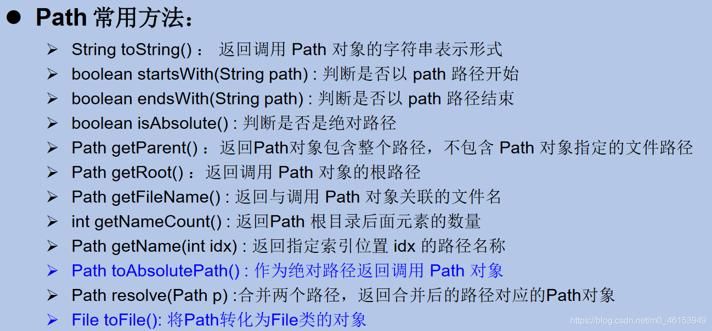
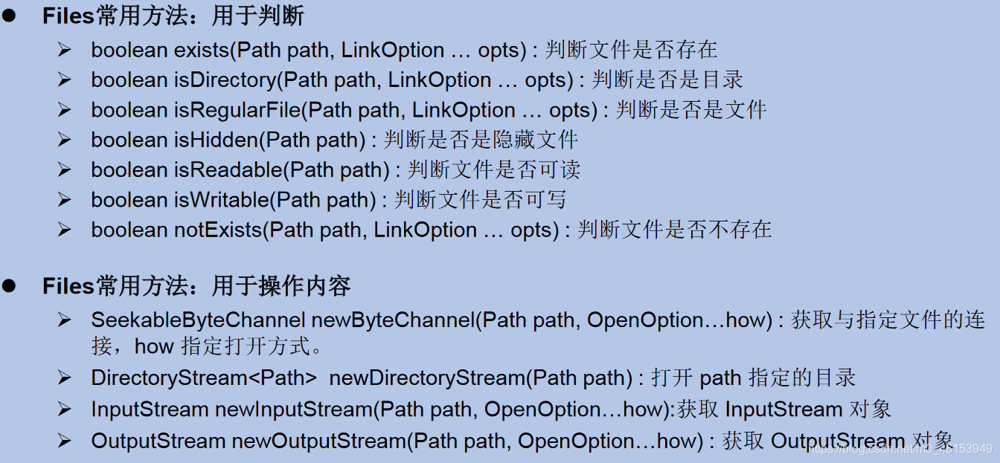
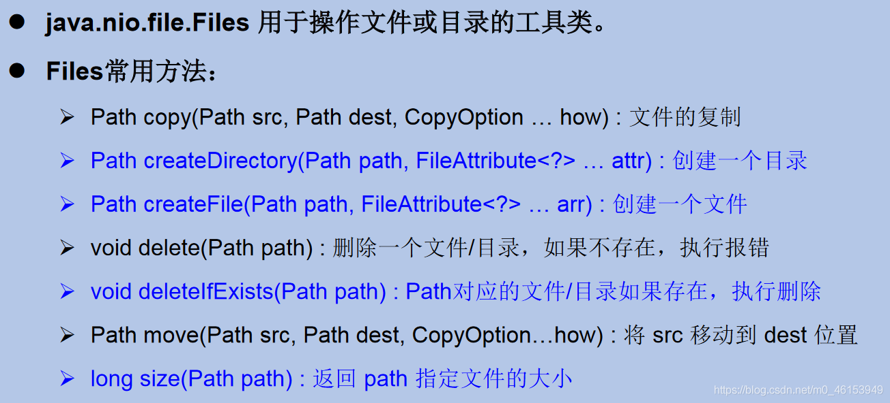

- `Java NIO` (New IO，Non-Blocking IO)是从Java 1.4版本开始引入的一套新的IO API，可以替代标准的Java IO API。NIO与原来的IO有同样的作用和目的，但是使用的方式完全不同，NIO支持面向缓冲区的(IO是面向流的)、基于通道的IO操作。NIO将以更加高效的方式进行文件的读写操作。
- Java API中提供了两套NIO，一套是针对 **标准输入输出NIO** ，另一套就是 **网络编程NIO** 。

```text
|-----java.nio.channels.Channel
    |-----FileChannel:处理本地文件
    |-----SocketChannel：TCP网络编程的客户端的Channel
    |-----ServerSocketChannel:TCP网络编程的服务器端的Channel
    |-----DatagramChannel：UDP网络编程中发送端和接收端的Channel
12345
```

- 随着JDK 7 的发布，Java对NIO进行了极大的扩展，增强了对文件处理和文件系统特性的支持，以至于我们称他们为`NIO.2`。因为NIO 提供的一些功能，NIO已经成为文件处理中越来越重要的部分。

- 早期的Java只提供了一个File类来访问文件系统，但File类的功能比较有限，所提供的方法性能也不高。而且，大多数方法在出错时仅返回失败，并不会提供异常信息。

- ```
  NIO. 2
  ```

  为了弥补这种不足，引入了

  ```
  Path
  ```

  接口，代表一个平台无关的平台路径，描述了目录结构中文件的位置。Path可以看成是File类的升级版本，实际引用的资源也可以不存在。

  - 在以前IO操作都是这样写的:

```java
import java.io.File;

File file = new File(“index.html”);  
- 但在Java7 中，我们可以这样写：
java import java.nio.file.Path; 
import java.nio.file.Paths; 
Path path = Paths.get(“index.html”); 
```

- 同时，NIO.2在`java.nio.file`包下还提供了`Files、Paths`工具类，`Files`包含了大量静态的工具方法来操作文件；`Paths`则包含了两个返回`Path`的静态工厂方法。

- ```
  Paths
  ```

  类提供的静态

  ```
  get()
  ```

  方法用来获取

  ```
  Path
  ```

  对象：

  - `static Pathget(String first, String … more)` : 用于将多个字符串串连成路径
  - `static Path get(URI uri)`: 返回指定uri对应的Path路径

> 1、Path接口




> 2、Files 类




