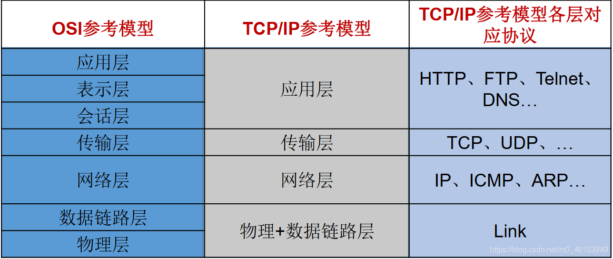
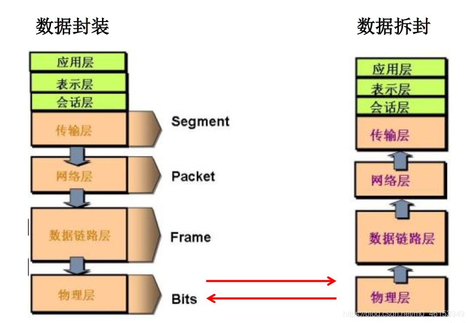

- 通信双方地址
  - IP
  - 端口号
- 一定的规则（即：网络通信协议。有两套参考模型）
  - OSI参考模型：模型过于理想化，未能在因特网上进行广泛推广
  - TCP/IP参考模型(或TCP/IP协议)：事实上的国际标准。
- 网络通信协议






```java
/**
 * 一、网络编程中有两个主要的问题：
 * 1.如何准确地定位网络上一台或多台主机；定位主机上的特定的应用
 * 2.找到主机后如何可靠高效地进行数据传输
 *
 * 二、网络编程中的两个要素：
 * 1.对应问题一：IP和端口号
 * 2.对应问题二：提供网络通信协议：TCP/IP参考模型（应用层、传输层、网络层、物理+数据链路层）
 */
```