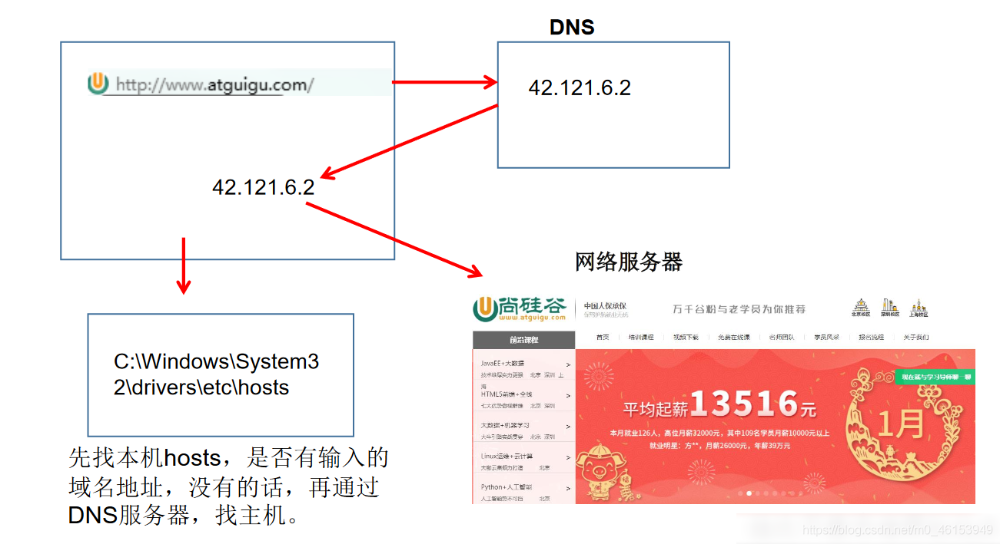
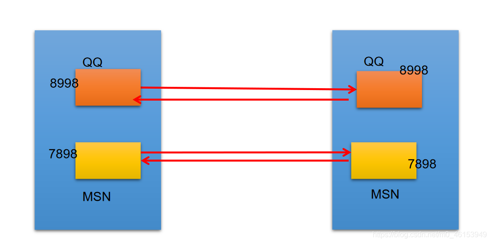

## 3.1、IP的理解与InetAddress类的实例化

- IP 地址：

  ```
  InetAddress
  ```

  - 唯一的标识Internet 上的计算机（通信实体）
  - 本地回环地址(hostAddress)：127.0.0.1 主机名(hostName)：localhost
  - IP地址分类方式1：IPV4和IPV6
    - IPV4：4个字节组成，4个0-255。大概42亿，30亿都在北美，亚洲4亿。2011年初已经用尽。以点分十进制表示，如192.168.0.1
    - IPV6：128位（16个字节），写成8个无符号整数，每个整数用四个十六进制位表示，数之间用冒号（：）分开，如：3ffe:3201:1401:1280:c8ff:fe4d:db39:1984
  - IP地址分类方式2：公网地址(万维网使用)和私有地址(局域网使用)。192.168.开头的就是私有地址，范围即为192.168.0.0–192.168.255.255，专门为组织机构内部使用
  - 特点：不易记忆

- Internet上的主机有两种方式表示地址：

  - 域名(hostName)：[www.atguigu.com](http://www.atguigu.com)
  - IP地址(hostAddress)：202.108.35.210

- `InetAddress`类主要表示IP地址，两个子类：`Inet4Address、Inet6Address`。

- `InetAddress`类对象含有一个Internet主机地址的域名和IP地址：[www.atguigu.com和202.108.35.210。](http://www.atguigu.xn--com202-k76j.108.35.210.)

- 域名容易记忆，当在连接网络时输入一个主机的域名后，域名服务器(DNS)负责将域名转化成IP地址，这样才能和主机建立连接。-------域名解析




```java
import java.net.InetAddress;
import java.net.UnknownHostException;

/**
 * 一、网络编程中有两个主要的问题：
 * 1.如何准确地定位网络上一台或多台主机；定位主机上的特定的应用
 * 2.找到主机后如何可靠高效地进行数据传输
 *
 * 二、网络编程中的两个要素：
 * 1.对应问题一：IP和端口号
 * 2.对应问题二：提供网络通信协议：TCP/IP参考模型（应用层、传输层、网络层、物理+数据链路层）
 *
 *
 * 三、通信要素一：IP和端口号
 *
 * 1. IP:唯一的标识 Internet 上的计算机（通信实体）
 * 2. 在Java中使用InetAddress类代表IP
 * 3. IP分类：IPv4 和 IPv6 ; 万维网 和 局域网
 * 4. 域名:   www.baidu.com   www.mi.com  www.sina.com  www.jd.com
 *            www.vip.com
 * 5. 本地回路地址：127.0.0.1 对应着：localhost
 *
 * 6. 如何实例化InetAddress:两个方法：getByName(String host) 、 getLocalHost()
 *        两个常用方法：getHostName() / getHostAddress()
 *
  * 7. 端口号：正在计算机上运行的进程。
 * 要求：不同的进程有不同的端口号
 * 范围：被规定为一个 16 位的整数 0~65535。
 *
 * 8. 端口号与IP地址的组合得出一个网络套接字：Socket
 */
public class InetAddressTest { 
    public static void main(String[] args) { 

        try { 
            //File file = new File("hello.txt");
            InetAddress inet1 = InetAddress.getByName("192.168.10.14");

            System.out.println(inet1);

            InetAddress inet2 = InetAddress.getByName("www.atguigu.com");
            System.out.println(inet2);

            InetAddress inet3 = InetAddress.getByName("127.0.0.1");
            System.out.println(inet3);

            //获取本地ip
            InetAddress inet4 = InetAddress.getLocalHost();
            System.out.println(inet4);

            //getHostName()
            System.out.println(inet2.getHostName());
            //getHostAddress()
            System.out.println(inet2.getHostAddress());

        } catch (UnknownHostException e) { 
            e.printStackTrace();
        }
    }
}
```

## 3.2、端口号的理解

- 端口号标识正在计算机上运行的进程（程序）
  - 不同的进程有不同的端口号
  - 被规定为一个16 位的整数`0~65535`。
  - 端口分类：
    - 公认端口：`0~1023`。被预先定义的服务通信占用（如：HTTP占用端口80，FTP占用端口21，Telnet占用端口23）
    - 注册端口：`1024~49151`。分配给用户进程或应用程序。（如：Tomcat占用端口8080，MySQL占用端口3306，Oracle占用端口1521等）。
    - 动态/私有端口：`49152~65535`。
- **端口号与IP地址的组合得出一个网络套接字：\**\*\*`Socket`\*\**\*。**


