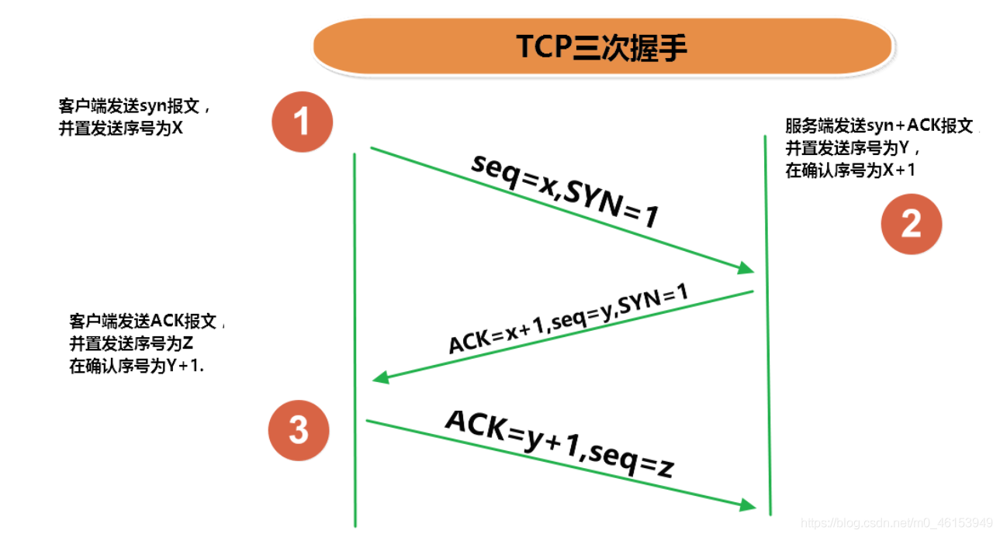
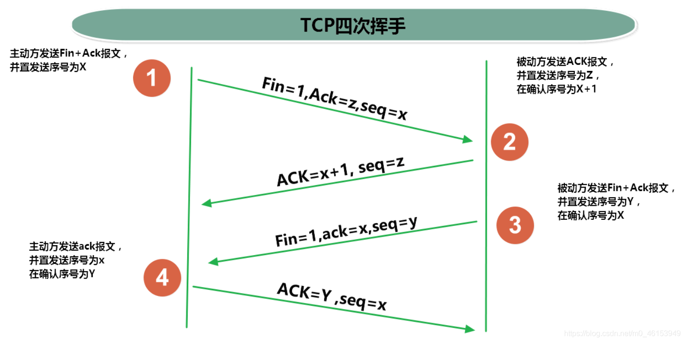

- **网络通信协议** 计算机网络中实现通信必须有一些约定，即[通信协议](https://so.csdn.net/so/search?q=通信协议&spm=1001.2101.3001.7020)，对速率、传输代码、代码结构、传输控制步骤、出错控制等制定标准。
- **问题：网络协议太复杂** 计算机网络通信涉及内容很多，比如指定源地址和目标地址，加密解密，压缩解压缩，差错控制，流量控制，路由控制，如何实现如此复杂的网络协议呢？
- **通信协议分层的思想** 在制定协议时，把复杂成份分解成一些简单的成份，再将它们复合起来。最常用的复合方式是层次方式，即同层间可以通信、上一层可以调用下一层，而与再下一层不发生关系。各层互不影响，利于系统的开发和扩展。

## 4.1、TCP和[UDP](https://so.csdn.net/so/search?q=UDP&spm=1001.2101.3001.7020)网络通信协议的对比

- 传输层协议中有两个非常重要的协议：
  - 传输控制协议TCP(Transmission Control Protocol)
  - 用户数据报协议UDP(User Datagram Protocol)。
- TCP/IP 以其两个主要协议：传输控制协议(TCP)和网络互联协议(IP)而得名，实际上是一组协议，包括多个具有不同功能且互为关联的协议。
- IP(Internet Protocol)协议是网络层的主要协议，支持网间互连的数据通信。
- TCP/IP协议模型从更实用的角度出发，形成了高效的四层体系结构，即物理链路层、IP层、传输层和应用层。
- TCP协议：
  - 使用TCP协议前，须先建立TCP连接，形成传输数据通道
  - 传输前，采用“三次握手”方式，点对点通信，是可靠的
  - TCP协议进行通信的两个应用进程：客户端、服务端。
  - 在连接中可进行大数据量的传输传输完毕，需释放已建立的连接，效率低
- UDP协议：
  - 将数据、源、目的封装成数据包，不需要建立连接
  - 每个数据报的大小限制在64K内
  - 发送不管对方是否准备好，接收方收到也不确认，故是不可靠的
  - 可以广播发送
  - 发送数据结束时无需释放资源，开销小，速度快



```text
第一次握手：建立连接。客户端发送连接请求报文段，将SYN位置为1，Sequence Number为x；然
后，客户端进入SYN_SEND状态，等待服务器的确认；
第二次握手：服务器收到SYN报文段。服务器收到客户端的SYN报文段，需要对这个SYN报文段进行确
认，设置Acknowledgment Number为x+1(Sequence Number+1)；同时，自己自己还要发送SYN请求
信息，将SYN位置为1，Sequence Number为y；服务器端将上述所有信息放到一个报文段（即
SYN+ACK报文段）中，一并发送给客户端，此时服务器进入SYN_RECV状态；
第三次握手：客户端收到服务器的SYN+ACK报文段。然后将Acknowledgment Number设置为y+1，
向服务器发送ACK报文段，这个报文段发送完毕以后，客户端和服务器端都进入ESTABLISHED状态，完
成TCP三次握手。
```




```text
第一次挥手：主机1（可以使客户端，也可以是服务器端），设置Sequence Number，向主机2发送一
个FIN报文段；此时，主机1进入FIN_WAIT_1状态；这表示主机1没有数据要发送给主机2了；
第二次挥手：主机2收到了主机1发送的FIN报文段，向主机1回一个ACK报文段，Acknowledgment
Number为Sequence Number加1；主机1进入FIN_WAIT_2状态；主机2告诉主机1，我“同意”你的关闭
请求；
第三次挥手：主机2向主机1发送FIN报文段，请求关闭连接，同时主机2进入LAST_ACK状态；
第四次挥手：主机1收到主机2发送的FIN报文段，向主机2发送ACK报文段，然后主机1进入TIME_WAIT
状态；主机2收到主机1的ACK报文段以后，就关闭连接；此时，主机1等待2MSL后依然没有收到回复，
则证明Server端已正常关闭，那好，主机1也可以关闭连接了。
```