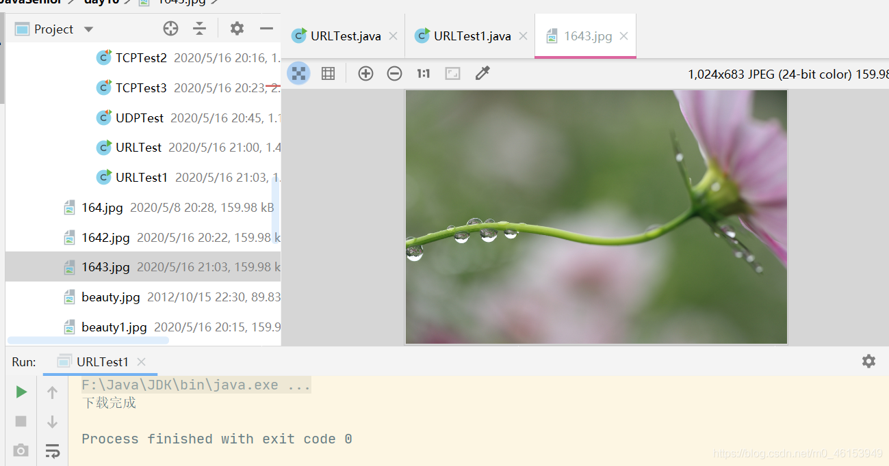
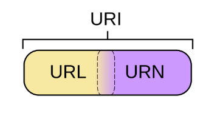

## 7.1、URL的理解与实例化

```java
import java.net.MalformedURLException;
import java.net.URL;

/**
 * URL网络编程
 * 1.URL:统一资源定位符，对应着互联网的某一资源地址
 * 2.格式：
 *  http://127.0.0.1:8080/work/164.jpg?username=subei
 *  协议   主机名    端口号  资源地址           参数列表
 */
public class URLTest { 
    public static void main(String[] args) { 
        try { 
            URL url = new URL("http://127.0.0.1:8080/work/164.jpg?username=subei");

//            public String getProtocol(  )     获取该URL的协议名
            System.out.println(url.getProtocol());
//            public String getHost(  )           获取该URL的主机名
            System.out.println(url.getHost());
//            public String getPort(  )            获取该URL的端口号
            System.out.println(url.getPort());
//            public String getPath(  )           获取该URL的文件路径
            System.out.println(url.getPath());
//            public String getFile(  )             获取该URL的文件名
            System.out.println(url.getFile());
//            public String getQuery(   )        获取该URL的查询名
            System.out.println(url.getQuery());
        } catch (MalformedURLException e) { 
            e.printStackTrace();
        }
    }
}
```

## 7.2、URL网络编程实现Tomcat服务端数据下载

```java
import java.io.FileOutputStream;
import java.io.IOException;
import java.io.InputStream;
import java.net.HttpURLConnection;
import java.net.URL;

public class URLTest1 { 
    public static void main(String[] args) { 
        HttpURLConnection urlConnection = null;
        InputStream is = null;
        FileOutputStream fos = null;
        try { 
            URL url = new URL("http://127.0.0.1:8080/work/164.jpg");

            urlConnection = (HttpURLConnection) url.openConnection();

            urlConnection.connect();

            is = urlConnection.getInputStream();
            fos = new FileOutputStream("day10\\1643.jpg");

            byte[] buffer = new byte[1024];
            int len;
            while((len = is.read(buffer)) != -1){ 
                fos.write(buffer,0,len);
            }

            System.out.println("下载完成");
        } catch (IOException e) { 
            e.printStackTrace();
        } finally { 
            //关闭资源
            if(is != null){ 
                try { 
                    is.close();
                } catch (IOException e) { 
                    e.printStackTrace();
                }
            }
            if(fos != null){ 
                try { 
                    fos.close();
                } catch (IOException e) { 
                    e.printStackTrace();
                }
            }
            if(urlConnection != null){ 
                urlConnection.disconnect();
            }
        }
    }
}
```




## 7.3、URI、URL和URN的区别

- URI，是uniform resource identifier，**统一资源标识符**，用来唯一的标识一个资源。而URL是uniform resource locator， **统一资源定位符** ，它是一种具体的URI，即URL可以用来标识一个资源，而且还指明了如何locate这个资源。而URN，uniform resource name，**统一资源命名**，是通过名字来标识资源，比如mailto:[java-net@java.sun.com](mailto:java-net@java.sun.com)。也就是说，URI是以一种抽象的，高层次概念定义统一资源标识，而URL和URN则是具体的资源标识的方式。URL和URN都是一种URI。
- 在Java的URI中，一个URI实例可以代表绝对的，也可以是相对的，只要它符合URI的语法规则。而URL类则不仅符合语义，还包含了定位该资源的信息，因此它不能是相对的。 

