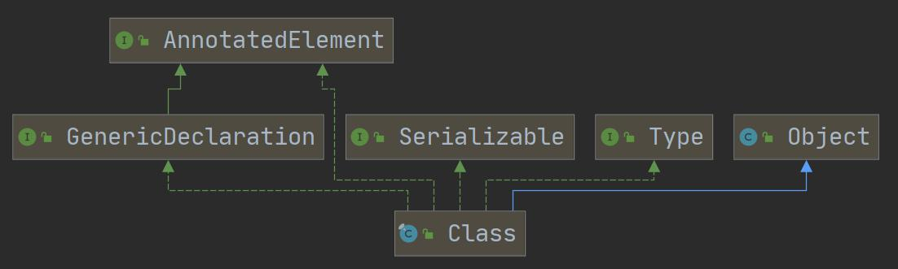
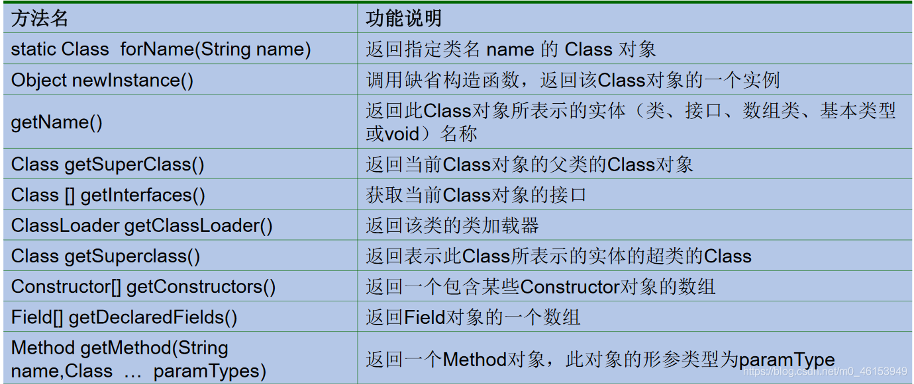

## 2.3、Class类的理解



```java
    /**
     * 关于java.lang.Class类的理解
     * 1.类的加载过程：
     * 程序经过Javac.exe命令后，会生成一个或多个字节码文件(.class结尾)。
     * 接着我们使用java.exe命令对某个字节码文件进行解释运行。相当于将某个字节码文件
     * 加载到内存中。此过程就称为类的加载。加载到内存中的类，我们就称为运行时类，此
     * 运行时类，就作为Class的一个实例。
     *
     * 换句话说，Class的实例就对应着一个运行时类。
     * 2.Class也继承了Object类
     * 3.加载到内存中的运行时类，会缓存一定的时间。在此时间之内，我们可以通过不同的方式
     * 来获取此运行时类。
     * 4.每个类只会加载一次，因此如果创建多个该Class对象，其实都指向一个地址；
     * 65.Class对象是存放在堆中，类的字节码二进制数据是放在方法区的，有的地方称为类的
     * 元数据(包括 方法代码，变量名，方法名，访问权限等)
     */
```

> **Class类的常用方法**




## 2.4、获取Class实例的4种方式

```java
import org.junit.Test;

import java.lang.annotation.ElementType;
import java.lang.reflect.Constructor;
import java.lang.reflect.Field;
import java.lang.reflect.Method;

public class ReflectionTest { 

    @Test
    public void test3() throws ClassNotFoundException { 
        //方式一：
        Class c1 = Person.class;
        System.out.println(c1);

        //方式二：通过运行时类的对象,调用getClass()
        Person p1 = new Person();
        Class c2 = p1.getClass();
        System.out.println(c2);

        //方式三：调用Class的静态方法：forName(String classPath)
        Class c3 = Class.forName("www.gh110.com");
//        c3 = Class.forName("www.123.com");
        System.out.println(c3);

        System.out.println(c1 == c2);
        System.out.println(c1 == c3);

        //方式四：使用类的加载器：ClassLoader  (了解)
        ClassLoader classLoader = ReflectionTest.getClass.getClassLoader();
        Class c4 = classLoader.loadClass("www.gh110.com");
        System.out.println(c4);

        System.out.println(c1 == c4);//true
    }
}
```

## 2.5、Class实例对应的结构的说明

> 1、哪些类型可以有Class对象？

（1）`class`：外部类，成员(成员内部类，静态内部类)，局部内部类，匿名内部类 （2）`interface`：接口 （3）`[]`：数组 （4）`enum`：枚举 （5）`annotation`：注解`@interface` （6）`primitivetype`：基本数据类型 （7）`void`

```java
import org.junit.Test;
import java.lang.annotation.ElementType;
import java.lang.reflect.Constructor;
import java.lang.reflect.Field;
import java.lang.reflect.Method;

public class ReflectionTest { 

    //万事万物皆对象？对象.xxx,File,URL,反射,前端、数据库操作

    /**
     * Class实例可以是哪些结构的说明：
     */
    @Test
    public void test4() { 
        Class s1 = Object.class;
        Class s2 = Comparable.class;
        Class s3 = String[].class;
        Class s4 = int[][].class;
        Class s5 = ElementType.class;
        Class s6 = Override.class;
        Class s7 = int.class;
        Class s8 = void.class;
        Class s9 = Class.class;

        int[] a = new int[10];
        int[] b = new int[100];
        Class s10 = a.getClass();
        Class s11 = b.getClass();
        // 只要数组的元素类型与维度一样(一维数组，二维数组)，就是同一个Class
        System.out.println(s10 == s11);
    }

}
```