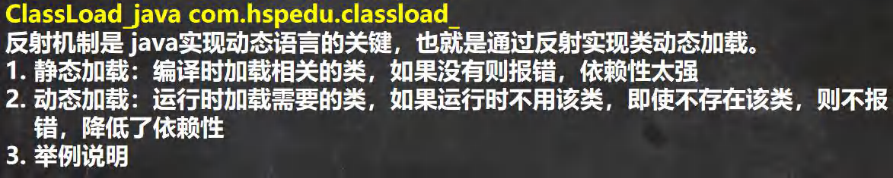
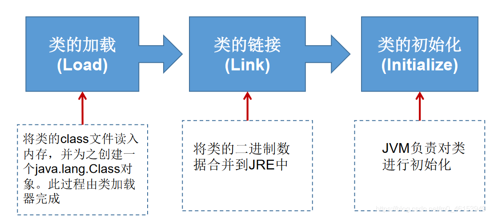
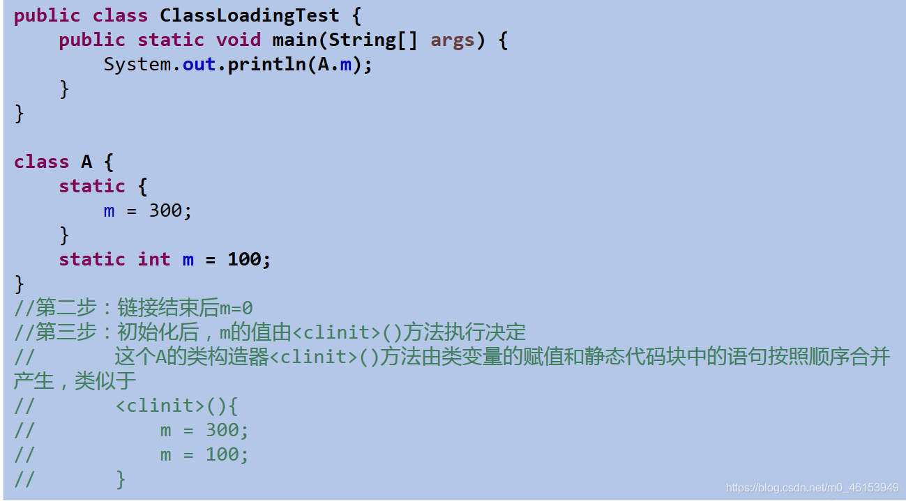
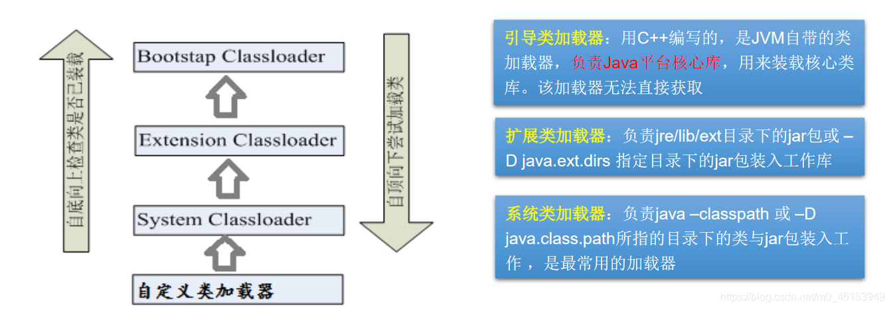
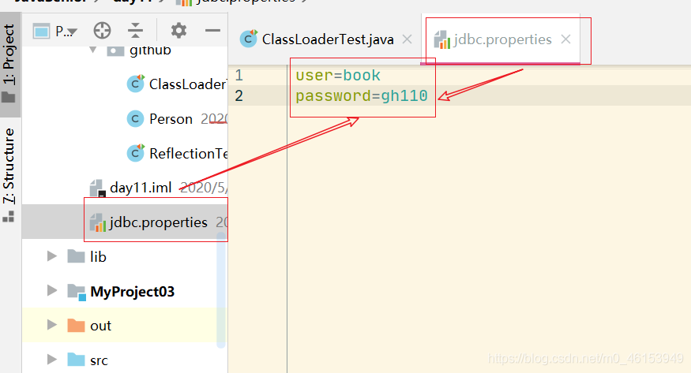

## 3.6、了解：类的加载过程

> 当程序主动使用某个类时，如果该类还未被加载到内存中，则系统会通过如下三个步骤来对该类进行初始化。






> 说明

- 加载：将class文件字节码内容加载到内存中，并将这些静态数据转换成方法区的运行时数据结构，然后生成一个代表这个类的java.lang.Class对象，作为方法区中类数据的访问入口（即引用地址）。所有需要访问和使用类数据只能通过这个Class对象。这个加载的过程需要类加载器参与。
- 链接：将Java类的二进制代码合并到JVM的运行状态之中的过程。
  - 验证：确保加载的类信息符合JVM规范，包括4种验证：文件格式验证，元数据验证，字节码验证，符号引用验证| 例如：以cafe开头，没有安全方面的问题
  - 准备：正式为类变量（static）分配内存并设置类变量默认初始值的阶段，这些内存都将在方法区中进行分配。
  - 解析：虚拟机常量池内的符号引用（常量名）替换为直接引用（地址）的过程。
- 初始化：
  - 执行类构造器<clinit>()方法的过程。类构造器<clinit>()方法是由编译期自动收集类中所有类变量的赋值动作和静态代码块中的语句合并产生的。（类构造器是构造类信息的，不是构造该类对象的构造器）。
  - 当初始化一个类的时候，如果发现其父类还没有进行初始化，则需要先触发其父类的初始化。
  - 虚拟机会保证一个类的<clinit>()方法在多线程环境中被正确加锁和同步。如果多个线程同时去初始化一个类，那么只会有一个线程去执行这个类的<clinit>方法，其他线程都需要阻塞等待，直到活动线程执行<clinit>()方法完毕；




## 3.7、了解：什么时候会发生类初始化？

- 类的主动引用（一定会发生类的初始化）
  - 当虚拟机启动，先初始化main方法所在的类
  - new一个类的对象
  - 调用类的静态成员（除了final常量）和静态方法
  - 使用java.lang.reflect包的方法对类进行反射调用
  - 当初始化一个类，如果其父类没有被初始化，则先会初始化它的父类
- 类的被动引用（不会发生类的初始化）
  - 当访问一个静态域时，只有真正声明这个域的类才会被初始化
    - 当通过子类引用父类的静态变量，不会导致子类初始化
  - 通过数组定义类引用，不会触发此类的初始化//Object[] array = new Object[3];
  - 引用常量不会触发此类的初始化（常量在链接阶段就存入调用类的常量池中了）

## 3.8、ClassLoader的理解


- 类加载器的作用：
  - 类加载的作用：将class文件字节码内容加载到内存中，并将这些静态数据转换成方法区的运行时数据结构，然后在堆中生成一个代表这个类的java.lang.Class对象，作为方法区中类数据的访问入口。
  - 类缓存：标准的JavaSE类加载器可以按要求查找类，但一旦某个类被加载到类加载器中，它将维持加载（缓存）一段时间。不过JVM垃圾回收机制可以回收这些Class对象。
- 类加载器作用是用来把类(class)装载进内存的。JVM 规范定义了如下类型的类的加载器。




```java
import org.junit.Test;

/**
 * 了解类的加载器
 *
 */
public class ClassLoaderTest { 
  
    @Test
    public void test1(){ 
        //对于自定义类，使用系统类加载器进行加载
        ClassLoader classLoader = ClassLoaderTest.class.getClassLoader();
        System.out.println(classLoader);
        //调用系统类加载器的getParent()：获取扩展类加载器
        ClassLoader classLoader1 = classLoader.getParent();
        System.out.println(classLoader1);
        //调用扩展类加载器的getParent()：无法获取引导类加载器
        //引导类加载器主要负责加载java的核心类库，无法加载自定义类的。
        ClassLoader classLoader2 = classLoader1.getParent();
        System.out.println(classLoader2);

        ClassLoader classLoader3 = String.class.getClassLoader();
        System.out.println(classLoader3);
    }
}
```

## 3.9、使用ClassLoader加载配置文件




```java
import org.junit.Test;

import java.io.InputStream;
import java.util.Properties;

/**
 * 了解类的加载器
 */
public class ClassLoaderTest { 

    /**
     * Properties：用来读取配置文件。
     * @throws Exception
     */
    @Test
    public void test2() throws Exception { 
        Properties pros = new Properties();
        //此时的文件默认在当前的module下。
        //读取配置文件的方式一：
//        FileInputStream fis = new FileInputStream("jdbc.properties");
//        pros.load(fis);

        //读取配置文件的方式二：使用ClassLoader
        //配置文件默认识别为：当前module的src下
        ClassLoader classLoader = ClassLoaderTest.class.getClassLoader();
        InputStream is = classLoader.getResourceAsStream("jdbc1.properties");
        pros.load(is);

        String user = pros.getProperty("user");
        String password = pros.getProperty("password");
        System.out.println("user = " + user + ",password = " + password);
    }
}
```