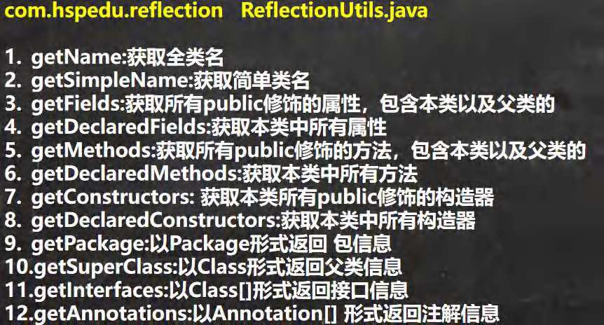
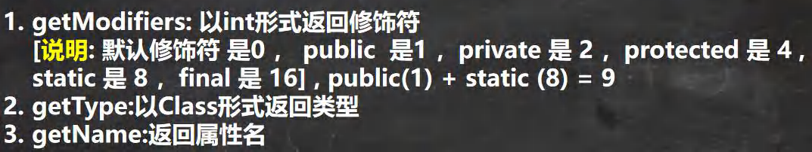
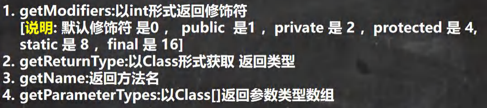

> Class类



> Field类



> Method类



> Constructor类


## 5.1、提供结构丰富Person类

> 1、Person类

```java
@MyAnnotation(value="java")
public class Person extends Creature<String> implements Comparable<String>,MyInterface{ 

    private String name;
    int age;
    public int id;

    public Person() { 
    }

    @MyAnnotation(value="C++")
    Person(String name){ 
        this.name = name;
    }

    private Person(String name,int age){ 
        this.name = name;
        this.age = age;
    }

    @MyAnnotation
    private String show(String nation){ 
        System.out.println("我来自" + nation + "星系");
        return nation;
    }

    @Override
    public void info() { 
        System.out.println("火星喷子");
    }

    public String display(String play){ 
        return play;
    }

    @Override
    public int compareTo(String o) { 
        return 0;
    }
}
```

> 2、Creature类

```java
import java.io.Serializable;

public abstract class Creature <T> implements Serializable { 
    private char gender;
    public double weight;

    private void breath(){ 
        System.out.println("太阳系");
    }

    public void eat(){ 
        System.out.println("银河系");
    }
}
```

> 3、MyInterface

```java
public interface MyInterface { 
    void info();
}
```

> 4、MyAnnotation

```java
import java.lang.annotation.Retention;
import java.lang.annotation.RetentionPolicy;
import java.lang.annotation.Target;

import static java.lang.annotation.ElementType.*;

@Target({ TYPE, FIELD, METHOD, PARAMETER, CONSTRUCTOR, LOCAL_VARIABLE})
@Retention(RetentionPolicy.RUNTIME)
public @interface MyAnnotation { 
    String value() default "hello world";
}
```

## 5.2、获取运行时类的属性结构及其内部结构

> 1、Person类

```java
package github2;

@MyAnnotation(value="java")
public class Person extends Creature<String> implements Comparable<String>,MyInterface{ 

    private String name;
    int age;
    public int id;

    public Person() { 
    }

    @MyAnnotation(value="C++")
    Person(String name){ 
        this.name = name;
    }

    private Person(String name,int age){ 
        this.name = name;
        this.age = age;
    }

    @MyAnnotation
    private String show(String nation){ 
        System.out.println("我来自" + nation + "星系");
        return nation;
    }

    @Override
    public void info() { 
        System.out.println("火星喷子");
    }

    public String display(String play){ 
        return play;
    }

    @Override
    public int compareTo(String o) { 
        return 0;
    }
}
```

> 2、测试类

```java
import github2.Person;
import org.junit.Test;

import java.lang.reflect.Field;
import java.lang.reflect.Modifier;

/**
 * 获取当前运行时类的属性结构
 */
public class FieldTest { 

    @Test
    public void test(){ 
        Class clazz = Person.class;
        //获取属性结构
        //getFields():获取当前运行时类及其父类中声明为public访问权限的属性
        Field[] fields = clazz.getFields();
        for(Field f : fields){ 
            System.out.println(f);
        }
        System.out.println("++++++++++++++++++");
        //getDeclaredFields():获取当前运行时类中声明的所有属性。（不包含父类中声明的属性）
        Field[] declaredFields = clazz.getDeclaredFields();
        for(Field f : declaredFields){ 
            System.out.println(f);
        }
    }

    //权限修饰符  数据类型 变量名
    @Test
    public void test2(){ 
        Class clazz = Person.class;
        Field[] declaredFields = clazz.getDeclaredFields();
        for(Field f : declaredFields){ 
            //1.权限修饰符
            int modifier = f.getModifiers();
            System.out.print(Modifier.toString(modifier) + "\t");
            System.out.println("+++++++++++++++++++++++++++");
            //2.数据类型
            Class type = f.getType();
            System.out.print(type.getName() + "\t");
            System.out.println("***************************");
            //3.变量名
            String fName = f.getName();
            System.out.print(fName);
        }
    }
}
```

## 5.3、获取运行时类的方法结构

> 1、Person类

```java
package github2;

@MyAnnotation(value="java")
public class Person extends Creature<String> implements Comparable<String>,MyInterface{ 

    private String name;
    int age;
    public int id;

    public Person() { 
    }

    @MyAnnotation(value="C++")
    Person(String name){ 
        this.name = name;
    }

    private Person(String name,int age){ 
        this.name = name;
        this.age = age;
    }

    @MyAnnotation
    private String show(String nation){ 
        System.out.println("我来自" + nation + "星系");
        return nation;
    }

    @Override
    public void info() { 
        System.out.println("火星喷子");
    }

    public String display(String play){ 
        return play;
    }

    @Override
    public int compareTo(String o) { 
        return 0;
    }
}
```

> 2、测试类

```java
package github3;

import github2.Person;
import org.junit.Test;

import java.lang.reflect.Method;

/**
 * 获取运行时类的方法结构
 */
public class MythodTest { 
    @Test
    public void test(){ 
        Class clazz = Person.class;
        //getMethods():获取当前运行时类及其所有父类中声明为public权限的方法
        Method[] methods = clazz.getMethods();
        for(Method m : methods){ 
            System.out.println(m + "****");
        }
        System.out.println("++++++++++++++++++++++++++++");
        //getDeclaredMethods():获取当前运行时类中声明的所有方法。（不包含父类中声明的方法）
        Method[] declaredMethods = clazz.getDeclaredMethods();
        for(Method m : declaredMethods){ 
            System.out.println(m);
        }
    }
}
```

## 5.4、获取运行时类的方法的内部结构

> 1、Person类

```java
@MyAnnotation(value="java")
public class Person extends Creature<String> implements Comparable<String>,MyInterface{ 

    private String name;
    int age;
    public int id;

    public Person() { 
    }

    @MyAnnotation(value="C++")
    Person(String name){ 
        this.name = name;
    }

    private Person(String name,int age){ 
        this.name = name;
        this.age = age;
    }

    @MyAnnotation
    private String show(String nation){ 
        System.out.println("我来自" + nation + "星系");
        return nation;
    }

    @Override
    public void info() { 
        System.out.println("火星喷子");
    }

    public String display(String interests,int age) throws Exception{ 
        return interests + age;
    }

    @Override
    public int compareTo(String o) { 
        return 0;
    }
  
    @Override
    public String toString() { 
        return "Person{" +
                "name='" + name + '\'' +
                ", age=" + age +
                ", id=" + id +
                '}';
    }
}
```

> 2、测试类

```java
package github3;

import github2.Person;
import org.junit.Test;

import java.lang.annotation.Annotation;
import java.lang.reflect.Method;
import java.lang.reflect.Modifier;

/**
 * 获取运行时类的方法结构
 */
public class MythodTest { 

    /**
     * @Xxxx
     * 权限修饰符  返回值类型  方法名(参数类型1 形参名1,...) throws XxxException{}
     */
    @Test
    public void test2() { 
        Class clazz = Person.class;
        Method[] declaredMethods = clazz.getDeclaredMethods();
        for (Method m : declaredMethods) { 
            //1.获取方法声明的注解
            Annotation[] annos = m.getAnnotations();
            for (Annotation a : annos) { 
                System.out.println(a + "KKKK");
            }

            //2.权限修饰符
            System.out.print(Modifier.toString(m.getModifiers()) + "\t");

            //3.返回值类型
            System.out.print(m.getReturnType().getName() + "\t");

            //4.方法名
            System.out.print(m.getName());
            System.out.print("(");
            //5.形参列表
            Class[] pTs = m.getParameterTypes();
            if(!(pTs == null && pTs.length == 0)){ 
                for(int i = 0;i < pTs.length;i++){ 
                    if(i == pTs.length - 1){ 
                        System.out.print(pTs[i].getName() + " args_" + i);
                        break;
                    }
                    System.out.print(pTs[i].getName() + " args_" + i + ",");
                }
            }
            System.out.print(")");

            //6.抛出的异常
            Class[] eTs = m.getExceptionTypes();
            if(eTs.length > 0){ 
                System.out.print("throws ");
                for(int i = 0;i < eTs.length;i++){ 
                    if(i == eTs.length - 1){ 
                        System.out.print(eTs[i].getName());
                        break;
                    }
                    System.out.print(eTs[i].getName() + ",");
                }
            }
            System.out.println("TQA");
        }
    }

}
```

## 5.5、获取运行时类的构造器结构

```java
package github3;

import github2.Person;
import org.junit.Test;

import java.lang.reflect.Constructor;

public class OtherTest { 
    /**
     * 获取构造器的结构
     */
    @Test
    public void test(){ 
        Class clazz = Person.class;
        //getConstructors():获取当前运行时类中声明为public的构造器
        Constructor[] constructors = clazz.getConstructors();
        for(Constructor c : constructors){ 
            System.out.println(c);
        }
        System.out.println("************************");
        //getDeclaredConstructors():获取当前运行时类中声明的所有的构造器
        Constructor[] declaredConstructors = clazz.getDeclaredConstructors();
        for(Constructor c : declaredConstructors){ 
            System.out.println(c);
        }
    }
}
```

## 5.6、获取运行时类的父类及父类的泛型

```java
package github3;

import github2.Person;
import org.junit.Test;

import java.lang.reflect.Constructor;
import java.lang.reflect.ParameterizedType;
import java.lang.reflect.Type;

public class OtherTest { 
    /**
     * 获取运行时类的父类
     */
    @Test
    public void test2(){ 
        Class clazz = Person.class;
        Class superclass = clazz.getSuperclass();
        System.out.println(superclass);
    }

    /**
     * 获取运行时类的带泛型的父类
     */
    @Test
    public void test3(){ 
        Class clazz = Person.class;
        Type genericSuperclass = clazz.getGenericSuperclass();
        System.out.println(genericSuperclass);
    }

    /**
     * 获取运行时类的带泛型的父类的泛型
     */
    @Test
    public void test4(){ 
        Class clazz = Person.class;
        Type genericSuperclass = clazz.getGenericSuperclass();
        ParameterizedType paramType = (ParameterizedType) genericSuperclass;
        //获取泛型类型
        Type[] actualTypeArguments = paramType.getActualTypeArguments();
//        System.out.println(actualTypeArguments[0].getTypeName());
        System.out.println(((Class)actualTypeArguments[0]).getName());
    }
}
```

## 5.7、获取运行时类的接口、所在包、注解等

```java
package github3;

import github2.Person;
import org.junit.Test;

import java.lang.annotation.Annotation;
import java.lang.reflect.Constructor;
import java.lang.reflect.ParameterizedType;
import java.lang.reflect.Type;

public class OtherTest { 
    /**
     * 获取运行时类实现的接口
     */
    @Test
    public void test5(){ 
        Class clazz = Person.class;

        Class[] interfaces = clazz.getInterfaces();
        for(Class c : interfaces){ 
            System.out.println(c);
        }
        System.out.println("++++++++++++++++++++++");
     
        //获取运行时类的父类实现的接口
        Class[] interfaces1 = clazz.getSuperclass().getInterfaces();
        for(Class c : interfaces1){ 
            System.out.println(c);
        }
    }

    /**
     * 获取运行时类所在的包
     */
    @Test
    public void test6(){ 
        Class clazz = Person.class;
        Package pack = clazz.getPackage();
        System.out.println(pack);
    }

    /**
     * 获取运行时类声明的注解
     */
    @Test
    public void test7(){ 
        Class clazz = Person.class;
        Annotation[] annotations = clazz.getAnnotations();
        for(Annotation annos : annotations){ 
            System.out.println(annos);
        }
    }
}
```