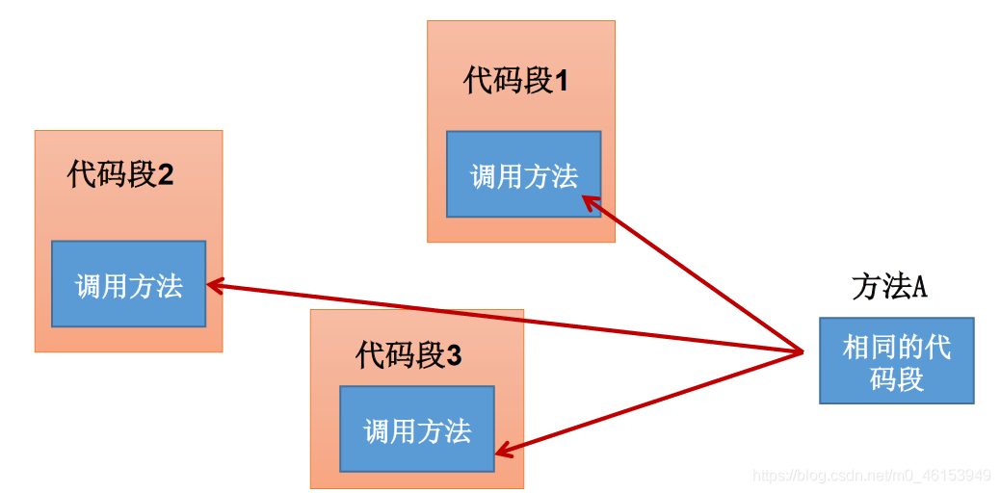
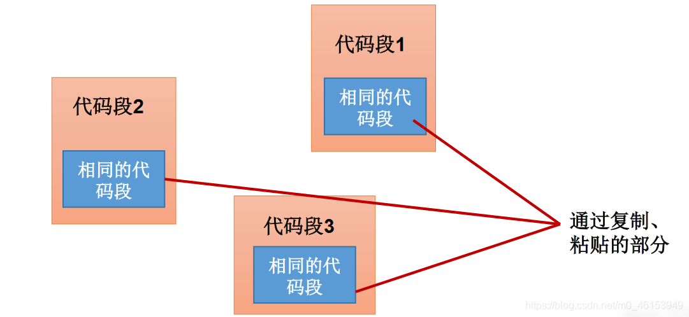
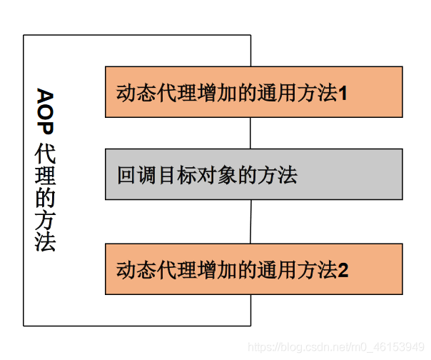

## 7.1、代理模式与动态代理

- 代理设计模式的原理: 使用一个代理将对象包装起来, 然后用该代理对象取代原始对象。任何对原始对象的调用都要通过代理。代理对象决定是否以及何时将方法调用转到原始对象上。
- 之前为大家讲解过代理机制的操作，属于静态代理，特征是代理类和目标对象的类都是在编译期间确定下来，不利于程序的扩展。同时，每一个代理类只能为一个接口服务，这样一来程序开发中必然产生过多的代理。 **最好可以通过一个代理类完成全部的代理功能** 。
- **动态代理**是指客户通过代理类来调用其它对象的方法，并且是在程序运行时根据需要动态创建目标类的代理对象。
- 动态代理使用场合:
  - 调试
  - 远程方法调用
- **动态代理相比于静态代理的优点** ： 抽象角色中（接口）声明的所有方法都被转移到调用处理器一个集中的方法中处理，这样，我们可以更加灵活和统一的处理众多的方法。

## 7.2、静态代理举例

```java
/**
 * 静态代理举例
 *
 * 特点：代理类和被代理类在编译期间，就确定下来了。
 */
interface ClothFactory{ 
    void produceCloth();
}

//代理类
class PersonTest implements ClothFactory{ 
    private ClothFactory factory;//用被代理类对象进行实例化

    public PersonTest(ClothFactory factory){ 
        this.factory = factory;
    }

    @Override
    public void produceCloth() { 
        System.out.println("造纸厂开始做一些准备工作");

        factory.produceCloth();

        System.out.println("造纸厂做一些后续收尾工作");
    }
}

//被代理类
class NeckTest implements ClothFactory{ 

    @Override
    public void produceCloth() { 
        System.out.println("造纸厂计划生产一批卫生纸");
    }
}

public class StaticProxyTest { 
    public static void main(String[] args) { 
        //创建被代理类的对象
        ClothFactory word = new NeckTest();

        //创建代理类的对象
        ClothFactory proxyPaperFactory = new PersonTest(word);

        proxyPaperFactory.produceCloth();
    }
}
```

## 7.3、动态代理举例

```java
import java.lang.reflect.InvocationHandler;
import java.lang.reflect.Method;
import java.lang.reflect.Proxy;

/**
 * 动态代理举例
 */
interface Moon{ 
    String getBelief();

    void Object(String Moon);
}

//被代理类
class Venus implements Moon{ 


    @Override
    public String getBelief() { 
        return "The only planet in the solar system without a magnetic field.";
    }

    @Override
    public void Object(String MinMoon) { 
        System.out.println("周围有很多" + MinMoon);
    }
}

/**
 * 要想实现动态代理，需要解决的问题？
 * 问题一：如何根据加载到内存中的被代理类，动态的创建一个代理类及其对象。
 * 问题二：当通过代理类的对象调用方法a时，如何动态的去调用被代理类中的同名方法a。
 */
class BookTest{ 

    //调用此方法，返回一个代理类的对象。解决问题一
    public static Object getProxyInstance(Object obj){ //obj:被代理类的对象
        DeskTest hander = new DeskTest();
        hander.bind(obj);
        return Proxy.newProxyInstance(obj.getClass().getClassLoader(),obj.getClass().getInterfaces(),hander);
    }
}

class DeskTest implements InvocationHandler{ 

    private Object obj;//需要使用被代理类的对象进行赋值

    public void bind(Object obj){ 
        this.obj = obj;
    }

    //当我们通过代理类的对象，调用方法a时，就会自动的调用如下的方法：invoke()
    //将被代理类要执行的方法a的功能就声明在invoke()中
    @Override
    public Object invoke(Object proxy, Method method, Object[] args) throws Throwable { 

        //method:即为代理类对象调用的方法，此方法也就作为了被代理类对象要调用的方法
        //obj:被代理类的对象
        Object returnValue = method.invoke(obj,args);

        //上述方法的返回值就作为当前类中的invoke()的返回值。
        return returnValue;
    }
}

public class ProductTest { 
    public static void main(String[] args) { 
        Venus superMan = new Venus();
        //NumTest:代理类的对象
        Moon NumTest = (Moon) BookTest.getProxyInstance(superMan);
        //当通过代理类对象调用方法时，会自动的调用被代理类中同名的方法
        String belief = NumTest.getBelief();
        System.out.println(belief);
        NumTest.Object("四川大巴山");

        System.out.println("+++++++++++++++++++");

        NeckTest fox = new NeckTest();
        ClothFactory ween = (ClothFactory) BookTest.getProxyInstance(fox);

        ween.produceCloth();
    }
}
```

### 7.4、AOP与动态代理的举例

> 前面介绍的Proxy和InvocationHandler，很难看出这种动态代理的优势，下面介绍一种更实用的动态代理机制






- 改进后的说明：代码段1、代码段2、代码段3和深色代码段分离开了，但代码段1、2、3又和一个特定的方法A耦合了！最理想的效果是：代码块1、2、3既可以执行方法A，又无须在程序中以硬编码的方式直接调用深色代码的方法。
- 使用Proxy生成一个动态代理时，往往并不会凭空产生一个动态代理，这样没有太大的意义。通常都是为指定的目标对象生成动态代理
- 这种动态代理在AOP中被称为AOP代理，AOP代理可代替目标对象，AOP代理包含了目标对象的全部方法。但AOP代理中的方法与目标对象的方法存在差异： **AOP代理里的方法可以在执行目标方法之前、之后插入一些通用处理** 。




> 举例

```java
/**
 * 静态代理举例
 *
 * 特点：代理类和被代理类在编译期间，就确定下来了。
 */
interface ClothFactory{ 
    void produceCloth();
}

//代理类
class PersonTest implements ClothFactory{ 
    private ClothFactory factory;//用被代理类对象进行实例化

    public PersonTest(ClothFactory factory){ 
        this.factory = factory;
    }

    @Override
    public void produceCloth() { 
        System.out.println("造纸厂开始做一些准备工作");

        factory.produceCloth();

        System.out.println("造纸厂做一些后续收尾工作");
    }
}

//被代理类
class NeckTest implements ClothFactory{ 

    @Override
    public void produceCloth() { 
        System.out.println("造纸厂计划生产一批卫生纸");
    }
}

public class StaticProxyTest { 
    public static void main(String[] args) { 
        //创建被代理类的对象
        ClothFactory word = new NeckTest();

        //创建代理类的对象
        ClothFactory proxyPaperFactory = new PersonTest(word);

        proxyPaperFactory.produceCloth();
    }
}
```

> 测试类

```java
package github4;

import java.lang.reflect.InvocationHandler;
import java.lang.reflect.Method;
import java.lang.reflect.Proxy;

/**
 * 动态代理举例
 */
interface Moon{ 
    String getBelief();

    void Object(String Moon);
}

//被代理类
class Venus implements Moon{ 


    @Override
    public String getBelief() { 
        return "The only planet in the solar system without a magnetic field.";
    }

    @Override
    public void Object(String MinMoon) { 
        System.out.println("周围有很多" + MinMoon);
    }
}

/**
 * 要想实现动态代理，需要解决的问题？
 * 问题一：如何根据加载到内存中的被代理类，动态的创建一个代理类及其对象。
 * 问题二：当通过代理类的对象调用方法a时，如何动态的去调用被代理类中的同名方法a。
 */
class BookTest{ 

    //调用此方法，返回一个代理类的对象。解决问题一
    public static Object getProxyInstance(Object obj){ //obj:被代理类的对象
        DeskTest hander = new DeskTest();
        hander.bind(obj);
        return Proxy.newProxyInstance(obj.getClass().getClassLoader(),obj.getClass().getInterfaces(),hander);
    }
}

class DeskTest implements InvocationHandler{ 

    private Object obj;//需要使用被代理类的对象进行赋值

    public void bind(Object obj){ 
        this.obj = obj;
    }

    //当我们通过代理类的对象，调用方法a时，就会自动的调用如下的方法：invoke()
    //将被代理类要执行的方法a的功能就声明在invoke()中
    @Override
    public Object invoke(Object proxy, Method method, Object[] args) throws Throwable { 
        SunTest util = new SunTest();
        util.Star();

        //method:即为代理类对象调用的方法，此方法也就作为了被代理类对象要调用的方法
        //obj:被代理类的对象
        Object returnValue = method.invoke(obj,args);

        util.Star2();

        //上述方法的返回值就作为当前类中的invoke()的返回值。
        return returnValue;
    }
}

class SunTest{ 

    public void Star(){ 
        System.out.println("====================通用方法一====================");

    }

    public void Star2(){ 
        System.out.println("====================通用方法二====================");
    }

}

public class ProductTest { 
    public static void main(String[] args) { 
        Venus superMan = new Venus();
        //NumTest:代理类的对象
        Moon NumTest = (Moon) BookTest.getProxyInstance(superMan);
        //当通过代理类对象调用方法时，会自动的调用被代理类中同名的方法
        String belief = NumTest.getBelief();
        System.out.println(belief);
        NumTest.Object("四川大巴山");

        System.out.println("+++++++++++++++++++");

        NeckTest fox = new NeckTest();
        ClothFactory ween = (ClothFactory) BookTest.getProxyInstance(fox);

        ween.produceCloth();
    }
}
```