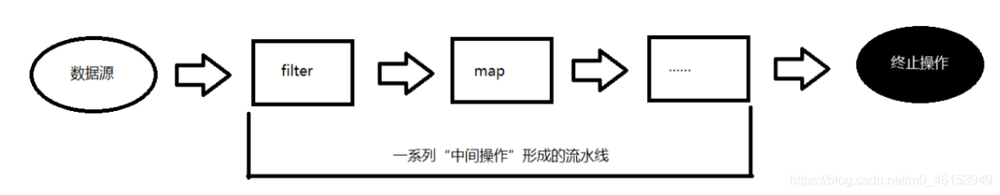
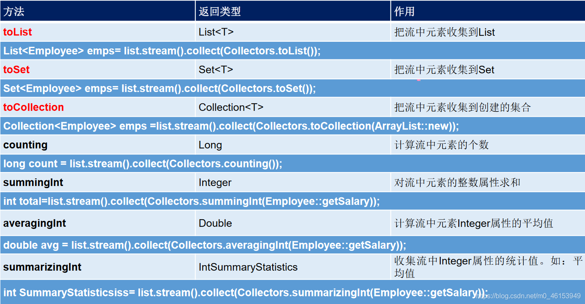
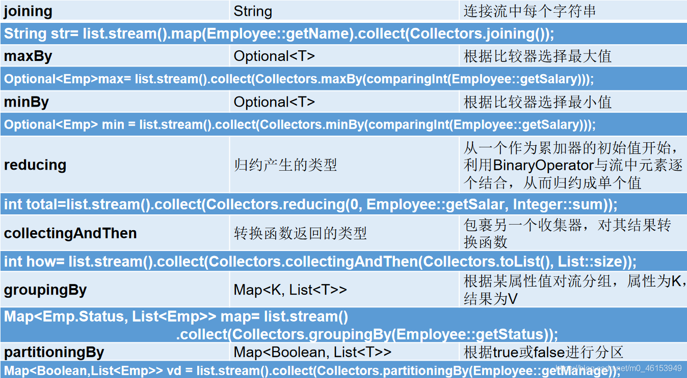

## 7.1、Stream API的概述

- Java8中有两大最为重要的改变。第一个是Lambda 表达式；另外一个则是Stream API。
- Stream API ( `java.util.stream`)把真正的函数式编程风格引入到Java中。这是目前为止对Java类库最好的补充，因为Stream API可以极大提供Java程序员的生产力，让程序员写出高效率、干净、简洁的代码。
- Stream 是Java8 中处理集合的关键抽象概念，它可以指定你希望对集合进行的操作，可以执行非常复杂的查找、过滤和映射数据等操作。使用Stream API 对集合数据进行操作，就类似于使用SQL 执行的数据库查询。也可以使用Stream API 来并行执行操作。简言之，Stream API 提供了一种高效且易于使用的处理数据的方式。
- 为什么要使用Stream API
  - **实际开发中，项目中多数数据源都来自于Mysql，Oracle等。但现在数据源可以更多了，有MongDB，Radis等，而这些NoSQL的数据就需要Java层面去处理** 。
  - **Stream 和Collection 集合的区别：Collection 是一种静态的内存数据结构，而Stream 是有关计算的。前者是主要面向内存，存储在内存中，后者主要是面向CPU，通过CPU 实现计算** 。

```java
/**
 * 1.Stream关注的是对数据的运算，与CPU打交道
 *   集合关注的是数据的存储，与内存打交道
 *
 * 2.
 * ①Stream 自己不会存储元素。
 * ②Stream 不会改变源对象。相反，他们会返回一个持有结果的新Stream。
 * ③Stream 操作是延迟执行的。这意味着他们会等到需要结果的时候才执行
 *
 * 3.Stream 执行流程
 * ① Stream的实例化
 * ② 一系列的中间操作（过滤、映射、...)
 * ③ 终止操作
 *
 * 4.说明：
 * 4.1 一个中间操作链，对数据源的数据进行处理
 * 4.2 一旦执行终止操作，就执行中间操作链，并产生结果。之后，不会再被使用
 */
```




## 7.2、Stream的实例化

> 1、EmployeeData类

```java
import java.util.ArrayList;
import java.util.List;
/**
 * 提供用于测试的数据
 */
public class EmployeeData { 

  public static List<Employee> getEmployees(){ 
    List<Employee> list = new ArrayList<>();
  
    list.add(new Employee(1001, "马化腾", 34, 6000.38));
    list.add(new Employee(1002, "马云", 12, 9876.12));
    list.add(new Employee(1003, "刘强东", 33, 3000.82));
    list.add(new Employee(1004, "雷军", 26, 7657.37));
    list.add(new Employee(1005, "李彦宏", 65, 5555.32));
    list.add(new Employee(1006, "比尔盖茨", 42, 9500.43));
    list.add(new Employee(1007, "任正非", 26, 4333.32));
    list.add(new Employee(1008, "扎克伯格", 35, 2500.32));
  
    return list;
  }
}
```

> 2、Employee类

```java
public class Employee { 

  private int id;
  private String name;
  private int age;
  private double salary;

  public int getId() { 
    return id;
  }

  public void setId(int id) { 
    this.id = id;
  }

  public String getName() { 
    return name;
  }

  public void setName(String name) { 
    this.name = name;
  }

  public int getAge() { 
    return age;
  }

  public void setAge(int age) { 
    this.age = age;
  }

  public double getSalary() { 
    return salary;
  }

  public void setSalary(double salary) { 
    this.salary = salary;
  }

  public Employee() { 
    System.out.println("Employee().....");
  }

  public Employee(int id) { 
    this.id = id;
    System.out.println("Employee(int id).....");
  }

  public Employee(int id, String name) { 
    this.id = id;
    this.name = name;
  }

  public Employee(int id, String name, int age, double salary) { 

    this.id = id;
    this.name = name;
    this.age = age;
    this.salary = salary;
  }

  @Override
  public String toString() { 
    return "Employee{" + "id=" + id + ", name='" + name + '\'' + ", age=" + age + ", salary=" + salary + '}';
  }

  @Override
  public boolean equals(Object o) { 
    if (this == o)
      return true;
    if (o == null || getClass() != o.getClass())
      return false;

    Employee employee = (Employee) o;

    if (id != employee.id)
      return false;
    if (age != employee.age)
      return false;
    if (Double.compare(employee.salary, salary) != 0)
      return false;
    return name != null ? name.equals(employee.name) : employee.name == null;
  }

  @Override
  public int hashCode() { 
    int result;
    long temp;
    result = id;
    result = 31 * result + (name != null ? name.hashCode() : 0);
    result = 31 * result + age;
    temp = Double.doubleToLongBits(salary);
    result = 31 * result + (int) (temp ^ (temp >>> 32));
    return result;
  }
}
```

> 3、测试类

```java
import github2.Employee;
import github2.EmployeeData;
import org.junit.Test;

import java.util.Arrays;
import java.util.List;
import java.util.stream.IntStream;
import java.util.stream.Stream;

/**
 * 测试Stream的实例化
 */
public class StreamAPITest { 

    //创建 Stream方式一：通过集合
    @Test
    public void test(){ 
        List<Employee> employees = EmployeeData.getEmployees();

//        default Stream<E> stream() : 返回一个顺序流
        Stream<Employee> stream = employees.stream();

//        default Stream<E> parallelStream() : 返回一个并行流
        Stream<Employee> parallelStream = employees.parallelStream();
    }

    //创建 Stream方式二：通过数组
    @Test
    public void test2(){ 
        int[] arr = new int[]{ 1,2,3,4,5,6};
        //调用Arrays类的static <T> Stream<T> stream(T[] array): 返回一个流
        IntStream stream = Arrays.stream(arr);

        Employee e1 = new Employee(1001,"Hom");
        Employee e2 = new Employee(1002,"Nut");
        Employee[] arr1 = new Employee[]{ e1,e2};

        Stream<Employee> stream1 = Arrays.stream(arr1);
    }
    //创建 Stream方式三：通过Stream的of()
    @Test
    public void test3(){ 
        Stream<Integer> stream = Stream.of(1, 2, 3, 4, 5, 6);
    }

    //创建 Stream方式四：创建无限流
    @Test
    public void test4(){ 
//      迭代
//      public static<T> Stream<T> iterate(final T seed, final UnaryOperator<T> f)
        //遍历前10个偶数
        Stream.iterate(0, t -> t + 2).limit(10).forEach(System.out::println);

//      生成
//      public static<T> Stream<T> generate(Supplier<T> s)
        Stream.generate(Math::random).limit(10).forEach(System.out::println);
    }
}
```

## 7.3、Stream的中间操作：筛选与切片

多个中间操作可以连接起来形成一个流水线，除非流水线上触发终止操作，否则中间操作不会执行任何的处理！而在终止操作时一次性全部处理，称为“惰性求值”。

| 方法                  | 描述                                                         |
| --------------------- | ------------------------------------------------------------ |
| `filter(Predicate p)` | 接收Lambda ，从流中排除某些元素                              |
| `distinct()`          | 筛选，通过流所生成元素的hashCode() 和equals() 去除重复元素   |
| `limit(long maxSize)` | 截断流，使其元素不超过给定数量                               |
| `skip(long n)`        | 跳过元素，返回一个扔掉了前n 个元素的流。若流中元素不足n 个，则返回一个空流。与`limit(n)`互补 |

```java
import github2.Employee;
import github2.EmployeeData;
import org.junit.Test;

import java.util.List;
import java.util.stream.Stream;

/**
 * 测试Stream的中间操作
 */
public class StreamAPITest2 { 

    //1-筛选与切片
    @Test
    public void test(){ 
        List<Employee> list = EmployeeData.getEmployees();
//        filter(Predicate p)——接收 Lambda ， 从流中排除某些元素。
        Stream<Employee> stream = list.stream();
        //练习：查询员工表中薪资大于7000的员工信息
        stream.filter(e -> e.getSalary() > 7000).forEach(System.out::println);

        System.out.println("+++++++++++++++++++++++");
//        limit(n)——截断流，使其元素不超过给定数量。
        list.stream().limit(3).forEach(System.out::println);
        System.out.println("+++++++++++++++++++++++");

//        skip(n) —— 跳过元素，返回一个扔掉了前 n 个元素的流。若流中元素不足 n 个，则返回一个空流。与 limit(n) 互补
        list.stream().skip(3).forEach(System.out::println);

        System.out.println("+++++++++++++++++++++++");
//        distinct()——筛选，通过流所生成元素的 hashCode() 和 equals() 去除重复元素

        list.add(new Employee(1013,"李飞",42,8500));
        list.add(new Employee(1013,"李飞",41,8200));
        list.add(new Employee(1013,"李飞",28,6000));
        list.add(new Employee(1013,"李飞",39,7800));
        list.add(new Employee(1013,"李飞",40,8000));

//        System.out.println(list);

        list.stream().distinct().forEach(System.out::println);
    }
}
```

## 7.4、Stream的中间操作：映射

| 方法                              | 描述                                                         |
| --------------------------------- | ------------------------------------------------------------ |
| `map(Function f)`                 | 接收一个函数作为参数，该函数会被应用到每个元素上，并将其映射成一个新的元素。 |
| `mapToDouble(ToDoubleFunction f)` | 接收一个函数作为参数，该函数会被应用到每个元素上，产生一个新的DoubleStream。 |
| `mapToInt(ToIntFunction f)`       | 接收一个函数作为参数，该函数会被应用到每个元素上，产生一个新的IntStream。 |
| `mapToLong(ToLongFunction f)`     | 接收一个函数作为参数，该函数会被应用到每个元素上，产生一个新的LongStream。 |
| `flatMap(Function f)`             | 接收一个函数作为参数，将流中的每个值都换成另一个流，然后把所有流连接成一个流 |

```java
import github2.Employee;
import github2.EmployeeData;
import org.junit.Test;

import java.util.ArrayList;
import java.util.Arrays;
import java.util.List;
import java.util.stream.Stream;

/**
 * 测试Stream的中间操作
 */
public class StreamAPITest2 { 

    //2-映射
    @Test
    public void test2(){ 
//        map(Function f)——接收一个函数作为参数，将元素转换成其他形式或提取信息，该函数会被应用到每个元素上，并将其映射成一个新的元素。
        List<String> list = Arrays.asList("aa", "bb", "cc", "dd");
        list.stream().map(str -> str.toUpperCase()).forEach(System.out::println);

//        练习1：获取员工姓名长度大于3的员工的姓名。
        List<Employee> employees = EmployeeData.getEmployees();
        Stream<String> namesStream = employees.stream().map(Employee::getName);
        namesStream.filter(name -> name.length() > 3).forEach(System.out::println);
        System.out.println();

        //练习2：
        Stream<Stream<Character>> streamStream = list.stream().map(StreamAPITest2::fromStringToStream);
      
        streamStream.forEach(s ->{ 
            s.forEach(System.out::println);
        });
        System.out.println("++++++++++++++++++++++");
//        flatMap(Function f)——接收一个函数作为参数，将流中的每个值都换成另一个流，然后把所有流连接成一个流。
        Stream<Character> characterStream = list.stream().flatMap(StreamAPITest2::fromStringToStream);
      
        characterStream.forEach(System.out::println);
    }

    //将字符串中的多个字符构成的集合转换为对应的Stream的实例
    public static Stream<Character> fromStringToStream(String str){ //aa
        ArrayList<Character> list = new ArrayList<>();
        for(Character c : str.toCharArray()){ 
            list.add(c);
        }
        return list.stream();
    }

    @Test
    public void test3(){ 
        ArrayList list1 = new ArrayList();
        list1.add(25);
        list1.add(33);
        list1.add(14);

        ArrayList list2 = new ArrayList();
        list2.add(51);
        list2.add(23);
        list2.add(61);

//        list1.add(list2);
        list1.addAll(list2);
        System.out.println(list1);
    }
}
```

## 7.5、Stream的中间操作：排序

| 方法                     | 描述                               |
| ------------------------ | ---------------------------------- |
| `sorted()`               | 产生一个新流，其中按自然顺序排序   |
| `sorted(Comparator com)` | 产生一个新流，其中按比较器顺序排序 |

```java
import github2.Employee;
import github2.EmployeeData;
import org.junit.Test;

import java.util.ArrayList;
import java.util.Arrays;
import java.util.List;
import java.util.stream.Stream;

/**
 * 测试Stream的中间操作
 */
public class StreamAPITest2 { 

    //3-排序
    @Test
    public void test4(){ 
//        sorted()——自然排序
        List<Integer> list = Arrays.asList(25,45,36,12,85,64,72,-95,4);
        list.stream().sorted().forEach(System.out::println);
        //抛异常，原因:Employee没有实现Comparable接口
//        List<Employee> employees = EmployeeData.getEmployees();
//        employees.stream().sorted().forEach(System.out::println);


//        sorted(Comparator com)——定制排序

        List<Employee> employees = EmployeeData.getEmployees();
        employees.stream().sorted( (e1,e2) -> { 

            int ageValue = Integer.compare(e1.getAge(),e2.getAge());
            if(ageValue != 0){ 
                return ageValue;
            }else{ 
                return -Double.compare(e1.getSalary(),e2.getSalary());
            }

        }).forEach(System.out::println);
    }
}
```

## 7.6、Stream的终止操作：匹配与查找

- 终端操作会从流的流水线生成结果。其结果可以是任何不是流的值，例如：List、Integer，甚至是void 。
- 流进行了终止操作后，不能再次使用。

| 方法                     | 描述                                                         |
| ------------------------ | ------------------------------------------------------------ |
| `allMatch(Predicate p)`  | 检查是否匹配所有元素                                         |
| `anyMatch(Predicate p)`  | 检查是否至少匹配一个元素                                     |
| `noneMatch(Predicate p)` | 检查是否没有匹配所有元素                                     |
| `findFirst()`            | 返回第一个元素                                               |
| `findAny()`              | 返回当前流中的任意元素                                       |
| `count()`                | 返回流中元素总数                                             |
| `max(Comparator c)`      | 返回流中最大值                                               |
| `min(Comparator c)`      | 返回流中最小值                                               |
| `forEach(Consumer c)`    | 内部迭代(使用Collection 接口需要用户去做迭代，称为外部迭代。相反，Stream API 使用内部迭代——它帮你把迭代做了) |

```java
import github2.Employee;
import github2.EmployeeData;
import org.junit.Test;

import java.util.List;
import java.util.Optional;
import java.util.stream.Stream;

public class StreamAPITest3 { 
    //1-匹配与查找
    @Test
    public void test(){ 
        List<Employee> employees = EmployeeData.getEmployees();

//        allMatch(Predicate p)——检查是否匹配所有元素。
//          练习：是否所有的员工的年龄都大于18
        boolean allMatch = employees.stream().allMatch(e -> e.getAge() > 23);
        System.out.println(allMatch);

//        anyMatch(Predicate p)——检查是否至少匹配一个元素。
//         练习：是否存在员工的工资大于 10000
        boolean anyMatch = employees.stream().anyMatch(e -> e.getSalary() > 9000);
        System.out.println(anyMatch);

//        noneMatch(Predicate p)——检查是否没有匹配的元素。
//          练习：是否存在员工姓“马”
        boolean noneMatch = employees.stream().noneMatch(e -> e.getName().startsWith("马"));
        System.out.println(noneMatch);
      
//        findFirst——返回第一个元素
        Optional<Employee> employee = employees.stream().findFirst();
        System.out.println(employee);
      
//        findAny——返回当前流中的任意元素
        Optional<Employee> employee1 = employees.parallelStream().findAny();
        System.out.println(employee1);
    }

    @Test
    public void test2(){ 
        List<Employee> employees = EmployeeData.getEmployees();
      
        // count——返回流中元素的总个数
        long count = employees.stream().filter(e -> e.getSalary() > 4500).count();
        System.out.println(count);
      
//        max(Comparator c)——返回流中最大值
//        练习：返回最高的工资：
        Stream<Double> salaryStream = employees.stream().map(e -> e.getSalary());
        Optional<Double> maxSalary = salaryStream.max(Double::compare);
        System.out.println(maxSalary);
      
//        min(Comparator c)——返回流中最小值
//        练习：返回最低工资的员工
        Optional<Employee> employee = employees.stream().min((e1, e2) -> Double.compare(e1.getSalary(), e2.getSalary()));
        System.out.println(employee);
        System.out.println();
      
//        forEach(Consumer c)——内部迭代
        employees.stream().forEach(System.out::println);

        //使用集合的遍历操作
        employees.forEach(System.out::println);
    }
}
```

## 7.7、Stream的终止操作：归约

| 方法                               | 描述                                                 |
| ---------------------------------- | ---------------------------------------------------- |
| `reduce(T iden, BinaryOperator b)` | 可以将流中元素反复结合起来，得到一个值。返回T        |
| `reduce(BinaryOperator b)`         | 可以将流中元素反复结合起来，得到一个值。返回Optional |

> 备注：map 和reduce 的连接通常称为map-reduce 模式，因Google 用它来进行网络搜索而出名。

```java
import github2.Employee;
import github2.EmployeeData;
import org.junit.Test;

import java.util.Arrays;
import java.util.List;
import java.util.Optional;
import java.util.stream.Stream;

public class StreamAPITest3 { 

    //2-归约
    @Test
    public void test3(){ 
//        reduce(T identity, BinaryOperator)——可以将流中元素反复结合起来，得到一个值。返回 T
//        练习1：计算1-10的自然数的和
        List<Integer> list = Arrays.asList(72,25,32,34,43,56,81,15,29,71);
        Integer sum = list.stream().reduce(0, Integer::sum);
        System.out.println(sum);

//        reduce(BinaryOperator) ——可以将流中元素反复结合起来，得到一个值。返回 Optional<T>
//        练习2：计算公司所有员工工资的总和
        List<Employee> employees = EmployeeData.getEmployees();
        Stream<Double> salaryStream = employees.stream().map(Employee::getSalary);
//        Optional<Double> sumMoney = salaryStream.reduce(Double::sum);
        Optional<Double> sumMoney = salaryStream.reduce((d1,d2) -> d1 + d2);
        System.out.println(sumMoney.get());
    }
}
```

## 7.8、Stream的终止操作：收集

| 方法                   | 描述                                                         |
| ---------------------- | ------------------------------------------------------------ |
| `collect(Collector c)` | 将流转换为其他形式。接收一个Collector接口的实现，用于给Stream中元素做汇总的方法 |

```java
import github2.Employee;
import github2.EmployeeData;
import org.junit.Test;

import java.util.Arrays;
import java.util.List;
import java.util.Optional;
import java.util.Set;
import java.util.stream.Collectors;
import java.util.stream.Stream;

public class StreamAPITest3 { 

    //3-收集
    @Test
    public void test4() { 
//        collect(Collector c)——将流转换为其他形式。接收一个 Collector接口的实现，用于给Stream中元素做汇总的方法
//        练习1：查找工资大于6000的员工，结果返回为一个List或Set

        List<Employee> employees = EmployeeData.getEmployees();
        List<Employee> employeeList = employees.stream().filter(e -> e.getSalary() > 6000).collect(Collectors.toList());

        employeeList.forEach(System.out::println);
      
        System.out.println("++++++++++++++++++");
      
        Set<Employee> employeeSet = employees.stream().filter(e -> e.getSalary() > 6000).collect(Collectors.toSet());

        employeeSet.forEach(System.out::println);
    }
}
```

> `Collector` 接口中方法的实现决定了如何对流执行收集的操作(如收集到`List、Set、Map`)。 `Collectors`实用类提供了很多静态方法，可以方便地创建常见收集器实例，具体方法与实例如下表：



