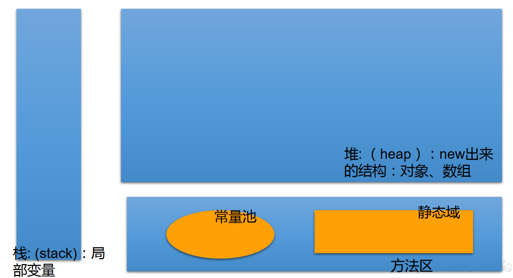

## 02、 [一维数组](https://so.csdn.net/so/search?q=一维数组&spm=1001.2101.3001.7020)的使用

```java
/*
 *   ① 一维数组的声明和初始化
 *  ② 如何调用数组的指定位置的元素
 *  ③ 如何获取数组的长度
 *  ④ 如何遍历数组
 *  ⑤ 数组元素的默认初始化值：见ArrayTest1.java
 *  ⑥ 数组的内存解析：见ArrayTest1.java
 */
```

> 1、代码案例1——ArrayTest.java

```java
public class ArrayTest { 
  public static void main(String[] args) { 
  
    //1. 一维数组的声明和初始化
    int num;  //声明
    num = 10;  //初始化
    int id = 1001;  //声明 + 初始化
  
    int[] ids;  //声明
    //1.1静态初始化:数组的初始化和数组元素的赋值操作同时进行
    ids = new int[]{ 1001,1002,1003,1004};
    //1.2动态初始化:数组的初始化和数组元素的赋值操作分开进行
    String[] names = new String[5]; 
  
    //错误的写法：
//    int[] arr1 = new int[];  //未赋值、未指明长度
//    int[5] arr2 = new int[5];
//    int[] arr3 = new int[3]{1,2,3};
  
    //也是正确的写法：
    int[] arr7 = { 1,2,3,5,4};//类型推断
  
    /*总结：数组一旦初始化完成，其长度就确定了。
    */
  
    //2.如何调用数组的指定位置的元素：通过角标的方式调用。
    //数组的角标(或索引)从0开始的，到数组的长度-1结束
    names[0] = "张郃";
    names[1] = "王陵";
    names[2] = "张学良";
    names[3] = "王传志";  //charAt(0)
    names[4] = "李峰";
//    names[5] = "周礼";  //如果数组超过角标会通过编译，运行失败。
  
    //3.如何获取数组的长度
    //属性：length
    System.out.println(names.length);  //5
    System.out.println(ids.length);  //4
  
    //4.如何遍历数组
//    System.out.println(names[0]);
//    System.out.println(names[1]);
//    System.out.println(names[2]);
//    System.out.println(names[3]);
//    System.out.println(names[4]);
  
    for(int i = 0;i < names.length;i++){ 
      System.out.println(names[i]);
    }
  
  }
}
```

> 2、代码案例2——ArrayTest1.java

```java
/*
 * ⑤ 数组元素的默认初始化值
 *     > 数组元素是整形：0
 *     > 数组元素是浮点型：0.0
 *     > 数组元素是char型：0或'\u0000'，而非'0'
 *     > 数组元素是boolean型:false
 * 
 *     > 数组元素是引用数据类型：null 
 */
public class ArrayTest1 { 
  public static void main(String[] args) { 
    //5.数组元素的默认初始化值
    int[] arr = new int[4];
    for(int i = 0;i < arr.length;i++){ 
      System.out.println(arr[i]);
    }
    System.out.println("*****************");
  
    short[] arr1 = new short[4];
    for(int i = 0;i < arr1.length;i++){ 
      System.out.println(arr1[i]);
    }
    System.out.println("*****************");
  
    float[] arr2 = new float[5]; 
    for(int i = 0;i < arr2.length;i++){ 
      System.out.println(arr2[i]);
    }
    System.out.println("*****************");
  
    char[] arr3 = new char[5]; 
    for(int i = 0;i < arr3.length;i++){ 
      System.out.println("----" + arr3[i] + "****");
    }
  
    if(arr3[0] == 0){ 
      System.out.println("你好！");
    }
    System.out.println("*****************");
  
    boolean[] arr4 = new boolean[5];
    System.out.println(arr4[0]);
  
    System.out.println("*****************");
    String[] arr5 = new String[5];
    System.out.println(arr5[0]);
    //验证
    if(arr5[0] == null){ 
      System.out.println("北京天气好差！");
    }
  
  }
}
```

## 2.1、内存的简化结构




## 2.2、一维数组的内存解析

```java
int[] arr = new int[]{ 1,2,3};
String[] arr1 = new String[4];
arr1[1] = “刘德华”;
arr1[2] = “张学友”;
arr1 = new String[3];
System.out.println(arr1[1]);//null
123456
```


> 按照图中步骤，最后数组内存解析完成，数组内部值为null。

## 2.3、练习1

```java
/*
 * 升景坊单间短期出租4个月，550元/月（水电煤公摊，网费35元/月），空调、卫生间、厨房齐全。
 * 屋内均是IT行业人士，喜欢安静。所以要求来租者最好是同行或者刚毕业的年轻人，爱干净、安静。
 * eclipse代码一键格式规范化：Ctrl+Shift+F
 */
public class ArrayDemo { 
  public static void main(String[] args) { 
    int[] arr = new int[] {  8, 2, 1, 0, 3 };
    int[] index = new int[] {  2, 0, 3, 2, 4, 0, 1, 3, 2, 3, 3 };
    String tel = "";
    for (int i = 0; i < index.length; i++) { 
      tel += arr[index[i]];
    }
    System.out.println("联系方式：" + tel);
  }
}
```

> 1、练习2

```java
/*
 * 2. 从键盘读入学生成绩，找出最高分，并输出学生成绩等级。
 * 成绩>=最高分-10    等级为’A’   
 * 成绩>=最高分-20    等级为’B’
 * 成绩>=最高分-30    等级为’C’   
 * 其余等级为’D’
 * 提示：先读入学生人数，根据人数创建int数组，存放学生成绩。
 */
import java.util.Scanner;
public class ArrayDemo2 { 
  public static void main(String[] args) { 
    //1.使用Scanner，读取学生的个数
    Scanner scan = new Scanner(System.in);
    System.out.print("请输入学生人数：");
    int num = scan.nextInt();
  
    //2.创建数组，存储学生成绩，动态初始化
    int[] str = new int[num];
    System.out.println("请输入" + num + "个学生成绩");
      
    //3.给数组中的元素赋值
    int maxnum = 0;
    for(int i = 0;i < str.length;i++){ 
      str[i] = scan.nextInt();
      //4.获取数组元素中的最大值：最高分
      if(maxnum < str[i]){ 
        maxnum = str[i];
      }
    }
  
    //5.根据每个学生成绩与最高分的差值，得到每个学生的等级，并输出等级和成绩
    char Grade;  //成绩等级
    for(int i = 0;i < str.length;i++){ 
      if(maxnum - str[i] <= 10){ 
        Grade = 'A';
      }else if(maxnum - str[i] <= 20){ 
        Grade = 'B';
      }else if(maxnum - str[i] <= 30){ 
        Grade = 'C';
      }else{ 
        Grade = 'D';
      }
    
      System.out.println("student " + i + "score is" + str[i] + 
          " grade is " + Grade);
    }
  }
}
```