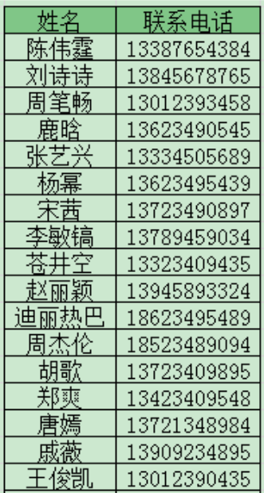
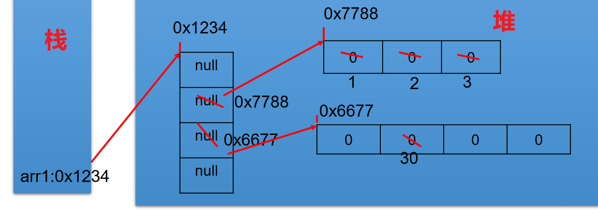
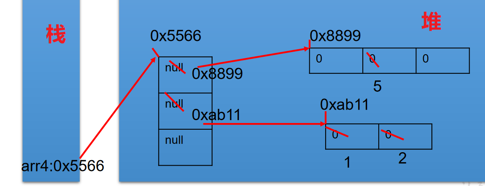
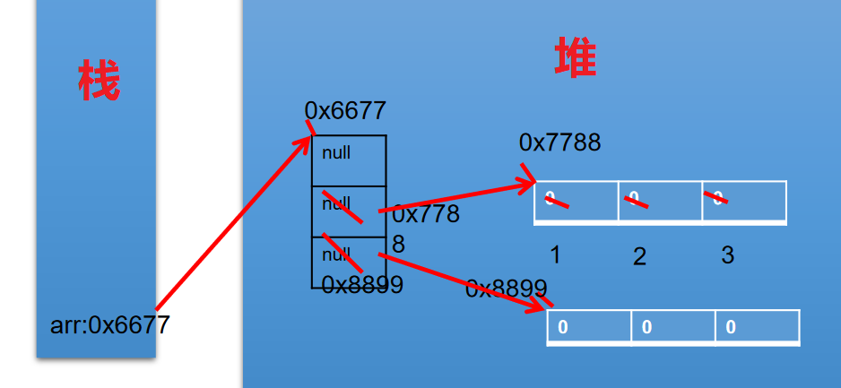
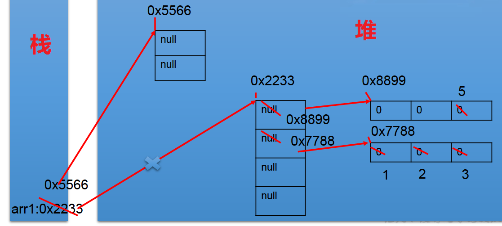
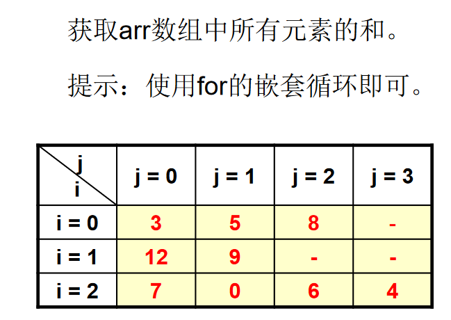
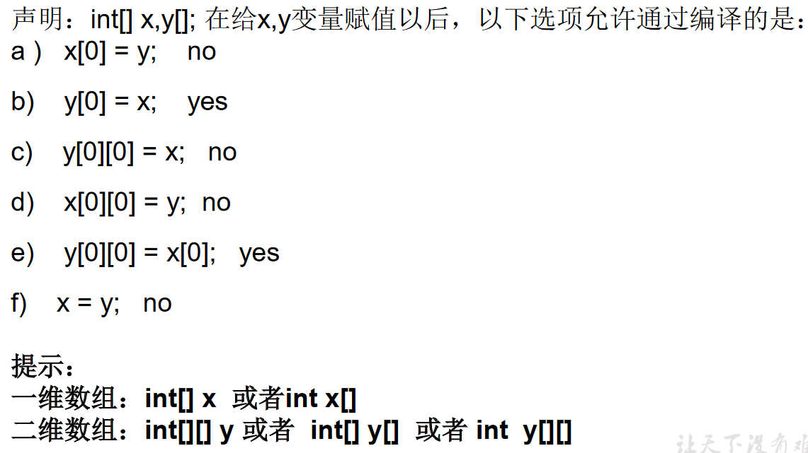

## 03、 [多维数组](https://so.csdn.net/so/search?q=多维数组&spm=1001.2101.3001.7020)的使用

Java 语言里提供了支持多维数组的语法。

> 如果说可以把一维数组当成几何中的线性图形，那么二维数组就相当于是一个表格，像下图Excel中的表格一样。




## 3.1、二位数组

> 1、代码案例——ArrayTest2.java

```java
/*
 * 二维数组的使用
 * 
 * 1.理解
 * 对于二维数组的理解，我们可以看成是一维数组array1又作为另一个一维数组array2的元素而存在。
 * 其实，从数组底层的运行机制来看，其实没有多维数组。
 * 
 * 2.二维数组的使用：
 *   ① 二维数组的初始化
 *  ② 如何调用数组的指定位置的元素
 *  ③ 如何获取数组的长度
 *  ④ 如何遍历数组
 *  ⑤ 数组元素的默认初始化值:见ArrayTest3.java
 *  ⑥ 数组的内存解析:见ArrayTest3.java
 * 
 */
public class ArrayTest2 { 
  public static void main(String[] args) { 
    //1.二维数组的声明和初始化
    int[] arr = new int[]{ 1,2,3};
    //静态初始化
    int[][] arr1 = new int[][]{ { 1,2,3},{ 4,5,6},{ 7,8,9}};
    //动态初始化1
    String[][] arr2 = new String[3][2];
    //动态初始化2
    String[][] arr3 = new String[3][];
  
    //错误的情况
//    String[][] arr4 = new String[][];
//    String[][] arr5 = new String[][4];
//    String[][] arr6 = new String[4][3]{ {1,2,3},{4,5,6},{7,8,9}};
  
    //正确的情况：
    int arr4[][] = new int[][]{ { 1,2,3},{ 4,5,12,6},{ 7,8,9}};
    int[] arr5[] = new int[][]{ { 1,2,3},{ 4,5,6},{ 7,8,9}};
    int[][] arr6 = { { 1,2,3},{ 4,5,6},{ 7,8,9}};  
  
    //2.如何调用数组的指定位置的元素
    System.out.println(arr1[0][1]);  //2
    System.out.println(arr2[1][1]);  //null
  
    arr3[1] = new String[4];  //定义arr3的[1]为长度为4的字符数组
    System.out.println(arr3[1][0]);  //没有上句，会报错
  
    //3.获取数组的长度
    System.out.println(arr4.length);  //3
    System.out.println(arr4[0].length);  //3
    System.out.println(arr4[1].length);  //4
  
    //4.如何遍历二维数组
    for(int i = 0;i < arr4.length;i++){ 
      for(int j = 0;j < arr4[i].length;j++){ 
        System.out.print(arr4[i][j] + " ");
      }
      System.out.println();
    }
  }
}
```

> 2、代码案例——ArrayTest3.java

```java
/*
 * 二维数组的使用：
 *   规定：二维数组分为外层数组的元素，内层数组的元素
 *   int[][] arr = new int[4][3]; 
 *  外层元素:arr[0],arr[1]等
 *  内层元素:arr[0][0],arr[1][2]等
 *  
 *   ⑤ 数组元素的默认初始化值
 *   针对于初始化方式一：比如：int[][] arr = new int[4][3];
 *     外层元素的初始化值为：地址值
 *     内层元素的初始化值为：与一维数组初始化情况相同
 * 
 * 针对于初始化方式而：比如：int[][] arr = new int[4][];
 *     外层元素的初始化值为：null
 *     内层元素的初始化值为：不能调用，否则报错。
 * 
 *   ⑥ 数组的内存解析
 */
public class ArrayTest3 { 
  public static void main(String[] args) { 
  
    int[][] arr = new int[4][3];
    System.out.println(arr[0]);  //[I@15db9742
    System.out.println(arr[0][0]);  //0
  
//    System.out.println(arr);  //ArrayTest3.java
  
    System.out.println("***********************");
    float[][] arr1 = new float[4][3];
    System.out.println(arr1[0]);  //地址值
    System.out.println(arr1[0][0]);  //0.0
  
    System.out.println("***********************");
  
    String[][] arr2 = new String[4][2];
    System.out.println(arr2[1]);  //地址值
    System.out.println(arr2[1][1]);  //null
  
    System.out.println("*********************");
    double[][] arr3 = new double[4][];
    System.out.println(arr3[1]);  //null
//    System.out.println(arr3[1][0]);  //报错
  }
}
```

## 3.2、二维数组的内存解析

> 1、案例1

```java
int[][] arr1 = new int[4][];
arr1[1] = new int[]{ 1,2,3};
arr1[2] = new int[4];
arr1[2][1] = 30;
```




> 2、案例2

```java
int[][] arr4= newint[3][];
System.out.println(arr4[0]);//null
System.out.println(arr4[0][0]);//报错
arr4[0] = new int[3];
arr4[0][1] = 5;
arr4[1] = new int[]{ 1,2};
```




> 3、案例3

```java
int[][] arr = new int[3][];
arr[1] = new int[]{ 1,2,3};
arr[2] = new int[3];
System.out.println(arr[0]);//null
System.out.println(arr[0][0]);//报异常
```




> 4、案例4

```java
int[][] arr1= newint[4][];
arr1[0] = new int[3];
arr1[1] = new int[]{ 1,2,3};
arr1[0][2] = 5;
arr1 = new int[2][];
```




## 3.3、练习

> 1、练习1




```java
public class ArrayEver1 { 
  public static void main(String[] args) { 
    int[][] arr = new int[][]{ { 3,5,8},{ 12,9},{ 7,0,6,4}};
    int sum = 0;  //记录总和
    for(int i = 0;i < arr.length;i++){ 
      for(int j = 0;j < arr[i].length;j++){ 
        sum += arr[i][j];
      }
    }
    System.out.println(sum);
  }
}
```

> 2、练习 2




> 3、练习 3

使用二维数组打印一个 10 行杨辉三角。

```java
/*
 * 【提示】
 * 1. 第一行有 1 个元素, 第 n 行有 n 个元素
 * 2. 每一行的第一个元素和最后一个元素都是 1
 * 3. 从第三行开始, 对于非第一个元素和最后一个元素的元素。
 * 即：yanghui[i][j] = yanghui[i-1][j-1] + yanghui[i-1][j];
 */
public class ArrayEver2 { 
  public static void main(String[] args) { 
    //1.声明并初始化二维数组
    int[][] arr = new int[10][];
  
    //2.给数组的元素赋值，遍历二维数组
    for(int i = 0;i < arr.length;i++){ 
      arr[i] = new int[i+1];
    
      //2.1 给首末元素赋值
      arr[i][0]=arr[i][i]=1;
      //2.2 给每行的非首末元素赋值
    //  if(i > 1){ 
      for(int j = 1;j < arr[i].length-1;j++){ 
          arr[i][j] = arr[i-1][j-1] + arr[i-1][j];
        }
    //  }

    }
  
  //  3.遍历数组
    for(int i = 0;i < arr.length;i++){ 
      for(int j = 0;j <arr[i].length;j++){ 
        System.out.print(arr[i][j] + " ");
      }
      System.out.println();
    }
  
  }
}
```

## 3.4、面试题目

> 1、创建一个长度为 6 的 int 型数组，要求取值为 1-30，同时元素值各不相同

```java
//此题只做了解，初学不必精通。
public class ArrayEver3 { 
  public static void main(String[] args) { 
    // 方式一：
//    int[] arr = new int[6];
//    for (int i = 0; i < arr.length; i++) {// [0,1) [0,30) [1,31)
//      arr[i] = (int) (Math.random() * 30) + 1;
//
//      boolean flag = false;
//      while (true) { 
//        for (int j = 0; j < i; j++) { 
//          if (arr[i] == arr[j]) { 
//            flag = true;
//            break;
//          }
//        }
//        if (flag) { 
//          arr[i] = (int) (Math.random() * 30) + 1;
//          flag = false;
//          continue;
//        }
//        break;
//      }
//    }
//
//    for (int i = 0; i < arr.length; i++) { 
//      System.out.println(arr[i]);
//    }
    // 方式二：
    int[] arr2 = new int[6];
    for (int i = 0; i < arr2.length; i++) { // [0,1) [0,30) [1,31)
      arr2[i] = (int) (Math.random() * 30) + 1;

      for (int j = 0; j < i; j++) { 
        if (arr2[i] == arr2[j]) { 
          i--;
          break;
        }
      }
    }

    for (int i = 0; i < arr2.length; i++) { 
      System.out.println(arr2[i]);
    }
  }
}  
```