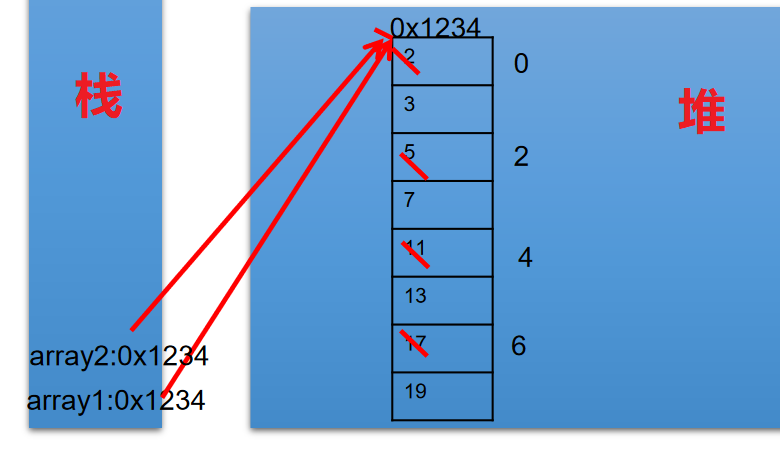
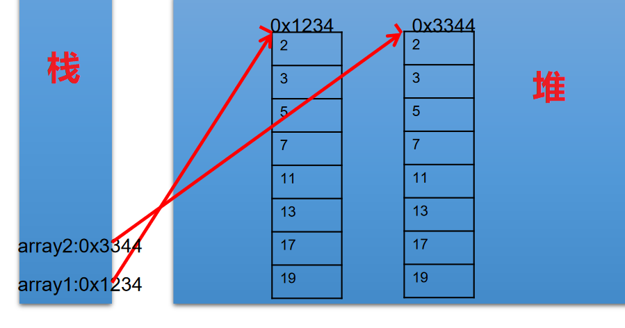
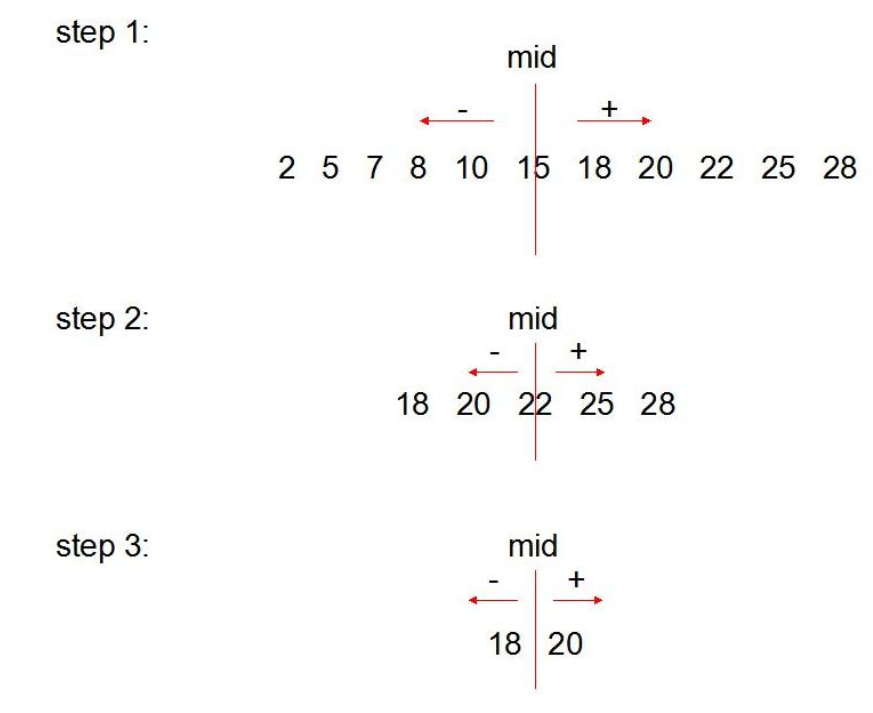
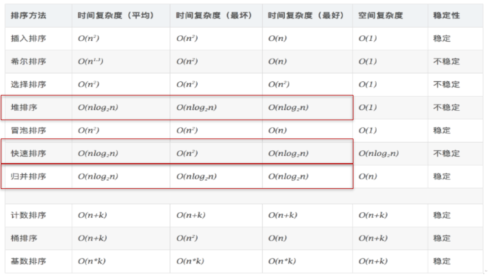

## 04、 数组中涉及到的常见算法

1. 数组元素的赋值(杨辉三角、回形数等)
2. 求数值型数组中元素的最大值、最小值、平均数、总和等
3. 数组的复制、反转、查找(线性查找、二分法查找)
4. 数组元素的排序算法

## 4.1、数组元素的赋值

```java
import java.util.Scanner;
/*
 * 此题了解！！！
 * 
 * 回形数格式方阵的实现
 * 从键盘输入一个整数（1~20） 
 * 则以该数字为矩阵的大小，把 1,2,3…n*n 的数字按照顺时针螺旋的形式填入其中。例如： 输入数字2，则程序输出： 1 2 
 * 4 3 
 * 输入数字 3，则程序输出：1 2 3 
 * 8 9 4 
 * 7 6 5 
 * 输入数字 4， 则程序输出： 
 * 1   2   3   4
 * 12  13  14  5 
 * 11  16  15  6 
 * 10  9   8   7
 */
public class ArrayTest { 
  public static void main(String[] args) { 
    Scanner scanner = new Scanner(System.in);
    System.out.println("输入一个数字:");
    int len = scanner.nextInt();
    int[][] arr = new int[len][len];
    int s = len * len;
    /*
     * k = 1:向右 k = 2:向下 k = 3:向左 k = 4:向上
     */
    int k = 1;
    int i = 0, j = 0;
    for (int m = 1; m <= s; m++) { 
      if (k == 1) { 
        if (j < len && arr[i][j] == 0) { 
          arr[i][j++] = m;
        } else { 
          k = 2;
          i++;
          j--;
          m--;
        }
      } else if (k == 2) { 
        if (i < len && arr[i][j] == 0) { 
          arr[i++][j] = m;
        } else { 
          k = 3;
          i--;
          j--;
          m--;
        }
      } else if (k == 3) { 
        if (j >= 0 && arr[i][j] == 0) { 
          arr[i][j--] = m;
        } else { 
          k = 4;
          i--;
          j++;
          m--;
        }
      } else if (k == 4) { 
        if (i >= 0 && arr[i][j] == 0) { 
          arr[i--][j] = m;
        } else { 
          k = 1;
          i++;
          j++;
          m--;
        }
      }
    }
    // 遍历
    for (int m = 0; m < arr.length; m++) { 
      for (int n = 0; n < arr[m].length; n++) { 
        System.out.print(arr[m][n] + "\t");
      }
      System.out.println();
    }
  }
}
```

## 4.2、数组元素的基本操作

```java
/*
 * 算法的考察：求数值型数组中元素的最大值、最小值、平均数、总和等
 * 
 * 定义一个 int 型的一维数组，包含 10 个元素，分别赋一些随机整数，
 * 然后求出所有元素的最大值，最小值，和值，平均值，并输出出来。
 * 要求：所有随机数都是两位数。
 * 
 * [10,99]
 * 公式：(int)(Math.random() * (99 - 10 + 1) + 10)
 */
public class ArrayTest1 { 
  public static void main(String[] args) { 
    int[] arr = new int[10];
    //数组赋值
    for(int i = 0;i <arr.length;i++){ 
      arr[i] = (int)(Math.random() * (99 - 10 + 1) + 10);
    }
  
    //遍历
    for(int i =0;i < arr.length;i++){ 
      System.out.print(arr[i] + " ");
    }
    System.out.println();
  
    //求数组元素的最大值
    int maxValue = arr[0];
    for(int i = 1;i <arr.length;i++){ 
      if(maxValue < arr[i]){ 
        maxValue = arr[i];
      }
    }
    System.out.println("最大值：" + maxValue);
  
    //求数组元素的最小值
    int minValue = arr[0];
    for(int i = 1;i <arr.length;i++){ 
      if(minValue > arr[i]){ 
        minValue = arr[i];
      }
    }
    System.out.println("最小值：" + minValue);
  
    //求数组元素的总和
    int sum = 0;
    for(int i = 1;i <arr.length;i++){ 
      sum += arr[i];
    }
    System.out.println("总和：" + sum);
  
    //求数组元素的平均数
    double avgVales = sum / arr.length;
    System.out.println("平均数：" + avgVales);  
  }
}
```

## 4.3、数组元素的基本操作 2

```java
/*
 * 使用简单数组
 * (1)创建一个名为 ArrayTest 的类，在 main()方法中声明 array1 和 array2 两个变量，他们是 int[]类型的数组。
 * (2)使用大括号{}，把 array1 初始化为 8 个素数：2,3,5,7,11,13,17,19。
 * (3)显示 array1 的内容。
 * (4)赋值 array2 变量等于 array1，修改 array2 中的偶索引元素，使其等于索引值(如 array[0]=0,array[2]=2)。打印出 array1。
 */
public class ArrayTest2 { 
  public static void main(String[] args) { 
    //声明 array1 和 array2 两个 int[]变量
    int[] array1,array2;
    //array1 初始化
    array1 = new int[]{ 2,3,5,7,11,13,17,19};
  
    //显示 array1 的内容==遍历。
    for(int i = 0;i < array1.length;i++){ 
      System.out.print(array1[i] + "\t");
    }
  
    //赋值 array2 变量等于 array1
        //不能称作数组的复制。
    array2 = array1;
  
    //修改 array2 中的偶索引元素，使其等于索引值(如 array[0]=0,array[2]=2)。
    for(int i = 0;i < array2.length;i++){ 
      if(i % 2 == 0){ 
        array2[i] = i;
      }
    }
    System.out.println();
  
    //打印出 array1。
    for(int i = 0;i < array1.length;i++){ 
      System.out.print(array1[i] + "\t");
    }
  }
}
```

> 1、思考：上述 array1 和 array2 是什么关系？

```java
//array1 和 array2 地址值相同，都指向了堆空间的唯一的一个数组实体。
int[] array1,array2;
array1 = new int[]{ 2,3,5,7,11,13,17,19};
array2 = array1;
for(int i = 0;i < array2.length;i++){ 
  if(i % 2 == 0){ 
    array2[i] = i;
  }
}
```




> 2、拓展：修改题目，实现 array2 对 array1 数组的复制

```java
int[] array1,array2;
array1 = new int[]{ 2,3,5,7,11,13,17,19};
//数组的复制
array2 = new int[array1.length];
for(int i = 0;i < array2.length;i++){ 
  array2[i] = array1[i];
}
```




## 4.4、数组的复制、反转、查找

> 1、复制、反转

```java
/*
 * 算法的考察：数组的复制、反转、查找(线性查找、二分法查找)
 */
public class ArrayTest3 { 
  public static void main(String[] args) { 

    String[] arr = new String[]{ "SS","QQ","YY","XX","TT","KK","EE","GG"};
  
    //数组的复制
    String[] arr1 = new String[arr.length];
    for(int i = 0;i < arr1.length;i++){ 
      arr1[i] = arr[i];
    }
  
    //数组的反转
    //方法一：
//    for(int i = 0;i < arr.length / 2;i++){ 
//      String temp = arr[i];
//      arr[i] = arr[arr.length - i - 1];
//      arr[arr.length - i - 1] = temp;
//    }
  
    //方法二：
    for(int i = 0,j = arr.length - 1;i < j;i++,j--){ 
      String temp = arr[i];
      arr[i] = arr[j];
      arr[j] = temp;
    }
  
    //遍历
    for(int i = 0;i < arr.length;i++){ 
      System.out.print(arr[i] + "\t");
    }
    System.out.println();
  
    //查找（或搜索）
    //线性查找
    String dest = "BB";  //要查找的元素
    dest = "CC";
  
    boolean isFlag = true;
  
    for(int i = 0;i < arr.length;i++){ 
      if(dest.equals(arr[i])){ 
        System.out.println("找到了指定元素，位置为：" + i);
        isFlag = false;
        break;
      }
    }
    if(isFlag){ 
      System.out.println("很遗憾，没找到！");
    }
  
    //二分法查找：
  
  }
}
```

> 2、二分法查找算法




```java
public class ArrayTest3 { 
  public static void main(String[] args) { 
    //二分法查找：
    //前提：所要查找的数组必须有序
    int[] arr2 = new int[]{ -98,-34,2,34,54,66,79,105,210,333};
  
    int dest1 = -34;
    int head = 0;  //初始的首索引
    int end = arr2.length - 1;  //初始的末索引
    boolean isFlag1 = true;
    while(head <= end){ 
      int middle = (head + end)/2;
    
      if(dest1 == arr2[middle]){ 
        System.out.println("找到了指定元素，位置为：" + middle);
        isFlag1 = false;
        break;
      }else if(arr2[middle] > dest1){ 
        end = middle - 1;
      }else{   //arr2[middle] < dest1
        head = middle + 1;
      }
    }
  
    if(isFlag1){ 
      System.out.println("很遗憾，没找到！");
    }  
  }
}
```

## 4.5、数组元素的[排序算法](https://so.csdn.net/so/search?q=排序算法&spm=1001.2101.3001.7020)

- 排序：假设含有 n 个记录的序列为{R1，R2，…,Rn},其相应的关键字序列为{K1，K2，…,Kn}。将这些记录重新排序为{Ri1,Ri2,…,Rin},使得相应的关键字值满足条 Ki1<=Ki2<=…<=Kin,这样的一种操作称为排序。

  - 通常来说，排序的目的是快速查找。

- 衡量排序算法的优劣：

  1. **时间复杂度** ：分析关键字的比较次数和记录的移动次数
  2. 空间复杂度：分析排序算法中需要多少辅助内存
  3. **稳定性** ：若两个记录 A 和 B 的关键字值相等，但排序后 A、B 的先后次序保持不变，则称这种排序算法是稳定的。

- 排序算法分类：

  内部排序

  和 

  外部排序

   。

  - 内部排序：整个排序过程不需要借助于外部存储器（如磁盘等），所有排序操作都在内存中完成。
  - 外部排序：参与排序的数据非常多，数据量非常大，计算机无法把整个排序过程放在内存中完成，必须借助于外部存储器（如磁盘）。外部排序最常见的是多路归并排序。可以认为外部排序是由多次内部排序组成。

## 4.6、十大内部排序算法

- 选择排序
  - 直接选择排序、堆排序
- 交换排序
  - **冒泡排序、快速排序**
- 插入排序
  - 直接插入排序、折半插入排序、Shell 排序
- 归并排序
- 桶式排序
- 基数排序

1. 详细操作，见《附录》 [附录：尚硅谷_宋红康_排序算法.pdf](https://shimo.im/docs/TcdrXydwCTHY866T)

## 4.7、算法的 5 大特征

| 输入（Input）                   | 有 0 个或多个输入数据，这些输入必须有清楚的描述和定义        |
| ------------------------------- | ------------------------------------------------------------ |
| 输出（Output）                  | 至少有 1 个或多个输出结果，不可以没有输出结果                |
| 有穷性（有限性，Finiteness）    | 算法在有限的步骤之后会自动结束而不会无限循环，并且每一个步骤可以在可接受的时间内完成 |
| 确定性（明确性，Definiteness）  | 算法中的每一步都有确定的含义，不会出现二义性                 |
| 可行性（有效性，Effectiveness） | 算法的每一步都是清楚且可行的，能让用户用纸笔计算而求出答案   |

> 说明：满足确定性的算法也称为：确定性算法。现在人们也关注更广泛的概念，例如考虑各种非确定性的算法，如并行算法、概率算法等。另外，人们也关注并不要求终止的计算描述，这种描述有时被称为过程（procedure）。

## 4.8、[冒泡排序](https://so.csdn.net/so/search?q=冒泡排序&spm=1001.2101.3001.7020)(重要)

冒泡排序的基本思想：通过对待排序序列从前向后，依次比较相邻元素的排序码，若发现逆序则交换，使排序码较大的元素逐渐从前部移向后部。

因为排序的过程中，各元素不断接近自己的位置，如果一趟比较下来没有进行过交换，就说明序列有序， 因此要在排序过程中设置一个标志swap判断元素是否进行过交换。从而减少不必要的比较。


```java
/*
 * 数组的冒泡排序的实现
 * 
 */
public class BubbleSortTest { 
  public static void main(String[] args) { 
  
    int[] arr = new int[]{ 43,32,76,92,-65,85,71,-42};
  
    //冒泡排序
    for(int i = 0;i < arr.length - 1;i++){ 
    
      for(int j = 0;j < arr.length - 1 - i;j++){ 
      
        if(arr[j] > arr[j+1]){ 
          int temp = arr[j];
          arr[j] = arr[j+1];
          arr[j+1] = temp;
        }
      }
    }
  
    for(int i = 0;i < arr.length;i++){ 
      System.out.print(arr[i] + "\t");
    }
  }
}
```

## 4.9、[快速排序](https://so.csdn.net/so/search?q=快速排序&spm=1001.2101.3001.7020)(初学Java，仅作了解)

> 快速排序（Quick Sort）由图灵奖获得者Tony Hoare发明，被列为20世纪十大算法之一，是迄今为止所有内排序算法中速度最快的一种。冒泡排序的升级版，交换排序的一种。快速排序的时间复杂度为O(nlog(n))。

**排序思想：**

1. 从数列中挑出一个元素，称为"基准"（pivot），
2. 重新排序数列，所有元素比基准值小的摆放在基准前面，所有元素比基准值大的摆在基准的后面（相同的数可以到任一边）。在这个分区结束之后，该基准就处于数列的中间位置。这个称为分区（partition）操作。
3. 递归地（recursive）把小于基准值元素的子数列和大于基准值元素的子数列排序。
4. 递归的最底部情形，是数列的大小是零或一，也就是永远都已经被排序好了。虽然一直递归下去，但是这个算法总会结束，因为在每次的迭代（iteration）中，它至少会把一个元素摆到它最后的位置去。


```java
/**
  * 快速排序
  * 通过一趟排序将待排序记录分割成独立的两部分，其中一部分记录的关键字均比另一部分关键字小，
  * 则分别对这两部分继续进行排序，直到整个序列有序。
  *
 */
public class QuickSort { 
  private static void swap(int[] data, int i, int j) { 
    int temp = data[i];
    data[i] = data[j];
    data[j] = temp;
  }
  private static void subSort(int[] data, int start, int end) { 
    if (start < end) { 
      int base = data[start];
      int low = start;
      int high = end + 1;
      while (true) { 
        while (low < end && data[++low] - base <= 0)
          ;
        while (high > start && data[--high] - base >= 0)
          ;
        if (low < high) { 
          swap(data, low, high);
        } else { 
          break;
        }
      }
      swap(data, start, high);
    
      subSort(data, start, high - 1);//递归调用
      subSort(data, high + 1, end);
    }
  }
  public static void quickSort(int[] data){ 
    subSort(data,0,data.length-1);
  }

  public static void main(String[] args) { 
    int[] data = {  9, -16, 30, 23, -30, -49, 25, 21, 30 };
    System.out.println("排序之前：\n" + java.util.Arrays.toString(data));
    quickSort(data);
    System.out.println("排序之后：\n" + java.util.Arrays.toString(data));
  }
}
```

## 4.10排序算法性能对比




> **各种内部排序方法性能比较**

1. 从平均时间而言：快速排序最佳。但在最坏情况下时间性能不如堆排序和归并排序。
2. 从算法简单性看：由于直接选择排序、直接插入排序和冒泡排序的算法比较简单，将其认为是简单算法。对于Shell排序、堆排序、快速排序和归并排序算法，其算法比较复杂，认为是复杂排序。
3. 从稳定性看：直接插入排序、冒泡排序和归并排序是稳定的；而直接选择排序、快速排序、Shell排序和堆排序是不稳定排序
4. 从待排序的记录数n的大小看，n较小时，宜采用简单排序；而n较大时宜采用改进排序。

> **排序算法的选择**

(1) 若n较小(如n≤50)，可采用直接插入或直接选择排序。当记录规模较小时，直接插入排序较好；否则因为直接选择移动的记录数少于直接插入，应选直接选择排序为宜。 (2) 若文件初始状态基本有序(指正序)，则应选用直接插入、冒泡或随机的快速排序为宜； (3) 若n较大，则应采用时间复杂度为O(nlgn)的排序方法：快速排序、堆排序或归并排序。