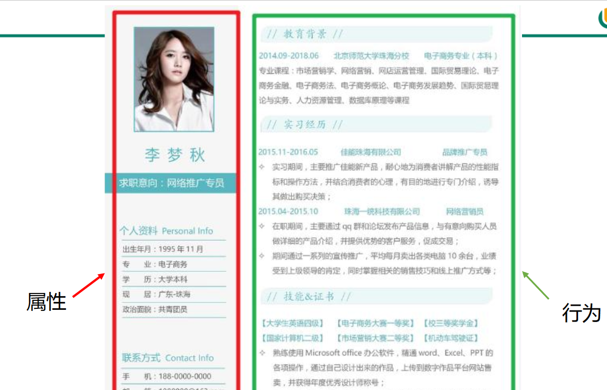
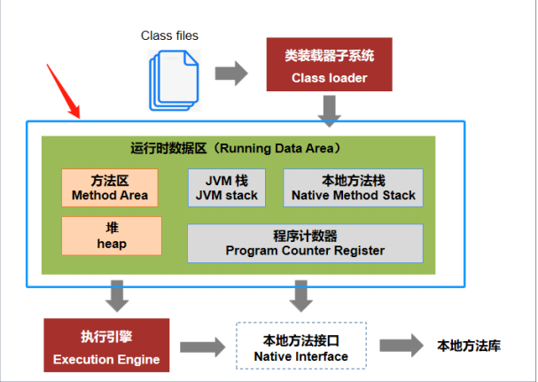
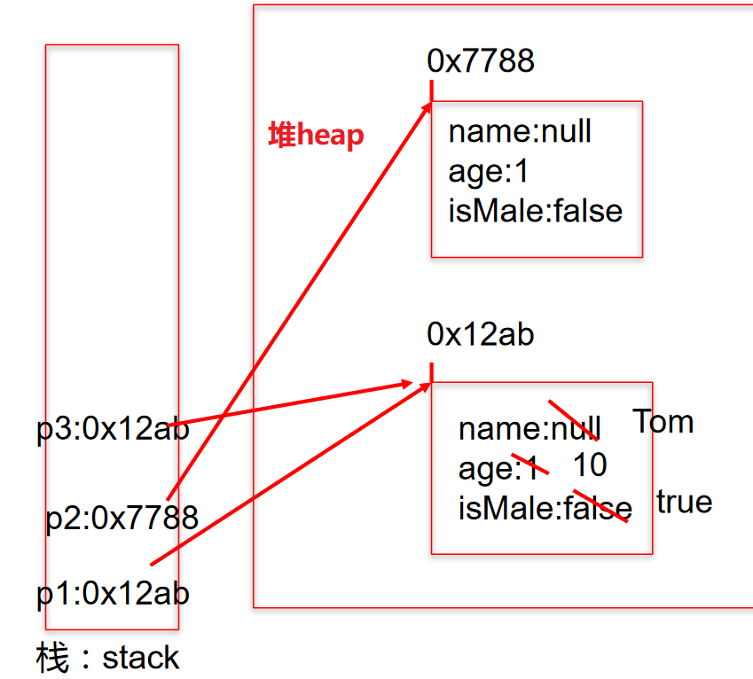
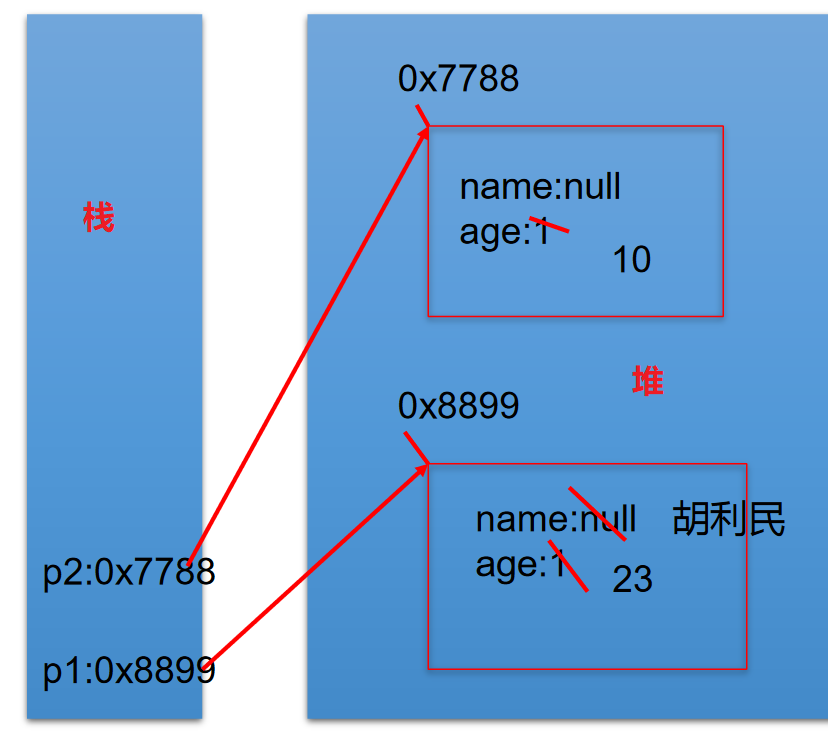

## 02、 类和对象

```java
/* 
 * 三、面向对象的两个要素：
 * 类:对一类事物的描述，是抽象的、概念上的定义
 * 对象:是实际存在的该类事物的每个个体，因而也称为实  例(instance)。
 * 可以理解为：类= 抽象概念的人；对象= 实实在在的某个人
 * 面向对象程序设计的重点是类的设计；
 * 设计类，其实就是设计类的成员。
 */
```

## 2.1、Java 类及类的成员

现实世界的生物体，大到鲸鱼，小到蚂蚁，都是由最基本的细胞构成的。同理，Java 代码世界是由诸多个不同功能的类构成的。

现实生物世界中的细胞又是由什么构成的呢？细胞核、细胞质、… 那么，Java 中用类 class 来描述事物也是如此。常见的类的成员有：

- 属性：对应类中的成员变量
- 行为：对应类中的成员方法




## 2.2、类与对象的创建及使用

```java
/*
 * 一、设计类、其实就是设计类的成员
 * Field = 属性 = 成员变量 = 域、字段
 * Method = (成员)方法 = 函数 
 * 
 * 创建类 = 类的实例化 = 实例化类
 * 
 * 二.类和对象的使用(面向对象思想落地的实现)
 * 1.创建类，设计类的成员
 * 2.创建类的对象
 * 3.通过“对象.属性”或“对象.方法”调用对象的结构
 * 三、如果创建类一个类的多个对象，则每个对象都独立的拥有一套类的属性。(非 static 的)
 *     意味着:如果我们修改一个对象的属性 a，则不影响另外一个对象属性 a 的值。
 */
//测试类
public class PersonTest { 
  public static void main(String[] args) { 
    //2.创建 Person 类的对象
    //创建对象语法：类名对象名= new 类名();
    Person p1 = new Person();
    //Scanner scan = new Scanner(System.in);

    //调用类的结构：属性、方法
    //调用属性:“对象.属性”
    p1.name = "Tom";
    p1.age = 25;
    p1.isMale = true;
    System.out.println(p1.name);

    //调用方法:“对象.方法”
    p1.eat();
    p1.sleep();
    p1.talk("chinese");
    //**********************
    Person p2 = new Person();
    System.out.println(p2.name); //null
    System.out.println(p2.isMale);
    //**********************
    //将 p1 变量保存的对象地址值赋给 p3,导致 p1 和 p3 指向了堆空间中的一个对象实体。
    Person p3 = p1;
    System.out.println(p3.name);

    p3.age = 10;
    System.out.println(p1.age); //10
  }
}
/*
 * 类的语法格式：
 * 修饰符 class 类名{ 
 *     属性声明;
 *     方法声明;
 * }
 * 说明：修饰符 public：类可以被任意访问类的正文要用{   }括起来
 */
//1.创建类，设计类的成员
class Person{ 

  //属性:对应类中的成员变量
  String name;
  int age;
  boolean isMale;

  //方法:对应类中的成员方法
  public void eat(){ 
    System.out.println("吃饭");
  }

  public void sleep(){ 
    System.out.println("睡觉");
  }

  public void talk(String language){ 
    System.out.println("人可以说话，使用的是：" + language);
  }
}
```

## 2.3、对象的创建和使用：内存解析




**方法区和堆**是所有线程共享的内存区域；而**JVM栈、本地方法栈和程序员计数器**是运行时线程私有的内存区域。

- 堆（Heap），是Java虚拟机内存中最大的一块。在虚拟机启动时创建。此内存区域的唯一目的就是**存放对象实例**，**几乎所有的对象实例都在这里分配内存**
- JVM栈（JVM Stacks）。虚拟机栈描述的是Java方法执行的内存模型：每个方法被执行的时候都会同时创建一个**栈帧**（Stack Frame）用于存储局部变量表、操作栈、动态链接、方法出口等信息。每一个方法被调用直至执行完成的过程，就对应着一个栈帧在虚拟机栈中从入栈到出栈的过程。
- 方法区（MethodArea），用于**存储已被虚拟机加载的类信息、常量、静态变量、即时编译器编译后的代码等数据。**
- 程序计数器（Program Counter Register）,程序计数器（Program Counter Register）是一块较小的内存空间，它的作用可以看做是当前线程所执行的字节码的行号指示器。
- 本地方法栈（Native Method Stacks）,本地方法栈（Native Method Stacks）与虚拟机栈所发挥的作用是非常相似的，其区别不过是虚拟机栈为虚拟机执行Java方法（也就是字节码）服务，而本地方法栈则是为虚拟机使用到的Native方法服务。

> 面试题

java中的对象不一定是在堆上分配的，因为JVM通过逃逸分析，能够分析出一个新对象的使用范围，并以此确定是否要将这个对象分配到堆上 ；如果JVM发现某些对象没有逃逸出方法，就很有可能被优化成在栈上分配；

> 备注：栈分配可以快速地在栈帧上创建和销毁对象，不用再将对象分配到堆空间，可以有效地减少JVM垃圾回收的压力。参考：https://baijiahao.baidu.com/s?id=1678511797907822583&wfr=spider&for=pc

> 1、案例 1

```java
Person p1= newPerson();
p1.name = "Tom";
p1.isMale = true;
Person p2 = new Person();
sysout(p2.name);//null
Person p3 = p1;
p3.age = 10;
```




> 2、案例 2

```java
Person p1= newPerson();
p1.name = "胡利民";
p1.age = 23;
Person p2 = new Person();
p2.age = 10;
12345
```


