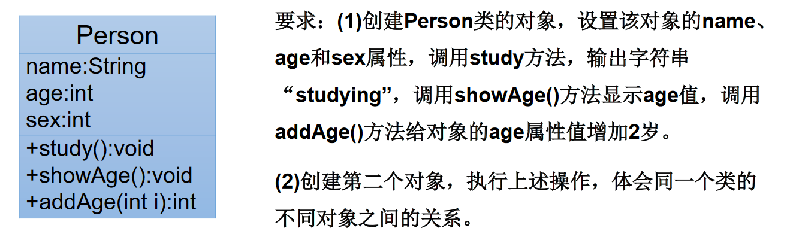

```java
/*
 * 类中方法的声明和使用
 * 
 * 方法：描述类应该具有的功能。
 * 比如：Math类：sqrt()\random() \...
 *     Scanner类：nextXxx() ...
 *     Arrays类：sort() \ binarySearch() \ toString() \ equals() \ ...
 * 
 * 1.举例：
 * public void eat(){}
 * public void sleep(int hour){}
 * public String getName(){}
 * public String getNation(String nation){}
 * 
 * 2. 方法的声明：权限修饰符  返回值类型  方法名(形参列表){
 *           方法体
 *         }
 *   注意：static、final、abstract 来修饰的方法，后面再讲。
 *   
 * 3. 说明：
 *     3.1 关于权限修饰符：默认方法的权限修饰符先都使用public
 *       Java规定的4种权限修饰符：private、public、缺省、protected  -->封装性再细说
 * 
 *     3.2 返回值类型： 有返回值  vs 没有返回值
 *       3.2.1  如果方法有返回值，则必须在方法声明时，指定返回值的类型。同时，方法中，需要使用
 *                return关键字来返回指定类型的变量或常量：“return 数据”。
 *           如果方法没有返回值，则方法声明时，使用void来表示。通常，没有返回值的方法中，就不需要
 *               使用return.但是，如果使用的话，只能“return;”表示结束此方法的意思。
 * 
 *       3.2.2 我们定义方法该不该有返回值？
 *         ① 题目要求
 *         ② 凭经验：具体问题具体分析
 * 
 *      3.3 方法名：属于标识符，遵循标识符的规则和规范，“见名知意”
 *      3.4 形参列表:方法名可以声明0个、1个，或多个形参。
 *        3.4.1 格式:数据类型1 形参1，数据类型2 形参2,...
 *    
 *        3.4.2 我们定义方法时，该不该定义形参？
 *          ① 题目要求
 *          ② 凭经验，具体问题具体分析
 *      3.5 方法体:方法功能的体现。
 *  4. return关键字的使用：
 *    1.使用范围:使用在方法体中
 *    2.作业:① 结束方法
 *        ② 针对于有返回值类型的方法，使用"return 数据"方法返回所要的数据。
 *    3.注意点:return关键字后不可声明执行语句。
 *  5. 方法的使用中，可以调用当前类的属性或方法。
 *      特殊的:方法A中又调用了方法A:递归方法。
 *    方法中不能定义其他方法。
 */
public class CustomerTest { 
  public static void main(String[] args) { 
  
    Customer cust1 = new Customer();
  
    cust1.eat();
  
    //测试形参是否需要设置的问题
//    int[] arr = new int[]{3,4,5,2,5};
//    cust1.sort();
  
    cust1.sleep(8);
  
  }
}
//客户类
class Customer{ 

  //属性
  String name;
  int age;
  boolean isMale;

  //方法
  public void eat(){ 
    System.out.println("客户吃饭");
    return;
    //return后不可以声明表达式
//    System.out.println("hello");
  }

  public void sleep(int hour){ 
    System.out.println("休息了" + hour + "个小时");
  
    eat();
//    sleep(10);
  }

  public String getName(){ 
  
    if(age > 18){ 
      return name;
    
    }else{ 
      return "Tom";
    }
  }

  public String getNation(String nation){ 
    String info = "我的国籍是：" + nation;
    return info;
  }

  //体会形参是否需要设置的问题
//  public void sort(int[] arr){ 
//  
//  }
//  public void sort(){ 
//    int[] arr = new int[]{3,4,5,2,5,63,2,5};
//    //。。。。
//  }

  public void info(){ 
    //错误的
//    public void swim(){ 
//    
//    }
  
  }
}
```

> 1、练习1

创建一个Person类，其定义如下：




```java
public class Person { 
  String name;
  int age;
  /*
   * sex:1表示为男性
   * sex:0表示为女性
   */
  int sex;

  public void study(){ 
    System.out.println("studying");
  }

  public void showAge(){ 
    System.out.println("age:" + age);
  }

  public int addAge(int i){ 
    age += i;
    return age;
  }
}
```

测试类

```java
/*
 * 要求:
 * (1)创建Person类的对象，设置该对象的name、age和sex属性，
 *   调用study方法，输出字符串“studying”，
 *   调用showAge()方法显示age值，
 *   调用addAge()方法给对象的age属性值增加2岁。
 * (2)创建第二个对象，执行上述操作，体会同一个类的不同对象之间的关系。
 * 
 */
public class PersonTest { 
  public static void main(String[] args) { 
    Person p1 = new Person();
  
    p1.name = "Tom";
    p1.age = 18;
    p1.sex = 1;
  
    p1.study();
  
    p1.showAge();
  
    int newAge = p1.addAge(2);
    System.out.println(p1.name + "的年龄为" + newAge);
  
    System.out.println(p1.age);  //20
  
    //*******************************
    Person p2 = new Person();
    p2.showAge();  //0
    p2.addAge(10);
    p2.showAge();  //10
  
    p1.showAge();  //20
  }
}
```

> 2、练习2

```java
/*
 * 2.利用面向对象的编程方法，设计类Circle计算圆的面积。
 */
//测试类
public class CircleTest { 
  public static void main(String[] args) { 
    Circle c1 = new Circle();
  
    c1.radius = 2.1;
  
    //对应方式一:
//    double area = c1.findArea();
//    System.out.println(area);
  
    //对应方式二:
    c1.findArea();
    //错误的调用
    double area = c1.findArea(3.4);
    System.out.println(area);
  }
}
//圆:3.14*r*r
class Circle{ 
  //属性
  double radius;

  //圆的面积方法
  //方法1：
//  public double findArea(){ 
//    double area = 3.14 * radius * radius;
//    return area;
//  }
  //方法2：
  public void findArea(){ 
    double area = Math.PI * radius * radius;
    System.out.println("面积为:" + area);
  }
  //错误情况:
  public double findArea(Double r){ 
    double area = 3.14 * r * r;
    return area;
  }
}
```

> 3、练习3

```java
/*
 * 3.1 编写程序，声明一个method方法，在方法中打印一个10*8的*型矩形，在main方法中调用该方法。
 * 3.2修改上一个程序，在method方法中，除打印一个10*8的*型矩形外，再计算该矩形的面积，
 * 并将其作为方法返回值。在main方法中调用该方法，接收返回的面积值并打印。
 * 
 * 3.3 修改上一个程序，在method方法提供m和n两个参数，方法中打印一个m*n的*型矩形，
 * 并计算该矩形的面积，将其作为方法返回值。在main方法中调用该方法，接收返回的面积值并打印。
 * 
 */
public class ExerTest { 

  public static void main(String[] args) { 
  
    ExerTest esr = new ExerTest();
    //3.1测试
//    esr.method();
  
    //3.2测试
    //方式一：
//    int area = esr.method();
//    System.out.println("面积为:" + area);
  
    //方式二:
//    System.out.println("面积为:" + esr.method());
  
    //3.3测试
    System.out.println("面积为:" + esr.method(6,5));
  }
  //3.1
//  public void method(){ 
//    for(int i = 0;i < 10;i++){ 
//      for(int j = 0;j < 8;j++){ 
//        System.out.print("* ");
//      }
//      System.out.println();
//    }
//  }

  //3.2
//  public int method(){ 
//    for(int i = 0;i < 10;i++){ 
//      for(int j = 0;j < 8;j++){ 
//        System.out.print("* ");
//      }
//      System.out.println();
//    }
//    return 10 * 8;
//  }

  //3.3
  public int method(int m,int n){ 
    for(int i = 0;i < m;i++){ 
      for(int j = 0;j < n;j++){ 
        System.out.print("* ");
      }
      System.out.println();
    }
    return m * n;
  }
}
```

> 4、练习四

```java
/*
 * 4. 对象数组题目：定义类Student，包含三个属性：
 * 学号number(int)，年级state(int)，成绩score(int)。
 * 创建20个学生对象，学号为1到20，年级和成绩都由随机数确定。
 * 问题一：打印出3年级(state值为3）的学生信息。
 * 问题二：使用冒泡排序按学生成绩排序，并遍历所有学生信息
 * 提示：  1) 生成随机数：Math.random()，返回值类型double;  
 *     2) 四舍五入取整：Math.round(double d)，返回值类型long。
 * 
 */
public class StudentTest { 
  public static void main(String[] args) { 
    //声明一个Student类型的数组
    Student[] stu = new Student[20];
  
    for(int i = 0;i <stu.length;i++){ 
      //给数组元素赋值
      stu[i] = new Student();
      //给Student的对象的属性赋值
      stu[i].number = i + 1;
      //年级:[1,6]
      stu[i].state = (int)(Math.random() * (6 - 1 + 1) + 1);
      //成绩:[0,100]
      stu[i].score = (int)(Math.random() * (100 - 0 + 1));
    }
  
    //遍历学生数组
    for(int i = 0;i < stu.length;i++){ 
//      System.out.println(stu[i].number + "," + stu[i].state 
//        +  "," + stu[i].score);
    
      System.out.println(stu[i].info());
    }
    System.out.println("*********以下是问题1*********");
  
    //问题一：打印出3年级(state值为3）的学生信息。
    for(int i = 0;i < stu.length;i++){ 
      if(stu[i].state == 3){ 
        System.out.println(stu[i].info());
      }
    }
    System.out.println("********以下是问题2**********");
  
    //问题二：使用冒泡排序按学生成绩排序，并遍历所有学生信息。
    for(int i = 0;i < stu.length - 1;i++){ 
      for(int j = 0;j <stu.length - 1 - i;j++){ 
        if(stu[j].score >stu[j+1].score){ 
          //如果需要换序，交换的是数组的元素，Student对象！！！
          Student temp = stu[j];
          stu[j] = stu[j+1];
          stu[j+1] = temp;
        }
      }
    }
  
    //遍历学生数组
    for(int i = 0;i < stu.length;i++){ 
      System.out.println(stu[i].info());
    }
  
  }
}
class Student{ 
  int number;  //学号
  int state;  //年级
  int score;  //成绩

  //显示学生信息的方法
  public String info(){ 
    return "学号:" + number + ",年级:" + state + ",成绩:" + score;
  }
}
```

> 4-1、练习四优化

```java
/*
 * 4. 对象数组题目：定义类Student，包含三个属性：
 * 学号number(int)，年级state(int)，成绩score(int)。
 * 创建20个学生对象，学号为1到20，年级和成绩都由随机数确定。
 * 问题一：打印出3年级(state值为3）的学生信息。
 * 问题二：使用冒泡排序按学生成绩排序，并遍历所有学生信息
 * 提示：  1) 生成随机数：Math.random()，返回值类型double;  
 *     2) 四舍五入取整：Math.round(double d)，返回值类型long。
 * 
 * 此代码是对StudentTest.java的改进，将操作数组的功能封装到方法中。
 */
public class StudentTest2 { 
  public static void main(String[] args) { 
    //声明一个Student类型的数组
    Student2[] stu = new Student2[20];
  
    for(int i = 0;i <stu.length;i++){ 
      //给数组元素赋值
      stu[i] = new Student2();
      //给Student的对象的属性赋值
      stu[i].number = i + 1;
      //年级:[1,6]
      stu[i].state = (int)(Math.random() * (6 - 1 + 1) + 1);
      //成绩:[0,100]
      stu[i].score = (int)(Math.random() * (100 - 0 + 1));
    }
  
    StudentTest2 test = new StudentTest2();
  
    //遍历学生数组
    test.print(stu);
  
    System.out.println("*********以下是问题1*********");
  
    //问题一：打印出3年级(state值为3）的学生信息。
    test.searchState(stu, 3);
    System.out.println("********以下是问题2**********");
  
    //问题二：使用冒泡排序按学生成绩排序，并遍历所有学生信息。
    test.sort(stu);
  
    //遍历学生数组
    for(int i = 0;i < stu.length;i++){ 
      System.out.println(stu[i].info());
    }
  }

  /**
    * 
    * @Description 遍历Student[]数组的操作
   */
  public void print(Student2[] stu){ 
    for(int i = 0;i < stu.length;i++){ 
      System.out.println(stu[i].info());
    }
  }

  /**
    * 
    * @Description 查找Student数组中指定年级的学习信息
   */
  public void searchState(Student2[] stu,int state){ 
    for(int i = 0;i < stu.length;i++){ 
      if(stu[i].state == state){ 
        System.out.println(stu[i].info());
      }
    }
  }

  /**
    * 
    * @Description 给Student数组排序
   */
  public void sort(Student2[] stu){ 
    for(int i = 0;i < stu.length - 1;i++){ 
      for(int j = 0;j <stu.length - 1 - i;j++){ 
        if(stu[j].score >stu[j+1].score){ 
          //如果需要换序，交换的是数组的元素，Student对象！！！
          Student2 temp = stu[j];
          stu[j] = stu[j+1];
          stu[j+1] = temp;
        }
      }
    }
  }
}
class Student2{ 
  int number;  //学号
  int state;  //年级
  int score;  //成绩

  //显示学生信息的方法
  public String info(){ 
    return "学号:" + number + ",年级:" + state + ",成绩:" + score;
  }
}
```