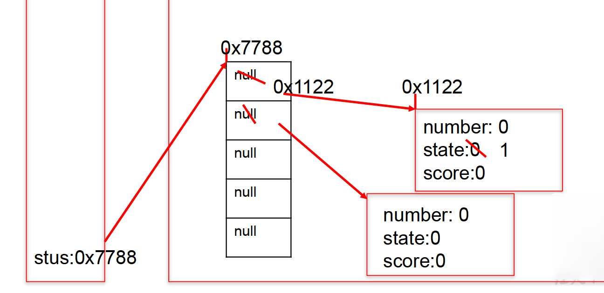

```java
/*引用类型的变量，只可能存储量两类值：null或地址值（含变量类型）*/
Student[] stus= newStudent[5];
stus[0] = new Student();
sysout(stus[0].state);//1
sysout(stus[1]);//null
sysout(stus[1].number);//异常
stus[1] = new Student();
sysout(stus[1].number);//0

class Student{ 
  int number;//学号
  int state = 1;//年级
  int score;//成绩
}
```


