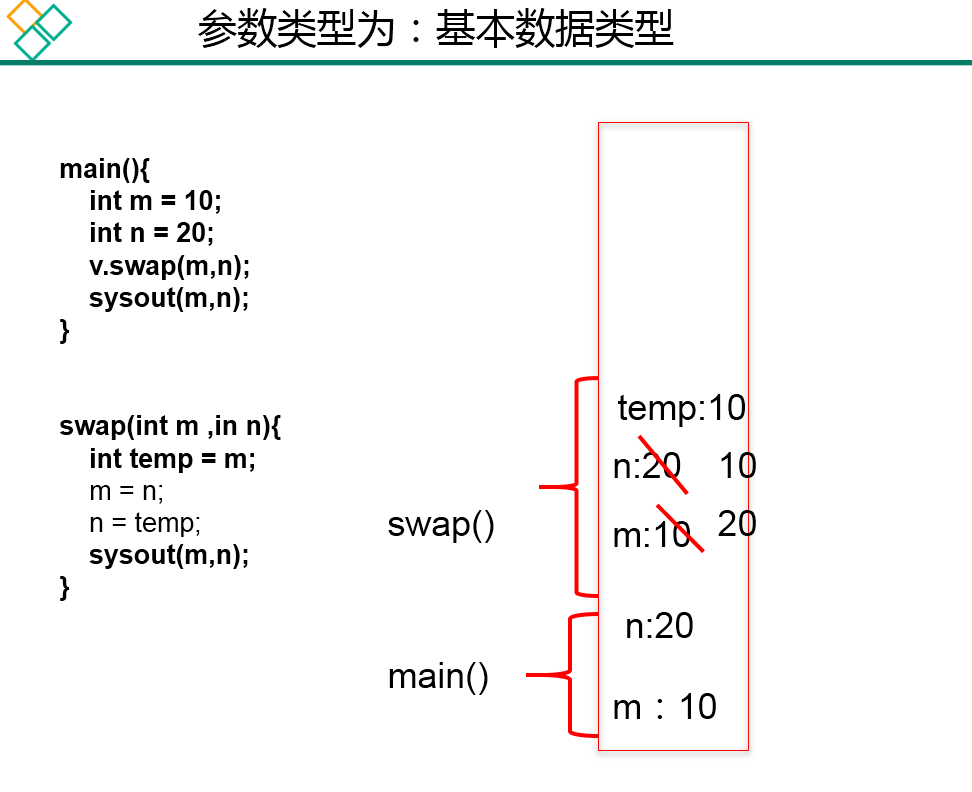
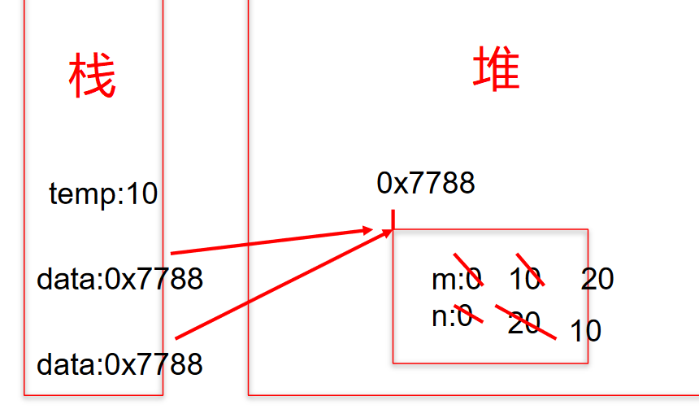
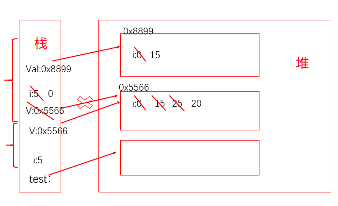
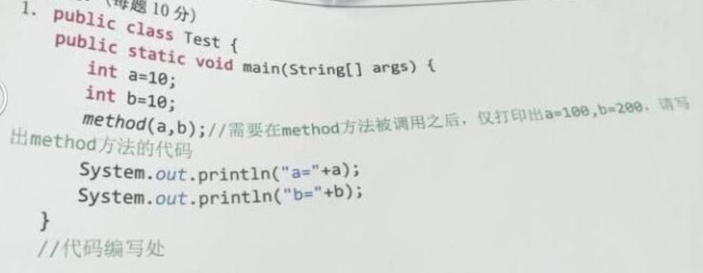

```java
/*
 * 关于变量的赋值
 * 
 *   如果变量是基本数据类型，此时赋值的是变量所保存的数据值。
 *   如果变量是引用数据类型，此时赋值的是变量所保存的数据的地址值。
 * 
 */
public class ValueTransferTest { 

  public static void main(String[] args) { 
  
    System.out.println("**********基本数据类型：***********");
    int m = 10;
    int n = m;
  
    System.out.println("m = " + m + ", n = " + n);
  
    n = 20;
  
    System.out.println("m = " + m + ", n = " + n);

    System.out.println("***********引用数据类型:********");
  
    Order o1 = new Order();
    o1.orderId = 1001;
  
    Order o2 = o1;  //赋值后，o1和o2的地址值相同，都指向了堆空间中同一个对象实体
    System.out.println("o1.orderId = " + o1.orderId + ",o2.orderId = " + o2.orderId);
  
    o2.orderId = 1002;
    System.out.println("o1.orderId = " + o1.orderId + ",o2.orderId = " + o2.orderId);
  
  }
}

class Order{ 
  int orderId;
}
```

### 4.8.1、**针对基本数据类型**

```java
/*
 * 方法的形参的传递机制：值传递
 * 
 * 1.形参：方法定义时，声明的小括号内的参数
 *   实参：方法调用时，实际传递给形参的数据
 * 
 * 2.值传递机制：
 *  如果参数是基本数据类型，此时实参赋值给形参的是实参真是存储的数据值。
 */
public class ValueTransferTest1 { 

  public static void main(String[] args) { 
  
    int m = 10;
    int n = 20;
  
    System.out.println("m = " + m + ", n = " + n);
    //交换两个变量的值的操作
//    int temp = m;
//    m = n;
//    n = temp;
  
    ValueTransferTest1 test = new ValueTransferTest1();
    test.swap(m, n);
  
    System.out.println("m = " + m + ", n = " + n);
  
  }

  public void swap(int m,int n){ 
    int temp = m;
    m = n;
    n = temp;
  }
}
```




### 4.8.2、**针对引用数据类型**

```java
/*
 *  如果参数是引用数据类型，此时实参赋值给形参的是实参存储数据的地址值。
 */
public class ValueTransferTest2 { 

  public static void main(String[] args) { 
    Data data = new Data();
  
    data.m = 10;
    data.n = 20;
  
    System.out.println("m = " + data.m + ", n = " + data.n);

    //交换m和n的值
//    int temp = data.m;
//    data.m = data.n;
//    data.n = temp;

    ValueTransferTest2 test = new ValueTransferTest2();
    test.swap(data);
  
    System.out.println("m = " + data.m + ", n = " + data.n);

  }

  public void swap(Data data){ 
    int temp = data.m;
    data.m = data.n;
    data.n = temp;
  }
}


class Data{ 

  int m;
  int n;
}
```




### 4.8.3、**练习1**

```java
public class TransferTest3{ 
  public static void main(String args[]){ 
    TransferTest3 test=new TransferTest3();
    test.first();
  }

  public void first(){ 
    int i=5;
    Value v=new Value();
    v.i=25;
    second(v,i);
    System.out.println(v.i);
  }

  public void second(Value v,int i){ 
    i=0;
    v.i=20;
    Value val=new Value();
    v=val;
    System.out.println(v.i+" "+i);
  
  }
}
class Value { 
  int i= 15;
} 
```




### 4.8.4、**练习2**




```java
public static void method(int a,int b){ 
  a = a * 10;
  b = b * 20;
  System.out.println(a);
  System.out.println(b);
  System.exit(0);
}
```

### 4.8.5、**练习3**

```java
/*
 * 微软：
 * 定义一个int型的数组：int[] arr = new int[]{12,3,3,34,56,77,432};
 * 让数组的每个位置上的值去除以首位置的元素，得到的结果，作为该位置上的新值。遍历新的数组。 
 */
 
//错误写法
for(int i= 0;i < arr.length;i++){ 
  arr[i] = arr[i] / arr[0];
}

//正确写法1
for(int i = arr.length –1;i >= 0;i--){ 
  arr[i] = arr[i] / arr[0];
}

//正确写法2
int temp = arr[0];
for(int i= 0;i < arr.length;i++){ 
  arr[i] = arr[i] / temp;
}
```

### 4.8.6、**练习4**

```java
/*
 * int[] arr = new int[10];
 * System.out.println(arr);//地址值?
 * 
 * char[] arr1 = new char[10];
 * System.out.println(arr1);//地址值?
 */
public class ArrayPrint { 

  public static void main(String[] args) { 
    int[] arr = new int[]{ 1,2,3};
        //传进去的是一个Object的对象
    System.out.println(arr);//地址值
  
    char[] arr1 = new char[]{ 'a','b','c'};
        //传进去的是一个数组，里面遍历数据了
    System.out.println(arr1);//abc
  }
}
```

### 4.8.7、**练习5：将对象作为参数传递给方法**

```java
/*
 * 练习5：将对象作为参数传递给方法
 * (1)定义一个Circle类，包含一个double型的radius属性代表圆的半径，一个findArea()方法返回圆的面积。
 * 
 * (2)定义一个类PassObject，在类中定义一个方法printAreas()，该方法的定义如下：
 * public void printAreas(Circle c,int time)
 * 在printAreas方法中打印输出1到time之间的每个整数半径值，以及对应的面积。
 * 例如，times为5，则输出半径1，2，3，4，5，以及对应的圆面积。
 * 
 * (3)在main方法中调用printAreas()方法，调用完毕后输出当前半径值。
 *
 */
public class Circle { 

  double radius;  //半径

  //返回圆的面积
  public double findArea(){ 
    return radius * radius * Math.PI;
  }
}
```

> **PassObject类**

```java
public class PassObject { 

  public static void main(String[] args) { 
    PassObject test = new PassObject();
  
    Circle c = new Circle();
  
    test.printAreas(c, 5);
  
    System.out.println("no radius is:" + c.radius);
  }

  public void printAreas(Circle c,int time){ 
  
    System.out.println("Radius\t\tAreas");
  
    //设置圆的半径
    for(int i = 1;i <= time ;i++){ 
      c.radius = i;
      System.out.println(c.radius + "\t\t" + c.findArea());
    }
  
    //重新赋值
    c.radius = time + 1;
  }
}
```