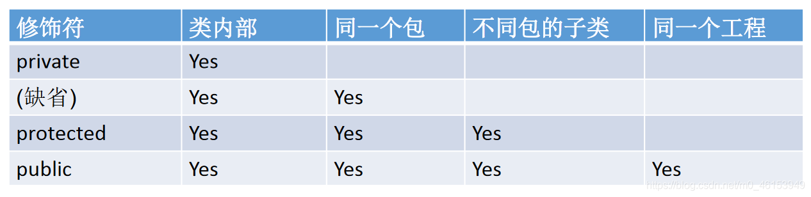
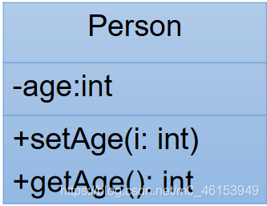

## 05、面向对象特征之一：封装与隐藏

> 1、封装性的引入与体现

为什么需要封装？封装的作用和含义？ 我要用洗衣机，只需要按一下开关和洗涤模式就可以了。有必要了解洗衣机内部的结构吗？有必要碰电动机吗？ 我要开车，…

> 2、我们程序设计追求“高内聚，低耦合”。

高内聚：类的内部数据操作细节自己完成，不允许外部干涉； 低耦合：仅对外暴露少量的方法用于使用。

> 3、隐藏对象内部的复杂性，只对外公开简单的接口。

便于外界调用，从而提高系统的可扩展性、可维护性。通俗的说，**把该隐藏的隐藏起来，该暴露的暴露出来。这就是封装性的设计思想。**

```java
/*
 * 面向对象的特征一:封装与隐藏
 * 一、问题的引入：
 *    当我们创建一个类的对象以后，我们可以通过"对象.属性"的方式，对对象的属性进行赋值。这里，赋值操作要受到
 *    属性的数据类型和存储范围的制约。但除此之外，没有其他制约条件。但是，实际问题中，我们往往需要给属性赋值
 *    加入额外限制条件。这个条件就不能在属性声明时体现，我们只能通过方法进行条件的添加。比如说，setLegs
 *    同时，我们需要避免用户再使用“对象.属性”的方式对属性进行赋值。则需要将属性声明为私有的(private)
 *    --》此时，针对于属性就体现了封装性。
 *  
 * 二、封装性的体现：
 *    我们将类的属性私有化(private),同时,提供公共的(public)方法来获取(getXxx)和设置(setXxx)
 *  
 *    拓展：封装性的体现：① 如上 ② 单例模式 ③ 不对外暴露的私有方法
 *
 */
public class AnimalTest { 

  public static void main(String[] args) { 
    Animal a = new Animal();
    a.name = "大黄";
//    a.age = 1;
//    a.legs = 4;//The field Animal.legs is not visible
  
    a.show();
  
//    a.legs = -4;
//    a.setLegs(6);
    a.setLegs(-6);
  
//    a.legs = -4;//The field Animal.legs is not visible
    a.show();
  
    System.out.println(a.name);
    System.out.println(a.getLegs());
  }
}
class Animal{ 

  String name;
  private int age;
  private int legs; //腿的个数

  //对于属性的设置
  public void setLegs(int l){ 
    if(l >= 0 && l % 2 == 0){ 
      legs = l;
    }else{ 
      legs = 0;
    }
  }

  //对于属性的获取
  public int getLegs(){ 
    return legs;
  }

  public void eat(){ 
    System.out.println("动物进食");
  }

  public void show(){ 
    System.out.println("name = " + name + ",age = " + age + ",legs = " + legs);
  }

  //提供关于属性 age 的 get 和 set 方法
  public int getAge(){ 
    return age;
  }

  public void setAge(int a){ 
    age = a;
  }
}
```

## 5.1、四种权限修饰符的理解与测试

Java 权限修饰符`public、protected、default(缺省)、private` 置于类的成员定义前，用来限定对象对该类成员的访问权限。




**对于 class 的权限修饰只可以用 public 和 default(缺省)。**

- public 类可以在任意地方被访问。
- default 类只可以被同一个包内部的类访问。

> 1、**Order 类**

```java
/*
 * 三、封装性的体现，需要权限修饰符来配合。
 *   1.Java 规定的 4 种权限：(从小到大排序)private、缺省、protected、public
 *   2.4 种权限用来修饰类及类的内部结构：属性、方法、构造器、内部类
 *   3.具体的，4 种权限都可以用来修饰类的内部结构：属性、方法、构造器、内部类
 *      修饰类的话，只能使用：缺省、public
 *  总结封装性：Java 提供了 4 中权限修饰符来修饰类积累的内部结构，体现类及类的内部结构的可见性的方法。
 * 
 */
public class Order { 

  private int orderPrivate;
  int orderDefault;
  public int orderPublic;

  private void methodPrivate(){ 
    orderPrivate = 1;
    orderDefault = 2;
    orderPublic = 3;
  }

  void methodDefault(){ 
    orderPrivate = 1;
    orderDefault = 2;
    orderPublic = 3;
  }

  public void methodPublic(){ 
    orderPrivate = 1;
    orderDefault = 2;
    orderPublic = 3;
  }
}
```

> 2、**OrderTest 类**

```java
public class OrderTest { 

  public static void main(String[] args) { 
  
    Order order = new Order();
  
    order.orderDefault = 1;
    order.orderPublic = 2;
    //出了 Order 类之后，私有的结构就不可调用了
//    order.orderPrivate = 3;//The field Order.orderPrivate is not visible
  
    order.methodDefault();
    order.methodPublic();
    //出了 Order 类之后，私有的结构就不可调用了
//    order.methodPrivate();//The method methodPrivate() from the type Order is not visible
  }
}
```

> **相同项目不同包的 OrderTest 类**

```java
import github.Order;

public class OrderTest { 

  public static void main(String[] args) { 
    Order order = new Order();
  
    order.orderPublic = 2;
    //出了 Order 类之后，私有的结构、缺省的声明结构就不可调用了
//    order.orderDefault = 1;
//    order.orderPrivate = 3;//The field Order.orderPrivate is not visible
  
    order.methodPublic();
    //出了 Order 类之后，私有的结构、缺省的声明结构就不可调用了
//    order.methodDefault();
//    order.methodPrivate();//The method methodPrivate() from the type Order is not visible
  }
}
```


## 5.2、封装性的练习




```java
/*
 * 1.创建程序,在其中定义两个类：Person 和 PersonTest 类。
 * 定义如下：用 setAge()设置人的合法年龄(0~130)，用 getAge()返回人的年龄。
 * 
 */
public class Person { 

  private int age;

  public void setAge(int a){ 
    if(a < 0 || a > 130){ 
//      throw new RuntimeException("传入的数据据非法");
      System.out.println("传入的数据据非法");
      return;
    }
  
    age = a;
  
  }

  public int getAge(){ 
    return age;
  }

  //绝对不能这样写！！！
  public int doAge(int a){ 
    age = a;
    return age;
  }
}
```

> 3、**测试类**

```java
/*
 *  在 PersonTest 类中实例化 Person 类的对象 b，
 *  调用 setAge()和 getAge()方法，体会 Java 的封装性。
 */
public class PersonTest { 

  public static void main(String[] args) { 
    Person p1 = new Person();
//    p1.age = 1;  //编译不通过
  
    p1.setAge(12);
  
    System.out.println("年龄为:" + p1.getAge());
  }
}
```