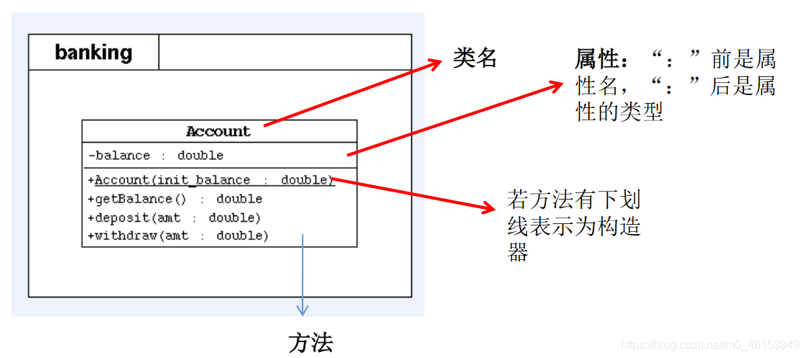

## 6.1、构造器的理解

```java
/*
 * 类的结构之三:构造器(构造方法、constructor)的使用
 * constructor:
 * 
 * 一、构造器的作用:
 * 1.创建对象
 * 2.初始化对象的属性
 * 
 * 二、说明
 * 1.如果没有显示的定义类的构造器的话，则系统默认提供一个空参的构造器。
 * 2.定义构造器的格式:
 *       权限修饰符  类名(形参列表) { }
 * 3.一个类中定义的多个构造器，彼此构成重载。
 * 4.一旦显示的定义了类的构造器之后，系统不再提供默认的空参构造器。
 * 5.一个类中，至少会有一个构造器  
 */
public class PersonTest { 

  public static void main(String[] args) { 
    //创建类的对象:new + 构造器
    Person p = new Person();  //Person()这就是构造器
  
    p.eat();
  
    Person p1 = new Person("Tom");
    System.out.println(p1.name);
  }
}
class Person{ 
  //属性
  String name;
  int age;

  //构造器
  public Person(){ 
    System.out.println("Person()......");
  }

  public Person(String n){ 
    name = n;
  }

  public Person(String n,int a){ 
    name = n;
    age = a;
  }

  //方法
  public void eat(){ 
    System.out.println("人吃饭");
  }

  public void study(){ 
    System.out.println("人学习");
  }
}
```

> 1、**练习 1**

```java
/* 2.在前面定义的 Person 类中添加构造器，
 * 利用构造器设置所有人的 age 属性初始值都为 18。
 * 
 */
public class Person { 

  private int age;

  public Person(){ 
    age = 18;
  }
}

public class PersonTest { 

  public static void main(String[] args) { 
    Person p1 = new Person();

    System.out.println("年龄为:" + p1.getAge());
  }
}
```

> 2、**练习 2**

```java
/* 3.修改上题中类和构造器，增加 name 属性,
 *   使得每次创建 Person 对象的同时初始化对象的 age 属性值和 name 属性值。
 */
public class Person { 

  private int age;
  private String name;

  public Person(){ 
    age = 18;
  }

  public Person(String n,int a){ 
    name = n;
    age = a;
  }

  public void setName(String n){ 
    name = n;
  }

  public String getName(){ 
    return name;
  }

  public void setAge(int a){ 
    if(a < 0 || a > 130){ 
//      throw new RuntimeException("传入的数据据非法");
      System.out.println("传入的数据据非法");
      return;
    }
  
    age = a;
  
  }

  public int getAge(){ 
    return age;
  }
}

public class PersonTest { 

  public static void main(String[] args) { 
  
    Person p2 = new Person("Tom",21);
  
    System.out.println("name = " + p2.getName() + ",age = " + p2.getAge());
  }
}
```

> 3、**练习 3**

```java
/*
 * 编写两个类，TriAngle 和 TriAngleTest，
 * 其中 TriAngle 类中声明私有的底边长 base 和高 height，同时声明公共方法访问私有变量。
 * 此外，提供类必要的构造器。另一个类中使用这些公共方法，计算三角形的面积。
 * 
 */
public class TriAngle { 

  private double base;//底边长
  private double height;//高

  public TriAngle(){ 
  
  }

  public TriAngle(double b,double h){ 
    base = b;
    height = h;
  }

  public void setBase(double b){ 
    base = b;
  }

  public double getBase(){ 
    return base;
  }

  public void setHeight(double h){ 
    height = h;
  }

  public double getHeight(){ 
    return height;
  }
}

public class TriAngleTest { 

  public static void main(String[] args) { 
  
    TriAngle t1 = new TriAngle();
    t1.setBase(2.0);
    t1.setHeight(2.5);
//    t1.base = 2.5;//The field TriAngle.base is not visible
//    t1.height = 4.3;  
    System.out.println("base : " + t1.getBase() + ",height : " + t1.getHeight());
  
    TriAngle t2 = new TriAngle(5.1,5.6);
    System.out.println("面积 : " + t2.getBase() * t2.getHeight() / 2);

  }
}
```

## 6.2、总结属性赋值的过程

```java
/*
 * 总结:属性赋值的先后顺序
 * 
 * ① 默认初始化值
 * ② 显式初始化
 * ③ 构造器中赋值
 * ④ 通过"对象.方法" 或 “对象.属性”的方式，赋值
 * 
 * 以上操作的先后顺序:① - ② - ③ - ④
 * 
 */
public class UserTest { 

  public static void main(String[] args) { 
    User u = new User();
  
    System.out.println(u.age);
  
    User u1 = new User(2);
  
    u1.setAge(3);
  
    System.out.println(u1.age);
  }
}
class User{ 
  String name;
  int age = 1;

  public User(){ 
  
  }

  public User(int a){ 
    age = a;
  }

  public void setAge(int a){ 
    age = a;
  }
}
```

## 6.3、JavaBean 的使用

```java
/*
 * JavaBean 是一种 Java 语言写成的可重用组件。
 * 所谓 javaBean，是指符合如下标准的 Java 类：
 *     > 类是公共的
 *     > 有一个无参的公共的构造器
 *     > 有属性，且有对应的 get、set 方法
 * 
 */
public class Customer { 

  private int id;
  private String name;

  public Customer(){ 
  
  }

  public void setId(int i){ 
    id = i;
  }

  public int getId(){ 
    return id;
  }

  public void setName(String n){ 
    name = n;
  }

  public String getName(){ 
    return name;
  }
}
```

## 6.4、UML 类图




- 表示 public 类型，-表示 private 类型，#表示 protected 类型
- 方法的写法: 方法的类型(+、-) 方法名(参数名：参数类型)：返回值类型