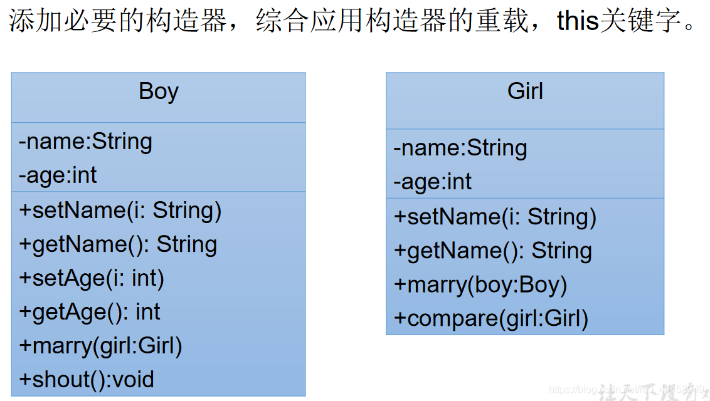

## 7.1、this 调用属性、方法、构造器

```java
/*
 * this 关键字的使用
 * 1.this 用来修饰、调用：属性、方法、构造器
 * 
 * 2.this 修饰属性和方法:
 *     this 理解为：当前对象,或当前正在创建的对象。
 *    
 *  2.1 在类的方法中，我们可以使用"this.属性"或"this.方法"的方式，调用当前对象属性和方法。
 *    通常情况下，我们都选择省略“this.”。特殊情况下，如果方法的形参和类的属性同名，我们必须显式
 *    的使用"this.变量"的方式，表明此变量是属性，而非形参。
 * 
 *  2.2 在类的构造器中，我们可以使用"this.属性"或"this.方法"的方式，调用正在创建的对象属性和方法。
 *    但是，通常情况下，我们都选择省略“this.”。特殊情况下，如果构造器的形参和类的属性同名，我们必须显式
 *    的使用"this.变量"的方式，表明此变量是属性，而非形参。
 *  
 *  3.this 调用构造器
 *    ① 我们可以在类的构造器中，显式的使用"this(形参列表)"的方式，调用本类中重载的其他的构造器！
 *    ② 构造器中不能通过"this(形参列表)"的方式调用自己。
 *    ③ 如果一个类中声明了n个构造器，则最多有n -1个构造器中使用了"this(形参列表)"。
 *    ④ "this(形参列表)"必须声明在类的构造器的首行！
 *    ⑤ 在类的一个构造器中，最多只能声明一个"this(形参列表)"。
 */
public class PersonTest { 

  public static void main(String[] args) { 
    Person p1 = new Person();
  
    p1.setAge(1);
    System.out.println(p1.getAge());
  
    p1.eat();
    System.out.println();
  
    Person p2 = new Person("jerry" ,20);
    System.out.println(p2.getAge());
  }
}
class Person{ 

  private String name;
  private int age;

  public Person(){ 
    this.eat();
    String info = "Person 初始化时，需要考虑如下的 1,2,3,4...(共 40 行代码)";
    System.out.println(info);
  }

  public Person(String name){ 
    this();
    this.name = name;
  }

  public Person(int age){ 
    this();
    this.age = age;
  }

  public Person(String name,int age){ 
    this(age);  //调用构造器的一种方式
    this.name = name;
//    this.age = age;
  }

  public void setNmea(String name){ 
    this.name = name;
  }

  public String getName(){ 
    return this.name;
  }

  public void setAge(int age){ 
    this.age = age;
  }

  public int getAge(){ 
    return this.age;
  }

  public void eat(){ 
    System.out.println("人吃饭");
    this.study();
  }

  public void study(){ 
    System.out.println("学习");
  }
}
```

## 7.2、this 的练习




> 1、**Boy 类**

```java
public class Boy { 

  private String name;
  private int age;

  public void setName(String name){ 
    this.name = name;
  }

  public String getName(){ 
    return name;
  }

  public void setAge(int ahe){ 
    this.age = age;
  }

  public int getAge(){ 
    return age;
  }

  public Boy(String name, int age) { 
    this.name = name;
    this.age = age;
  }


  public void marry(Girl girl){ 
    System.out.println("我想娶" + girl.getName());
  }

  public void shout(){ 
    if(this.age >= 22){ 
      System.out.println("可以考虑结婚");
    }else{ 
      System.out.println("好好学习");
    }
  }
}
```

> 2、**Girl 类**

```java
public class Girl { 

  private String name;
  private int age;

  public String getName() { 
    return name;
  }
  public void setName(String name) { 
    this.name = name;
  }

  public Girl(){ 
  
  }
  public Girl(String name, int age) { 
    this.name = name;
    this.age = age;
  }

  public void marry(Boy boy){ 
    System.out.println("我想嫁给" + boy.getName());
  }
  /**
    * 
    * @Description 比较两个对象的大小
    * @author subei
    * @date 2020 年 4 月 21 日上午 9:17:35
    * @param girl
    * @return
   */
  public int compare(Girl girl){ 
//    if(this.age >girl.age){ 
//      return 1;
//    }else if(this.age < girl.age){ 
//      return -1;
//    }else{ 
//      return 0;
//    }
  
    return this.age - girl.age;
  }

}
```

> 3、**测试类**

```java
public class BoyGirlTest { 

  public static void main(String[] args) { 
  
    Boy boy = new Boy("罗密欧",21);
    boy.shout();
  
    Girl girl = new Girl("朱丽叶", 18);
    girl.marry(boy);
  
    Girl girl1 = new Girl("祝英台", 19);
    int compare = girl.compare(girl1);
    if(compare > 0){ 
      System.out.println(girl.getName() + "大");
    }else if(compare < 0){ 
      System.out.println(girl1.getName() + "大");
    }else{ 
      System.out.println("一样的");
    }
  }
}
```

> 2、练习2

**Account 类**

```java
public class Account { 

  private int id; // 账号
  private double balance; // 余额
  private double annualInterestRate; // 年利率

  public void setId(int id) { 

  }

  public double getBalance() { 
    return balance;
  }

  public void setBalance(double balance) { 
    this.balance = balance;
  }

  public double getAnnualInterestRate() { 
    return annualInterestRate;
  }

  public void setAnnualInterestRate(double annualInterestRate) { 
    this.annualInterestRate = annualInterestRate;
  }

  public int getId() { 
    return id;
  }

  public void withdraw(double amount) {  // 取钱
    if(balance < amount){ 
      System.out.println("余额不足，取款失败");
      return;
    }
    balance -= amount;
    System.out.println("成功取出" + amount);
  }

  public void deposit(double amount) {  // 存钱
    if(amount > 0){ 
      balance += amount;
      System.out.println("成功存入" + amount);
    }
  }

  public Account(int id, double balance, double annualInterestRate) { 
    this.id = id;
    this.balance = balance;
    this.annualInterestRate = annualInterestRate;
  }


}
```

**Customer 类**

```java
public class Customer { 

  private String firstName;
  private String lastName;
  private Account account;

  public Customer(String f, String l) { 
    this.firstName = f;
    this.lastName = l;
  }

  public String getFirstName() { 
    return firstName;
  }

  public String getLastName() { 
    return lastName;
  }

  public Account getAccount() { 
    return account;
  }

  public void setAccount(Account account) { 
    this.account = account;
  }

}
```

**CustomerTest 类**

```java
/*
 * 写一个测试程序。
 * （1）创建一个 Customer，名字叫 Jane Smith, 他有一个账号为 1000，
 * 余额为 2000 元，年利率为 1.23％的账户。
 * （2）对 Jane Smith 操作。存入 100 元，再取出 960 元。再取出 2000 元。
 * 打印出 Jane Smith 的基本信息
 * 
 * 成功存入：100.0
 * 成功取出：960.0
 * 余额不足，取款失败
 * Customer  [Smith,  Jane]  has  a  account:  id  is 1000, 
 *  annualInterestRate  is 1.23％,  balance  is 1140.0
 *  
 */
public class CustomerTest { 

  public static void main(String[] args) { 
    Customer cust = new Customer("Jane" , "Smith");
  
    Account acct = new Account(1000,2000,0.0123);
  
    cust.setAccount(acct);
  
    cust.getAccount().deposit(100); //存入 100
    cust.getAccount().withdraw(960); //取钱 960
    cust.getAccount().withdraw(2000); //取钱 2000
  
    System.out.println("Customer[" + cust.getLastName() + cust.getFirstName() + "]  has  a  account:  id  is "
        + cust.getAccount().getId() + ",annualInterestRate  is " + cust.getAccount().getAnnualInterestRate() * 100 + "%,  balance  is "
        + cust.getAccount().getBalance());
  }
}
```

> 3、练习3

**Account 类**

```java
public class Account { 

  private double balance;

  public double getBalance() { 
    return balance;
  }

  public Account(double init_balance){ 
    this.balance = init_balance;
  }

  //存钱操作
  public void deposit(double amt){ 
    if(amt > 0){ 
      balance += amt;
      System.out.println("存钱成功");
    }
  }

  //取钱操作
  public void withdraw(double amt){ 
    if(balance >= amt){ 
      balance -= amt;
      System.out.println("取钱成功");
    }else{ 
      System.out.println("余额不足");
    }
  }
}
```

**Customer 类**

```java
public class Customer { 

  private String firstName;
  private String lastName;
  private Account account;

  public String getFirstName() { 
    return firstName;
  }
  public String getLastName() { 
    return lastName;
  }
  public Account getAccount() { 
    return account;
  }
  public void setAccount(Account account) { 
    this.account = account;
  }
  public Customer(String f, String l) { 
    this.firstName = f;
    this.lastName = l;
  }
}
```

**Bank 类**

```java
public class Bank { 

  private int numberOfCustomers;  //记录客户的个数
  private Customer[] customers;  //存放多个客户的数组

  public Bank(){ 
    customers = new Customer[10];
  }

  //添加客户
  public void addCustomer(String f,String l){ 
    Customer cust = new Customer(f,l);
//    customers[numberOfCustomers] = cust;
//    numberOfCustomers++;
    customers[numberOfCustomers++] = cust;
  }

  //获取客户的个数
  public int getNumberOfCustomers() { 
    return numberOfCustomers;
  }

  //获取指定位置上的客户
  public Customer getCustomers(int index) { 
//    return customers;  //可能报异常
    if(index >= 0 && index < numberOfCustomers){ 
      return customers[index];
    }
  
    return null;
  }

}
```

**BankTest 类**

```java
public class BankTest { 

  public static void main(String[] args) { 
  
    Bank bank = new Bank();
  
    bank.addCustomer("Jane", "Smith");
  
    bank.getCustomers(0).setAccount(new Account(2000));
  
    bank.getCustomers(0).getAccount().withdraw(500);
  
    double balance = bank.getCustomers(0).getAccount().getBalance();
  
    System.out.println("客户: " + bank.getCustomers(0).getFirstName() + "的账户余额为：" + balance);
  
    System.out.println("***************************");
    bank.addCustomer("万里", "杨");
  
    System.out.println("银行客户的个数为: " + bank.getNumberOfCustomers());
  
  }
}
```