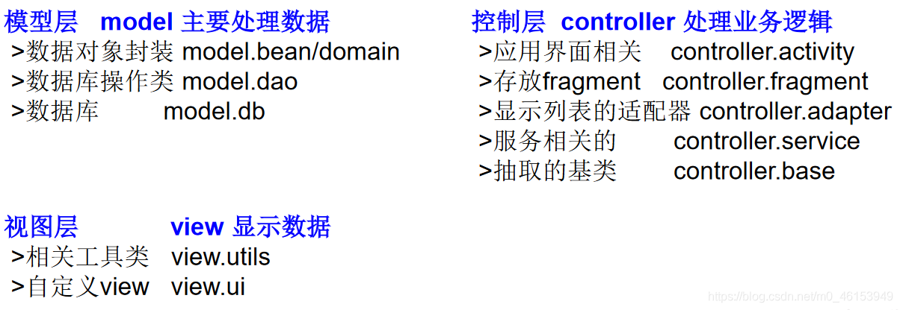

## 8.1、关键字—package

```java
/*
 * 一、package 关键字的使用
 * 1.为了更好的实现项目中类的管理，提供包的概念
 * 2.使用 package 声明类或接口所属的包，声明在源文件的首行
 * 3.包，属于标识符，遵循标识符的命名规则、规范"见名知意"
 * 4.每“.”一次,就代表一层文件目录。
 * 
 * 补充:同一个包下，不能命名同名接口或同名类
 *     不同包下，可以命名同名的接口、类。
 *
 */
public class PackageImportTest { 

}
```

> **JDK 中主要的包介绍**

```java
1.java.lang----包含一些 Java 语言的核心类，如 String、Math、Integer、System 和 Thread，提供常用功能
2.java.net----包含执行与网络相关的操作的类和接口。
3.java.io----包含能提供多种输入/输出功能的类。
4.java.util----包含一些实用工具类，如定义系统特性、接口的集合框架类、使用与日期日历相关的函数。
5.java.text----包含了一些 java 格式化相关的类
6.java.sql----包含了 java 进行 JDBC 数据库编程的相关类/接口
7.java.awt----包含了构成抽象窗口工具集（abstractwindowtoolkits）的多个类，这些类被用来构建和管理应用程序的图形用户界面(GUI)。B/S  C/S
```

## 8.2、MVC 设计模式

MVC 是常用的设计模式之一，将整个程序分为三个层次： **视图模型层，控制器层，数据模型层** 。这种将程序输入输出、数据处理，以及数据的展示分离开来的设计模式使程序结构变的灵活而且清晰，同时也描述了程序各个对象间的通信方式，降低了程序的耦合性。




## 8.3、关键字—import

```java
import java.util.*;

import account2.Bank;

/*
 * 二、import关键字的使用
 * import:导入
 * 1.在源文件中显式的使用import结构导入指定包下的类、接口
 * 2.声明在包的声明和类的声明之间
 * 3.如果需要导入多个结构，则并列写出即可
 * 4.可以使用"xxx.*"的方式,表示可以导入xxx包下的所有结构。
 * 5.如果导入的类或接口是java.lang包下的，或者是当前包下的，则可以省略此import语句。
 * 6.如果在代码中使用不同包下的同名的类。那么就需要使用类的全类名的方式指明调用的是哪个类。
 * 7.如果已经导入java.a包下的类。那么如果需要使用a包的子包下的类的话，仍然需要导入。
 * 8.import static组合的使用：调用指定类或接口下的静态的属性或方法.
 * 
 */
public class PackageImportTest { 

  public static void main(String[] args) { 
    String info = Arrays.toString(new int[]{ 1,2,3});
  
    Bank bank = new Bank();
  
    ArrayList list = new ArrayList();
    HashMap map = new HashMap();
  
    Scanner s = null;
  
    System.out.println("hello");
  
    UserTest us = new UserTest();
  
  }
}
```