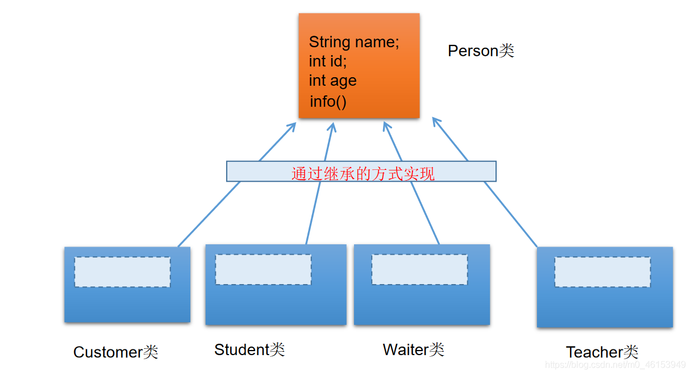
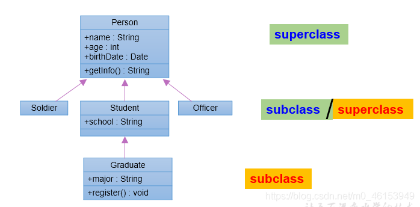
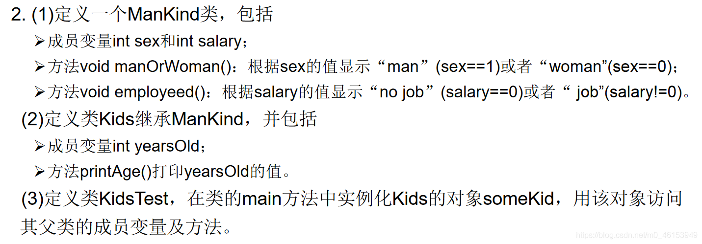
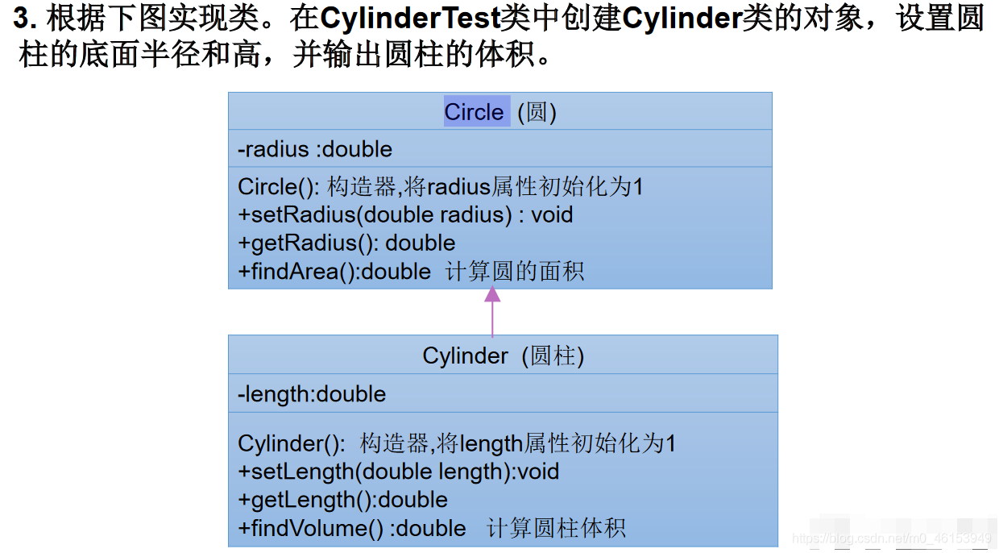

> 1、Person 类

```java
/*
 * 为描述和处理个人信息，定义类 Person
 */
public class Person { 

  String name;
  private int age;

  public Person(){ 
  
  }

  public Person(String name,int age){ 
    this.name = name;
    this.age = age;
  }

  public void eat(){ 
    System.out.println("吃饭");
    sleep();
  }

  private void sleep(){ 
    System.out.println("睡觉");
  }

  public int getAge() { 
    return age;
  }

  public void setAge(int age) { 
    this.age = age;
  }

}
```

> 2、Student 类

```java
/*
 * 为描述和处理学生信息，定义类 Student
 */
public class Student extends Person { 

//  String name;
//  int age;
  String major;

  public Student(){ 
  
  }

  public Student(String name,int age,String major){ 
    this.name = name;
//    this.age = age;
    setAge(age);
    this.major = major;
  }

//  public void eat(){ 
//    System.out.println("吃饭");
//  }
//
//  public void sleep(){ 
//    System.out.println("睡觉");
//  }

  public void study(){ 
    System.out.println("学习");
  }

  public void show(){ 
    System.out.println("name:" + name + ",age = " + getAge());
  }

}
```

> 3、测试类

```java
/*
 * 面向对象的特征二:继承性
 * 
 * 为什么要有继承？
 *     多个类中存在相同属性和行为时，将这些内容抽取到单独一个类中，
 *     那么多个类无需再定义这些属性和行为，只要继承那个类即可。
 *  * 一、继承性的好处
 * ① 减少了代码的冗余，提高了代码的复用性；
 * ② 便于功能的扩展；
 * ③ 为之后多态性的使用，提供了前提。
 * 
 * 二、继承性的格式
 *   class A extends B{}
 *  A:子类、派生类、subclass
 *  B:父类、超类、基类、superclass
 *  
 *  2.1 体现：一旦子类 A 继承父类以后，子类 A 中就获取了父类 B 中声明的结构：属性、方法
 *     特别的，父类中声明为 private 的属性或方法，子类继承父类以后，仍然认为获取了父类中私有的结构。
 *     只有因为封装性的影响，使得子类不能直接调用父类的结构而已。
 *  2.2 子类继承父类以后，还可以声明自己特有的属性或方法，实现功能的拓展。
 *    子类和父类的关系：不同于子集与集合的关系。
 *    extends:延展、扩展
 * 
 */
public class ExtendsTest { 

  public static void main(String[] args) { 
    Person p1 = new Person();
//    p1.age = 1;
    p1.eat();
    System.out.println("********************");
  
    Student s1 = new Student();
    s1.eat();
//    s1.sleep();
    s1.name = "Tom";
  
    s1.setAge(10);
    System.out.println(s1.getAge());
  
  }
}
```




> 3、Java 中关于继承性的规定

```java
/*  三、Java 中关于继承性的规定：
 *    1.一个类可以被多个类继承
 *    2.Java 中类的单继承性：一个类只能有一个父类
 *    3.子父类是相对的概念。
 *    4.子类直接继承的父类，称为：直接父类。间接继承的父类，称为，间接父类。
 *    5.子类继承父类后，就获取了直接父类以及所有间接父类中声明的属性和方法。
 * 
 * 四、1.如果我们没有显式的声明一个类的父类的话，则此类继承于 java.lang.Object 类
 *     2.所有的 java 类(除 java.long.Object 类之外)都直接或间接地继承于 java.lang.Object 类;
 *     3.意味着，所有的 java 类具有 java.lang.Object 类声明的功能。
 */
public class ExtendsTest { 

  public static void main(String[] args) { 
    s1.brease();
  
    Creature c = new Creature();
    System.out.println(c.toString());
  
  }
}
```

> 4、将上述 Person 类改为如下

```java
public class Person extends Creature { 
    ...
}
```

> 5、Creature 类

```java
public class Creature { 

  public void brease(){ 
    System.out.println("呼吸");
  }
}
```




## 1.1、继承性练习

> 1、练习1




```java
/*
 * 定义类Kids继承ManKind，并包括
 * 成员变量int yearsOld；
 * 方法printAge()打印yearsOld的值
 * 
 */
public class Kids extends ManKind{ 

  private int yearsOld;  //年限

  public Kids() { 


  }

  public Kids(int yearsOld) { 
    this.yearsOld = yearsOld;
  }

  public int getYearsOld() { 
    return yearsOld;
  }

  public void setYearsOld(int yearsOld) { 
    this.yearsOld = yearsOld;
  }

  public void printAge(){ 
    System.out.println("I am " + yearsOld);
  }
}
```

ManKind类

```java
/*
 * 定义一个ManKind类，包括
 * 成员变量int sex和int salary；
 * 方法void manOrWoman()：根据sex的值显示“man”(sex==1)或者“woman”(sex==0)；
 * 方法void employeed()：根据salary的值显示“no job”(salary==0)或者“job”(salary!=0)。
 * 
 */
public class ManKind { 

  private int sex;  //性别
  private int salary;  //薪资

  public ManKind() { 
  
  }

  public ManKind(int sex, int salary) { 
    this.sex = sex;
    this.salary = salary;
  }

  public void manOrWoman(){ 
    if(sex==1){ 
      System.out.println("man");
    }else if(sex==0){ 
      System.out.println("woman");
    }
  }

  public void employeed(){ 
    if(salary==0){ 
      System.out.println("no job");
    }else if(salary!=0){ 
      System.out.println("job");
    }
  }

  public int getSex() { 
    return sex;
  }

  public void setSex(int sex) { 
    this.sex = sex;
  }

  public int getSalary() { 
    return salary;
  }

  public void setSalary(int salary) { 
    this.salary = salary;
  }

}
```

KidsTest

```java
/*
 * 定义类KidsTest，在类的main方法中实例化Kids的对象someKid，
 * 用该对象访问其父类的成员变量及方法。
 * 
 */
public class KidsTest { 
  public static void main(String[] args) { 
  
    Kids someKid = new Kids(12);
  
    someKid.printAge();
  
    someKid.setYearsOld(15);
    someKid.setSalary(0);
    someKid.setSex(1);
  
    someKid.employeed();
    someKid.manOrWoman();
  }
}
```

> 2、练习2




```java
public class Circle { 

  public double radius;  //半径

  public Circle(){ 
    radius = 1.0;
  }

  public double getRadius() { 
    return radius;
  }

  public void setRadius(double radius) { 
    this.radius = radius;
  }

  public double findArea(){   //计算圆的面积
    return Math.PI * radius * radius;
  }
}
```

Cylinder类

```java
public class Cylinder extends Circle{ 

  private double length;

  public Cylinder(){ 
    length = 1.0;
  }

  public double getLength() { 
    return length;
  }

  public void setLength(double length) { 
    this.length = length;
  }

  public double findVolume(){   //计算圆柱体积
    return findArea() * length;
  }
}
```

测试类

```java
public class CylinderTest { 
  public static void main(String[] args) { 
  
    Cylinder cy = new Cylinder();
  
    cy.setRadius(2.1);
    cy.setLength(3.4);
    double volues = cy.findVolume();
    System.out.println("圆柱的体积:" + volues);
  
    double area = cy.findArea();
    System.out.println("圆的面积: " + area);
  }
}
```