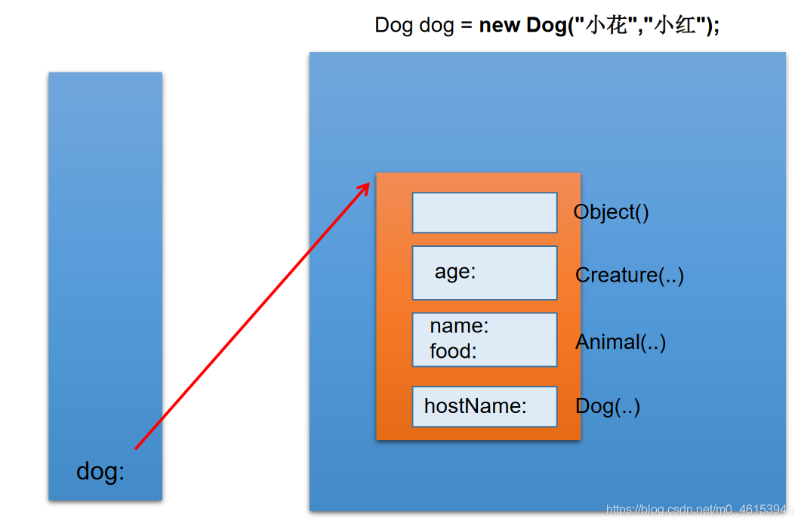
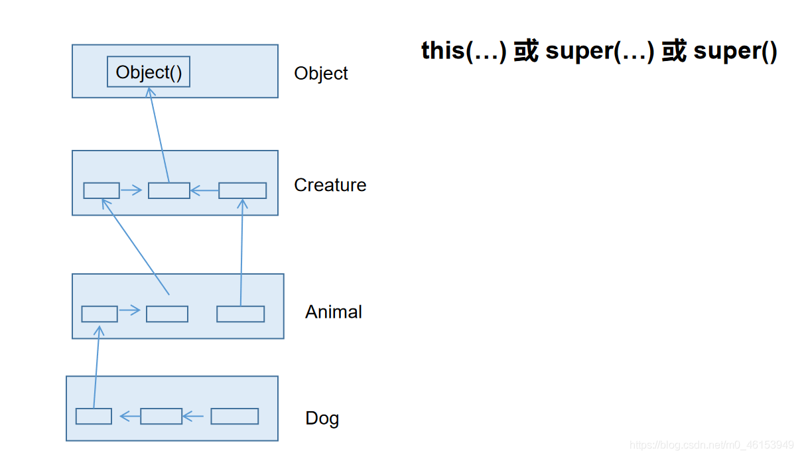

```java
/*
 * 子类对象实例化的全过程
 * 
 * 1.从结果上看:
 *     子类继承父类以后，就获取了父类中声明的属性或方法。
 *     创建子类的对象中，在堆空间中，就会加载所有父类中声明的属性。
 * 
 * 2.从过程上看:
 *     当我们通过子类的构造器创建子类对象时,我们一定会直接或间接的调用其父类构造器， 
 *     直到调用了java.lang.Object类中空参的构造器为止。正因为加载过所有的父类结构，所以才可以看到内存中有
 *     父类中的结构，子类对象可以考虑进行调用。
 * 
 * 明确:虽然创建子类对象时，调用了父类的构造器，但自始至终就创建过一个对象，即为new的子类对象。
 */
public class InstanceTest { 

}
```

> 练习

Account类

```java
/*
 * 写一个名为Account的类模拟账户。该类的属性和方法如下图所示。
 * 该类包括的属性：账号id，余额balance，年利率annualInterestRate；
 * 包含的方法：访问器方法（getter和setter方法），
 * 返回月利率的方法getMonthlyInterest()，
 * 取款方法withdraw()，存款方法deposit()。
 * 
 */
public class Account { 

  private int id;  //账号
  private double balance;  //余额
  private double annualInterestRate;  //年利率

  public Account(int id, double balance, double annualInterestRate) { 
    super();
    this.id = id;
    this.balance = balance;
    this.annualInterestRate = annualInterestRate;
  }

  public int getId() { 
    return id;
  }

  public void setId(int id) { 
    this.id = id;
  }

  public double getBalance() { 
    return balance;
  }

  public void setBalance(double balance) { 
    this.balance = balance;
  }

  public double getAnnualInterestRate() { 
    return annualInterestRate;
  }

  public void setAnnualInterestRate(double annualInterestRate) { 
    this.annualInterestRate = annualInterestRate;
  }

  public double getMonthlyInterest(){   //返回月利率的方法
    return annualInterestRate / 12;
  }

  public void withdraw (double amount){   //取款方法
    if(balance >= amount){ 
      balance -= amount;
      return;
    }
    System.out.println("余额不足");
  }

  public void deposit (double amount){   //存款方法
    if(amount > 0){ 
      balance += amount;
    
    }
  }

}
```

AccountTest类

```java
/*
 * 写一个用户程序测试Account类。在用户程序中，
 * 创建一个账号为1122、余额为20000、年利率4.5%的Account对象。
 * 使用withdraw方法提款30000元，并打印余额。再使用withdraw方法提款2500元，
 * 使用deposit方法存款3000元，然后打印余额和月利率。
 */
public class AccountTest { 
  public static void main(String[] args) { 
    Account acct = new Account(1122,20000,0.045);
  
    acct.withdraw(30000);
    System.out.println("你的账户余额为:" + acct.getBalance());
    acct.withdraw(2500);
    System.out.println("你的账户余额为:" + acct.getBalance());
    acct.deposit(3000);
    System.out.println("你的账户余额为:" + acct.getBalance());


    System.out.println("月利率为: " + (acct.getAnnualInterestRate() * 100) + "%");
  }
}
```

CheckAccount类

```java
/*
 * 创建Account类的一个子类CheckAccount代表可透支的账户，该账户中定义一个属性overdraft代表可透支限额。
 * 在CheckAccount类中重写withdraw方法，其算法如下：
 * 如果（取款金额<账户余额），
 * 可直接取款
 * 如果（取款金额>账户余额），
 * 计算需要透支的额度
 * 判断可透支额overdraft是否足够支付本次透支需要，如果可以
 *     将账户余额修改为0，冲减可透支金额
 * 如果不可以
 *     提示用户超过可透支额的限额
 * 
 */
public class CheckAccount extends Account{ 

  private double overdraft;  //代表可透支限额

  public CheckAccount(int id, double balance, double annualInterestRate,double overdraft){ 
    super(id, balance, annualInterestRate);
    this.overdraft = overdraft;
  }

  public double getOverdraft() { 
    return overdraft;
  }

  public void setOverdraft(double overdraft) { 
    this.overdraft = overdraft;
  }

  @Override
  public void withdraw(double amount) { 
    if(getBalance() >= amount){   //余额足够消费
      //方式一
//      setBalance(getBalance() - amount); 
      //方式二
      super.withdraw(amount);
    }else if(overdraft >= amount - getBalance()){   //余额不够
    
      overdraft -= (amount - getBalance());
//      setBalance(0);
      //或
      super.withdraw(getBalance());
    
    }else{   //超过可透支限额
      System.out.println("超过可透支限额！");
    }
  
  }
}
```

CheckAccountTest类

```java
/*
 * 写一个用户程序测试CheckAccount类。在用户程序中，
 * 创建一个账号为1122、余额为20000、年利率4.5%，
 * 可透支限额为5000元的CheckAccount对象。
 * 使用withdraw方法提款5000元，并打印账户余额和可透支额。
 * 再使用withdraw方法提款18000元，并打印账户余额和可透支额。
 * 再使用withdraw方法提款3000元，并打印账户余额和可透支额。
 * 
 */
public class CheckAccountTest { 
  public static void main(String[] args) { 
    CheckAccount cat = new CheckAccount(1122,20000,0.045,5000);
  
    cat.withdraw(5000);
    System.out.println("您的账户余额为: " + cat.getBalance());
    System.out.println("您的可透支额度为: " + cat.getOverdraft());
  
    cat.withdraw(18000);
    System.out.println("您的账户余额为: " + cat.getBalance());
    System.out.println("您的可透支额度为: " + cat.getOverdraft());
  
    cat.withdraw(3000);
    System.out.println("您的账户余额为: " + cat.getBalance());
    System.out.println("您的可透支额度为: " + cat.getOverdraft());
  }
}
```