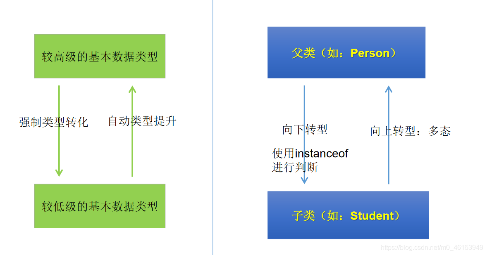

> Person类

```java
public class Person { 
  String name;
  int age;

  public void eat(){ 
    System.out.println("人，吃饭");
  }

  public void walk(){ 
    System.out.println("人，走路");
  }

}
```

> Woman类

```java
public class Woman extends Person{ 

  boolean isBeauty;

  public void goShopping(){ 
    System.out.println("女人喜欢购物");
  }

  public void eat(){ 
    System.out.println("女人少吃，为了减肥。");
  }

  public void walk(){ 
    System.out.println("女人，窈窕的走路。");
  }
}
```

> Man类

```java
public class Man extends Person{ 

  boolean isSmoking;

  public void earnMoney(){ 
    System.out.println("男人负责工作养家");
  }

  public void eat() { 
    System.out.println("男人多吃肉，长肌肉");
  }

  public void walk() { 
    System.out.println("男人霸气的走路");
  }
}
```

> 测试类

```java
/*
 * 面向对象之三:多态性
 * 
 * 1.理解多态性:可以理解为一个事物的多种态性。
 * 2.何为多态性:
 *    对象的多态性:父类的引用指向子类的对象(或子类的对象赋值给父类的引用)
 * 
 * 3.多态的使用：虚拟方法调用
 *   有了对象多态性以后，我们在编译期，只能调用父类声明的方法，但在执行期实际执行的是子类重写父类的方法
 *       简称：编译时，看左边；运行时，看右边。
 *  
 *  若编译时类型和运行时类型不一致，就出现了对象的多态性(Polymorphism)
 *  多态情况下，
 *    “看左边”：看的是父类的引用（父类中不具备子类特有的方法）
 *    “看右边”：看的是子类的对象（实际运行的是子类重写父类的方法）
 *  
 *  4.多态性的使用前提：
 *    ① 类的继承关系
 *    ② 方法的重写
 *  5.对象的多态性:只适用于方法，不适用于属性(编译和运行都看左边)
 */
public class PersonTest { 
  public static void main(String[] args) { 
  
  Person p1 = new Person();
  p1.eat();

  Man man = new Man();
  man.eat();
  man.age = 25;
  man.earnMoney();

  //************************************
  //对象的多态性，父类的引用指向子类的对象
  Person p2 = new Man();
//  Person p3 = new Woman();

  //多态的使用:当调用子父类同名同参数方法时，实际调用的是子类重写父类的方法---虚拟方法调用
  p2.eat();
  p2.walk();

//  p2.earnMoney();

  }
}
```

> 举例

```java
/*
 * 多态性应用举例
 */
public class AnimalTest { 

  public static void main(String[] args) { 
    AnimalTest test = new AnimalTest();
    test.func(new Dog());
  
    test.func(new Cat());
  }

  public void func(Animal animal){   //Animal animal = new Dog();
    animal.eat();
    animal.shout();
  }

  //如果没有多态性，就会写很多如下的方法，去调用
  public void func(Dog dog){ 
    dog.eat();
    dog.shout();
  }

  public void func(Cat cat){ 
    cat.eat();
    cat.shout();
  }
}

class Animal{ 

  public void eat(){ 
    System.out.println("动物，进食");
  }

  public void shout(){ 
    System.out.println("动物：叫");
  }
}

class Dog extends Animal{ 
  public void eat(){ 
    System.out.println("狗吃骨头");
  }

  public void shout() { 
    System.out.println("汪！汪！汪！");
  }
}

class Cat extends Animal{ 
  public void eat(){ 
    System.out.println("猫吃鱼");
  }

  public void shout() { 
    System.out.println("喵！喵！喵！");
  }
}
```

## 6.1、虚拟方法的补充

```java
import java.util.Random;
/*
 * 2.从编译和运行的角度看：
 * 重载，是指允许存在多个同名方法，而这些方法的参数不同。
 * 编译器根据方法不同的参数表，对同名方法的名称做修饰。
 * 对于编译器而言，这些同名方法就成了不同的方法。
 * 它们的调用地址在编译期就绑定了。Java的重载是可以包括父类和子类的，
 * 即子类可以重载父类的同名不同参数的方法。所以：对于重载而言，在方法调用之前，
 * 编译器就已经确定了所要调用的方法，这称为“早绑定”或“静态绑定”；
 * 而对于多态，只有等到方法调用的那一刻，解释运行器才会确定所要调用的具体方法，
 * 这称为“晚绑定”或“动态绑定”。
 * 
 * 引用一句Bruce Eckel的话：“不要犯傻，如果它不是晚绑定，它就不是多态。”
 */
//面试题：多态是编译时行为还是运行时行为？
//证明如下：
class Animal  { 
 
  protected void eat() { 
    System.out.println("animal eat food");
  }
}

class Cat  extends Animal  { 
 
  protected void eat() { 
    System.out.println("cat eat fish");
  }
}

class Dog  extends Animal  { 
 
  public void eat() { 
    System.out.println("Dog eat bone");

  }

}

class Sheep  extends Animal  { 
 
  public void eat() { 
    System.out.println("Sheep eat grass");

  }
 
}

public class InterviewTest { 

  public static Animal  getInstance(int key) { 
    switch (key) { 
    case 0:
      return new Cat ();
    case 1:
      return new Dog ();
    default:
      return new Sheep ();
    }

  }

  public static void main(String[] args) { 
    int key = new Random().nextInt(3);

    System.out.println(key);

    Animal  animal = getInstance(key);
  
    animal.eat();
     
  }

}
```

## 6.2、向下转型的使用

> Person 类

```java
public class Person { 
  String name;
  int age;

  public void eat(){ 
    System.out.println("人，吃饭");
  }

  public void walk(){ 
    System.out.println("人，走路");
  }

}
```

> Man 类

```java
public class Man extends Person{ 

  boolean isSmoking;

  public void earnMoney(){ 
    System.out.println("男人负责工作养家");
  }

  public void eat() { 
    System.out.println("男人多吃肉，长肌肉");
  }

  public void walk() { 
    System.out.println("男人霸气的走路");
  }
}
```

> Woman 类

```java
public class Woman extends Person{ 

  boolean isBeauty;

  public void goShopping(){ 
    System.out.println("女人喜欢购物");
  }

  public void eat(){ 
    System.out.println("女人少吃，为了减肥。");
  }

  public void walk(){ 
    System.out.println("女人，窈窕的走路。");
  }
}
```

> PersonTest 类

```java
/*
 * 面向对象之三:多态性
 * 
 * 1.理解多态性:可以理解为一个事物的多种态性。
 * 2.何为多态性:
 *    对象的多态性:父类的引用指向子类的对象(或子类的对象赋值给父类的引用)
 * 
 * 3.多态的使用：虚拟方法调用
 *   有了对象多态性以后，我们在编译期，只能调用父类声明的方法，但在执行期实际执行的是子类重写父类的方法
 *       简称：编译时，看左边；运行时，看右边。
 *  
 *  若编译时类型和运行时类型不一致，就出现了对象的多态性(Polymorphism)
 *  多态情况下，
 *    “看左边”：看的是父类的引用（父类中不具备子类特有的方法）
 *    “看右边”：看的是子类的对象（实际运行的是子类重写父类的方法）
 *  
 *  4.多态性的使用前提：
 *    ① 类的继承关系
 *    ② 方法的重写
 *  5.对象的多态性:只适用于方法，不适用于属性(编译和运行都看左边)
 */
public class PersonTest { 
  public static void main(String[] args) { 

    Person p1 = new Person();
    p1.eat();

    Man man = new Man();
    man.eat();
    man.age = 25;
    man.earnMoney();

    // ************************************
    System.out.println("************************");
    // 对象的多态性，父类的引用指向子类的对象
    Person p2 = new Man();
    // Person p3 = new Woman();

    // 多态的使用:当调用子父类同名同参数方法时，实际调用的是子类重写父类的方法---虚拟方法调用
    p2.eat();
    p2.walk();

    // p2.earnMoney();

    System.out.println("**************************");
    // 不能调用子类所特有的方法、属性，编译时，p2是Person类型，

    // p2.earnMoney();

    p2.name = "Tom";
    // p2.isSmoking = true;
    // 有了对象的多态性以后，内存中实际上是加载了子类特有的属性和方法，但是由于变量声明为父类类型，导致
    // 编译时，只能调用父类中声明的属性和方法。子类的属性和方法不能调用。

    // 如何才能调用子类所特有的属性和方法？
    // 使用强制类型转换符，也可称为:向下转型
    Man m1 = (Man) p2;
    m1.earnMoney();
    m1.isSmoking = true;

    // 使用强转时，可能出现ClassCastException异常
    // Woman w1 = (Woman)p2;
    // w1.goShopping();

    /*
     * instanceof关键字的使用
     * 
     * a instanceof A:判断对象a是否是类A的实例。如果，返回true，如果不是，返回false;
     * 
     * 使用情境:为了避免在向下转型时出现ClassCastException异常，我们在进行向下转型之前，先进行
     * instanceof的判断,一旦返回true,就进行向下转型。如果返回false，不进行向下转型。
     * 
     * 如果a instanceof A返回true,则a instanceof B也返回true。 其中类B是类A的父类。
     * 
     */

    if (p2 instanceof Woman) { 
      Woman w1 = (Woman) p2;
      w1.goShopping();
      System.out.println("**********Woman*********");
    }

    if (p2 instanceof Man) { 
      Man m2 = (Man) p2;
      m2.earnMoney();
      System.out.println("*********Man************");
    }

    if (p2 instanceof Person) { 
      System.out.println("***********Person************");
    }

    if (p2 instanceof Object) { 
      System.out.println("***********object************");
    }
  
    //向下转型的常见问题
    //练习
    //问题1:编译时通过，运行时不通过
    //举例一
//    Person p3 = new Woman();
//    Man m3 = (Man)p3;
  
    //举例二
    Person p4 = new Person();
    Man m4 = (Man)p4;
  
    //问题二:编译通过，运行时也通过
    Object obj = new Woman();
    Person p = (Person)obj;
  
    //问题三:编译不通过
//    Man m5 = new woman();
  
//    String str = new Date();
  
//    Object o = new Date();
//    String str1 = (String)o;
  }
}
```




## 6.3、[多态](https://so.csdn.net/so/search?q=多态&spm=1001.2101.3001.7020)性的练习

> 1、练习1

```java
/*
 * 练习:子类继承父类
 * 
 * 1.若子类重写了父类方法，就意味着子类里定义的方法彻底覆盖了父类里的同名方法，
 * 系统将不可能把父类里的方法转移到子类中。
 * 
 * 2.对于实例变量则不存在这样的现象，即使子类里定义了与父类完全相同的实例变量，
 * 这个实例变量依然不可能覆盖父类中定义的实例变量
 * 
 */
public class FieldMethodTest { 
  public static void main(String[] args){ 
    Sub s= new Sub();
    System.out.println(s.count);  //20
    s.display();//20
  
    Base b = s;
    //==:对于引用数据类型来讲，比较的是两个引用数据类型变量的地址值是否一样。
    System.out.println(b == s);  //true
    System.out.println(b.count);  //10
    b.display();
  }
}

class Base { 
  int count= 10;
  public void display() { 
    System.out.println(this.count);
  }
}

class Sub extends Base { 
  int count= 20;
  public void display() { 
    System.out.println(this.count);
  }
}
```

> 2、练习2

```java
/*
 * 建立InstanceTest 类，在类中定义方法method(Person e);
 * 
 * 在method中:
 * (1)根据e的类型调用相应类的getInfo()方法。
 * (2)根据e的类型执行：
 *     如果e为Person类的对象，输出：“a person”;
 *     如果e为Student类的对象，输出：“a student”“a person ”
 *     如果e为Graduate类的对象，输出：“a graduated student”
 *     “a student” “a person”
 * 
 */
class Person { 
  protected String name = "person";
  protected int age = 50;


  public String getInfo() { 
    return "Name: " + name + "\n" + "age: " + age;
  }
}

class Student extends Person { 
  protected String school = "pku";

  public String getInfo() { 
    return "Name: " + name + "\nage: " + age + "\nschool: " + school;
  }
}

class Graduate extends Student { 
  public String major = "IT";

  public String getInfo() { 
    return "Name: " + name + "\nage: " + age + "\nschool: " + school + "\nmajor:" + major;
  }
}


public class InstanceTest{ 

  public static void main(String[] args) { 
    //虚拟方法调用
    InstanceTest test = new InstanceTest();
    test.method(new Student());
  
  }

  public void method(Person e){ 
    String info = e.getInfo();
    System.out.println(info);
  
    //方法一
    if(e instanceof Graduate){ 
      System.out.println("a graduated student");
      System.out.println("a student");
      System.out.println("a person");
    }else if(e instanceof Student){ 
      System.out.println("a student");
      System.out.println("a person");
    }else{ 
      System.out.println("a person");
    }
  
    //方法二
    if(e instanceof Graduate){ 
      System.out.println("a graduated student");
    }
    if(e instanceof Student){ 
      System.out.println("a student");
    }
    if(e instanceof Person){ 
      System.out.println("a person");
    }
  }
}
```

> 3、练习3

Geometric[Object类](https://so.csdn.net/so/search?q=Object类&spm=1001.2101.3001.7020)

```java
/*
 * 定义三个类，父类GeometricObject代表几何形状，子类Circle代表圆形，MyRectangle代表矩形。
 */
public class GeometricObject { 
  protected String color;
  protected double weight;
  public String getColor() { 
    return color;
  }
  public void setColor(String color) { 
    this.color = color;
  }
  public double getWeight() { 
    return weight;
  }
  public void setWeight(double weight) { 
    this.weight = weight;
  }
  public GeometricObject(String color, double weight) { 
    super();
    this.color = color;
    this.weight = weight;
  }

  public double findArea(){ 
    return 0.0;
  }
}
```

Circle类

```java
public class Circle extends GeometricObject { 

  private double radius;

  public Circle(double weight,String color, double radius) { 
    super(color,weight);
    this.radius = radius;
  }

  public double getRadius() { 
    return radius;
  }

  public void setRadius(double radius) { 
    this.radius = radius;
  }

  @Override
  public double findArea() { 
    return 3.14 * radius * radius;
  }
}
```

MyRectangle类

```java
public class MyRectangle extends GeometricObject { 

  private double width;
  private double height;

  public MyRectangle(double width, double height,String color,double weight) { 
    super(color, weight);
    this.height = height;
    this.width = width;
  }

  public double getWidth() { 
    return width;
  }

  public void setWidth(double width) { 
    this.width = width;
  }

  public double getHeight() { 
    return height;
  }

  public void setHeight(double height) { 
    this.height = height;
  }

  @Override
  public double findArea() { 
    return width * height;
  }
}
```

GeometricTest类

```java
/*
 * 定义一个测试类GeometricTest，编写equalsArea方法测试两个对象的面积是否相等（注意方法的参数类型，利用动态绑定技术），
 * 编写displayGeometricObject方法显示对象的面积（注意方法的参数类型，利用动态绑定技术）。
 * 
 */
public class GeometricTest { 

  public static void main(String[] args) { 
    GeometricTest test = new GeometricTest();
  
    Circle c1 = new Circle(2.3,"white",1.0);
    test.displayGeometricObject(c1);
  
    Circle c2 = new Circle(3.3,"white",1.0);
    test.displayGeometricObject(c2);
  
    boolean isEqual = test.equalsArea(c1, c2);
    System.out.println("面积是否相等: " + isEqual);
  
    MyRectangle rect = new MyRectangle(2.1, 3.4,"red",1.0);
    test.displayGeometricObject(rect);
  }

  public void displayGeometricObject(GeometricObject o){ 
    System.out.println("面积为: " + o.findArea());
  }

  //测试两个对象的面积是否相等
  public boolean equalsArea(GeometricObject o1,GeometricObject o2){ 
    return o1.findArea() == o2.findArea();
  }
}
```

练习4

```java
/*
 * 面试题：多态是编译时行为还是运行时行为？如何证明？
 * 
 * 证明见如下：
 */
import java.util.Random;

class Animal  { 

  protected void eat() { 
    System.out.println("animal eat food");
  }
}

class Cat  extends Animal  { 

  protected void eat() { 
    System.out.println("cat eat fish");
  }
}

class Dog  extends Animal  { 

  public void eat() { 
    System.out.println("Dog eat bone");
  }
}

class Sheep  extends Animal  { 

  public void eat() { 
    System.out.println("Sheep eat grass");

  }

}

public class InterviewTest { 

  public static Animal  getInstance(int key) { 
    switch (key) { 
    case 0:
      return new Cat ();
    case 1:
      return new Dog ();
    default:
      return new Sheep ();
    }

  }

  public static void main(String[] args) { 
    int key = new Random().nextInt(3);

    System.out.println(key);

    Animal  animal = getInstance(key);
  
    animal.eat();
     
  }
}
```

> 4、面试题拓展

```java
/* 考查多态的笔试题目：
 * 面试题：多态是编译时行为还是运行时行为？如何证明？
 * 
 * 拓展问题
 */
public class InterviewTest1 { 

  public static void main(String[] args) { 
    Base base = new Sub();
    base.add(1, 2, 3);

//    Sub s = (Sub)base;
//    s.add(1,2,3);
  }
}

class Base { 
  public void add(int a, int... arr) { 
    System.out.println("base");
  }
}

class Sub extends Base { 

  public void add(int a, int[] arr) { 
    System.out.println("sub_1");
  }

//  public void add(int a, int b, int c) { 
//    System.out.println("sub_2");
//  }

}
```