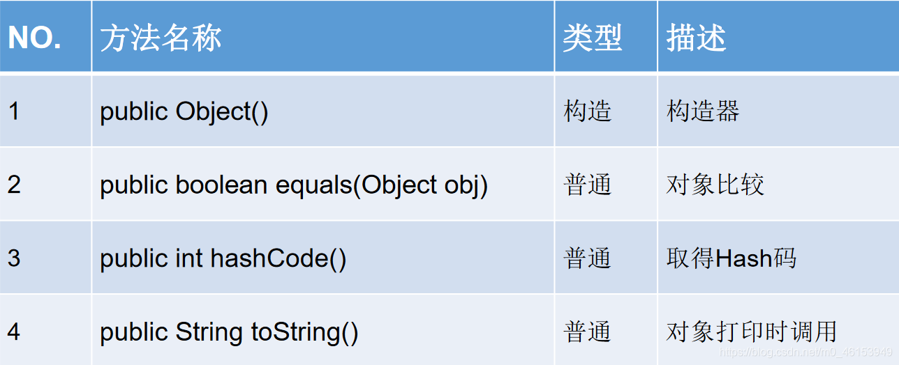

```java
/*
 * java.lang.Object类
 * 1.Object类是所有Java类的根父类;
 * 2.如果在类的声明中未使用extends关键字指明其父类，则默认父类为java.lang.Object类
 * 3.Object类中的功能(属性、方法)就具有通用性。
 * 属性:无
 * 方法:equals() / toString() / getClass() / hashCode() / clone() /finalize()
 *    wait() 、notify()、notifyAll()
 * 
 * 4.Object类只声明了一个空参的构造器。
 * 
 * 面试题:
 * 1、final、finally、finalize的区别？
 * final：是一个安全修饰符，修饰类类不能被继承，修饰方法，方法不能被重写，修饰变量，
 *       变量变常量，且只能赋值一次。
 * finally：是异常处理的一部分，当try catch执行完后，一定会执行finally中的内容，
 *          特殊情况外，当执行finally之前jvm停止运行，finally就不执行了
 * finalize：是Object中的一个方法，用于垃圾回收
 * 2.Object中的常用方法？
 * 类相关： getClass（） 获取类在运行期间的Class对象
 *         clone（）对象的克隆，一般不用
 *         toString（） 转字符串
 * 使用集合需要重写：
 *         equals（） 对象间比较方法
 *         hashCode（）获取对象的hash值，可以理解为获取在内存中的地址值 
 * 线程同步：
 *         wait(xxx) 线程进行阻塞状态
 *         notify() notifyAll() 唤醒某个阻塞的线程或者阻塞的线程
 * 垃圾回收：
 *        finalize（） 作为垃圾被回收时，最后执行的操作
 * 
 */
public class ObjectTest { 

  public static void main(String[] args) { 
  
  }
}

class Order{ 

}
```

## 7.1、Object类中的主要结构




## 7.2、==操作符与[equals](https://so.csdn.net/so/search?q=equals&spm=1001.2101.3001.7020)方法

```java
import java.sql.Date;

/*
 * 面试题: ==和equals的区别
 * 
 * 一、回顾==的使用
 * == : 运算符
 * 1.可以使用在基本数据类型变量和引用数据类型变量中
 * 2.如果比较的是基本数据类型变量：比较两个变量保存的数据是否相等。(不一定类型要相同)
 *      如果比较的是引用数据类型变量：比较两个对象的地址值是否相同,即两个引用是否指向同一个对象实体
 *  补充: == 符号使用时，必须保证符号左右两边的变量类型一致。
 *
 * 二、equals()方法的使用
 * 1.是一个方法，而非运算符
 * 2.只能适用于引用数据类型。
 * 3.Object类中equals()的定义：
 *     public boolean equals(Object obj){
 *       return (this == obj);
 *     }
 * 说明：Object类中定义的equals()和==的作用是相同的，比较两个对象的地址值是否相同，即两个引用是否指向同一个对象实体。
 * 
 * 4.像String、Date、File、包装类等都重写了Object类中的equals()方法.
 *    两个引用的地址是否相同，而是比较两个对象的“实体内容”是否相同。
 * 
 * 5.通常情况下，我们自定义的类如果使用equals()的话，也通常是比较两个对象的"实体内容"是否相同。那么，我们
 *      就需要对Object类中的equals()进行重写。
 * 
 * 重写的原则:比较两个对象的实体内容是否相同。
 * 
 */
public class EqualsTest { 
  public static void main(String[] args) { 
  
    //基本数据类型
    int i = 10;
    int j = 10;
    double d = 10.0;
    System.out.println(i == j);  //true
    System.out.println(i == d); //true
  
//    boolean b =true;
//    System.out.println(i == b);
  
    char c = 10;
    System.out.println(i == c); //true
  
    char c1 = 'A';
    char c2 = 65;
    System.out.println(c1 == c2); //true
  
    //引用数据类型
    Customer cust1 = new Customer("Tom" ,21);
    Customer cust2 = new Customer("Tom" ,21);
    System.out.println(cust1 == cust2); //false
  
    String str1 = new String("BAT");
    String str2 = new String("BAT");
    System.out.println(str1 == str2); //false
    System.out.println("*************************");
    System.out.println(cust1.equals(cust2));  //false
    System.out.println(str1.equals(str2));  //true
  
    Date date1 = new Date(23432525324L);
    Date date2 = new Date(23432525324L);
    System.out.println(date1.equals(date2));  //true
  }
}
```

> Customer类

```java
public class Customer { 

  private String name;
  private int age;
  public String getName() { 
    return name;
  }
  public void setName(String name) { 
    this.name = name;
  }
  public int getAge() { 
    return age;
  }
  public void setAge(int age) { 
    this.age = age;
  }
  public Customer() { 
    super();
  }
  public Customer(String name, int age) { 
    super();
    this.name = name;
    this.age = age;
  }


  //自动生成的equals()
  @Override
  public boolean equals(Object obj) { 
    if (this == obj)
      return true;
    if (obj == null)
      return false;
    if (getClass() != obj.getClass())
      return false;
    Customer other = (Customer) obj;
    if (age != other.age)
      return false;
    if (name == null) { 
      if (other.name != null)
        return false;
    } else if (!name.equals(other.name))
      return false;
    return true;
  }

  //重写原则，比较两个对象的实体内容(即name和age)是否相同
  //手动实现equals()的重写
//  @Override
//  public boolean equals(Object obj) { 
//  
    System.out.println("Customer equals()....");
//    if(this == obj){ 
//      return true;
//    }
//  
//    if(obj instanceof Customer){ 
//      Customer cust = (Customer)obj;
//      //比较两个对象的属性是否都相同
      if(this.age == cust.age && this.name.equals(cust.name)){ 
        return true;
      }else{ 
        return false;
      }
//    
//      //或
//      return this.age == cust.age && this.name.equals(cust.name);
//    }
//  
//    return false;
//  }
  
}
```

### 7.2.1、重写equals()方法的原则

- 对称性：如果x.equals(y)返回是“true”，那么y.equals(x)也应该返回是“true”。
- 自反性：x.equals(x)必须返回是“true”。
- 传递性：如果x.equals(y)返回是“true”，而且y.equals(z)返回是“true”，那么z.equals(x)也应该返回是“true”。
- 一致性：如果x.equals(y)返回是“true”，只要x和y内容一直不变，不管你重复x.equals(y)多少次，返回都是“true”。
- 任何情况下，x.equals(null)，永远返回是“false”；x.equals(和x不同类型的对象)永远返回是“false”。

```java
  int it = 65;
    float fl= 65.0f;
  System.out.println("65和65.0f是否相等？" + (it == fl)); //true
  char ch1 = 'A'; 
  char ch2 = 12;
  System.out.println("65和'A'是否相等？" + (it == ch1));//true
  System.out.println("12和ch2是否相等？" + (12 == ch2));//true 
  String str1 = new String("hello");
  String str2 = new String("hello");
  System.out.println("str1和str2是否相等？"+ (str1 == str2));//false
  System.out.println("str1是否equals str2？"+(str1.equals(str2)));//true
  System.out.println("hello" == new java.util.Date()); //编译不通过
```

> 练习一

```java
/*
 * .编写Order类，有int型的orderId，String型的orderName，
 * 相应的getter()和setter()方法，两个参数的构造器，重写父类的equals()方法：public booleanequals(Object obj)，
 * 并判断测试类中创建的两个对象是否相等。
 * 
 * 
 */
public class OrderTest { 
  public static void main(String[] args) { 
    Order order1 = new Order(1001,"AA");
    Order order2 = new Order(1001,"BB");
  
    System.out.println(order1.equals(order2));  //false
  
    Order order3 = new Order(1001,"BB");
    System.out.println(order2.equals(order3)); //true
  }
}

class Order{ 
  private int orderId;
  private String orderName;
  public int getOrderId() { 
    return orderId;
  }
  public void setOrderId(int orderId) { 
    this.orderId = orderId;
  }
  public String getOrderName() { 
    return orderName;
  }
  public void setOrderName(String orderName) { 
    this.orderName = orderName;
  }
  public Order(int orderId, String orderName) { 
    super();
    this.orderId = orderId;
    this.orderName = orderName;
  }
  public boolean equals(Object obj){ 
    if(this == obj){     
      return true;
    }
    if(obj instanceof Order){ 
      Order order = (Order)obj;
      //正确的
      return this.orderId == order.orderId && this.orderName.equals(order.orderName);
      //错误的
//      return this.orderId == order.orderId && this.orderName == order.orderName;
    }
    return false;
  }
}
```

> 练习二

```java
/*
 * 请根据以下代码自行定义能满足需要的MyDate类,在MyDate类中覆盖equals方法，
 * 使其判断当两个MyDate类型对象的年月日都相同时，结果为true，否则为false。
 * public boolean equals(Object o)
 */
public class MyDateTest { 
  public static void main(String[] args) { 
    MyDate m1= new MyDate(14, 3, 1976);
    MyDate m2= new MyDate(14, 3, 1976);
    if(m1== m2) { 
      System.out.println("m1==m2");
    } else{ 
      System.out.println("m1!=m2"); // m1 != m2
    }
  
    if(m1.equals(m2)) { 
      System.out.println("m1 is equal to m2");// m1 is equal to m2
    } else{ 
      System.out.println("m1 is not equal to m2");
    }
  }
}

class MyDate{ 
  private int day;
  private int month;
  private int year;

  public MyDate(int day, int month, int year) { 
    super();
    this.day = day;
    this.month = month;
    this.year = year;
  }

  public int getDay() { 
    return day;
  }

  public void setDay(int day) { 
    this.day = day;
  }

  public int getMonth() { 
    return month;
  }


  public void setMonth(int month) { 
    this.month = month;
  }

  public int getYear() { 
    return year;
  }

  public void setYear(int year) { 
    this.year = year;
  }

  @Override
  public boolean equals(Object obj) { 
    if(this == obj){ 
      return true;
    }
    if(obj instanceof MyDate){ 
      MyDate myDate = (MyDate)obj;
      return this.day == myDate.day && this.month == myDate.month &&
          this.year == myDate.year;
    }
    return false;
  }

//  @Override
//  public boolean equals(Object obj) { 
//    if (this == obj)
//      return true;
//    if (obj == null)
//      return false;
//    if (getClass() != obj.getClass())
//      return false;
//    MyDate other = (MyDate) obj;
//    if (day != other.day)
//      return false;
//    if (month != other.month)
//      return false;
//    if (year != other.year)
//      return false;
//    return true;
//  }
  
}
```

## 7.3、toString的使用

```java
public class Customer { 

  private String name;
  private int age;
  public String getName() { 
    return name;
  }
  public void setName(String name) { 
    this.name = name;
  }
  public int getAge() { 
    return age;
  }
  public void setAge(int age) { 
    this.age = age;
  }
  public Customer() { 
    super();
  }
  public Customer(String name, int age) { 
    super();
    this.name = name;
    this.age = age;
  }

  //自动生成的equals()
  @Override
  public boolean equals(Object obj) { 
    if (this == obj)
      return true;
    if (obj == null)
      return false;
    if (getClass() != obj.getClass())
      return false;
    Customer other = (Customer) obj;
    if (age != other.age)
      return false;
    if (name == null) { 
      if (other.name != null)
        return false;
    } else if (!name.equals(other.name))
      return false;
    return true;
  }

  //重写原则，比较两个对象的实体内容(即name和age)是否相同
  //手动实现equals()的重写
//  @Override
//  public boolean equals(Object obj) { 
//  
    System.out.println("Customer equals()....");
//    if(this == obj){ 
//      return true;
//    }
//  
//    if(obj instanceof Customer){ 
//      Customer cust = (Customer)obj;
//      //比较两个对象的属性是否都相同
      if(this.age == cust.age && this.name.equals(cust.name)){ 
        return true;
      }else{ 
        return false;
      }
//    
//      //或
//      return this.age == cust.age && this.name.equals(cust.name);
//    }
//  
//    return false;
//  }

  //手动实现
//  @Override
//  public String toString() { 
//    return "Customer[name = " + name + ",age = " + age + "]";
//  }

  //自动实现
  @Override
  public String toString() { 
    return "Customer [name=" + name + ", age=" + age + "]";
  }

}
```

> ToStringTest类

```java
import java.util.Date;
/*
 * Object类中toString()的使用
 * 
 * 1.当我们输出一个引用对象时，实际上就是调用当前对象的toString()
 * 2.Object类中toString的定义方法
 *   public String toString() {
 *      return getClass().getName() + "@" + Integer.toHexString(hashCode());
 *  }
 * 
 * 3.像String、Date、File、包装类等都重写了Object类中的toString()方法。
 *    使得在调用toString()时，返回"实体内容"信息.
 * 
 * 4.自定义类如果重写toString()方法，当调用此方法时，返回对象的"实体内容".
 */
public class ToStringTest { 
  public static void main(String[] args) { 
  
    Customer cust1 = new Customer("Tom" ,21);
    System.out.println(cust1.toString());  //github4.Customer@15db9742
    System.out.println(cust1);   //github4.Customer@15db9742 ---> Customer[name = Tom,age = 21]
  
    String str = new String("MM");
    System.out.println(str);
  
    Date date = new Date(45362348664663L);
    System.out.println(date.toString());  //Wed Jun 24 12:24:24 CST 3407
  
  }
}
```

> 练习

GeometricObject类

```java
public class GeometricObject { 
  protected  String  color;
  protected  double  weight;

  public GeometricObject() { 
    super();
    this.color = "white";
    this.weight = 1.0;
  }

  public GeometricObject(String color, double weight) { 
    super();
    this.color = color;
    this.weight = weight;
  }

  public String getColor() { 
    return color;
  }

  public void setColor(String color) { 
    this.color = color;
  }

  public double getWeight() { 
    return weight;
  }

  public void setWeight(double weight) { 
    this.weight = weight;
  }
}
```

> Circle类

```java
public class Circle extends GeometricObject{ 
  private double radius;

  public Circle() {   //初始化对象的color属性为“white”，weight属性为1.0，radius属性为1.0。
    super();  //super自带，不需再写
//    this.color = "white";
//    this.weight = 1.0;
    this.radius = 1.0;
  }

  //初始化对象的color属性为“white”，weight属性为1.0，radius根据参数构造器确定。
  public Circle(double radius) { 
    super();  //super自带，不需再写
//    this.color = "white";
//    this.weight = 1.0;
    this.radius = radius;
  }

  public Circle(double radius,String color,double weight) { 
    super(color,weight);
    this.radius = radius;
  }

  public double getRadius() { 
    return radius;
  }

  public void setRadius(double radius) { 
    this.radius = radius;
  }

  //计算圆的面积
  public double findArea(){ 
    return Math.PI * radius * radius;
  }

  @Override  //重写equals方法,比较两个圆的半径是否相等，如相等，返回true。
  public boolean equals(Object obj) { 
    if(this == obj){ 
      return true;
    }
  
    if(obj instanceof Circle){ 
      Circle c = (Circle)obj;
      return this.radius == c.radius;
    }
  
    return false;
  }

  @Override
  public String toString() {   //重写toString方法,输出圆的半径。
    return "Circle [radius=" + radius + "]";
  }

}
```

> 测试类

```java
/*
 * 写一个测试类，创建两个Circle对象，判断其颜色是否相等；
 * 利用equals方法判断其半径是否相等；利用toString()方法输出其半径。
 * 
 */
public class CircleTest { 
  public static void main(String[] args) { 
  
    Circle circle1 = new Circle(2.3);
    Circle circle2 = new Circle(3.3,"white",2.0);
  
    System.out.println("颜色是否相等: " + circle1.getColor().equals(circle2.color));
  
    System.out.println("半径是否相等: " + circle1.equals(circle2));
  
    System.out.println(circle1);
    System.out.println(circle2.toString());
  }
}
```