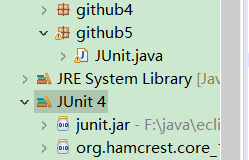
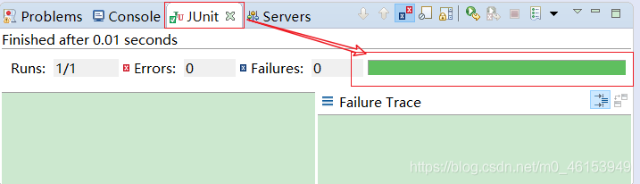
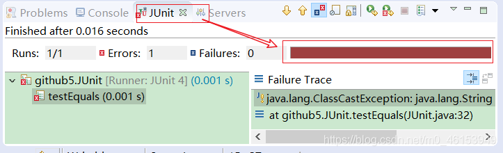
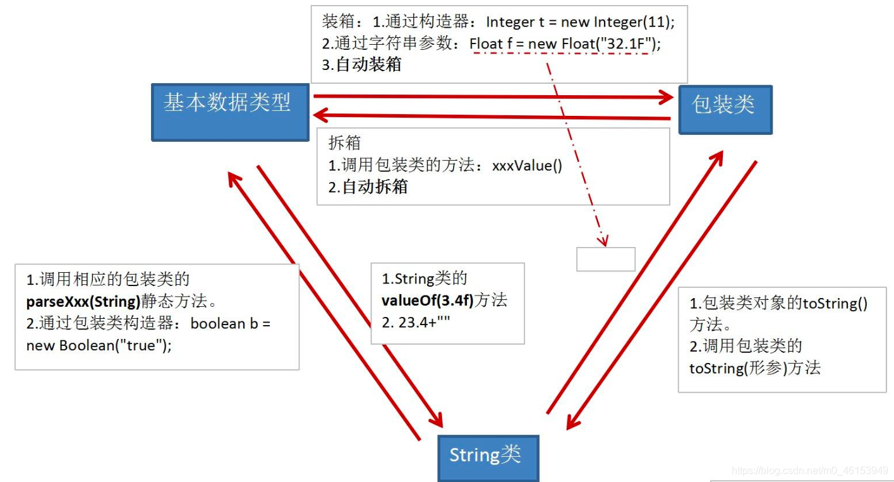
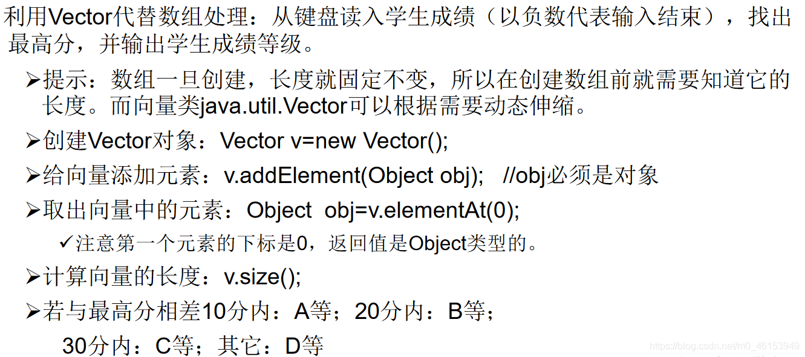

## 8.1、单元测试方法的使用

```java
import java.util.Date;
import org.junit.Test;
/*
 * java中的JUnit单元测试
 * 
 * 步骤:
 * 1.选中当前项目工程 --》 右键:build path --》 add libraries --》 JUnit 4 --》 下一步
 * 2.创建一个Java类进行单元测试。
 *    此时的Java类要求:①此类是公共的 ②此类提供一个公共的无参构造器 
 * 3.此类中声明单元测试方法。
 *   此时的单元测试方法:方法的权限是public,没有返回值，没有形参。
 * 
 * 4.此单元测试方法上需要声明注解:@Test并在单元测试类中调用:import org.junit.Test;
 * 5.声明好单元测试方法以后，就可以在方法体内测试代码。
 * 6.写好代码后，左键双击单元测试方法名：右键 --》 run as --》 JUnit Test
 * 
 * 说明:如果执行结果无错误，则显示是一个绿色进度条，反之，错误即为红色进度条。
 */
public class JUnit { 

  int num = 10;

  //第一个单元测试方法
  @Test
  public void testEquals(){ 
    String s1 = "MM";
    String s2 = "MM";
    System.out.println(s1.equals(s2));
  
    //ClassCastException的异常
//    Object obj = new String("GG");
//    Date date = (Date)obj;
  
    System.out.println(num);
    show();
  }

  public void show(){ 
    num = 20;
    System.out.println("show()...");
  }

  //第二个单元测试方法
  @Test
  public void testToString(){ 
    String s2 = "MM";
    System.out.println(s2.toString());
  }
}
```







## 8.2、包装类的使用

```java
/*
 * 包装类的使用
 * 1.java提供了8种基本数据类型对应的包装类，使得基本数据类型的变量具有类的特征
 *     基本数据类型    包装类
 *     byte      Byte
 *     short      Short
 *     int       Integer
 *     long      Long
 *     float      Float
 *     double      Double
 *     boolean      Boolean
 *     char      Character
 * 注意:其中Byte、Short、Integer、Long、Float、Double的父类是:Number
 * /
```

## 8.3、包装类与基本数据类型相互转换




```java
import org.junit.Test;
/*
 * 2.基本数据类型、包装类、String三者之间的相互转换。
 * 
 */
public class WrapperTest { 

  //String类型---> 基本数据类型、包装类,调用包装类的parseXxx()
  @Test
  public void test5(){ 
    String str1 = "123";
//    String str1 = "123a";
  
    //错误的情况，可能会报错
//    int num1 = (int)str1;
//    Integer in1 = (Integer)str1;
  
    int num2 = Integer.parseInt(str1); 
    System.out.println(num2 + 1);  //124
  
    String str2 = "true";
    Boolean b1 = Boolean.parseBoolean(str2);
    System.out.println(b1);  //true
  
  }

  //基本数据类型、包装类---》String类型，调用String重载的valueOf(Xxx xxx)
  @Test
  public void test4(){ 
    int num1 = 10;
    //方式1:连接运算
    String str1 = num1 + "";
    //方式2:调用String的valueOf(Xxx xxx)
    float f1 = 12.3f;
    String str2 = String.valueOf(f1); //"12.3"
  
    Double d1 = new Double(12.4);
    String str3 = String.valueOf(d1);
    System.out.println(str2);
    System.out.println(str3);  //"12.4"
  
  }

  /*
   * JDK 5.0 新特性:自动装箱与自动拆箱
   */
  @Test
  public void test3(){ 
//    int num1 = 10;
//    //基本数据类型 --》 包装类的对象
//    method(num1);  //Object obj = num1
  
    //自动装箱:基本数据类型 --》 包装类
    int num2 = 10;
    Integer in1 = num2;//自动装箱
  
    boolean b1 = true;
    Boolean b2 = b1;//自动装箱
  
    //自动拆箱：包装类 --》 基本数据类型
    System.out.println(in1.toString());
  
    int num3 = in1;
  
  }

  public void method(Object obj){ 
    System.out.println(obj);
  }

  //包装类 --》 基本数据类型:调用包装类的xxxValue()
  @Test
  public void test2() { 
    Integer in1 = new Integer(12);
    int i1 = in1.intValue();
    System.out.println(i1 + 1); 
  
    Float f1 = new Float(12.3f);
    float f2 = f1.floatValue();
    System.out.println(f2 + 1); 
  }

  //基本数据类型--》包装类,调用包装类的构造器
  @Test
  public void test1() { 
    int num1 = 10;
//    System.out.println(num1.toString());
  
    Integer in1 = new Integer(num1);
    System.out.println(in1.toString());
  
    Integer in2 = new Integer("123");
    System.out.println(in2.toString());
  
    //报异常
//    Integer in3 = new Integer("123abc");
//    System.out.println(in3.toString());
  
    Float f1 = new Float(12.3f);
    Float f2 = new Float("12.3");
    System.out.println(f1);
    System.out.println(f2);
  
    Boolean b1 = new Boolean(true);
    Boolean b2 = new Boolean("true");
  
    Boolean b3 = new Boolean("true123");
    System.out.println(b3); //false
  
    Order order = new Order();
    System.out.println(order.isMale); //false
    System.out.println(order.isFemale); //null
  
  }
}

class Order{ 

  boolean isMale;
  Boolean isFemale;
}
```

## 8.4、练习

> 1、面试题

```java
import org.junit.Test;
/*
 * 如下两个题目输出结果相同吗？各是什么：
 *     Object o1= true? new Integer(1) : new Double(2.0);
 *     System.out.println(o1);//
 * 
 *     Object o2;
 *     if(true)
 *       o2 = new Integer(1);
 *    else 
 *      o2 = new Double(2.0);
 *    System.out.println(o2);//
 *
 */
public class InterViewTest { 

  @Test
  public void test(){ 
    Object o1= true? new Integer(1) : new Double(2.0);
    System.out.println(o1);// 1.0
  }

  @Test
  public void test2(){ 
    Object o2;
    if(true)
      o2 = new Integer(1);
    else 
      o2 = new Double(2.0);
    System.out.println(o2);// 1
  }

  @Test
  public void method1() { 
    Integer i = new Integer(1);
    Integer j = new Integer(1);
    System.out.println(i == j); //false
  
      //Integer内部定义了一个IntegerCache结构，IntegerCache中定义Integer[]
    //保存了从-128-127范围的整数。如果我们使用自动装箱的方式，给Integer赋值的范围在其中时，
    //可以直接使用数组中的元素，不用再去new了。目的，提高效率。
  
    Integer m = 1;
    Integer n = 1;
    System.out.println(m == n);//true
  
    Integer x = 128;//相当于new了一个Integer对象
    Integer y = 128;//相当于new了一个Integer对象
    System.out.println(x == y);//false

  }
}
```

> 2、编程题




```java
import java.util.Scanner;
import java.util.Vector;

/*
 * 利用Vector代替数组处理：从键盘读入学生成绩（以负数代表输入结束），
 * 找出最高分，并输出学生成绩等级。
 * 
 * 提示：数组一旦创建，长度就固定不变，所以在创建数组前就需要知道它的长度。
 * 而向量类java.util.Vector可以根据需要动态伸缩。
 * 
 * 创建Vector对象：Vector v=new Vector();
 * 给向量添加元素：v.addElement(Object obj);   //obj必须是对象
 * 取出向量中的元素：Object  obj=v.elementAt(0);
 * 注意第一个元素的下标是0，返回值是Object类型的。
 * 计算向量的长度：v.size();
 * 若与最高分相差
 *     10分内：A等；
 *     20分内：B等；
 *     30分内：C等；
 *     其它：D等
 * 
 */
public class VectorTest { 
  public static void main(String[] args) { 
    // 1.实例化Scanner，用于从键盘获取学生成绩
    Scanner scan = new Scanner(System.in);

    // 2.创建Vector对象：Vector v=new Vector();相当于原来的数组
    Vector v = new Vector();

    // 3.通过for(;;)或while(true)方式，给Vector中添加数组
    int maxScore = 0;
    for (;;) { 
      System.out.println("请输入学生成绩（以负数代表输入结束）");
      int score = scan.nextInt();
      // 3.2 当输入是负数时，跳出循环
      if (score < 0) { 
        break;
      }
      if (score > 100) { 
        System.out.println("输入的数据非法，请重新输入");
        continue;
      }
      // 3.1 添加操作：：v.addElement(Object obj)
      // jdk5.0之前：
      // Integer inScore = new Integer(score);
      // v.addElement(inScore);//多态
      // jdk5.0之后：
      v.addElement(score);// 自动装箱
      // 4.获取学生成绩的最大值
      if (maxScore < score) { 
        maxScore = score;
      }
    }

    // 5.遍历Vector，得到每个学生的成绩，并与最大成绩比较，得到每个学生的等级。
    char level;
    for (int i = 0; i < v.size(); i++) { 
      Object obj = v.elementAt(i);
      // jdk 5.0之前：
      // Integer inScore = (Integer)obj;
      // int score = inScore.intValue();
      // jdk 5.0之后：
      int score = (int) obj;

      if (maxScore - score <= 10) { 
        level = 'A';
      } else if (maxScore - score <= 20) { 
        level = 'B';
      } else if (maxScore - score <= 30) { 
        level = 'C';
      } else { 
        level = 'D';
      }

      System.out.println("student-" + i + " score is " + score + ",level is " + level);

    }
  }
}
```